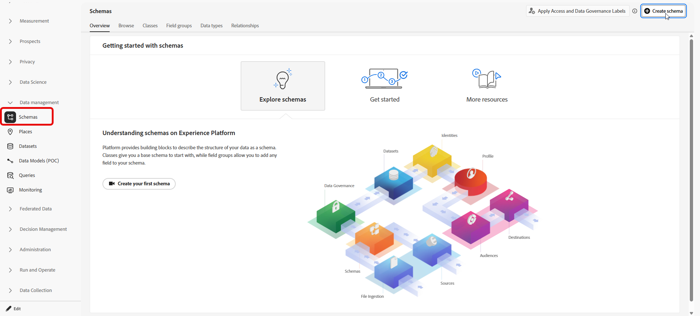
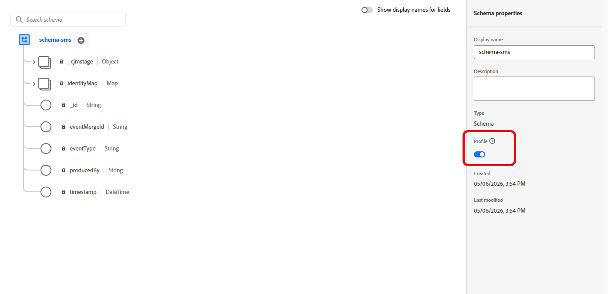
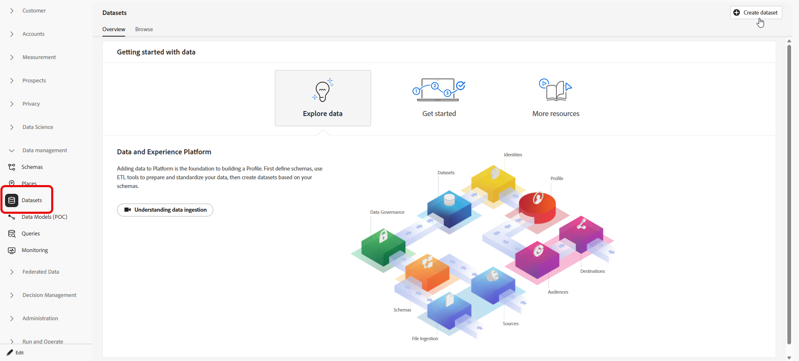
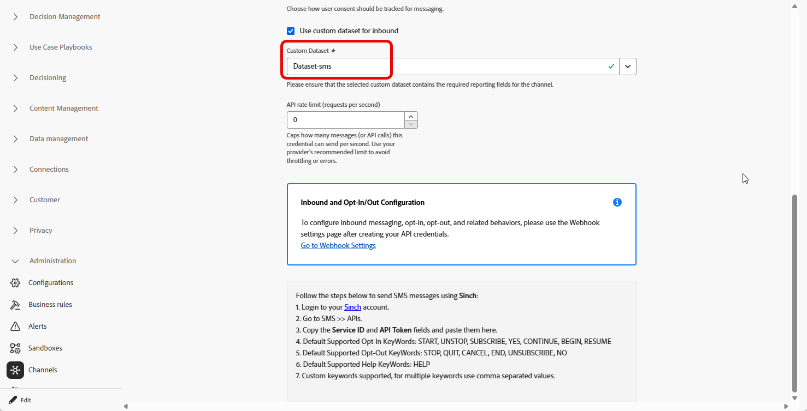

# インバウンドキーワードにカスタムデータセットを使用する {#custom-dataset-inbound-keywords}

インバウンド SMS キーワードは、プロファイル対応のカスタムデータセットに保存できます。 この設定は、Adobe Experience Platform スキーマ、そのスキーマから作成されたデータセット、インバウンドメッセージのデータセットを参照するJourney Optimizer SMS API資格情報で構成されます。

>[!NOTE]
>
>カスタムデータセットが設定されていない場合、インバウンドキーワードはデフォルトでシステム _AJO Inbound Activity Event Dataset_&#x200B;に保存されます。 受信メッセージがこのデータセットに取り込まれる前に、プロファイルに[!DNL Journey Optimizer]から送信されたメッセージが少なくとも1つ必要です。 [ システムデータセットの詳細](../data/get-started-datasets.md#system-datasets)

スキーマ、フィールドグループ、データセットの背景については、次のAdobe Experience Platform ドキュメントを参照してください。

* [XDM システムの概要](https://experienceleague.adobe.com/docs/experience-platform/xdm/home.html?lang=ja){target="_blank"}
* [スキーマ構成の基本](https://experienceleague.adobe.com/docs/experience-platform/xdm/schema/composition.html?lang=ja){target="_blank"}
* [データセットの概要](https://experienceleague.adobe.com/docs/experience-platform/catalog/datasets/overview.html?lang=ja){target="_blank"}

インバウンドキーワードにカスタムデータセットを使用するには、次のことが必要です。

1. [スキーマの作成](#create-schema)
1. [データセットの作成](#create-dataset)
1. [API資格情報の設定](#configure-api-credentials)

## スキーマの作成 {#create-schema}

スキーマは、取り込んだデータに適用される構造と検証ルールを定義します。 以下に示す既存のフィールドグループを追加して、インバウンドキーワード収集用のエクスペリエンスイベントスキーマを作成します。

➡️ [ スキーマ作成の詳細については、Adobe Experience Platform ドキュメント ](https://experienceleague.adobe.com/ja/docs/experience-platform/xdm/schema/composition)を参照してください

1. Adobe Experience Platformで、**[!UICONTROL Data management]**&#x200B;から&#x200B;**[!UICONTROL Schemas]**&#x200B;にアクセスし、**[!UICONTROL Create schema]**&#x200B;を選択します。

   

1. **[!UICONTROL 標準スキーマ]**&#x200B;を選択します。

1. **[!UICONTROL エクスペリエンスイベント]**&#x200B;を選択します。

   

1. スキーマの&#x200B;**[!UICONTROL 表示名]**&#x200B;を入力し、**[!UICONTROL 終了]**&#x200B;をクリックします。

   スキーマが保存され、スキーマエディターが開きます。

1. **[!UICONTROL スキーマプロパティ]**&#x200B;を開き、**[!UICONTROL プロファイル]**&#x200B;のスキーマを有効にします。

   

1. **[!UICONTROL フィールドグループ]**&#x200B;で、次の既存のフィールドグループを追加します。

   * [!DNL Adobe CJM ExperienceEvent - Message interaction details]
   * [!DNL Adobe CJM ExperienceEvent - Message Execution Details]
   * [!DNL Adobe CJM ExperienceEvent - Message Profile Details]

1. 「**[!UICONTROL 保存]**」をクリックします。

## データセットの作成 {#create-dataset}

データセットは、取り込んだデータのストレージコンテナです。 各データセットは1つのスキーマに関連付けられており、データセットに書き込まれたレコードは、そのスキーマに準拠している必要があります。

1. Adobe Experience Platformで、**[!UICONTROL Data management]**&#x200B;から&#x200B;**[!UICONTROL データセット]**&#x200B;にアクセスし、**[!UICONTROL データセットを作成]**&#x200B;を選択します。

   

1. 「**[!UICONTROL スキーマからデータセットを作成]**」を選択します。

1. 前のセクションで作成したスキーマを選択し、**[!UICONTROL 次へ]**&#x200B;をクリックします。

   

1. **[!UICONTROL 名前]**&#x200B;を入力し、**[!UICONTROL 完了]**&#x200B;をクリックします。

1. 「**[!UICONTROL データアクティビティ]**」タブで、**[!UICONTROL プロファイル]**&#x200B;のデータを有効にします。

   組織のガバナンス要件に適した&#x200B;**[!UICONTROL データ保持]** ポリシーを選択します。

   

1. 「**[!UICONTROL 保存]**」をクリックします。

## API資格情報の設定 {#configure-api-credentials}

[SMS/MMS/RCS設定の基本を学ぶ](mobile-configuration.md)を使用して、SMS プロバイダーに従って資格情報を設定します。 次の手順を実行して、カスタムインバウンドデータセットを選択します。

1. 左側のパネルで、**[!UICONTROL 管理]**／**[!UICONTROL チャネル]**／`>`**[!UICONTROL SMS 設定]**&#x200B;を参照し、**[!UICONTROL API 資格情報]**&#x200B;メニューを選択します。 「**[!UICONTROL 新しい API 資格情報を作成]**」ボタンをクリックします。

1. プロバイダーに応じて資格情報を作成または編集します。

1. 「**[!UICONTROL インバウンド用のカスタムデータセットを使用]**」オプションを有効にします。

1. 前のセクションで作成した&#x200B;**[!UICONTROL データセット]**&#x200B;を選択します。

   

1. 残りの必須フィールドをすべて入力し、**[!UICONTROL 保存]**&#x200B;をクリックします。

   >[!NOTE]
   >
   >API資格情報を保存すると、Journey Optimizerはインバウンドキーワードデータセットが正しく設定されていることを検証します。 検証が失敗した場合は、必要な修正がエラーメッセージで示されます。

資格情報を保存すると、送信メッセージと受信メッセージの動作は変更されません。その資格情報の受信キーワードは、選択したカスタムデータセットに記録されます。
