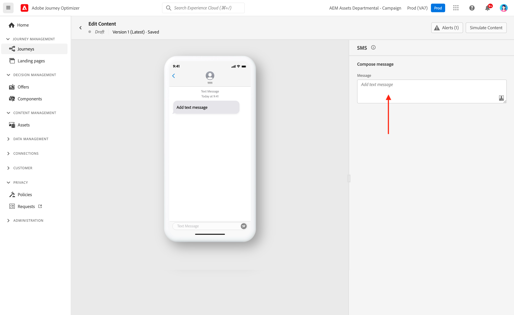
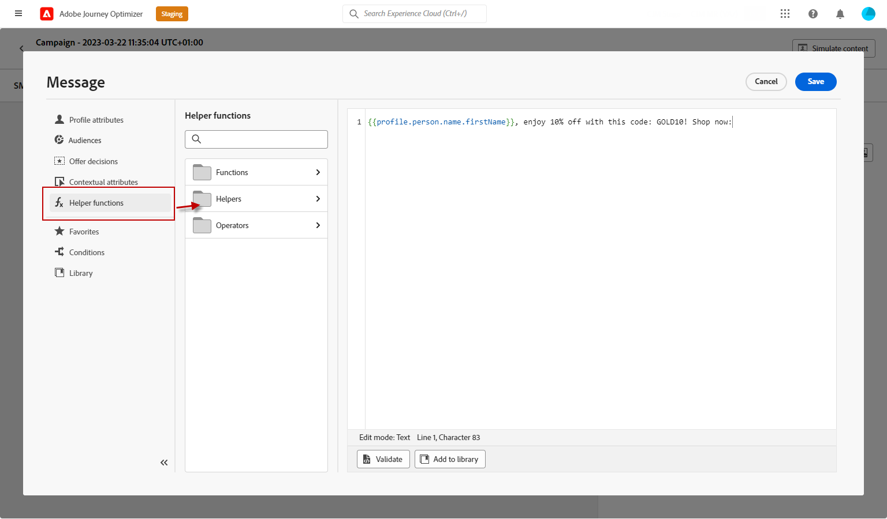

# モバイルメッセージのデザイン {#design-mobile}

>[!BEGINSHADEBOX]

**このページ：** RCS リッチメディア、フォールバックテキスト、推奨アクション、トラッキングされたURL、追加されたメディアなど、Adobe Journey OptimizerのSMS、RCS、およびMMS メッセージコンテンツをデザインおよびパーソナライズする方法について説明します。

>[!ENDSHADEBOX]

Adobe Journey Optimizerを使用すれば、テキスト（SMS）、リッチコミュニケーション（RCS）、マルチメディア（MMS）メッセージをデザインして送信できます。 最初に、ジャーニーまたはキャンペーンにモバイルメッセージアクションを追加し、次に詳細に説明するように、モバイルメッセージのコンテンツを定義する必要があります。 Adobe Journey Optimizerでは、送信前にモバイルメッセージをテストする機能も提供されています。これにより、レンダリング、パーソナライゼーション属性、その他すべての設定を確認できます。

業界標準や規制に従って、すべてのSMS/RCS/MMS マーケティングメッセージには、プロファイルが簡単に購読を解除できる方法が含まれている必要があります。 これを行うには、SMS プロファイルはオプトインキーワードとオプトアウトキーワードで返信できます。 [オプトアウトの管理方法について学ぶ](../privacy/opt-out.md#opt-out-decision-management)

## RCS コンテンツの定義{#rcs-content}

RCSを使用すると、サポートされているデバイスでネイティブメッセージングアプリを通じて配信される、画像、ビデオ、カルーセル、インタラクティブボタンを含む視覚的に豊かなメッセージを送信できます。 メッセージは、ブランドの検証済み送信者から送信されます。 プロファイルのデバイスまたは通信事業者がRCSをサポートしていない場合、Journey Optimizerは標準のSMSに自動的にフォールバックします。

すべてのRCS メッセージには、**[!UICONTROL デフォルトのフォールバックテキスト]**&#x200B;が必要です。デバイスまたはキャリアがRCSをサポートしていないプロファイルに配信されるプレーンテキスト SMS バージョンです。 施策は、it部門の力がなければ成り立ちません。

フォールバックテキストを書く際には、次の点に注意してください。

* **簡潔に。** SMS メッセージは、セグメントごとに160文字に制限されています。長いメッセージは複数の部分に分割され、追加料金が発生する場合があります。
* **キーURLを含めます。** RCS メッセージがアクションボタンを介してURLにリンクしている場合は、SMS プロファイルが引き続き宛先に到達できるように、フォールバックテキストに短縮URLを追加します。
* **RCSのみの参照を避けます。** プレーン SMSでは利用できないビジュアル、カルーセル、インタラクティブ機能については言及しないでください。
* **Personalizationはサポートされています。** フォールバックテキストでパーソナライゼーショントークンを使用することで、両方のバージョンでメッセージの一貫性を保つことができます。

RCS メッセージコンテンツを定義するには、次の手順に従います。

1. オーサリングパネルで、**[!UICONTROL コンテンツタイプ]**&#x200B;を選択します。

   +++ テキスト

   オプションのインタラクティブボタンを備えたプレーンテキスト本文。 ビジュアルが必要ない通知、アラート、リマインダー、会話フローに最適です。

   +++

   +++ メディア

   オプションのテキストとインタラクティブボタンを備えた、スタンドアロンの画像またはビデオ。 単一のビジュアル（商品画像、バナー、ビデオクリップ）がメッセージの中心である場合に使用します。

   1. ヘッダーメニューから、表示する画像またはビデオを指す&#x200B;**[!UICONTROL メディア URL]**&#x200B;を入力します。

   1. メディアがビデオファイルの場合は、オプションで&#x200B;**[!UICONTROL サムネール URL]**&#x200B;を入力します。

   +++

   +++ カード

   画像やビデオ、タイトル、本文、アクションボタンを組み合わせた構造化カード。 ブランド化された形式で商品、オファー、コンテンツ項目を提示するために使用します。

   1. **[!UICONTROL タイトル]**&#x200B;と&#x200B;**[!UICONTROL 説明]**&#x200B;を入力します。

   1. 表示する画像またはビデオを指す&#x200B;**[!UICONTROL メディア URL]**&#x200B;を入力します。

   1. メディアがビデオファイルの場合は、オプションで&#x200B;**[!UICONTROL サムネール URL]**&#x200B;を入力します。

   +++

   +++ カルーセル

   1つのメッセージ内の水平方向にスクロール可能な一連のリッチカードで、それぞれに独自の画像、タイトル、説明、ボタンがあります。 商品カタログやプロモーションに最適です。 最低2枚のカードが必要です。

   1. 各カードの表示幅を制御するには、**[!UICONTROL カード幅]**&#x200B;を選択します。
   1. 各カードに&#x200B;**[!UICONTROL タイトル]**&#x200B;と&#x200B;**[!UICONTROL 説明]**&#x200B;を入力します。

   1. カードの画像またはビデオを指す&#x200B;**[!UICONTROL メディア URL]**&#x200B;を入力します。

   1. オプションで、**[!UICONTROL メディアの高さ]**&#x200B;を選択し、推奨されるアクションボタンを追加します。

   +++

   +++ 場所

   プロファイルのメッセージングスレッドにインラインマッププレビューとして表示される、一連の座標にマップピンを送信します。 実店舗の住所、イベントの会場、サービスエリアを共有するために使用します。

   1. 場所の10進数&#x200B;**[!UICONTROL 緯度]**&#x200B;と&#x200B;**[!UICONTROL 経度]**&#x200B;を入力します。

   1. 必要に応じて、**[!UICONTROL Location name]**&#x200B;を入力して、マップ ピンにラベルとして表示します。

   +++

1. 「**[!UICONTROL メッセージテキスト]**」フィールドに、メッセージコンテンツを入力します。 パーソナライゼーションを利用して、各プロファイルに合わせてテキストを調整できます。 文字制限はメッセージタイプによって異なります。リッチメディア（シングル）の場合は3,072文字、基本RCSの場合は160文字です。

1. **[!UICONTROL Personalization エディター]**&#x200B;を使用して、コンテンツを定義し、パーソナライズおよび動的コンテンツを追加します。 プロファイル名や市区町村など、任意の属性を使用できます。 また、条件ルールを定義することもできます。

1. オプションで、**[!UICONTROL 提案されたアクション]**&#x200B;のインタラクティブボタンを追加して、プロファイルが1回タップするだけでアクションを実行できるようにします。

1. **[!UICONTROL ラベル]**&#x200B;を&#x200B;**[!UICONTROL アクション]**&#x200B;に入力します。

1. **[!UICONTROL アクションタイプ]**&#x200B;を選択します。

   * **[!UICONTROL 返信]**: プロファイルの代理として、事前に定義されたテキスト返信をRCS エージェントに送信します。 これにより、顧客の意図を把握し、会話フローを促進し、下流のジャーニーイベントをトリガーできます。 追加フィールドは必要ありません。返信テキストはボタンラベルと一致します。

   * **[!UICONTROL 開くURL]**: プロファイルをweb ページ、ディープリンク、またはアプリ内の宛先にリダイレクトします。 パーソナライゼーショントークンとUTM トラッキングパラメーター（例：`https://www.example.com/offers?id={{profile.userId}}`）をサポートしています。

   * **[!UICONTROL 電話番号をダイヤル]**：指定した電話番号が事前入力されたデバイス ダイヤラーを開き、プロファイルが呼び出せるように準備します。

   * **[!UICONTROL 場所を表示]**: デバイスの既定のマップ アプリケーションを指定した場所で開きます。 表示する場所の小数&#x200B;**[!UICONTROL 緯度]**&#x200B;と&#x200B;**[!UICONTROL 経度]**&#x200B;を指定します。

1. 「**[!UICONTROL デフォルトのフォールバックテキスト]**」フィールドに、メッセージのプレーンテキスト SMS バージョンを入力します。 これは必須であり、デバイスまたはキャリアがRCSをサポートしていないプロファイルに配信されます。

1. **[!UICONTROL Webview]** ドロップダウンから、**[!UICONTROL Open URL]** アクションを送信する際に&#x200B;**[!UICONTROL Webview]**&#x200B;のサイズを選択します。

1. 「**[!UICONTROL 保存]**」をクリックして、プレビューでメッセージを確認します。 メッセージのコンテンツをテストして確認するには、[この節](send-mobile-message.md)を参照してください。

## SMS コンテンツの定義{#sms-content}

>[!CONTEXTUALHELP]
>id="ajo_message_sms_content"
>title="SMS コンテンツの定義"
>abstract="パーソナライゼーションエディターを使用してコンテンツを定義し、動的要素を組み込むことによって、モバイルメッセージをカスタマイズおよびパーソナライズします。"

メッセージコンテンツを設定するには、次の手順に従います。 MMS の設定について詳しくは、[この節](#mms-content)を参照してください。

1. ジャーニーまたはキャンペーンの設定画面で、「**[!UICONTROL コンテンツを編集]**」ボタンをクリックして、モバイルメッセージコンテンツを設定します。

1. 「**[!UICONTROL メッセージ]**」フィールドをクリックして、パーソナライゼーションエディターを開きます。

   

1. テキスト生成に[AI アシスタント ](../content-management/generative-text.md)を使用して、オーディエンスに合わせた魅力的なモバイルメッセージを生成します。

1. パーソナライゼーションエディターを使用して、コンテンツの定義、パーソナライゼーションと動的コンテンツの追加を行います。 プロファイル名や市区町村など、任意の属性を使用できます。 また、条件ルールを定義することもできます。 パーソナライゼーションエディターの[パーソナライゼーション](../personalization/personalize.md)と[動的コンテンツ](../personalization/get-started-dynamic-content.md)について詳しくは、次のページを参照してください。

1. コンテンツを定義したら、追跡する URL をメッセージに追加できます。 これを行うには、**[!UICONTROL ヘルパー関数]**&#x200B;メニューにアクセスし、「**[!UICONTROL ヘルパー]**」を選択します。

   

1. **[!UICONTROL Url]**&#x200B;を選択し、**[!UICONTROL URLを追加]**&#x200B;をクリックします。 `Url` ヘルパー関数について詳しくは、[この節](../personalization/functions/helpers.md#url)を参照してください。

   

1. URLを短縮するには、`originalUrl` フィールドにURLを貼り付け、**[!UICONTROL 保存]**&#x200B;をクリックします。

   >[!CAUTION]
   >
   >URL 短縮機能を使用するには、最初にサブドメインを設定する必要があります。このサブドメインはその後、設定にリンクされます。 [詳細情報](mobile-subdomains.md)
   >
   > 短縮 URL の有効期間は 30 日に設定されています。 この期間が経過すると、これらの短縮 URL にはアクセスできなくなり、`404 short-code not found` というメッセージが表示されます。

1. モバイルアプリで特定の画面を開くディープリンクを追加するには、以下の例のように、`DEEPLINK`型の`Url` ヘルパー関数を使用します。 [ ディープリンクについて詳しく見る](../email/deeplinks.md)

   ```
   {{url originalUrl='<<deeplink_url>>' type='DEEPLINK' action='CLICK'}}
   ```

   >[!CAUTION]
   >
   >ディープリンクを使用する前に、Journey Optimizerで対応する[設定手順](../email/deeplinks.md#configuration)を完了し、モバイルアプリに[ ディープリンク処理](../email/deeplinks.md#mobile-implementation)を実装していることを確認してください。 そうしていない場合、ディープリンクは意図したアプリ内コンテンツにユーザーを誘導しません。
   >
   >また、URLがAdobe システムを通じて書き換えられるように、ジャーニーまたはキャンペーンの&#x200B;**[!UICONTROL アクション]** セクションでリンクトラッキングが有効になっていることを確認してください。

1. **[!UICONTROL Decisioning]** メニューから、**Decisioning**&#x200B;を使用して、モバイルメッセージのコンテンツをパーソナライズおよび最適化できます。 この機能により、優先順位スコア、数式、AI モデルを使用して、顧客に最適なコンテンツを動的に選択して表示できます。

   モバイルメッセージで決定ポリシーを作成および使用する方法について詳しくは、[この節](../experience-decisioning/create-decision.md)を参照してください。

1. 「**[!UICONTROL 保存]**」をクリックして、プレビューでメッセージを確認します。 メッセージのコンテンツをテストして確認するには、[この節](send-mobile-message.md)を参照してください。

## MMS コンテンツの定義{#mms-content}

マルチメディアメッセージサービス（MMS）メッセージを送信すると、ビデオ、画像、オーディオクリップ、GIF などのメディアを共有できるようにすることで、通信を強化できます。 また、MMS ではメッセージに最大 1600 文字のテキストを含めることができます。

>[!NOTE]
>
> MMS チャネルには、[このページ](../start/guardrails.md#sms-guardrails)にリストされているいくつかの制限があります。

MMS コンテンツを作成するには、次の手順に従います。

1. [このセクション ](#create-sms-journey-campaign)の説明に従って、モバイルメッセージを作成します。

1. [この節](#sms-content)の説明に従って、SMS コンテンツを編集します。

1. MMS オプションを有効にして、SMS コンテンツにメディアを追加します。

   

1. 「**[!UICONTROL タイトル]**」をメディアに追加します。

1. 「**[!UICONTROL メディア]**」フィールドにメディアの URL を入力します。

   

1. 「**[!UICONTROL 保存]**」をクリックして、プレビューでメッセージを確認します。 以下に詳しく説明するように、メッセージのコンテンツをテストして確認できるようになりました。

テストを実行してコンテンツを検証したら、モバイルメッセージをオーディエンスに送信できます。 これらの手順について詳しくは、[このページ](send-mobile-message.md)を参照してください。

