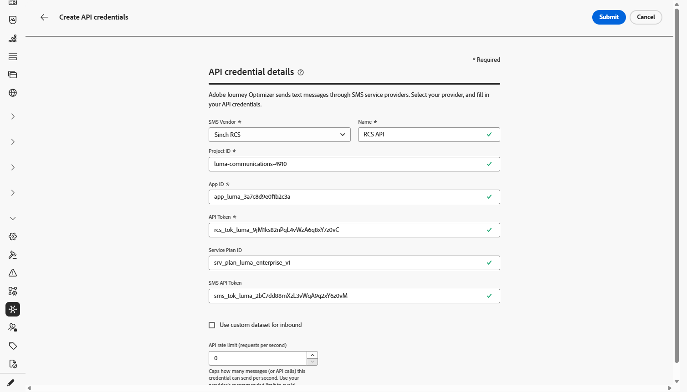

# Sinch プロバイダーの設定 {#sms-configuration-sinch}

Journey Optimizer で Sinch プロバイダーを使用する場合は、次の 3 つの異なるオプションがあります。

* **SMS 設定**：SMS メッセージをシームレスに送信するための Sinch API 資格情報を設定します。

* **MMS 設定**：マルチメディアメッセージ（MMS）用に Sinch MMS API 資格情報を設定します。 なお、インバウンドメッセージのトラッキングと応答は、SMS 設定で処理されます。 MMS セットアップは、MMS メッセージのアウトバウンド配信にのみ使用されます。

* **RCS 設定**：RCS メッセージをシームレスに送信する Sinch API 資格情報を設定します。

Sinch プロバイダーを設定するには、次の手順に従います。

1. [API 資格情報の作成](#create-api)
1. [Webhook の作成](mobile-webhook.md)
1. [チャネル設定の作成](mobile-configuration-surface.md)
1. [SMS チャネルアクションを使用したジャーニーまたはキャンペーンの作成](create-mobile-message.md)

## SMS 用の API 資格情報の設定{#create-api}

Journey Optimizer で SMS メッセージと MMS を送信するように Sinch プロバイダーを設定するには、次の手順に従います。

1. 左側のパネルで、**[!UICONTROL 管理]**／**[!UICONTROL チャネル]**／`>`**[!UICONTROL SMS 設定]**&#x200B;を参照し、**[!UICONTROL API 資格情報]**&#x200B;メニューを選択します。 「**[!UICONTROL 新しい API 資格情報を作成]**」ボタンをクリックします。

1. 以下で説明するように、SMS API 資格情報を設定します。

   +++ 設定用の SMS 資格情報のリスト

   | 設定フィールド | 説明 |
   |---|---|
   | SMS ベンダー | Sinch |
   | 名前 | API 資格情報の名前を選択します。 |
   | サービス ID および API トークン | API ページにアクセスして、「SMS」タブで資格情報を検索します。 詳しくは、[Sinch のドキュメント](https://developers.sinch.com/docs/sms/getting-started/){target="_blank"}を参照してください。 |
   | インバウンド番号 | ユニークなインバウンド番号またはショートコードを追加します。 これにより、それぞれに独自のインバウンド番号またはショートコードを持つ異なるサンドボックス間で同じ API 資格情報を使用できます。 |
   | 上書き URL | SMS 配信レポート、フィードバックデータ、インバウンドメッセージまたはイベント通知のデフォルトのエンドポイントを置き換えるカスタム URL を入力します。 Sinch は、事前定義された更新ではなく、関連するすべての更新をこの URL に送信します。 |

   +++

<!--
1. Choose how user consent should be tracked for messaging:

    * **[!UICONTROL Sender short code]**: Inbound keyword consent is keyed to your **sender short code** only. Use when one inbound number is enough to represent consent.

    * **[!UICONTROL Sender short code + profile number]**: Consent is keyed to the **sender short code** and the profile **mobile number**. Use when profiles can have several numbers, or when opt-in/out must apply per sender and recipient pair.
-->

1. 「**[!UICONTROL インバウンドのカスタムデータセットを使用]**」を選択して、この資格情報のインバウンド SMSを、ドロップダウンから選択した事前作成データセットにルーティングします。 [ インバウンドキーワードのカスタムデータセットの使用について詳しく見る](../mobile/custom-dataset-inbound-keywords.md)

   >[!NOTE]
   >
   >データセットスキーマは&#x200B;**[!UICONTROL XDM ExperienceEvent]**&#x200B;である必要があり、少なくとも次のフィールドグループを含める必要があります。
   >* Adobe CJM ExperienceEvent - メッセージインタラクションの詳細
   >* Adobe CJM ExperienceEvent - Message Execution Details
   >* Adobe CJM ExperienceEvent - メッセージプロファイル詳細
   >
   >プロファイルに対してスキーマとデータセットを有効にする必要があります。

1. API 資格情報の設定が完了したら、「**[!UICONTROL 送信]**」をクリックします。

1. **[!UICONTROL API 資格情報]**&#x200B;メニューで、ごみ箱アイコンをクリックして、API 資格情報を削除します。

1. 既存の資格情報を変更するには、目的の API 資格情報を見つけて、「**[!UICONTROL 編集]**」オプションをクリックして必要な変更を行います。

1. 既存の API 資格情報から「**[!UICONTROL SMS 接続を検証]**」をクリックし、指定されたデバイスにサンプルメッセージを送信して、SMS API 資格情報をテストおよび検証します。

1. 「**番号**」フィールドと「**メッセージ**」フィールドに入力し、「**[!UICONTROL 接続を確認]**」をクリックします。

   >[!IMPORTANT]
   >
   >メッセージは、プロバイダーのペイロード形式に合わせて構造化する必要があります。

   

API資格情報を作成して設定したら、次に[Webhook](mobile-webhook.md)とRCS メッセージのチャネル設定を作成する必要があります。 [詳細情報](mobile-configuration-surface.md)

## MMS 用の API 資格情報の設定{#sinch-mms}

>[!IMPORTANT]
>
> MMS セットアップに加えて、特にインバウンドメッセージのトラッキングと同意リクエストの管理のために Sinch API 資格情報を作成する必要もあります。

Journey Optimizer で MMS を送信するように Sinch MMS を設定するには、次の手順に従います。

1. 左側のパネルで、**[!UICONTROL 管理]**／**[!UICONTROL チャネル]**／`>`**[!UICONTROL SMS 設定]**&#x200B;を参照し、**[!UICONTROL API 資格情報]**&#x200B;メニューを選択します。 「**[!UICONTROL 新しい API 資格情報を作成]**」ボタンをクリックします。

1. 以下で説明するように、MMS API 資格情報を設定します。

   * **[!UICONTROL SMS ベンダー]**：Sinch MMS。

   * **[!UICONTROL 名前]**: API資格情報の名前を入力します。

   * **[!UICONTROL プロジェクト ID]**、**[!UICONTROL アプリ ID]** および **[!UICONTROL API トークン]**：MMS API 資格情報を収集するには、以下の手順に従います。

      * **[!UICONTROL プロジェクト ID]** および&#x200B;**[!UICONTROL アプリ ID]** の場合：Sinch ダッシュボードで Sinch プロジェクトの [Conversation API の概要](https://dashboard.sinch.com/convapi/overview)ページにアクセスします。
      * **[!UICONTROL API トークン]**&#x200B;の場合：Sinch プロジェクトの[アクセスキー](https://community.sinch.com/t5/Customer-Dashboard/Sinch-Access-Keys/ta-p/12638)を取得し、Sinch プロジェクトの&#x200B;**アクセスキー**&#x200B;から **Base64 API トークン**&#x200B;を取得します。

1. API 資格情報の設定が完了したら、「**[!UICONTROL 送信]**」をクリックします。

1. **[!UICONTROL API 資格情報]**&#x200B;メニューで、ごみ箱アイコンをクリックして、API 資格情報を削除します。

1. 既存の資格情報を変更するには、目的の API 資格情報を見つけて、「**[!UICONTROL 編集]**」オプションをクリックして必要な変更を行います。

API資格情報を作成して設定したら、次に[Webhook](mobile-webhook.md)とRCS メッセージのチャネル設定を作成する必要があります。 [詳細情報](mobile-configuration-surface.md)

## RCS 用の API 資格情報の設定

<!---->

RCS（リッチ通信サービス）メッセージは、Sinch を通じて Journey Optimizer でサポートされ、ロゴや送信者名などのブランド要素を含む検証済みのビジネスプロファイルを使用して、基本的なメッセージを送信できます。

ネイティブ RCS オーサリングにはSinch RCSが必要です。 Twilio、Infobip、およびその他のプロバイダーは、[ カスタムプロバイダー統合](mobile-configuration-custom.md)を使用する必要があります。

プロファイルのデバイスが RCS をサポートしていない場合や、一時的に RCS 経由で未到達の場合に、メッセージは SMS に自動的にフォールバックします。

Journey OptimizerでRCSを送信するようにSinch RCSを設定するには、次の手順に従います。

1. 左側のパネルで、**[!UICONTROL 管理]**／**[!UICONTROL チャネル]**／`>`**[!UICONTROL SMS 設定]**&#x200B;を参照し、**[!UICONTROL API 資格情報]**&#x200B;メニューを選択します。 「**[!UICONTROL 新しい API 資格情報を作成]**」ボタンをクリックします。

1. 次に示すように、RCS API資格情報を設定します。

   * **[!UICONTROL SMS ベンダー]**: Sinch RCS。

   * **[!UICONTROL 名前]**: API資格情報の名前を入力します。

   * **[!UICONTROL プロジェクト ID]**、**[!UICONTROL アプリ ID]**&#x200B;および&#x200B;**[!UICONTROL API トークン]**:Sinch RCS アカウントからプロジェクト ID、アプリ ID、およびAPI トークンを入力します。

   * **[!UICONTROL サービスプラン ID]**:Sinch アカウントに関連付けられているサービスプラン IDを入力します。

   * **[!UICONTROL SMS API トークン]**: Sinch アカウントからSMS API トークンを入力します。

   

1. オプションで、「**[!UICONTROL インバウンドのカスタムデータセットを使用]**」オプションを有効にして、インバウンド RCS メッセージをカスタムデータセットに保存します。 [詳細情報](../mobile/custom-dataset-inbound-keywords.md)

1. **[!UICONTROL API レート制限（リクエスト/秒）]**&#x200B;を設定して、1秒あたりのAPI呼び出しの最大数を制限するか、プロバイダーの推奨値を使用してスロットリングを回避するか、無制限のリクエストに対して0のままにします。

1. API 資格情報の設定が完了したら、「**[!UICONTROL 送信]**」をクリックします。

1. **[!UICONTROL API 資格情報]**&#x200B;メニューで、ごみ箱アイコンをクリックして、API 資格情報を削除します。

1. 既存の資格情報を変更するには、目的の API 資格情報を見つけて、「**[!UICONTROL 編集]**」オプションをクリックして必要な変更を行います。

API資格情報を作成して設定したら、次に[Webhook](mobile-webhook.md)とRCS メッセージのチャネル設定を作成する必要があります。 [詳細情報](mobile-configuration-surface.md)

<!--
### Basic RCS Messages

>[!AVAILABILITY]
>
> Basic RCS messages is only available upon Adobe RCS add-on offering.

1. **Set up your branded RCS agent**

    Create a branded RCS agent in the Sinch Dashboard. [Learn more on branded RCS agent](https://community.sinch.com/t5/RCS/Getting-Started-with-RCS-using-Conversation-API/ta-p/17844)

1. **Set up your [Custom API credentials](mobile-configuration-custom.md)**
    
    Once your RCS agent is approved, you need to set up your Sinch API credentials, which include your access key, secret, and service plan ID. These credentials will be used by Journey Optimizer to authenticate and send messages through Sinch's platform.

1. **Create a [channel configuration](mobile-configuration-surface.md) for your RCS messages**

    Configure a channel surface in Journey Optimizer by linking your Sinch credentials and defining the messaging parameters. This setup enables you to compose and send RCS messages from Journey Optimizer.

1. **Create and personalize your [SMS message](../mobile/create-mobile-message.md)**

    Your messages automatically falls back to SMS when the profile's device does not support RCS or is temporarily unreachable via RCS.
-->

