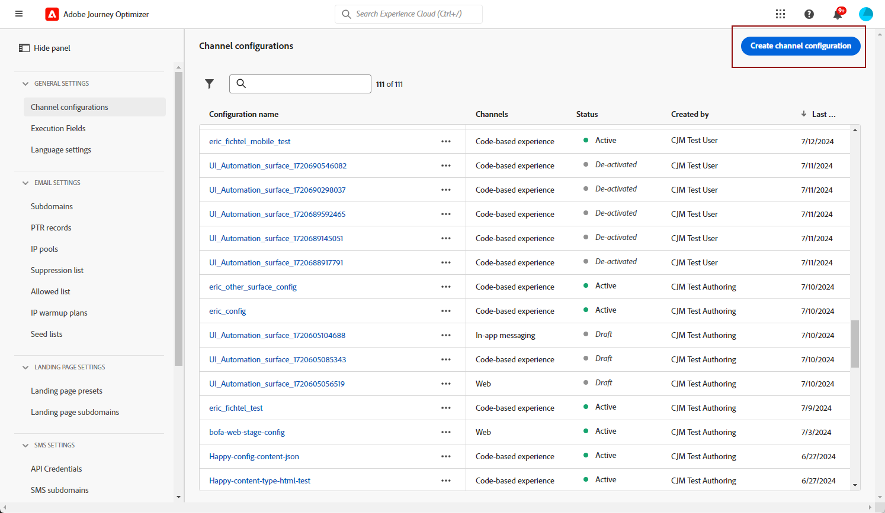

# モバイルメッセージ設定の作成 {#message-preset-sms}

>[!CONTEXTUALHELP]
>id="ajo_admin_surface_sms_type"
>title="メッセージカテゴリの定義"
>abstract="この設定を使用するモバイルメッセージのタイプを選択します（ユーザーの同意が必要なプロモーションメッセージの場合は「マーケティング」、パスワードリセットなどの非商用メッセージの場合は「トランザクション」）。"
>additional-url="https://experienceleague.adobe.com/docs/journey-optimizer/using/privacy/consent/opt-out.html?lang=ja#sms-opt-out-management" text="マーケティングモバイルメッセージのオプトアウト"

モバイルメッセージチャネルを設定したら、**[!DNL Journey Optimizer]**&#x200B;からSMS、RCS、MMS メッセージを送信できるように、チャネル設定を作成する必要があります。

チャネル設定を作成するには、次の手順に従います。

1. 左側のパネルで、**[!UICONTROL 管理]**／**[!UICONTROL チャネル]**&#x200B;を参照し、**[!UICONTROL 一般設定]**／**[!UICONTROL チャネル設定]**&#x200B;を選択します。 「**[!UICONTROL チャネル設定を作成]**」ボタンをクリックします。

   

1. 設定の名前と説明（オプション）を入力し、「モバイル」チャネルを選択します。

   

   >[!NOTE]
   >
   > 名前は、文字（A ～ Z）で始める必要があります。 使用できるのは英数字のみです。 アンダースコア（`_`）、ドット（`.`）、ハイフン（`-`）も使用できます。

1. この設定の&#x200B;**[!UICONTROL SMS タイプ]**&#x200B;を選択してください：

   * **[!UICONTROL マーケティング]**：ユーザーの同意が必要なプロモーションメッセージの場合。
   * **[!UICONTROL トランザクション]**：注文の確認、パスワードリセット、配信の更新など、非商用メッセージの場合。

   >[!CAUTION]
   >
   >**トランザクション** メッセージは、マーケティングコミュニケーションの購読解除を行ったプロファイルに送信できますが、特定のコンテキストでのみ送信できます。

   {width=80%}

1. 設定に関連付ける&#x200B;**[!UICONTROL モバイル設定]**&#x200B;を選択します。

   モバイルメッセージを送信するように環境を設定する方法について詳しくは、[この節](#create-api)を参照してください。

1. コミュニケーションに使用する「**[!UICONTROL 送信者番号]**」を入力します。

1. モバイルメッセージでURL短縮機能を使用する場合は、**[!UICONTROL サブドメイン]** リストから項目を選択します。

   >[!NOTE]
   >
   >サブドメインを選択できるようにするには、以前に少なくとも1つのSMS/RCS/MMS サブドメインを設定していることを確認します。 [方法についてはこちらを参照](mobile-subdomains.md)

1. 「**[!UICONTROL 実行ディメンション]**」セクションで、**[!UICONTROL SMS 実行フィールド]**&#x200B;を使用して、プロファイル属性の中から、データベースで複数の番号が使用可能な場合に優先して使用する電話番号を選択します。 [詳細情報](../configuration/primary-email-addresses.md#override-execution-address-channel-config)

   >[!NOTE]
   >
   >デフォルトでは、[!DNL Journey Optimizer] は、サンドボックスレベルの[一般設定](../configuration/primary-email-addresses.md)で指定された電話番号を使用します。 このフィールドを更新すると、この設定を使用するジャーニーおよびキャンペーンのデフォルト値が上書きされます。

1. 「**[!UICONTROL インバウンドのカスタムデータセットを使用]**」を選択して、この資格情報のインバウンド SMSを、ドロップダウンから選択した事前作成データセットにルーティングします。 [ インバウンドキーワードのカスタムデータセットの使用について詳しく見る](custom-dataset-inbound-keywords.md)

   >[!NOTE]
   >
   >データセットスキーマは&#x200B;**[!UICONTROL XDM ExperienceEvent]**&#x200B;である必要があり、少なくとも次のフィールドグループを含める必要があります。
   >* Adobe CJM ExperienceEvent - メッセージインタラクションの詳細
   >* Adobe CJM ExperienceEvent - Message Execution Details
   >* Adobe CJM ExperienceEvent - メッセージプロファイル詳細
   >
   >プロファイルに対してスキーマとデータセットを有効にする必要があります。

1. すべてのパラメーターを設定したら、「**[!UICONTROL 送信]**」をクリックして確定します。 なお、チャネル設定をドラフトとして保存し、後で設定を再開することもできます。

   

1. チャネル設定が作成されると、リストに「**[!UICONTROL 処理中]**」のステータスで表示されます。

   >[!NOTE]
   >
   >チェックが成功しなかった場合、考えられる失敗理由について詳しくは[この節](../configuration/channel-surfaces.md)を参照してください。

1. チェックが正常に完了すると、チャネル設定のステータスが「**[!UICONTROL アクティブ]**」になります。 メッセージの配信に使用する準備が整いました。

   

これで、Journey Optimizerでモバイルメッセージを送信する準備が整いました。
