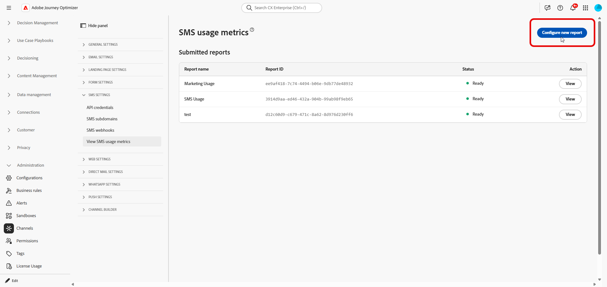
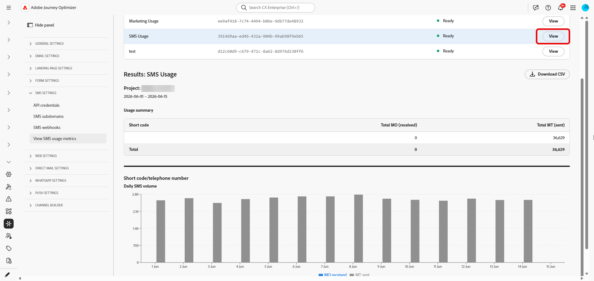

# SMS使用状況レポートの生成 {#sms-usage-report}

>[!CONTEXTUALHELP]
>id="ajo_admin_sms_usage_metrics"
>title="SMS使用状況指標"
>abstract="SMS利用状況レポートを生成し、メッセージング数とベンダーへの請求を紐付けることができます。 レポートには、ショートコードまたは電話番号ごとに、日ごとに集計されたモバイル終端（MT）およびモバイル開始（MO）数が一覧表示されます。"

>[!BEGINSHADEBOX]

**このページでは：** Sinch MMS API資格情報とダウンロード可能なCSV出力を使用して、Adobe Journey OptimizerでSMS使用状況レポートを生成し、モバイル終了（MT）およびモバイル開始（MO）ボリュームをベンダーの請求と照合します。

>[!ENDSHADEBOX]

SMSの使用状況に関する指標は、Adobe Journey Optimizerを通じてSMSを購入する際に使用できます。 レポートでは、過去&#x200B;**90日間の短いコードまたは電話番号で送信と受信のトラフィックが日別に集計されます**。

使用状況の指標を表示するには、管理者が次の操作を行う必要があります。

1. [Sinchから使用状況データを取得するためにのみ使用されるSinch MMS API資格情報](mobile-configuration-sinch.md#sinch-mms)を作成します。

   使用状況レポートでは、**[!UICONTROL SMS ベンダー]**&#x200B;が&#x200B;**Sinch MMS**&#x200B;に設定されたAPI資格情報が必要です。 この資格情報は、Journey OptimizerとSinchを接続して、使用状況データを取得できるようにします。 これは、SMSまたはMMS メッセージの送信に使用されるSinch資格情報とは異なりますが、フィールド値は同じSinch プロジェクトから取得されます。

1. [SMS使用状況レポートを設定して取得](#configure-sms-usage-report)。

これらの手順を実行するには、**[!UICONTROL SMS設定の管理]**&#x200B;権限が必要です。 [詳しくは、権限を参照してください](../administration/high-low-permissions.md#administration-permissions)。

## SMS利用状況レポートの設定と表示 {#configure-sms-usage-report}

>[!CONTEXTUALHELP]
>id="ajo_admin_sms_usage_report_name"
>title="レポート名"
>abstract="後でリストでこのレポートを認識するのに役立つラベル（例：2026年5月の請求レビュー）を入力します。"

>[!CONTEXTUALHELP]
>id="ajo_admin_sms_usage_credential"
>title="SMS資格情報"
>abstract="送受信トラフィックがこのレポートに表示されるSinch API資格情報を選択します。 資格情報を追加または更新するには、**管理** > **チャネル** > **API資格情報**&#x200B;に移動し、**SMS ベンダー** > **Sinch MMS**&#x200B;を選択します。"

>[!CONTEXTUALHELP]
>id="ajo_admin_sms_usage_start_date"
>title="開始日"
>abstract="レポートに含める日付範囲の初日。 使用状況データは、過去90日間のみ利用可能です。"

SMS使用レポートでは、Journey Optimizerでのベンダーの請求とメッセージングのアクティビティ間の調整をサポートするために、モバイル開始（MO）およびモバイル終了（MT）ボリュームを短いコードで表示します。

1. 左側のパネルで、**[!UICONTROL 管理]** > **[!UICONTROL チャネル]** > **[!UICONTROL SMS設定]**&#x200B;を参照します。

1. **[!UICONTROL SMS使用状況の指標を表示]** メニューにアクセスし、**[!UICONTROL 新しいレポートの設定]**&#x200B;をクリックします。

   

1. レポートを設定します。

   * **[!UICONTROL レポート名]**：レポートを識別するのに役立つラベルを入力します。
   * **[!UICONTROL SMS資格情報]**: SMS使用状況レポート用に以前に作成した&#x200B;**Sinch MMS** API資格情報を選択します。
   * **[!UICONTROL 開始日]**&#x200B;および&#x200B;**[!UICONTROL 終了日]**：レポートの日付範囲を設定します。 使用状況データは、過去90日間のみ利用可能です。

     

1. 「**[!UICONTROL レポートを設定]**」をクリックしてリクエストを送信します。

1. **[!UICONTROL 送信済みレポート]**&#x200B;のリストで、設定したレポートを検索し、**[!UICONTROL レポートを取得]**&#x200B;をクリックします。

   レポートの生成中にステータスが&#x200B;**保留中**&#x200B;に変更されます。

1. レポートのステータスが&#x200B;**[!UICONTROL 準備完了]**&#x200B;に更新されたら、**[!UICONTROL 表示]**&#x200B;をクリックしてレポートを開きます。 レポートには以下が含まれます。

   * **使用状況の概要**：選択した日付の合計モバイル開始（MO）メッセージとモバイル終了（MT）メッセージを、短いコードで分類します。

   * **毎日のSMS ボリューム**: SMS ボリュームを日ごとに、短いコードで分類します。

     

1. レポートをエクスポートするには、**[!UICONTROL CSVをダウンロード]**&#x200B;をクリックします。 Journey Optimizerは、表示中のレポート用のCSV ファイルをダウンロードします。
