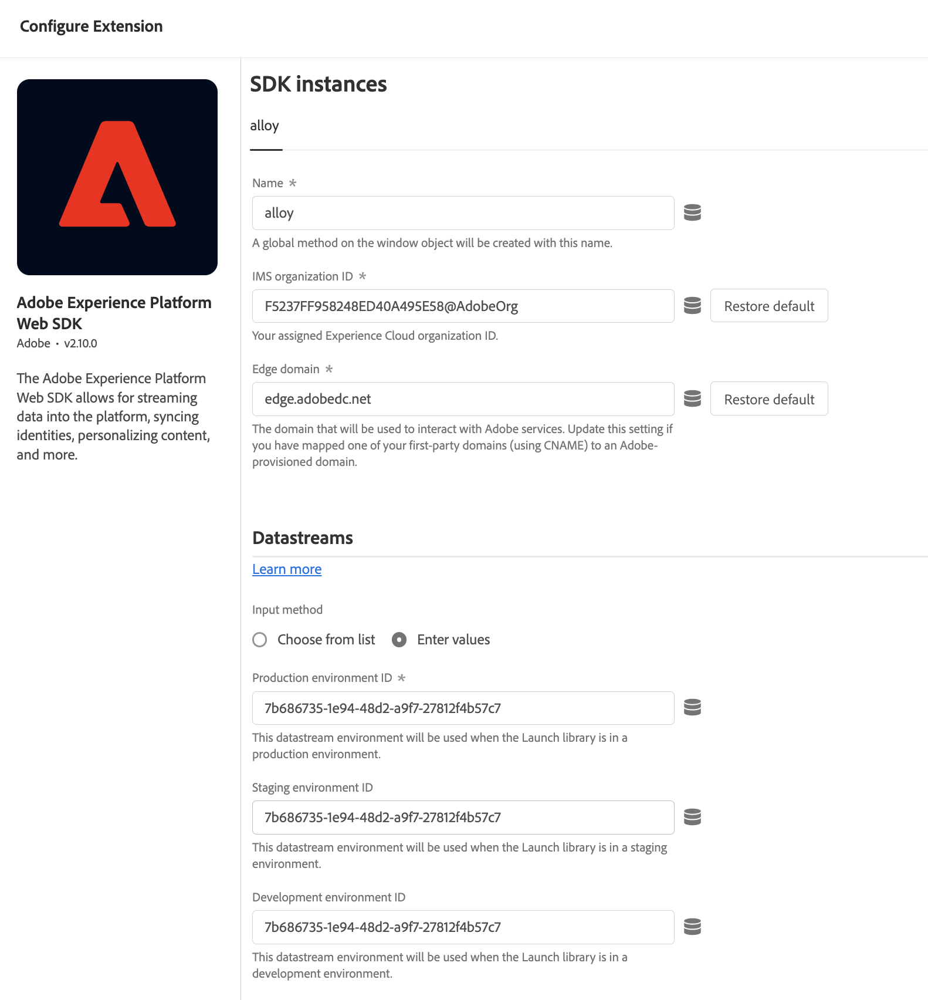
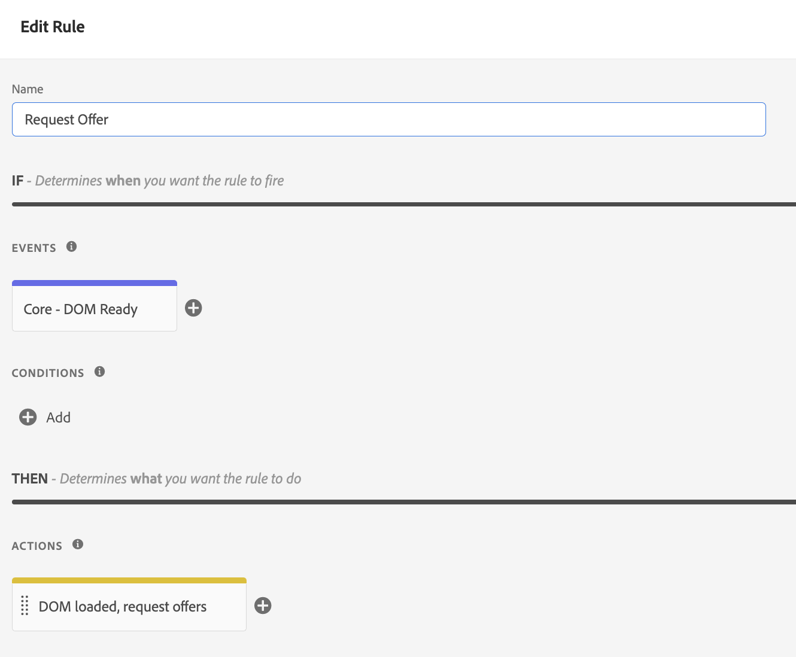

# Edge Decisioning API を使用したオファーの配信 {#edge-decisioning-api}

## 概要と前提条件 {#edge-overview-and-prerequisites}

[Adobe Experience Platform Web SDK](https://experienceleague.adobe.com/docs/experience-platform/edge/home.html?lang=ja#video-overview) は、Adobe Experience Cloud のお客様が Experience Platform Edge Network を通じて Experience Cloud の様々なサービスを操作できるようにする、クライアントサイド JavaScript ライブラリです。

 Experience Platform Web SDK では、意思決定管理を含む Adobe のパーソナライゼーションソリューションのクエリをサポートしており、API またはオファーライブラリを使用して作成した、パーソナライズされたオファーを取得およびレンダリングできます。詳しい手順については、[オファーの作成](../../get-started/starting-offer-decisioning.md)についてのドキュメントを参照してください。

[Platform Web SDK](https://experienceleague.adobe.com/docs/experience-platform/edge/home.html?lang=ja#video-overview) を使用して 意思決定管理を実装するには、2 つの方法があります。1 つ目は、開発者が対象の、web サイトやプログラミングに関する知識を必要とする方法です。もう 1 つは、Adobe Experience Platform のユーザーインターフェイスを使用して、HTML ページのヘッダーで参照する小さなスクリプトのみを必要とするオファーを設定する方法です。

Adobe Experience Platform Web SDK を使用してパーソナライズされたオファーを配信する方法について詳しくは、[意思決定管理](https://experienceleague.adobe.com/docs/experience-platform/edge/personalization/offer-decisioning/offer-decisioning-overview.html?lang=ja#enabling-offer-decisioning)に関する Adobe Experience Platform のドキュメントを参照してください。

## Adobe Experience Platform Web SDK {#aep-web-sdk}

Platform Web SDK は、次の SDK を置き換えます。

* Visitor.js
* AppMeasurement.js
* AT.js
* DIL.js

SDK は、これらのライブラリを組み合わせることができず、最初から新しく実装されます。これを使用するには、まず次の手順に従う必要があります。

1. 組織が SDK を使用するための適切な権限を持っていることと、権限を正しく設定していることを確認します。

   <!-- For more detailed instructions, refer to the documentation on using the [Adobe Experience Platform Web SDK](). -->

1. Adobe Experience Cloudのアカウントにある「データ収集」タブで [ データストリームを設定 ](https://experienceleague.adobe.com/docs/experience-platform/edge/fundamentals/datastreams.html?lang=ja) します。

1. SDK をインストールします。[SDK ページのインストール](https://experienceleague.adobe.com/docs/experience-platform/edge/fundamentals/installing-the-sdk.html?lang=ja)に記載されているように、複数の方法があります。このページでは、様々な実装方法を使用して説明を続けます。

SDK を使用するには、[スキーマ](../../../data/get-started-schemas.md)および[データストリーム](../../../data/get-started-datasets.md)を定義する必要があります。

<!-- ****TODO - Configure schema**** -->

オファーをパーソナライズするには、パーソナライズ機能やプロファイルを個別に設定する必要があります。

<!-- Refer to the [doc](www.link.com) for detailed instructions.  -->

意思決定管理の SDK を設定するには、次の 2 つの手順に従います。

## オプション 1 - Launch を使用したタグ拡張機能と実装のインストール

コーディングの経験が少ないユーザーにとって、より使いやすいオプションです。

1. [タグプロパティの作成](https://experienceleague.adobe.com/docs/experience-platform/tags/admin/companies-and-properties.html?lang=ja)

1. [埋め込みコードの追加](https://experienceleague.adobe.com/docs/core-services-learn/implementing-in-websites-with-launch/configure-launch/launch-add-embed.html?lang=ja)

1. 「データストリーム」ドロップダウンから設定を選択し、作成したデータストリームを使用して、Adobe Experience Platform Web SDK 拡張機能をインストールして設定します。詳しくは、[拡張機能](https://experienceleague.adobe.com/docs/experience-platform/tags/ui/extensions/overview.html?lang=ja)に関するドキュメントを参照してください。

   

   

1. 必要な[データ要素](https://experienceleague.adobe.com/docs/experience-platform/tags/ui/data-elements.html?lang=ja)を作成します。少なくとも、Platform Web SDK ID マップおよび Platform Web SDK XDM オブジェクトデータ要素を作成する必要があります。

   

   

1. [ルール](https://experienceleague.adobe.com/docs/experience-platform/tags/ui/rules.html?lang=ja)を作成します。

   Platform Web SDK のイベントのアクションを追加し、関連する decisionScopes をそのアクションの設定に追加します。

   

   

1. 設定したすべての関連するルール、データ要素、拡張機能を含むライブラリを[作成して公開](https://experienceleague.adobe.com/docs/experience-platform/tags/publish/libraries.html?lang=ja)します。

## オプション 2 - 事前にビルドされたスタンドアロンバージョンを使用して手動で実装

Web SDK のビルド済みスタンドアロンインストールを使用して意思決定管理を使用するために必要な手順は次のとおりです。このガイドは、SDK を初めて実装する場合を想定しています。そのため、すべての手順が当てはまるとは限りません。このガイドは、ある程度の開発経験も前提としています。

オプション 2 から次の JavaScript スニペットを含める：HTML ページの「`<head>` 」セクションに表示される[このページ](https://experienceleague.adobe.com/docs/experience-platform/edge/fundamentals/installing-the-sdk.html?lang=ja)のビルド済みスタンドアロンバージョン。

```
javascript
    <script>
        !function(n,o){o.forEach(function(o){n[o]||((n.__alloyNS=n.__alloyNS||
        []).push(o),n[o]=function(){var u=arguments;return new Promise(
        function(i,l){n[o].q.push([i,l,u])})},n[o].q=[])})}
        (window,["alloy"]);
    </script>
    <script src="https://cdn1.adoberesources.net/alloy/2.6.4/alloy.js" async></script>
```

SDK 設定をセットアップするには、アドビアカウント内から 2 つの ID（edgeConfigId および orgId）が必要です。edgeConfigId は、前提条件で設定する必要があるデータストリーム ID と同じです。

edgeConfigID やデータストリーム ID の検索には、データ収集に移動し、「データストリーム」を選択します。orgId を検索するには、自分のプロファイルに移動します。

このページの手順に従って、JavaScript で SDK を設定します。設定関数では、必ず edgeConfigId と orgId を使用します。このドキュメントでは、設定に存在するオプションのパラメーターについても説明します。最終的な設定は、次のようになります。

```
javascript
    alloy("configure", {
        "edgeConfigId": "12345678-0ABC-DEF-GHIJ-KLMNOPQRSTUV",                            
        "orgId":"ABCDEFGHIJKLMNOPQRSTUVW@AdobeOrg",
        "debugEnabled": true,
        "edgeDomain": "edge.adobedc.net",
        "clickCollectionEnabled": true,
        "idMigrationEnabled": true,
        "thirdPartyCookiesEnabled": true,
        "defaultConsent":"in"  
    });
```

デバッグで使用する Debugger Chrome 拡張機能をインストールします。詳細はこちら <https://chrome.google.com/webstore/detail/adobe-experience-platform/bfnnokhpnncpkdmbokanobigaccjkpob> をご覧ください。

次に、デバッガー内でアカウントにログインします。次に、ログに移動し、正しいワークスペースに接続されていることを確認します。次に、オファーから base64 エンコードされたバージョンの決定範囲をコピーします。

Web サイトの編集時に、設定および `sendEvent` 関数と共にスクリプトを使用して、決定範囲を Adobe に送信します。

**例**：

```
javascript
    alloy("sendEvent", {
        "decisionScopes": 
        [
        "eyJ4ZG06YWN0aXZpdHlJZCI6Inhjb3JlOm9mZmVyLWFjdGl2aXR5OjE0ZWE4MDhhZjJjZDM1NzQiLCJ4ZG06cGxhY2VtZW50SWQiOiJ4Y29yZTpvZmZlci1wbGFjZW1lbnQ6MTRjNGFmZDI2OTXXXXXXXXXX"
        ]
    });
```

応答の処理方法の例については、次を参照してください。

```
javascript
    alloy("sendEvent", {
        "decisionScopes":
        [
        "eyJ4ZG06YWN0aXZpdHlJZCI6Inhjb3JlOm9mZmVyLWFjdGl2aXR5OjE0ZWE4MDhhZjJjZDM1NzQiLCJ4ZG06cGxhY2VtZW50SWQiOiJ4Y29yZTpvZmZlci1wbGFjZW1lbnQ6MTRjNGFmZDI2OTXXXXXXXXXX"
        ]
    }).then(function(result) {
        Object.entries(result).forEach(([key, value]) => {
            console.log(key, value);
        });
    });
```

デバッガーを使用して、Edge ネットワークに正常に接続されたことを確認できます。

>[!NOTE]
>
>ログの Edge への接続が表示されない場合は、広告ブロッカーを無効にする必要がある可能性があります。

オファーの作成方法および使用している書式に戻ります。決定で満たされた条件に基づいて、オファーが、Adobe Experience Platform内で作成する際に指定した情報を含むユーザーに返されます。

この例では、返される JSON は次のようになります。

```
json
{
   "name":"ABC Test",
   "description":"This is a test offer", 
   "link":"https://sampletesting.online/",
   "image":"https://sample-demo-URL.png"
}
```

応答オブジェクトを処理し、必要なデータを解析します。複数の決定範囲を 1 回の `sendEvent` 呼び出しで送信できるため、応答が若干異なって見える場合があります。

```
json
    {
        "id": "abrxgl843d913",
        "scope": "eyJ4ZG06YWN0aXZpdHlJZCI6Inhjb3JlOm9mZmVyLWFjdGl2aXR5OjE0ZWE4MDhhZjJjZDM1NzQiLCJ4ZG06cGxhY2VtZW50SWQiOiJ4Y29yZTpvZmZlci1wbGFjZW1lbnQ6MTRjNGFmZDI2OTVlNWRmOSJ9",
        "items": 
        [
            {
                "id": "xcore:fallback-offer:14ea7f1ea26ebd0a",
                "etag": "1",
                "schema": "https://ns.adobe.com/experience/offer-management/content-component-json",
                "data": {
                    "id": "xcore:fallback-offer:14ea7f1ea26ebd0a",
                    "format": "application/json",
                    "language": [
                        "en-us"
                    ],
                    "content": "{\"name\":\"ABC Test\",\"description\":\"This is a test offer\", \"link\":\"https://sampletesting.online/\",\"image\":\"https://sample-demo-URL.png\"}"
                }
            }
        ]
    }
]
}
```

```
json
{
    "propositions": 
    [
    {
        "renderAttempted": false,
        "id": "e15ecb09-993e-4b66-93d8-0a4c77e3d913",
        "scope": "eyJ4ZG06YWN0aXZpdHlJZCI6Inhjb3JlOm9mZmVyLWFjdGl2aXR5OjE0ZWE4MDhhZjJjZDM1NzQiLCJ4ZG06cGxhY2VtZW50SWQiOiJ4Y29yZTpvZmZlci1wbGFjZW1lbnQ6MTRjNGFmZDI2OTVlNWRmOSJ9",
        "items": 
        [
            {
                "id": "xcore:fallback-offer:14ea7f1ea26ebd0a",
                "etag": "1",
                "schema": "https://ns.adobe.com/experience/offer-management/content-component-json",
                "data": {
                    "id": "xcore:fallback-offer:14ea7f1ea26ebd0a",
                    "format": "application/json",
                    "language": [
                        "en-us"
                    ],
                    "content": "{\"name\":\"Claire Hubacek Test\",\"description\":\"This is a test offer\", \"link\":\"https://sampletesting.online/\",\"image\":\"https://sample-demo-URL.png\"}"
                }
            }
        ]
    }
    ]
}
```

この例では、web ページでオファー固有の詳細を処理して使用するために必要なパスは `result['decisions'][0]['items'][0]['data']['content']` です。

JS 変数を設定するには：

```
javascript
const offer = JSON.parse(result['decisions'][0]['items'][0]['data']['content']);

let offerURL = offer['link'];
let offerDescription = offer['description'];
let offerImageURL = offer['image'];

document.getElementById("offerDescription").innerHTML = offerDescription;
document.getElementById('offerImage').src = offerImageURL;
```

<!--## Limitations

Some offer constraints are currently not supported with the mobile Experience Edge workflows, for example Capping. The Capping field value specifies the number of times an offer can be presented across all users. For more details, see [Add constraints to an offer](../../offer-library/add-constraints.md#capping).-->
