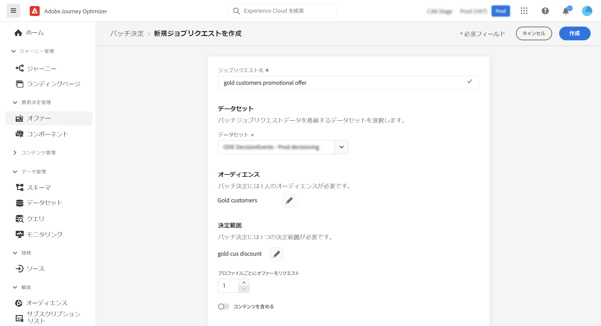
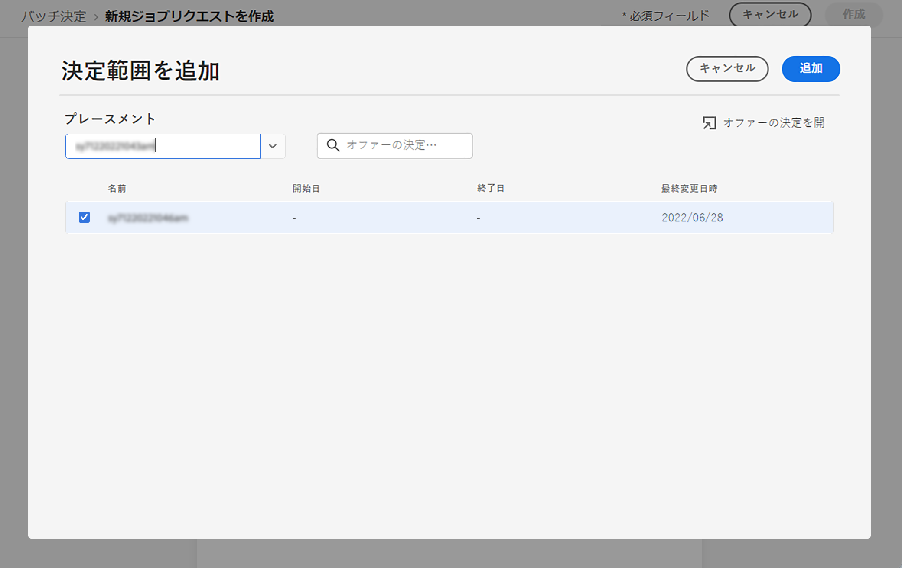
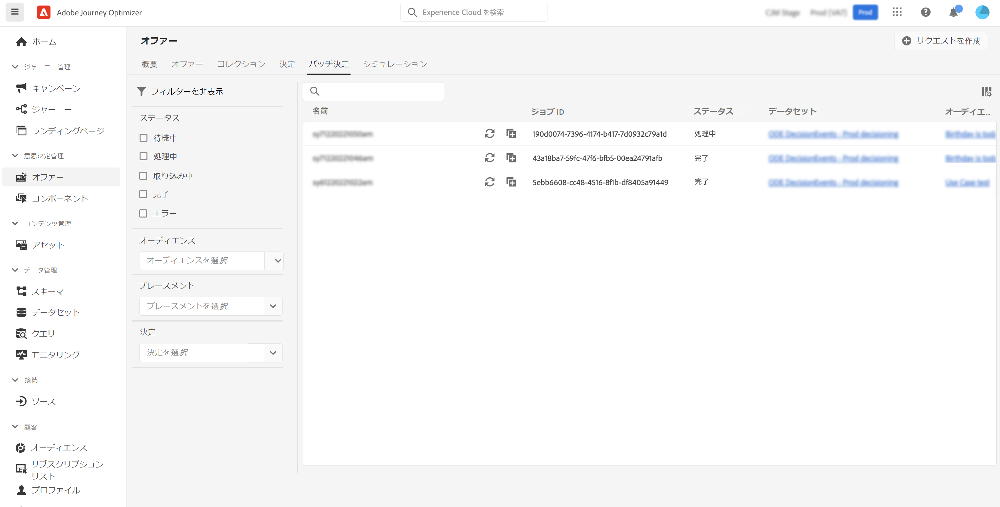

# バッチ決定 {#deliver}

## Batch Decisioning の基本を学ぶ {#start}

Journey Optimizer を使用すると、特定の Adobe Experience Platform オーディエンスに含まれるすべてのプロファイルにオファーの決定を配信できます。

それには、ターゲットとするオーディエンスと使用するオファーの決定に関する情報を含んだジョブリクエストを Journey Optimizer で作成する必要があります。オーディエンス内の各プロファイルに対するオファーコンテンツは、Adobe Experience Platform データセットに配置され、カスタムバッチワークフローで使用できます。

バッチ配信は、API を使用して実行することもできます。詳しくは、[Batch Decisioning API ドキュメント](api-reference/offer-delivery-api/batch-decisioning-api.md)を参照してください。

## 前提条件 {#prerequisites}

ジョブリクエストを設定する前に、以下が作成されていることを確認します。

* Adobe Experience Platform の&#x200B;**データセット**。このデータセットは、&quot;ODE DecisionEvents&quot; スキーマを使用して決定結果を保存するために使用されます。詳しくは、[データセットドキュメント](https://experienceleague.adobe.com/docs/experience-platform/catalog/datasets/overview.html?lang=ja)を参照してください。

* Adobe Experience Platform の&#x200B;**オーディエンス**。オーディエンスは、評価してから更新してください。オーディエンスメンバーシップの評価を更新する方法については、[セグメント化サービスのドキュメント](https://www.adobe.com/go/segmentation-overview-en_jp)を参照してください

  >[!NOTE]
  >
  >1 日に 1 回発生するプロファイルスナップショットからバッチジョブが実行されます。Batch Decisioning では頻度を制限し、常に最新のスナップショットからプロファイルを読み込みます。オーディエンスの作成後、最大 24 時間待ってから Batch Decisioning API を試すことをお勧めします。

* Adobe Journey Optimizer の&#x200B;**決定**。[決定の作成方法を学ぶ](offer-activities/create-offer-activities.md)

<!-- in API doc, remove these info and add ref here-->

## ジョブリクエストの作成

新しいジョブリクエストを作成するには、次の手順に従います。

1. **[!UICONTROL オファー]**&#x200B;メニューで、「**[!UICONTROL Batch Decisioning]**」タブを開き、「**[!UICONTROL リクエストを作成]**」をクリックします。

   

1. ジョブリクエストに名前を付け、ジョブデータの送信先のデータセットを選択します。

1. ターゲットにする Adobe Experience Platform オーディエンスを選択します。

1. オーディエンスにオファーを配信する際に使用する 1 つまたは複数のオファー決定範囲を選択します。
   1. リストからプレースメントを選択します。
   1. 選択したプレースメントで使用可能な決定が表示されます。任意の決定を選択し、「**[!UICONTROL 追加]**」をクリックします。
   1. 操作を繰り返して、必要な数の決定範囲を追加します。

   

1. デフォルトでは、決定範囲のオファーが各プロファイルに対して 1 つ返されます。返されるオファーの数は、「**[!UICONTROL プロファイルごとにオファーをリクエスト]**」オプションを使用して調整できます。例えば、「2」を選択した場合、選択した決定範囲に最適な 2 つのオファーが表示されます。

   >[!NOTE]
   >
   >1 つの決定範囲につき最大 30 のオファーをリクエストできます。

1. オファーコンテンツをデータセットに含める場合は、「**[!UICONTROL コンテンツを含める]**」オプションをオンにします。このオプションはデフォルトでは無効です。

1. 「**[!UICONTROL 作成]**」をクリックして、ジョブリクエストを実行します。

## バッチジョブの監視

リクエストされたすべてのバッチジョブは、「**[!UICONTROL Batch Decisioning]**」タブからアクセスできます。さらに、リストを絞り込むのに役立つ検索ツールとフィルタリングツールを使用できます。

### ジョブリクエストのステータス

ジョブリクエストが作成されると、バッチジョブは次の複数のステータスを処理します。

>[!NOTE]
>
>ジョブリクエストのステータスに関する最新の情報を取得するには、ジョブの横にある「...」ボタンを使用して、ジョブを更新します。

1. **[!UICONTROL 待機中]**：ジョブリクエストが作成され、処理キューに入っています。1 つのデータセットにつき、一度に最大 5 つのバッチジョブを実行できます。同じ出力データセットを持つその他のバッチリクエストがキューに追加されます。前のジョブの実行が完了したら、キュー内のジョブがピックアップされ処理されます。
1. **[!UICONTROL 処理中]**：ジョブリクエストを処理中です
1. **[!UICONTROL 取り込み中]**：ジョブリクエストが実行され、結果データが選択したデータセットに取り込まれています。
1. **[!UICONTROL 完了]**：ジョブリクエストが実行され、結果データが選択したデータセットに保存されます。

   >[!NOTE]
   >
   >ジョブリスト内のジョブの名前をクリックすると、ジョブの結果が保存されているデータセットにアクセスできます。

ジョブリクエストの実行中にエラーが発生した場合、リクエストのステータスが&#x200B;**[!UICONTROL エラー]**&#x200B;になります。新しいリクエストを作成するには、バッチジョブを複製してみてください。バッチジョブの複製方法については、[こちら](#duplicate)を参照してください。

### バッチジョブ処理時間

各バッチジョブのエンドツーエンド時間は、ワークロードが作成されてから出力データセットで決定結果が使用可能になるまでの期間です。

エンドツーエンドのバッチ決定時間に影響を与える主な要因は、オーディエンスサイズです。実施要件を満たすオファーでグローバルなフリークエンシーキャップが有効になっている場合、バッチ決定の完了にはさらに時間がかかります。実施要件を満たすオファーに対してフリークエンシーキャップを有効にする場合と有効にしない場合の両方で、それぞれのオーディエンスサイズに対するエンドツーエンドの処理時間の概算を以下に示します。

実施要件を満たすオファーに対してフリークエンシーキャップを有効にする場合：

| オーディエンスサイズ | エンドツーエンドの処理時間 |
|--------------|----------------------------|
| 1 万件以下のプロファイル | 7 分 |
| 100 万件以下のプロファイル | 30 分 |
| 1,500 万件以下のプロファイル | 50 分 |

実施要件を満たすオファーに対してフリークエンシーキャップを有効にしない場合：

| オーディエンスサイズ | エンドツーエンドの処理時間 |
|--------------|----------------------------|
| 1 万件以下のプロファイル | 6 分 |
| 100 万件以下のプロファイル | 8 分 |
| 1,500 万件以下のプロファイル | 16 分 |

## ジョブリクエストの複製 {#duplicate}

既存のジョブの情報を再利用して、新しいリクエストを作成できます。

それには、複製アイコンをクリックし、必要に応じてジョブ情報を編集したあと、「**[!UICONTROL 作成]**」をクリックして新しいリクエストを作成します。

