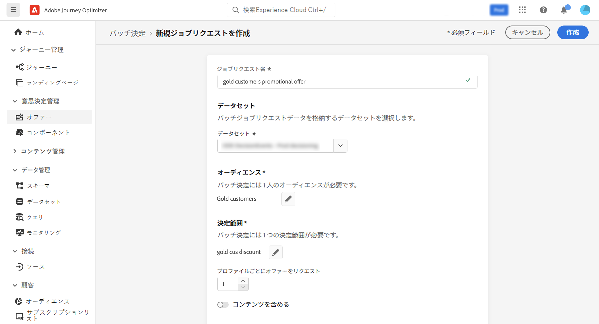
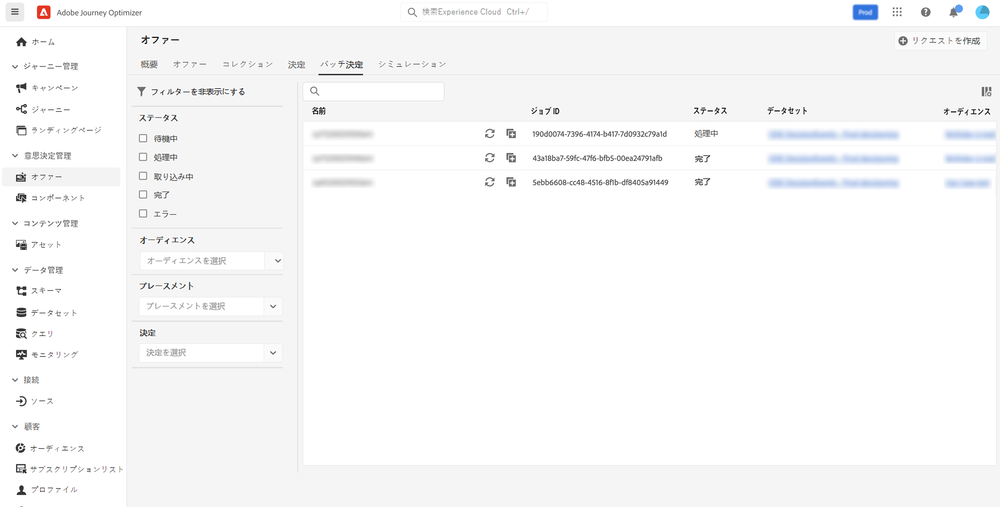

# Batch Decisioning {#deliver}

## バッチ判定の概要 {#start}

Journey Optimizerを使用すると、特定のAdobe Experience Platformセグメント内のすべてのプロファイルに対して、オファーの決定を配信できます。

これをおこなうには、Journey Optimizerでジョブリクエストを作成し、ターゲットにするセグメントに関する情報と、使用するオファーの決定を含める必要があります。 次に、セグメント内の各プロファイルのオファーコンテンツがAdobe Experience Platformデータセットに配置され、カスタムバッチワークフローで使用できるようになります。

バッチ配信は、API を使用して実行することもできます。 詳しくは、 [バッチ判定 API ドキュメント](api-reference/offer-delivery-api/batch-decisioning-api.md).

## 前提条件 {#prerequisites}

ジョブリクエストを設定する前に、以下が作成されていることを確認します。

* **データセット** Adobe Experience Platform このデータセットは、「ODE DecisionEvents」スキーマを使用して判定結果を保存するために使用されます。 詳しくは、 [データセットドキュメント](https://experienceleague.adobe.com/docs/experience-platform/catalog/datasets/user-guide.html?lang=ja).

* **セグメント** Adobe Experience Platform セグメントは評価されてから更新される必要があります。 セグメントメンバーシップ評価を更新する方法については、 [セグメント化サービスのドキュメント](http://www.adobe.com/go/segmentation-overview-en_jp)

   >[!NOTE]
   >
   >1 日に 1 回発生するプロファイルスナップショットからバッチジョブが実行されます。 バッチ判定は頻度を制限し、常に最新のスナップショットからプロファイルを読み込みます。

* **決定** Adobe Journey Optimizer [決定の作成方法を学ぶ](offer-activities/create-offer-activities.md)

<!-- in API doc, remove these info and add ref here-->

## ジョブリクエストの作成

新しいジョブリクエストを作成するには、次の手順に従います。

1. 内 **[!UICONTROL オファー]** メニュー、を開きます。 **[!UICONTROL バッチ判定]** タブをクリックし、 **[!UICONTROL リクエストを作成]**.

   

1. ジョブリクエストに名前を付け、ジョブデータの送信先のデータセットを選択します。

1. ターゲットにするAdobe Experience Platformセグメントを選択します。

1. セグメントにオファーを配信する際に使用する 1 つまたは複数のオファー決定範囲を選択します。
   1. リストからプレースメントを選択します。
   1. 選択したプレースメントで使用可能な決定が表示されます。 任意の決定を選択し、「**[!UICONTROL 追加]**」をクリックします。
   1. 操作を繰り返して、必要な数の決定範囲を追加します。

   

1. デフォルトでは、判定範囲のオファーが各プロファイルに対して 1 つ返されます。 返されるオファーの数は、 **[!UICONTROL プロファイルごとのオファーをリクエスト]** オプション。 例えば、「2」を選択した場合、選択した決定範囲に対して最適な 2 つのオファーが表示されます。

   >[!NOTE]
   >
   >1 つの決定範囲につき最大 30 個のオファーをリクエストできます。

1. オファーコンテンツをデータセットに含める場合は、 **[!UICONTROL コンテンツを含める]** オプションをオンにします。 このオプションはデフォルトでは無効です。

1. クリック **[!UICONTROL 作成]** をクリックして、ジョブリクエストを実行します。

## バッチジョブの監視

リクエストされたすべてのバッチジョブは、 **[!UICONTROL バッチ判定]** タブをクリックします。 さらに、リストを絞り込むのに役立つ検索およびフィルタリングツールを使用できます。

### ジョブリクエストのステータス

ジョブリクエストが作成されると、バッチジョブは次の複数のステータスを処理します。

>[!NOTE]
>
>ジョブリクエストのステータスに関する最新の情報を取得するには、ジョブの横にある楕円形ボタンを使用して、ジョブを更新します。

1. **[!UICONTROL 待機中]**:ジョブリクエストが作成され、処理キューに入りました。 1 つのデータセットにつき、一度に最大 5 つのバッチジョブを実行できます。 同じ出力データセットを持つその他のバッチリクエストがキューに追加されます。前のジョブの実行が完了したら、キュー内のジョブがピックアップされ処理されます。
1. **[!UICONTROL 処理中]**:ジョブリクエストを処理中です
1. **[!UICONTROL 取り込み]**:ジョブリクエストが実行され、結果データが選択したデータセットに取り込まれます。
1. **[!UICONTROL 完了]**:ジョブリクエストが実行され、結果データが選択したデータセットに保存されます。

   >[!NOTE]
   >
   >ジョブリスト内のジョブの名前をクリックすると、ジョブの結果が保存されるデータセットにアクセスできます。

ジョブリクエストの実行中にエラーが発生した場合、 **[!UICONTROL エラー]** ステータス。 新しいリクエストを作成するには、バッチジョブを複製してみてください。 [バッチジョブの複製方法を説明します](#duplicate)

### バッチジョブ処理時間

各バッチジョブのエンドツーエンド時間は、ワークロードが作成された時点から出力データセットで判定結果を使用できる時点までの期間です。

セグメントのサイズが、エンドツーエンドのバッチ判定時間に影響を与える主な要因です。 実施要件を満たすオファーでグローバル頻度キャップが有効になっている場合、バッチ判定の完了にはさらに時間がかかります。 次に、対象となるオファーに対して頻度キャップを適用する場合と適用しない場合の両方で、それぞれのセグメントサイズのエンドツーエンドの処理時間の近似を示します。

実施要件を満たすオファーに対して頻度キャップを有効にした場合：

| セグメントサイズ | エンドツーエンドの処理時間 |
|--------------|----------------------------|
| 1 万件以下のプロファイル | 7 分 |
| 100 万件以下のプロファイル | 30 分 |
| 1,500 万件以下のプロファイル | 50 分 |

実施要件を満たすオファーの頻度キャップがない場合：

| セグメントサイズ | エンドツーエンドの処理時間 |
|--------------|----------------------------|
| 1 万件以下のプロファイル | 6 分 |
| 100 万件以下のプロファイル | 8 分 |
| 1,500 万件以下のプロファイル | 16 分 |

## ジョブリクエストの複製 {#duplicate}

既存のジョブの情報を再利用して、新しいリクエストを作成できます。

それには、複製アイコンをクリックし、必要に応じてジョブ情報を編集して、「 **[!UICONTROL 作成]** をクリックして新しいリクエストを作成します。

