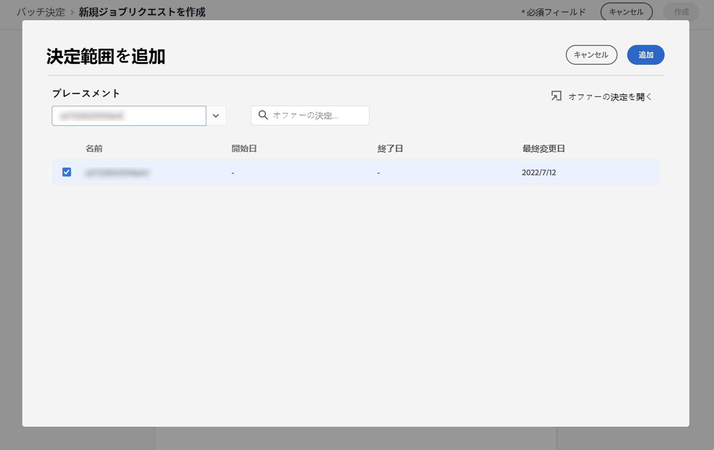

# Batch decisioning {#deliver}

## Batch decisioning を使用した作業の開始 {#start}

旅のオプティマイザーを使用すると、特定の Adobe 経験のあるプラットフォームセグメントに含まれるすべてのプロファイルについての意思決定を行うことができます。

これを行うには、ターゲットとなるセグメントに関する情報および「使用する意思決定」を行うための、旅オプティマイザー内のジョブリクエストを作成する必要があります。 これにより、セグメント内の各プロファイルのオファーコンテンツが、カスタムバッチワークフローで利用できる Adobe のプラットフォームデータセットに配置されます。

Api を使用して、バッチ処理を実行することもできます。 詳細については、Batch Decisioning API の [ マニュアル ](api-reference/offer-delivery-api/batch-decisioning-api.md) を参照してください。

## 知識 {#prerequisites}

ジョブ要求を設定する前に、次のものが作成されていることを確認してください。

* **Adobe エクスペリエンスプラットフォームのデータセット**&#x200B;このデータセットは、&quot;DecisionEvents&quot; スキーマを使用して意思決定の結果を保存するために使用されます。 データセットのマニュアル ](https://experienceleague.adobe.com/docs/experience-platform/catalog/datasets/overview.html) を参照して [ ください。

* **Adobe エクスペリエンスプラットフォームのセグメント**&#x200B;セグメントを評価してから更新する必要があります。 セグメンテーションサービスマニュアルのセグメントメンバーシップ評価を更新する方法について説明します [ 。](http://www.adobe.com/go/segmentation-overview-en)

   >[!NOTE]
   >
   >バッチジョブは、1日に1回発生するプロファイルのスナップショットから実行されます。 Batch decisioning は頻度を上限にし、常に最新のスナップショットからプロファイルを読み込みます。

* **Adobe のフライトオプティマイザーの決定**[意思決定を作成する方法について説明します。](offer-activities/create-offer-activities.md)

<!-- in API doc, remove these info and add ref here-->

## ジョブ要求の作成

新しいジョブリクエストを作成するには、次の手順に従います。

1. **[!UICONTROL Offers]**&#x200B;メニューのタブを開き **[!UICONTROL Batch decisioning]** 、をクリック **[!UICONTROL Create request]** します。

   

1. ジョブ要求の名前を指定し、ジョブデータを送信するデータセットを選択します。

1. ターゲットとする Adobe エクスペリエンスプラットフォームセグメントを選択します。

1. セグメントにオファーを提供するために使用する1つまたは複数の特典を選択します。
   1. リストから場所を選択します。
   1. 選択した配置表示に対して使用可能な決定。 目的の決定を選択し、をクリック **[!UICONTROL Add]** します。
   1. 必要に応じて、この操作を繰り返して、意志決定範囲を追加します。

   

1. デフォルトでは、決定範囲の1つのオファーがプロファイルごとに返されます。 このオプションを使用 **[!UICONTROL Request offer per profile]** すると、返されるオファーの数を調整することができます。 例えば、「2」を選択すると、選択されたデシジョンスコープに最高2種類の特典が表示されます。

   >[!NOTE]
   >
   >1つの意志決定スコープにつき最大30個のオファーを要求できます。

1. オファーコンテンツをデータセット **[!UICONTROL Include content]** に含める場合は、オプションをオンにします。 このオプションはデフォルトでは無効になっています。

1. クリック **[!UICONTROL Create]** すると、ジョブ要求が実行されます。

## バッチジョブの監視

すべての要求されたバッチジョブは、 **[!UICONTROL Batch decisioning]** このタブからアクセスできます。 さらに、検索ツールとフィルタリングツールを使用して、リストを調整することもできます。

### ジョブがステータスを要求

ジョブ要求の作成が完了すると、バッチジョブは複数の状態になります。

>[!NOTE]
>
>ジョブ要求のステータスに関する最新情報を取得するには、ジョブの横にある「楕円」ボタンを使用して、そのジョブが表示されるようにします。

1. **[!UICONTROL Queued]**: ジョブ要求が作成され、処理待ち行列に入っています。 一度に最大5個のバッチジョブを一度に実行できます。 同じ出力データセットを持つその他のバッチ要求は、キューに追加されます。 前のジョブの実行が完了すると、キューに入れられたジョブが処理されます。
1. **[!UICONTROL Processing]**: ジョブ要求が処理されています。
1. **[!UICONTROL Ingesting]**: ジョブ要求が実行されました。結果データは、選択されたデータセットで ingested されています。
1. **[!UICONTROL Completed]**&#x200B;ジョブ要求が実行され、選択したデータセットに結果データが格納されるようになりました。

   >[!NOTE]
   >
   >ジョブの結果が格納されているデータセットにアクセスするには、「ジョブ」リストで名前をクリックします。

ジョブ要求の実行中にエラーが発生した場合は、状態が表示 **[!UICONTROL Error]** されます。 新しい要求を作成するには、バッチジョブを複製します。 [バッチジョブを複製する方法を学習します。](#duplicate)

### バッチジョブの処理時間

各バッチジョブのエンドツーエンド時間とは、ワークロードが作成されてから、その結果が出力データセットで利用可能になった時点までの期間です。

セグメントのサイズは、エンドツーエンドのバッチの決定時間に影響を与える主な要素です。 適切なオファーでグローバル周波数上限が有効になっている場合は、バッチ decisioning が完了するまでに余分な時間がかかります。 以下に示すのは、各セグメントサイズにおけるエンドツーエンドの処理時間を概算したものです。これには、使用可能な状態に対する周波数上限機能があります。

次の条件を満たす機能が有効になっています。

| セグメントのサイズ | エンドツーエンドの処理時間 |
|--------------|----------------------------|
| 1万プロファイルまたはそれ以下 | 7分 |
| 100万プロファイルまたはそれ以下 | 30分 |
| 1500万プロファイルまたはそれ以下 | 50分 |

利用可能なオファーの周波数上限なし:

| セグメントのサイズ | エンドツーエンドの処理時間 |
|--------------|----------------------------|
| 1万プロファイルまたはそれ以下 | 6分 |
| 100万プロファイルまたはそれ以下 | 8分 |
| 1500万プロファイルまたはそれ以下 | 16分 |

## ジョブ要求の複製 {#duplicate}

既存のジョブの情報を再利用して、新しい要求を作成することができます。

これを行うには、複製アイコンをクリックし、必要に応じてジョブ情報を編集してから、をクリック **[!UICONTROL Create]** して新しい要求を作成します。

