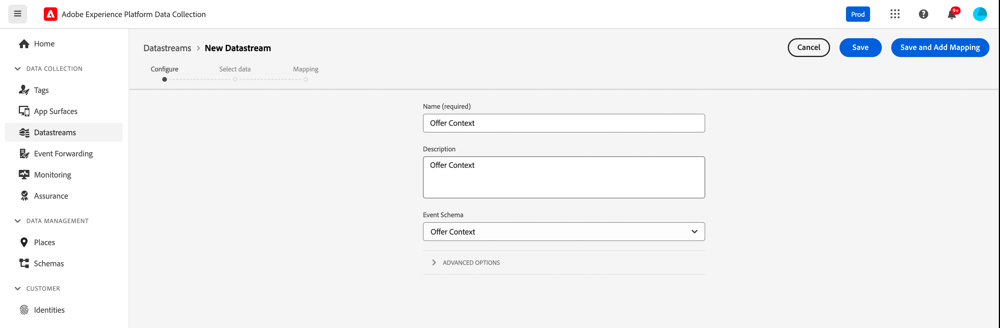
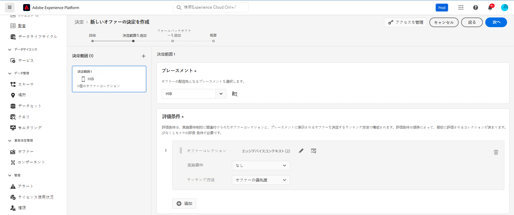

# コンテキストデータと Edge 決定リクエスト {#edge}

この節では、Edge 決定リクエストでコンテキストデータを渡し、実施要件ルールで使用する方法について説明します。お客様が使用しているデバイスのタイプに基づいてパーソナライズされたオファーを提供する方法を示すエンドツーエンドのユースケースを検討します。

このユースケースには、いくつかの重要な手順が含まれます。

1. [前提条件を設定](#prerequisites)：リクエストでコンテキストデータを渡すのに必要なすべての手順が完了していることを確認します。
1. [実施要件ルールでコンテキストデータを使用](#rule)：ユーザーのデバイスタイプに基づいて表示するオファーを決定するルールを作成します。
1. [デバイス固有のオファーを設計](#offers)：デバイスタイプごとにカスタマイズされたオファーを作成し、対応するルールにリンクします。
1. [オファーコレクションを作成](#collection)：すべてのオファーを静的コレクションにグループ化します。
1. [決定を設定](#decision)：オファーの決定エンジンを活用して、デバイスタイプに基づいてユーザーに提示する最適なオファーを選択する新しい決定を作成します。
1. [Edge 決定リクエストでコンテキストデータを渡す](#request)：API リクエストを通じてコンテキストデータを渡して、適切なオファーを取得してユーザーに提示します。

>[!BEGINSHADEBOX]

さらに、コンテキストデータを&#x200B;**ランキング式**&#x200B;に活用したり、動的に&#x200B;**オファー表示域をパーソナライズ**&#x200B;したりすることもできます。例えば、単一のオファーを作成し、パーソナライゼーションフィールドを使用して、コンテキストデータに基づいてその表示域を適応させることができます。例えば、ユーザーが iPhone を使用している場合は特定の画像を表示し、iPad ユーザーの場合は別の画像を表示します。詳しくは、次の節を参照してください。

* [ランキング式 - コンテキストデータに基づいてオファーの優先度を上げる](../offers/ranking/create-ranking-formulas.md#context-data)
* [コンテキストデータに基づいた表示域のパーソナライズ](../offers/offer-library/add-representations.md#context-data)

>[!ENDSHADEBOX]

## Edge 決定リクエストでコンテキストデータを渡す前提条件 {#prerequisites}

Decisioning API を使用して自由な形式でコンテキストを渡すのではなく、Edge 決定コンテキストペイロードは XDM エクスペリエンスイベントに準拠する必要があります。これを行うには、データ収集に使用される「XDM エクスペリエンスイベント」の一部としてコンテキストを定義する必要があります。

1. エクスペリエンスイベントスキーマを定義します。このユースケースの目的で、「オファーコンテキスト」スキーマが作成され、オファーコンテキストフィールドは「オファーコンテキスト」フィールドグループの一部になります。実際には、フィールドグループは、「Edge Collection Network」データストリームに関連付けられたデータ収集に使用されるエクスペリエンスイベントスキーマに追加されます。

   >[!NOTE]
   >
   >オファーコンテキストエクスペリエンスイベントスキーマは、プライマリ ID として「CUSTOMER_ID」フィールドを使用する、プロファイルの一部である必要があります。

   この例では、「オファーコンテキスト」フィールドグループに language と deviceType という 2 つのプロパティがあります。これらのプロパティは、オファーのランキングと実施要件ルールで使用されます。

   {width="60%" align="center" zoomable="yes"}

   スキーマの操作方法について詳しくは、Adobe Experience Platform [エクスペリエンスデータモデル（XDM）ガイド](https://experienceleague.adobe.com/ja/docs/experience-platform/xdm/home){target="_blank"}を参照してください。

1. データセット（ここでは「オファーコンテキスト」）を作成し、プロファイルに対して有効になっていることを確認します。

1. **[!UICONTROL データ収集]**／**[!UICONTROL データストリーム]**&#x200B;メニューから新しいデータストリームを作成します。データストリームを作成および設定する方法について詳しくは、Adobe Experience Platform [データストリームガイド](https://experienceleague.adobe.com/ja/docs/experience-platform/datastreams/configure){target="_blank"}を参照してください。

   ここでは、「オファーコンテンツ」イベントスキーマを選択して、「オファーコンテキスト」データストリームを作成しました。

   

1. 新しく作成したデータストリームを編集し、サービスとして「Adobe Experience Platform」を選択し、イベントデータセットとして「オファーコンテキスト」を選択します。

   

1. データストリームを保存し、その ID をコピーします。この ID は、API リクエストエンドポイントで使用されます。[詳しくは、API 呼び出しの作成方法を参照してください。](#request)

   

## 実施要件ルールでのコンテキストデータの使用 {#rules}

ユーザーのデバイスタイプに基づいて表示するオファーを決定する実施要件ルールを作成します。


* iPhone デバイスのルール：

   * ルール名：「Edge コンテキストルール - iPhone」
   * 設定：deviceType = &#39;iphone&#39;
   * PQL 構文：

     ```
     select _Any1 from xEvent where _Any1._experienceplatform.offerContextData.deviceType.equals("iphone", false)
     ```

* iPad デバイスのルール：

   * ルール名：「Edge コンテキストルール - iPad」
   * 設定：deviceType = &#39;ipad&#39;
   * PQL 構文

     ```
     select _Any1 from xEvent where _Any1._experienceplatform.offerContextData.deviceType.equals("ipad", false)
     ```

## オファーの作成 {#offers}

デバイスタイプごとにオファーを作成し、以前に作成した対応する実施要件ルールにリンクします。

* iPhone ユーザー向けオファー：

   * オファー名：「Edge コンテキスト - iPhone オファーコンテンツ」
   * 関連ルール：「Edge コンテキストルール - iPhone」

* iPad ユーザー向けオファー：

   * オファー名：Edge コンテキスト - iPad オファーコンテンツ：
   * 関連ルール：「Edge コンテキストルール - iPad」

さらに、特定のデバイス条件が満たされない場合に表示するフォールバックオファー（ここでは「コンテキストフォールバックコンテンツ」）を作成します。

## コレクションへのオファーの追加 {#collection}

以前に作成したオファーを、ここでは「Edge デバイスコンテキスト」という名前の静的コレクションに追加します。このコレクションでは、オファーの決定によって実施要件を満たすオファーが選択され、お客様に提示されます。


## オファーの決定の作成 {#decision}

オファーの決定エンジンを活用して、フォールバックオファーとして「コンテキストフォールバック」オファーを選択し、デバイスタイプに基づいてユーザーに提示する最適なオファーを選択する新しい決定を作成します。



>[!NOTE]
>
>さらに進んで、コンテキストデータをランキング式に活用し、決定に割り当てることができます。その他の情報

## Edge 決定リクエストでコンテキストデータを渡す {#request}

### エンドポイント

エンドポイントでは、以前に作成した[データストリーム](#prerequisites)の ID を使用します。

`https://edge.adobedc.net/ee/irl1/v1/interact?configId=f3c47f2a-c484-4908-87a5-a82b55039e22`

### ペイロード

コンテキストデータを渡すリクエストの例を次に示します。

* デバイスのタイプに関する情報は、`xdm:ContextData` ノードに渡されます。
* `decisionScopes` ノードで、以前に設定した[オファーの決定](#decision)の決定範囲をコピー＆ペーストします。

  +++決定範囲の取得先

  

+++

```
{
	"events": [{
		"xdm": {
			"identityMap": {
				"customerId": [{
					"id": "0000158216",
					"authenticatedState": "authenticated",
					"primary": true
				}]
			},
			"_experienceplatform": {
				"identity": {
					"core": {
						"customerId": "0000158216"
					}
				},
                "offerContextData" : {
                    "language" : "NL",
                    "deviceType" : "iphone"
                }
			}
		}
	}],
	"query": {
		"personalization": {
			"decisionScopes": ["eyJ4ZG06YWN0aXZpdHlJZCI6Inhjb3JlOm9mZmVyLWFjdGl2aXR5OjE3M2I1MGM5Mjg0ZGQ4NzkiLCJ4ZG06cGxhY2VtZW50SWQiOiJ4Y29yZTpvZmZlci1wbGFjZW1lbnQ6MTZhMzQxZWQ4ZDYyMzc2MSJ9"]
		}
	}
}
```

### 応答

応答の例を次に示します。

```
{
    "requestId": "14a2d3f5-a6fa-494e-b42c-cc65a845284a",
    "handle": [
        {
            "payload": [
                {
                    "id": "1eafc831-4819-4800-8e25-c9e9f0838e09",
                    "scope": "eyJ4ZG06YWN0aXZpdHlJZCI6Inhjb3JlOm9mZmVyLWFjdGl2aXR5OjE3M2I1MGM5Mjg0ZGQ4NzkiLCJ4ZG06cGxhY2VtZW50SWQiOiJ4Y29yZTpvZmZlci1wbGFjZW1lbnQ6MTZhMzQxZWQ4ZDYyMzc2MSJ9",
                    "activity": {
                        "id": "xcore:offer-activity:173b50c9284dd879",
                        "etag": "1",
                        "name": "Edge Device Context"
                    },
                    "placement": {
                        "id": "xcore:offer-placement:16a341ed8d623761",
                        "etag": "1",
                        "name": "HIB",
                        "channel": "https://ns.adobe.com/xdm/channel-types/mobile",
                        "componentType": "https://ns.adobe.com/experience/offer-management/content-component-json"
                    },
                    "items": [
                        {
                            "id": "xcore:personalized-offer:173b4e05676d87f5",
                            "etag": "3",
                            "name": "Edge Context - iPhone Offer",
                            "priority": 0,
                            "schema": "https://ns.adobe.com/experience/offer-management/content-component-json",
                            "data": {
                                "id": "xcore:personalized-offer:173b4e05676d87f5",
                                "format": "application/json",
                                "language": [
                                    "en-gb"
                                ],
                                "content": "{\n    \"name\" : \"iphone offer\"\n}"
                            }
                        }
                    ]
                }
            ],
            "type": "personalization:decisions",
            "eventIndex": 0
        },
        {
            "payload": [],
            "type": "activation:pull",
            "eventIndex": 0
        },
        {
            "payload": [],
            "type": "personalization:decisions",
            "eventIndex": 0
        },
        {
            "payload": [
                {
                    "scope": "Target",
                    "hint": "37",
                    "ttlSeconds": 1800
                },
                {
                    "scope": "AAM",
                    "hint": "6",
                    "ttlSeconds": 1800
                },
                {
                    "scope": "EdgeNetwork",
                    "hint": "irl1",
                    "ttlSeconds": 1800
                }
            ],
            "type": "locationHint:result"
        },
        {
            "payload": [
                {
                    "key": "kndctr_907075E95BF479EC0A495C73_AdobeOrg_identity",
                    "value": "CiY0MDAwMDgyMjMzNTEzNzU1OTcwMjQ0NDcyNjU1MTAyMDEwNDQ3MVIRCNnE4Y6QMRABGAEqBElSTDHwAdnE4Y6QMQ==",
                    "maxAge": 34128000
                },
                {
                    "key": "kndctr_907075E95BF479EC0A495C73_AdobeOrg_cluster",
                    "value": "irl1",
                    "maxAge": 1800
                }
            ],
            "type": "state:store"
        }
    ]
}
```
