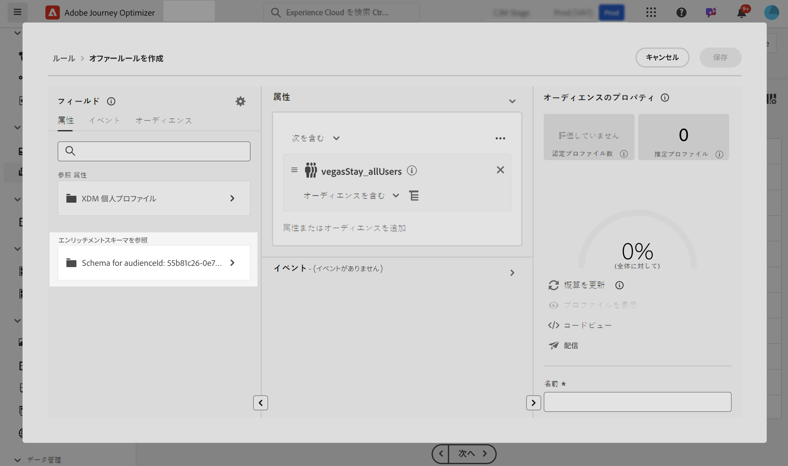
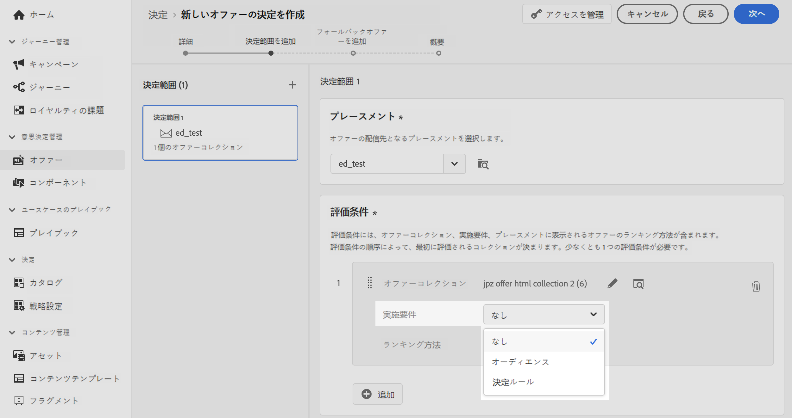
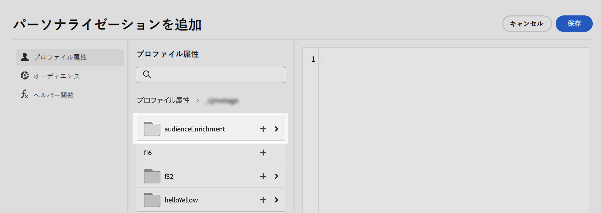

# 決定にカスタムアップロードオーディエンスを活用 {#custom-upload-decisioning}

Journey Optimizer を使用すると、カスタムアップロード（CSV ファイル）を使用して作成されたオーディエンスのデータを Adobe Experience Platform に活用して、意思決定管理ワークフローをサポートできます。これは、データがプロファイルには必要ないものの、意思決定には依然として不可欠な場合に、特に便利です。

カスタムアップロードオーディエンスのデータは、意思決定管理で次の目的で活用できます。

1. オファーと意思決定での実施要件条件の設定。
2. オファー表示域でのコンテンツのパーソナライズ。

カスタムアップロードオーディエンスについて詳しくは、次の節を参照してください。
* [オーディエンスと Journey Optimizer の概要](../audience/about-audiences.md)
* [Adobe Experience Platform でのオーディエンスの読み込み](https://experienceleague.adobe.com/ja/docs/experience-platform/segmentation/ui/audience-portal#import-audience){target="_blank"}

## 必読 {#must-read}

* この機能は、**意思決定管理**&#x200B;でのみサポートされ、決定（旧称「エクスペリエンス決定」）ではサポートされていません。
* これは、**Decisioning API（Hub）**&#x200B;リクエストを通じてのみ使用でき、**Edge Decisioning API** または **Batch Decisioning** ではサポートされていません。

## カスタムアップロードオーディエンスを実施要件条件として使用 {#eligibilty}

カスタムアップロードオーディエンスは、オファーと決定の両方のレベルで実施要件条件として使用できます。これらの条件を追加すると、実施要件からオファーまたはオファーのコレクションを除外できます。カスタムアップロードオーディエンスを活用して、オファーや決定の実施要件を絞り込むことができる様々な場所を次に示します。

* カスタムアップロードオーディエンスを使用して決定ルールを作成します。

   1. ルールをオーサリングする際は、「**オーディエンス**」タブにアクセスし、一覧で CSV オーディエンスを検索します。オーディエンスをルールキャンバスにドラッグ＆ドロップします。
   1. 「**属性**」タブを使用して、選択したオーディエンスにリンクされたエンリッチメントスキーマに移動し、CSV ファイルのすべてのデータにアクセスしてルールで使用します。これにより、CSV ファイルのフィールドを使用してルールを絞り込むことができます。[決定ルールの作成方法を学ぶ](../offers/offer-library/creating-decision-rules.md)
   1. ルールを保存します。ルールを作成したら、オファーと決定の両方のレベルで使用して実施要件を絞り込むことができます。

  

* カスタムアップロードオーディエンスをオファーの制約として使用します。[オファーに制約を追加する方法を学ぶ](../offers/offer-library/add-constraints.md)

  オファーのオーサリング時に、**制約を追加**&#x200B;手順で次のいずれかを実行できます。

   * カスタムアップロードオーディエンスを使用してオファーの実施要件の定義します。
   * カスタムアップロードオーディエンスを活用したルールを適用します。

  

* 決定レベルでカスタムアップロードオーディエンスを使用します。

  決定を設定する際の&#x200B;**決定範囲を追加**&#x200B;手順では、カスタムアップロードオーディエンスを、オファーのコレクションに対する評価条件として使用できます。[決定範囲の定義方法を学ぶ](../offers/offer-activities/create-offer-activities.md#add-decision-scopes)

  

## カスタムアップロードオーディエンスを使用したオファー表示域のパーソナライズ

カスタムアップロードオーディエンスを使用して、CSV ファイルのデータを参照してオファー表示域のコンテンツをパーソナライズすることもできます。[オファーに表示域を追加する方法を学ぶ](../offers/offer-library/add-representations.md)

カスタムアップロードオーディエンスの属性を活用してパーソナライズするには、まずカスタムオーディエンスを制約として追加する必要があります。これを行うには、オファーのオーサリング時に、**制約を追加**&#x200B;手順で、オーディエンスを制約として追加するか、カスタムアップロードオーディエンスを活用したルールを選択します。

オーディエンスを制約として追加すると、その属性を使用して表示域のコンテンツをパーソナライズできます。これを行うには、「**プロファイル属性**」タブにアクセスし、カスタムアップロードオーディエンスを検索します。オーディエンスから関連属性を選択して、オファーコンテンツをパーソナライズします。

