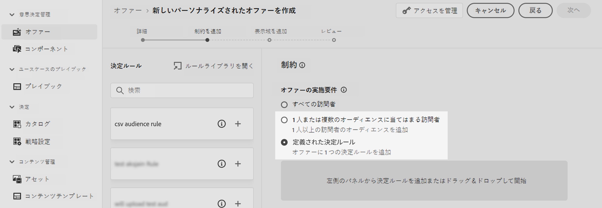

# 意思決定へのカスタムアップロードオーディエンスの活用 {#custom-upload-decisioning}

Journey Optimizerでは、カスタムアップロード（CSV ファイル）を使用して作成されたオーディエンスのデータをAdobe Experience Platformに活用して、意思決定管理ワークフローをサポートできます。 これは、データがプロファイルには必要ないが意思決定には依然として不可欠な場合に、特に便利です。

カスタムアップロードオーディエンスのデータは、意思決定管理で次の目的に活用できます。

1. オファーと決定の実施要件条件。
2. オファー表示域でのコンテンツのパーソナライズ。

カスタムアップロードオーディエンスについて詳しくは、次の節を参照してください。
* [オーディエンスとJourney Optimizerの概要](../audience/about-audiences.md)
* [Adobe Experience Platformでのオーディエンスの読み込み ](https://experienceleague.adobe.com/en/docs/experience-platform/segmentation/ui/audience-portal#import-audience){target="_blank"}

## 必読 {#must-read}

* この機能は、**意思決定管理** でのみサポートされ、Decisioning （旧称「Experience Decisioning」）ではサポートされていません。
* これは、**Decisioning API （Hub）** リクエストを通じてのみ使用でき、**Edge Decisioning API** または **Batch Decisioning** ではサポートされていません。
 
## カスタムアップロードオーディエンスを実施要件条件として使用 {#eligibilty}

カスタムアップロードオーディエンスは、オファーと決定の両方のレベルで実施要件条件として使用できます。 これらの条件を追加すると、実施要件からオファーまたはオファーのコレクションを除外できます。 カスタムアップロードオーディエンスを活用してオファーや決定の実施要件を調整できる様々な場所を次に示します。

* カスタムアップロードオーディエンスを使用して決定ルールを作成します。

   1. ルールのオーサリング時に、「**オーディエンス**」タブにアクセスし、リストで CSV オーディエンスを検索します。 オーディエンスをルールキャンバスにドラッグ&amp;ドロップします。
   1. 「**属性**」タブを使用し、選択したオーディエンスにリンクされたエンリッチメントスキーマに移動すると、CSV ファイルのすべてのデータにアクセスしてルールで使用できます。 これにより、CSV ファイルのフィールドを使用してルールを絞り込むことができます。 [ 決定ルールの作成方法を学ぶ ](../offers/offer-library/creating-decision-rules.md)
   1. ルールを保存します。 ルールを作成したら、オファーと決定の両方のレベルで使用して実施要件を調整できます。

  

* カスタムアップロードオーディエンスをオファーの制約として使用する。 [オファーに制約を追加する方法を学ぶ](../offers/offer-library/add-constraints.md)

  オファーのオーサリング時、「**制約を追加** ステップで次のいずれかを実行できます。

   * カスタムアップロードオーディエンスを使用したオファーの実施要件の定義
   * カスタムアップロードオーディエンスを活用したルールを適用します。

  

* 決定レベルでカスタムアップロードオーディエンスを使用します。

  決定を設定する際の **決定範囲を追加** ステップでは、カスタムアップロードオーディエンスを、オファーのコレクションに対する評価条件として使用できます。 [ 決定範囲の定義方法を学ぶ ](../offers/offer-activities/create-offer-activities.md#add-decision-scopes)

  

## カスタムアップロードオーディエンスを使用したオファー表示域のパーソナライズ

カスタムアップロードオーディエンスを使用して、CSV ファイルからのデータを参照することでオファー表示域のコンテンツをパーソナライズすることもできます。 [ オファーに表示域を追加する方法を学ぶ ](../offers/offer-library/add-representations.md)

カスタムアップロードオーディエンスの属性をパーソナライゼーションに活用するには、まずカスタムオーディエンスを制約として追加する必要があります。 これを行うには、オファーのオーサリング時に、**制約を追加** 手順で、オーディエンスを制約として追加するか、カスタムアップロードオーディエンスを活用したルールを選択します。

オーディエンスを制約として追加したら、その属性を使用して表示域のコンテンツをパーソナライズできます。 これを行うには、「**プロファイル属性**」タブにアクセスし、カスタムアップロードオーディエンスを検索します。 オーディエンスから関連属性を選択して、オファーコンテンツをパーソナライズします。

