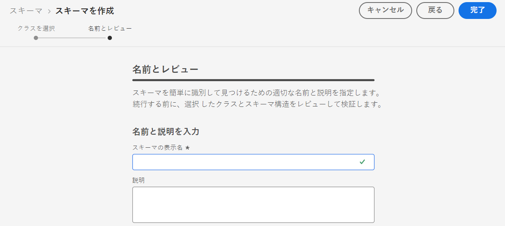
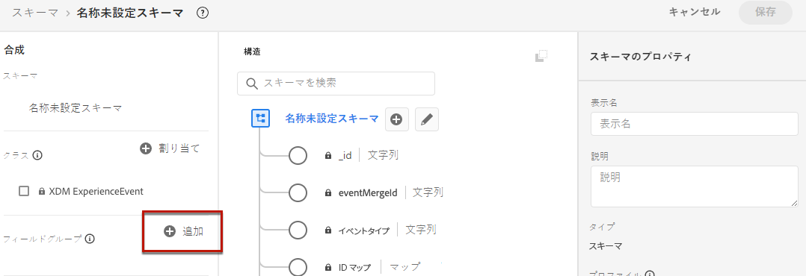
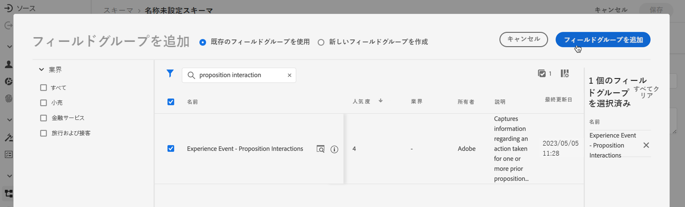
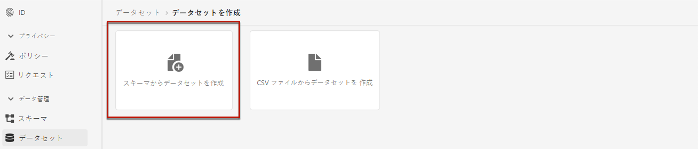

# イベントを収集するデータセットの作成 {#create-dataset}

エクスペリエンスイベントを収集するには、まずこれらのイベントを送信するデータセットを作成する必要があります。

まず、データセットで使用するスキーマを作成します。

1. **[!UICONTROL データ管理]**&#x200B;メニューで「**[!UICONTROL スキーマ]**」を選択します。

1. 右上の「**[!UICONTROL スキーマを作成]**」をクリックして、「**[!UICONTROL エクスペリエンスイベント]**」を選択し、「**次へ**」をクリックします。

   

   >[!NOTE]
   >
   >XDM スキーマとフィールドグループについて詳しくは、[XDM システムの概要ドキュメント ](https://experienceleague.adobe.com/docs/experience-platform/xdm/home.html?lang=ja){target="_blank"} を参照してください。

1. スキーマの名前と説明を入力して、「**終了**」をクリックします。
   

1. 左側の「**[!UICONTROL フィールドグループ]**」セクションで、「**[!UICONTROL 追加]**」を選択します。

   

1. 「**[!UICONTROL 検索]**」フィールドに「提案インタラクション」と入力します。

1. 「**[!UICONTROL エクスペリエンスイベント - 提案インタラクション]**」フィールドグループを選択し、「**[!UICONTROL フィールドグループの追加]**」をクリックします。

   

   >[!CAUTION]
   >
   >データセットで使用されるスキーマには、「**[!UICONTROL エクスペリエンスイベント - 提案インタラクション]**」フィールドグループが関連付けられている必要があります。そうしないと、AI モデルで使用できなくなります。

1. スキーマを保存します。

>[!NOTE]
>
>スキーマの構築について詳しくは、[ スキーマ構成の基本 ](https://experienceleague.adobe.com/docs/experience-platform/xdm/schema/composition.html?lang=ja#understanding-schemas){target="_blank"} を参照してください。

これで、このスキーマを使用してデータセットを作成する準備が整いました。 これを行うには、以下の手順に従います。

1. **[!UICONTROL データ管理]**&#x200B;メニューで「**[!UICONTROL データセット]**」を選択し、「**[!UICONTROL 参照]**」タブに移動します。

1. 「**[!UICONTROL データセットを作成]**」をクリックし、「**[!UICONTROL スキーマからデータセットを作成]**」を選択します。

   

1. 作成したスキーマをリストから選択し、「**[!UICONTROL 次へ]**」をクリックします。

1. 「**[!UICONTROL 名前]**」フィールドにデータセットの一意の名前を入力し、「**[!UICONTROL 終了]**」をクリックします。

   

>[!NOTE]
>
>これで、[AI モデルの作成](../ranking/create-ranking-strategies.md)時に、イベントデータを収集するデータセットを選択できる状態になりました。
