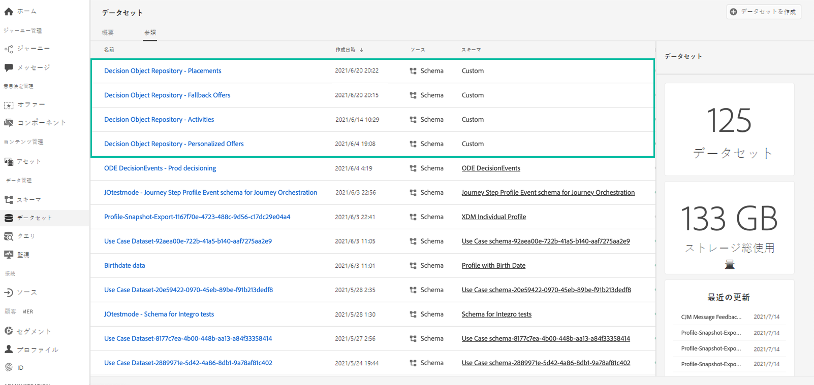
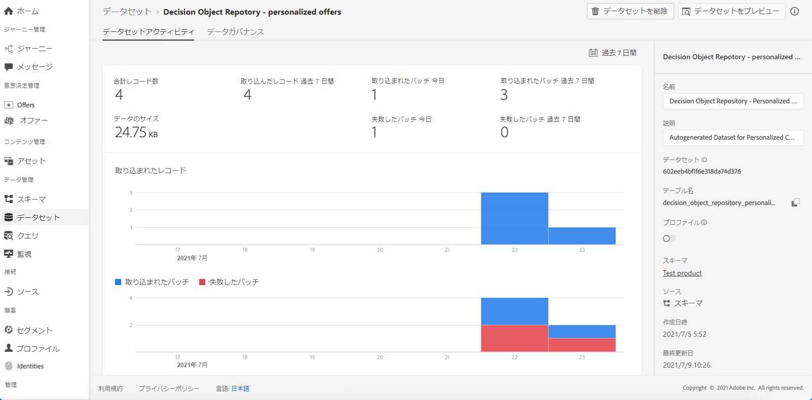
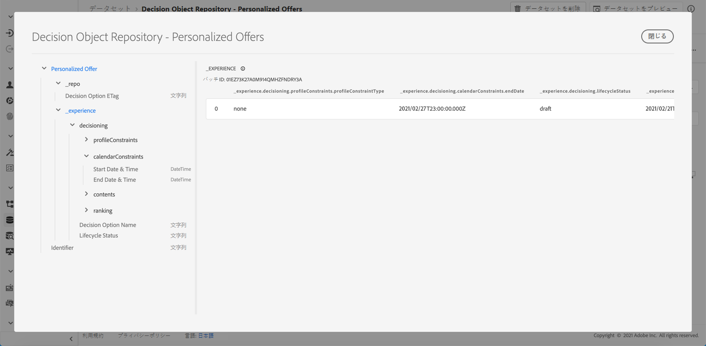

# 書き出したオファーカタログへのアクセス {#access-exported-catalog}

書き出したオファーカタログには、Adobe Experience Platform の&#x200B;**[!UICONTROL データセット]**&#x200B;メニューでアクセスできます。オファーライブラリのオブジェクトごとに 1 つのデータセットが作成されます。

データセットをクリックすると、その詳細が表示されます。

「**[!UICONTROL データセットをプレビュー]**」ボタンを使用すると、データセット内の最新の成功したバッチを表示できます。左側のパネルには、エクスポートされたデータのタイプに関する情報が表示されます。

データセットを参照および使用する方法の詳細については、[Adobe Experience Platform データセットのドキュメント](https://experienceleague.adobe.com/docs/experience-platform/catalog/datasets/user-guide.html?lang=ja#getting-started)を参照してください。
