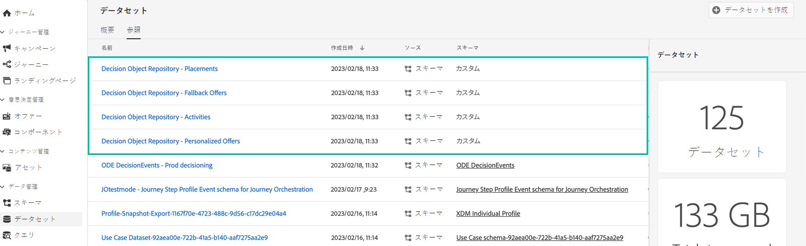
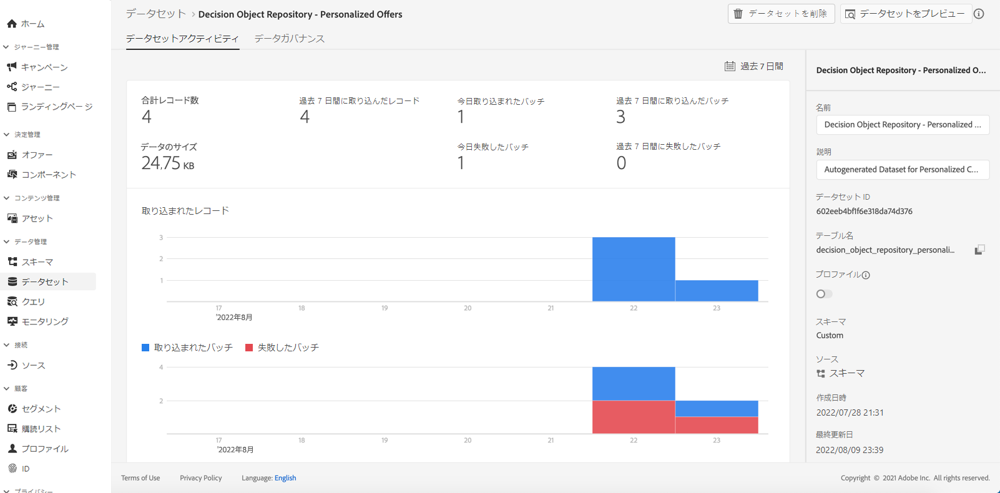

# 書き出したオファーカタログへのアクセス {#access-exported-catalog}

>[!TIP]
>
>[!DNL Adobe Journey Optimizer] の新しい決定機能である決定が、コードベースのエクスペリエンスチャネルとメールチャネルを通じて使用できるようになりました。 [詳細情報](../../experience-decisioning/gs-experience-decisioning.md)

エクスポートしたオファーカタログには、Adobe Experience Platform の&#x200B;**[!UICONTROL データセット]**&#x200B;メニューでアクセスできます。 オファーライブラリのオブジェクトごとに 1 つのデータセットが作成されます。

データセットをクリックすると、その詳細が表示されます。

「**[!UICONTROL データセットをプレビュー]**」ボタンを使用すると、データセット内の最新の成功したバッチを表示できます。

データセットの参照および使用方法について詳しくは、[このページ](../../data/get-started-datasets.md)を参照してください。
