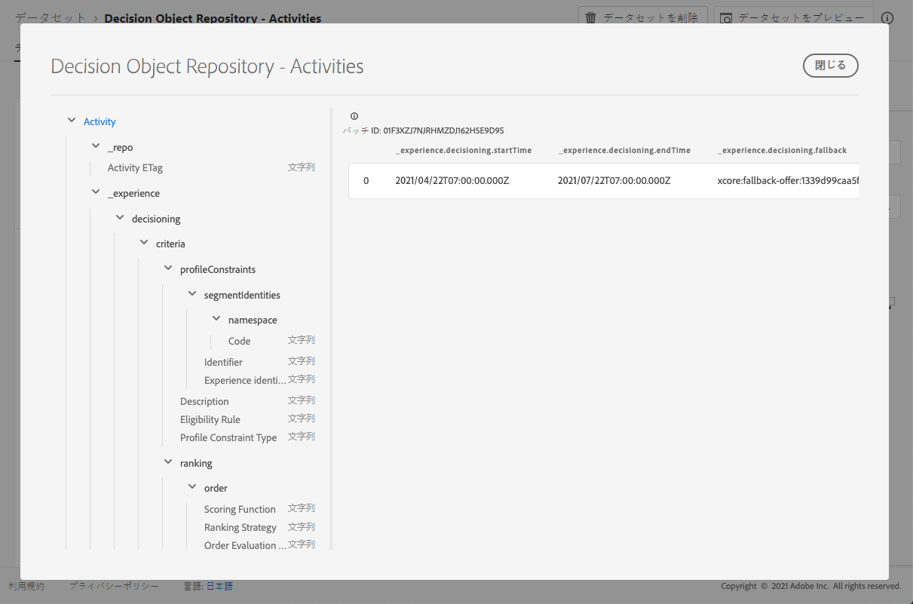

# 意思決定データセット {#decisions-dataset}

オファーが変更されるたびに、決定 (以前のアクティビティ) 用に自動生成されたデータセットが更新されます。

データセット内の最後の成功したバッチが右側に表示されます。 データセットのスキーマの階層ビューが左側のペインに表示されます。

>[!NOTE]
>
>この節 ](../export-catalog/access-dataset.md) で [ は、オファーライブラリの各オブジェクトについて、書き出したデータセットにアクセスする方法について説明します。

以下に、データセットに使用できるすべてのフィールドのリストを示します。これは、これまで「意思決定オブジェクトリポジトリ-アクティビティ」 **[!UICONTROL Decision Object Repository - Decisions]** と呼ばれていました。

<!--A decision (formerly known as offer decision) is used to control the decisioning process. It specifies the filter applied to the total inventory to narrow down offers by topic/category, the placement to narrow down the inventory to those offers that technically fit into the reserved space for the offer and specifies a fallback option should the combined constraints disqualify all available personalization offers.-->

## 識別子 {#identifier}

**フィールド:** _id
**タイトル:** 識別子
**説明:** レコードの一意の識別子。**タイプ:** string

## _experience {#experience}

**フィールド:** _experience
**タイプ:** object

### _experience > decisioning

**フィールド:** decisioning
**タイプ:** object

#### _experience > decisioning > criteria

**フィールド:** 基準
**タイトル:** 検索
**説明:** 一連の制約が各セットに含まれている一連の意思決定条件を定義します。**タイプ:** array

**_experience > decisioning > criteria > 説明**

**フィールド:** 説明
**タイトル:** つい
**説明:** 条件の説明。 この条件が構築され、それが決定にどのような影響を与えるかについて、人間が読み取ることができるかどうかを判断するために使用されます。**タイプ:** string

**_experience > decisioning > criteria > optionSelection**

**フィールド:** optionselection
**タイトル:** オプションの選択
**説明:** このオプションを選択すると、このコンテキストのオプションの有効性、適用性が決まります。**タイプ:** object

* **つい**

   **フィールド:** 説明
   **タイトル:** 説明
   **説明:** オプション選択の説明。 このオプションが構築されているか、どのようなオプションが設定されているか、またはその理由について、人間が読むことができるようにするために使用されます。
   **タイプ:** string

* **オプションフィルター**

   **フィールド:** フィルター
   **タイトル:** Option Filter
   **説明:** 割り当てられたタグを使用して、インベントリのオプションと一致するタグベースのフィルターへの参照。 値は、参照される意思決定規則の URI (@id) です。 スキーマの https://ns.adobe.com/experience/decisioning/filter を参照してください。
   **タイプ:** string

* **プロファイル制約タイプ**

   **フィールド:** optionselectiontype
   **タイトル:** プロファイル制約タイプ
   **説明:** 制約が現在設定されているかどうかと、制約の表現方法を指定します。 このような場合は、フィルタークエリを使用するか、1つ以上のセグメントメンバーシップを使用することが考えられます。
   **タイプ:** string
   **指定できる値は次のとおりです。** 「none」 (デフォルト)、&quot;directList&quot;、&quot;filter&quot;

* **オプションリスト**

   **フィールド:** オプション
   **タイトル:** オプションリスト
   **説明:** フィルタークエリーを評価せずに、直接オプションを指定するリストです。 オプションリスト、またはオプションフィルタールールのいずれかを指定することができます。
   **タイプ:** array

   <!--Missing title under Option List? Desc = An identifier of an decision option entity. The value value refers to an `@id` property of a decision option. Type: string-->

**_experience > decisioning > criteria > 配置**

**フィールド:** 配置
**タイトル:** 配置の制限
**説明:** 配置拘束は、この条件がリストされている場所にのみ適用されることを示します。 リスト内の目的の位置がリストに含ま `xdm:placements` れている場合にのみ、そのオプションの選択が検討されます。 それ以外の場合は、すべての意思決定条件がスキップされます。 「Xdm: 配置」リストが省略された場合、または空白になっている場合は、対象を絞った値が条件として考慮されます。 ここに示した配置は、オプション選択の条件を満たしています。 考慮対象のオプションには、対象となる配置の表現を指定する必要があります。**タイプ:** array

* **配置識別子**

   **タイトル:** 配置識別子
   **説明:** 配置エンティティへの参照。 値は、参照される配置の URI (@id) です。 スキーマの https://ns.adobe.com/experience/decisioning/placement を参照してください。
   **タイプ:** string

**_experience > decisioning > criteria > profileConstraints**

**フィールド:** profileConstraints
**タイトル:** プロファイル制約
**説明:** この時点で、プロファイルの制約によって、オプションの選択項目がこのプロファイル id の対象となるかどうかが現在のコンテキストで決定されます。 各オプションの値を指定する必要がない場合は、「false」に評価されるプロファイル制約によってオプションの選択全体がキャンセルされます。これは、「false」のような値になります。 これに対して、オプションをパラメーターとして使用するプロファイルの制約ルールは、オプション選択の各オプションについて評価されます。**タイプ:** object

* **_experience > decisioning > criteria > profileConstraints > 説明**

   **フィールド:** 説明
   **タイトル:** 説明
   **説明:** プロファイル制約の説明。 これは、このプロファイル制約を作成する方法またはその理由について、人間が読み取ることができるようにするために使用されます。または、この設定によって追加または除外されるオプションを指定します。
   **タイプ:** string

* **_experience > decisioning > criteria > profileConstraints > 適格性ルール**

   **フィールド:** eligibilityRule
   **タイトル:** 適格性ルール
   **説明:** 指定されたプロファイルとその他の特定のコンテキスト XDM オブジェクトについて、true または false に評価される意思決定規則への参照です。 このルールを使用して、オプションが特定のプロファイルに限定されているかどうかを判断します。 値は、参照される意思決定規則の URI (@id) です。 スキーマの https://ns.adobe.com/experience/decisioning/rule を参照してください。
   **タイプ:** string

* **_experience > decisioning > criteria > profileConstraints > Profile Constraint Type**

   **フィールド:** profileconstrtype
   **タイトル:** プロファイル制約タイプ
   **説明:** 制約が現在設定されているかどうかと、制約の表現方法を指定します。 このような場合は、ルールを使用するか、1つ以上のセグメントメンバーシップを使用することができます。
   **タイプ:** string
   **指定可能な値:**
   * 「none」を指定します (デフォルト)。
   * 「eligibilityRule」: 「プロファイル制約は、制約付きアクションが許可される前に true と評価される必要がある単一のルールとして表されます。
   * 「anySegments」: &quot;profile constraint&quot; は1つ以上のセグメントとして表現されるので、そのプロファイルは少なくとも1つに属している必要があります。
   * 「allSegments」: &quot;profile constraint&quot; は1つ以上のセグメントとして表現されるので、制限されたアクションを実行するには、そのすべてのメンバーである必要があります。
   * 「rules」: 「プロファイル制約」は、条件、適用性、適合性、条件を満たすアクションが実行される前に「true」と評価されます。

* **_experience > decisioning > criteria > profileConstraints > segmentIdentities**

   **フィールド:** segmentIdentities
   **タイトル:** セグメント識別子
   **説明:** セグメントの識別子。
   **タイプ:** array

   * **識別子**

      **フィールド:** _id
      **タイトル:** 識別子
      **説明:** 関連する名前空間のセグメントの id。
      **タイプ:** string

   * **名前**

      **フィールド:** namespace
      **タイトル:** 名前空間
      **説明:** 属性に `xid` 関連付けられた名前空間。
      **タイプ:** object
      **必須:** 「code」

      * **コード**

         **フィールド:** コード
         **タイトル:** コード
         **説明:** コードは、名前空間のユーザーによる読み取り可能な識別子であり、このコードを使用して、アイデンティティのグラフ処理に使用される技術的な名前空間 id を要求することができます。
         **タイプ:** string
   * **エクスペリエンス識別子**

      **フィールド:** xid
      **タイトル:** エクスペリエンス識別子
      **説明:** この値が指定されている場合、この値は、すべての名前空間内のすべての名前空間によって一意になるクロスネームの識別子を表します。
      **タイプ:** string

**_experience > decisioning > criteria > ランク付け**

**フィールド:** ランク付け
**タイトル:** ランクの詳細
**説明:** ランク (priority)。 決定条件のコンテキストによって、「最適な」オプションが決定される方法を定義します。 プロファイルの制約条件に適合するように選択されているすべてのオプションの中で、ランキングによってトップ (または先頭) オプションが決定されます。**タイプ:** object

* **_experience > decisioning > criteria > ランク付け > order**

   **フィールド:** 注文
   **タイトル:** 評価の注文
   **説明:** 1 つまたは複数の意思決定オプションの相対命令の評価。 序数値が小さいオプションよりも、序数値の大きいオプションが選択されています。 このメソッドによって決定される値は、並べ替えることはできますが、計算することはできません。また、計算することもできません。 Median and モードは、序数データに使用できる最も重要な傾向の基準となります。
   **タイプ:** object

   * **スコアリング関数**

      **フィールド:** 関数
      **タイトル:** スコアリング機能
      **説明:** この決定オプションの数値スコアを計算する関数への参照です。 その後、決定オプションはそのスコアによって順番に (ランク) されます。 このプロパティの値は、一度に on オプションを指定して呼び出す関数の URI (@id) です。 スキーマの https://ns.adobe.com/experience/decisioning/function を参照してください。
      **タイプ:** string

   * **Order 評価タイプ**

      **フィールド:** orderevaluationtype
      **タイトル:** 注文の評価タイプ
      **説明:** 使用する order メカニズムを指定します。決定オプションの静的な優先度では、すべてのオプションの数値を計算するスコアリング関数、または、それを並べ替えるリストを受け取るランク付けストラテジが使用されます。
      **タイプ:** string
      **指定できる値は次のとおりです:** &quot;static&quot;、&quot;scoringFunction&quot;、&quot;Ran王国ストラテジー&quot;

   * **ランク付け方針**

      **フィールド:** ran王国戦略
      **タイトル:** ランク付け方針
      **説明:** 意思決定オプションのリストをランク付けするストラテジへの参照です。 決定オプションは、番号リストに含まれています。 このプロパティの値は、一度に on オプションを指定して呼び出す関数の URI (@id) です。 スキーマの https://ns.adobe.com/experience/decisioning/rankingStrategy を参照してください。
      **タイプ:** string

* **_experience > decisioning > criteria > ランク付け > 優先順位**

   **フィールド:** priority
   **タイトル:** 優先度
   **説明:** 他のすべてのオプションを基準にした1つの決定オプションの優先度です。 Order 関数が指定されていないオプションについては、このプロパティを使用して優先順位が付けられます。 優先度が高いオプションよりも優先されます。 2つ以上の修飾オプションが最も優先度の高い値を共有している場合は、1つが一様なランダムに選択され、意志決定の意思決定に使用されます。
   **タイプ:** integer
   **最小値:** 0
   **初期設定値は0です。**

#### _experience > decisioning > アクティビティの終了日時

**フィールド:** 終了時刻
**タイトル:** アクティビティの終了日時
**説明:** 意思決定 (旧称 activity) 終了日付と終了時間。 このプロパティには、http://schema.org/Action で定義された org の &quot;endTime&quot; プロパティの意味があります。**タイプ:** string

#### _experience > decisioning > Fallback オプション

**フィールド:** フォールバック
**タイトル:** 「Fallback」オプション
**説明:** この決定のコンテキストに decisioning を適用したときに使用される fallback オプションへの参照は、通常のオプションに適合されません。これは、困難な拘束が適用されている場合に通常発生します。 値は、参照されるフォールバックオプションの URI (@id) です。**タイプ:** string

#### _experience > decisioning > Activity Name

**フィールド:** 名前
**タイトル:** アクティビティ名
**説明:** 様々なユーザーインターフェイスに表示される意思決定 (旧称 activity) 名です。**タイプ:** string

#### _experience > decisioning > アクティビティの開始日時

**フィールド:** startTime
**タイトル:** アクティビティの開始日時
**説明:** 意思決定 (旧称 activity) 開始日と終了時間。 このプロパティには、http://schema.org/Action で定義された org の「startTime」プロパティの意味があります。**タイプ:** string

## _repo {#repo}

**フィールド:** _repo
**タイプ:** object

### _repo > Activity ETag

**フィールド:** etag
**タイトル:** アクティビティ ETag
**説明:** 意思決定 (旧称 activity) オブジェクトがスナップショット作成時に使用されたことを示すリビジョン。**タイプ:** string
