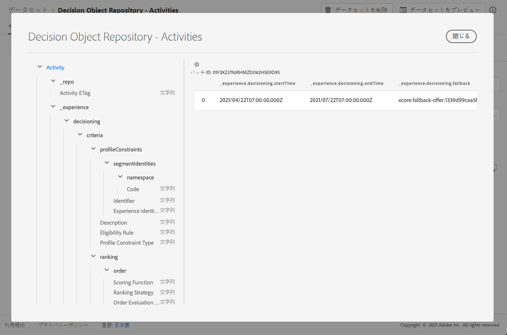

# 判断データセット{#decisions-dataset}

オファーが変更されるたびに、自動生成された判断データセットが更新されます。

データセット内で成功した最新のバッチが右側に表示されます。 データセットのスキーマの階層表示が左側のペインに表示されます。

>[!NOTE]
>
>[このセクション](../export-catalog/access-dataset.md)で、オファーライブラリの各オブジェクト用に書き出したデータセットにアクセスする方法を説明します。

決定(以前のオファー決定)は、決定プロセスの制御に使用されます。 トピック/カテゴリ別にオファーを絞り込むために、在庫合計に適用されるフィルタを指定します。在庫をオファーの予約領域に技術的に適合するオファーに絞り込むための配置と、組み合わせ制約によって使用可能なすべてのパーソナライゼーションオファーが不適格になる場合のフォールバックオプションを指定します。

以下に、**[!UICONTROL Decision Object Repository - Decisions]**&#x200B;データセット(旧称Decision Object Repository -アクティビティ)で使用できるすべてのフィールドのリストを示します。

## 識別子

レコードの一意の識別子。

型：文字列

## _エクスペリエンス

### 判定

#### 基準

一連の決定条件を定義します。各決定条件には、一連の制約が含まれます。

タイプ：array

* **説明**

   条件の説明。 この基準がどのように構築されたか、なぜ構築されたのか、またその判断に与える影響について、人間が理解できる意図を伝えるのに使用されます。

   型：文字列

* **オプションの選択**

   オプションの選択は、このコンテキストでのオプションの有効性/適用性を定義します。

   タイプ：object

   * **説明**

      オプション選択の説明。 このオプション選択の構成方法や構成理由、一致するオプションを人間が理解できる意図を伝えるために使用されます。

      型：文字列

   * **オプションフィルタ**

      タグに基づくフィルターへの参照。アタッチされたタグを使用して、在庫のオプションと一致します。 値は、参照される決定ルールのURI (@id)です。 スキーマhttps://ns.adobe.com/experience/decisioning/filterを参照してください。

      型：文字列

   * **プロファイル制約タイプ**

      拘束が現在設定されているかどうか、および拘束の表現方法を決定します。 フィルタークエリを使用するか、1つ以上のセグメントメンバーシップを使用するかが考えられます。

      型：文字列

   * **オプションリスト**

      フィルタークエリを評価せずに、オプションを直接指定するリスト。 オプションリストまたはオプションフィルター規則を指定できます。

      タイプ：array

      <!--Missing title under Option List? Desc = An identifier of an decision option entity. The value value refers to an `@id` property of a decision option.-->

* **配置**

   配置拘束では、この基準はリストに表示された配置にのみ適用できることが示されます。 対象となる配置が`xdm:placements`リスト内にある場合にのみ、考慮されるオプションが選択されます。 それ以外の場合は、決定条件全体がスキップされます。 &#39;xdm:placements&#39;リストが省略されたり空の場合、ターゲットを設定した場所に対する基準が考慮されます。 ここに示すプレースメントは、オプション選択に対して暗黙の条件を持ちます。 考慮するオプションは、対象となる配置を表す必要があります。

   タイプ：array

   * **配置識別子**

   配置エンティティへの参照。 値は、参照される配置のURI (@id)です。 スキーマhttps://ns.adobe.com/experience/decisioning/placementを参照してください。

   型：文字列

* **プロファイル制約**

   プロファイル制約は、このコンテキストで、現在の時点で、プロファイル選択がこのオプションIDに対して適格かどうかを決定します。 プロファイル制約は、各オプションの値を考慮する必要がない場合、つまり、オプション選択のオプションが不変である場合、「false」と評価されるプロファイル制約は、オプション選択全体をキャンセルします。 一方、プロファイルをパラメータとするオプション制約ルールは、オプション選択の各修飾オプションに対して評価されます。

   タイプ：object

   * **説明**

      プロファイル制約の説明。 このプロファイル制約が構築された方法や理由、また、この制約に含まれるオプションや除外されるオプションについて、人間が理解できる意図を伝えるために使用されます。

      型：文字列

   * **実施要件ルール**

      特定のプロファイルおよび/または他の指定されたコンテキストXDMオブジェクトに対してtrueまたはfalseと評価されるデシジョンルールへの参照です。 このルールは、特定のプロファイルに該当するかどうかを判断するために使用します。 値は、参照される決定ルールのURI (@id)です。 スキーマhttps://ns.adobe.com/experience/decisioning/ruleを参照してください。

      型：文字列

   * **プロファイル制約タイプ**

      拘束が現在設定されているかどうか、および拘束の表現方法を決定します。 ルールまたは1つ以上のセグメントメンバーシップを使用している可能性があります。

      型：文字列

      可能な値：&quot;none&quot;、&quot;eligibilityRule&quot;、&quot;anySegments&quot;、&quot;allSegments&quot;、&quot;rules&quot;

      デフォルト値：&quot;none&quot;

   * **セグメント識別子**

      セグメントの識別子

      文字列：array

      * **識別子**

         関連名前空間内のセグメントのID。

         型：文字列

      * **名前空間**

         `xid` 属性に関連付けられた名前空間。

         タイプ：object

         * **コード**

            コードは、人間が読める名前空間の識別子であり、ID グラフ処理に使用される技術名前空間 ID をリクエストするために使用できます。

            型：文字列
      * **エクスペリエンス識別子**

         存在する場合、この値は、すべての名前空間内のすべての名前空間スコープ識別子全体で一意の名前空間間識別子を表します。

         型：文字列

* **ランキングの詳細**

   ランク（優先度） 判断基準のコンテキストに対する\&quot;最良のオプション\&quot;の決定方法を定義します。 プロファイルの制約を満たす選択したすべてのオプションの中で、ランキングによって提案する上位（または上位N）のオプションが決定されます。

   タイプ：object

   * **注文の評価**

      1つ以上の決定オプションの相対順序の評価。 順序の値が高いオプションは、順序の値が低いオプションよりも選択されます。 この方法で決定される値は並べ替えることができますが、間の距離は測定できず、合計も製品も計算できません。 中央値とモードは、序数データに使用できる中心的傾向の唯一の測定値です。

      タイプ：object

      * **スコアリング関数**

         この決定オプションの数値スコアを計算する関数への参照です。 次に、そのスコアに基づいて決定オプションが並べ替えられます。 このプロパティの値は、onオプションで一度に呼び出す関数のURI (@id)です。 スキーマhttps://ns.adobe.com/experience/decisioning/functionを参照してください。

         型：文字列

      * **注文の評価タイプ**

         使用する順序評価メカニズム、決定オプションの静的優先度、各リストの数値を計算するスコアリング関数、または注文のを受け取るランキング戦略を指定します。

         型：文字列

      * **ランキングの戦略**

         意思決定リストをランク付けする戦略への参照。 決定オプションは、順序どおりのリストで返されます。 このプロパティの値は、onオプションで一度に呼び出す関数のURI (@id)です。 スキーマhttps://ns.adobe.com/experience/decisioning/rankingStrategyを参照してください。

         型：文字列
   * **優先度**

      1つの決定オプションの優先度を、他のすべてのオプションと比較した場合の優先度です。 注文関数が指定されていないオプションは、このプロパティを使用して優先付けされます。 優先順位の高いオプションは、優先順位の低いオプションよりも先に選択されます。 2つ以上の条件を満たすオプションが最も高い優先度の値を共有する場合、1つは一様なランダムで選択され、意思決定の提案に使用されます。

      タイプ：integer

      最小値：0

      デフォルト値：0

#### アクティビティ終了日時

デシジョンの終了日と終了時刻。 プロパティには、http://schema.org/Actionで定義されたスキーマ.orgの&#39;endTime&#39;プロパティのセマンティックが含まれます。

型：文字列

#### フォールバックオプション

この決定のコンテキストでデシジョニングを行うときに使用されるフォールバックオプションへの参照が、どの標準オプションも適用されません（通常、ハードコンストレインが適用される場合に発生します）。 この値は、参照されるフォールバックオプションのURI (@id)です。

型：文字列

#### アクティビティ名

様々なユーザーインターフェイスに表示される決定名。

型：文字列

#### アクティビティ開始の日時

決定開始の日付と終了時刻です。 プロパティに、schema.org の「startTime」プロパティのセマンティックが http://schema.org/Action で定義されている.

型：文字列

## _repo

### アクティビティETag

スナップショットが作成された時点での決定オブジェクトのリビジョン。

型：文字列
