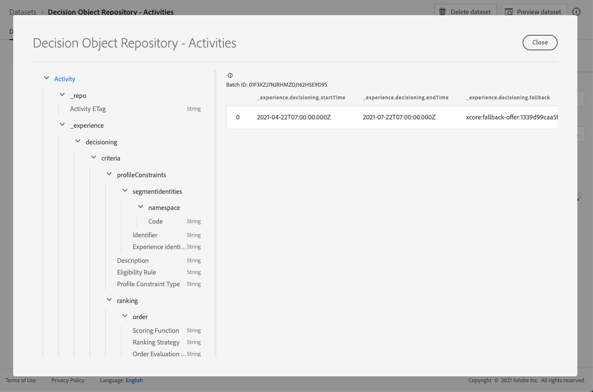

# 決定データセット {#decisions-dataset}

>[!TIP]
>
>[!DNL Adobe Journey Optimizer] の新しい決定機能である決定が、コードベースのエクスペリエンスチャネルとメールチャネルを通じて使用できるようになりました。 [詳細情報](../../experience-decisioning/gs-experience-decisioning.md)

オファーを変更するたびに、自動生成された決定データセットが更新されます。

正常に更新された、データセットの最新のバッチが右側に表示されます。 データセットのスキーマの階層ビューが左側のペインに表示されます。

>[!NOTE]
>
>[この節](../export-catalog/access-dataset.md)では、オファーライブラリの各オブジェクト用にエクスポートしたデータセットにアクセスする方法を説明します。

次に、**[!UICONTROL 決定オブジェクトリポジトリー（決定）]**&#x200B;データセット（旧称：決定オブジェクトリポジトリー（アクティビティ））で使用できるすべてのフィールドのリストを示します。

<!--A decision (formerly known as offer decision) is used to control the decisioning process. It specifies the filter applied to the total inventory to narrow down offers by topic/category, the placement to narrow down the inventory to those offers that technically fit into the reserved space for the offer and specifies a fallback option should the combined constraints disqualify all available personalization offers.-->

+++ 識別子

**フィールド：**&#x200B;_id
**タイトル：**&#x200B;識別子
**説明：** レコードの一意のID。
**タイプ：**&#x200B;文字列

+++

+++ _experience

**フィールド：** _experience
**タイプ：**&#x200B;オブジェクト

+++

+++ _experience > decisioning

**フィールド：**&#x200B;決定
**タイプ：**&#x200B;オブジェクト

+++

+++ _experience > decisioning > criteria

**フィールド：**&#x200B;条件
**タイトル：**&#x200B;条件
**説明：**&#x200B;それぞれに一連の制約が含まれる一連の決定条件を定義します。
**型：**&#x200B;配列

+++

+++ _experience > decisioning > criteria > description

**フィールド：**&#x200B;description
**タイトル：**&#x200B;説明
**説明：**&#x200B;条件の説明。 この条件の構成や目的、この条件が決定に与える影響などについて、人間が判読できる形で意図を伝えるために使用します。
**タイプ：**&#x200B;文字列

+++

+++_experience > decisioning > criteria > optionSelection

**フィールド：** optionSelection
**タイトル：** オプションの選択
**説明：** オプションの選択は、このコンテキストにおけるオプションの有効性/適用性を定義します。
**タイプ：**&#x200B;オブジェクト

* 説明

  **フィールド：**&#x200B;description
  **タイトル：**&#x200B;説明
  **説明：**&#x200B;オプション選択の説明。 このオプション選択の構築方法や構築理由、または一致するオプションについて、判読できる意図を伝えるために使用されます。
  **タイプ：**&#x200B;文字列

* オプションフィルター

  **フィールド：**&#x200B;filter
  **タイトル：**&#x200B;オプションフィルター
  **説明：** 関連付けられたコレクション修飾子を使用して在庫のオプションに一致するコレクション修飾子（旧称「タグ」）ベースのフィルターへの参照。 値は、参照される決定ルールの URI（@id）です。 https://ns.adobe.com/experience/decisioning/filter のスキーマを参照してください。
  **タイプ：**&#x200B;文字列

* プロファイル制約タイプ

  **フィールド：**&#x200B;optionSelectionType
  **タイトル：**&#x200B;プロファイル制約タイプ
  **説明：**&#x200B;制約が現在設定されているかどうか、また制約がどのように表現されているかを判定します。 フィルタークエリを使用するか、1 つ以上のオーディエンスメンバーシップを使用する場合があります。
  **タイプ：**&#x200B;文字列
  **使用可能な値：** &quot;none&quot;（デフォルト）、&quot;directList&quot;、&quot;filter&quot;

* オプションリスト

  **フィールド：**&#x200B;options
  **タイトル：**&#x200B;オプションリスト
  **説明：**&#x200B;フィルタークエリを評価せずに、オプションを直接指定するリスト。 オプションリストまたはオプションフィルタールールを指定できます。
  **型：**&#x200B;配列

<!--Missing title under Option List? Desc = An identifier of an decision option entity. The value value refers to an `@id` property of a decision option. Type: string-->

+++

+++_experience > decisioning > criteria > placements

**フィールド：** プレースメント
**タイトル：**&#x200B;配置の制限
**説明：** プレースメント制約では、この条件はリストされたプレースメントにのみ適用されることを示しています。 `xdm:placements` リスト内にある対象の配置がオプション選択である場合にのみ選択されます。 それ以外の場合は、決定条件全体がスキップされます。 「xdm:placements」リストが省略された、または空の場合、ターゲットとする任意のプレースメントに対して条件が考慮されます。 ここに示すプレースメントは、オプション選択に対して暗黙の条件を適用します。 考慮するオプションには、対象となるプレースメントの表現が必要です。
**型：**&#x200B;配列

* プレースメント識別子

  **タイトル：**&#x200B;プレースメント ID
  **説明：**&#x200B;プレースメントエンティティへの参照。 値は、参照されるオファープレースメントの URI（@id）です。 スキーマ https://ns.adobe.com/experience/decisioning/placement を参照してください。
  **タイプ：**&#x200B;文字列

+++

+++_experience > decisioning > criteria > profileConstraints

**フィールド：** profileConstraints
**タイトル：** プロファイル制約
**説明：** プロファイル制約は、このコンテキストで、この時点でこのプロファイル IDに対してオプション選択が適格かどうかを決定します。 プロファイル制約で各オプションの値を考慮する必要がない場合（オプション選択のオプションが不変である場合）、「false」と評価されるプロファイル制約では、オプション選択全体がキャンセルされます。 一方、オプションをパラメーターとするプロファイル制約ルールは、要件を満たすオプションを選択するたびに評価されます。
**タイプ：**&#x200B;オブジェクト

+++

+++_experience > decisioning > criteria > profileConstraints > Description

**フィールド：**&#x200B;description
**タイトル：**&#x200B;説明
**説明：** プロファイル制約の説明。 このプロファイルの制約が設けられた経緯や理由、どのオプションが含まれ、除外されるかについて、人間が判読できる形で意図を伝えるために使用します。
**タイプ：**&#x200B;文字列

+++

+++ _experience > decisioning > criteria > profileConstraints > Eligibility Rule

**フィールド：**&#x200B;実施要件ルール
**タイトル：**&#x200B;の実施要件ルール
**説明：**&#x200B;特定のプロファイルやその他の特定のコンテキスト XDM オブジェクトに対して、trueまたはfalseと評価される決定ルールへの参照。 ルールは、オプションが特定のプロファイルに該当するかどうかを決定するために使用されます。 値は、参照される決定ルールの URI（@id）です。 スキーマ https://ns.adobe.com/experience/decisioning/rule を参照してください。
**タイプ：**&#x200B;文字列

+++

+++ _experience > decisioning > criteria > profileConstraints > Profile Constraint Type

**フィールド：** profileConstraintType
**タイトル：**&#x200B;プロファイル制約タイプ
**説明：**&#x200B;制約が現在設定されているかどうか、また制約がどのように表現されているかを判定します。 ルールを使用するか、1 つ以上のオーディエンスメンバーシップを使用する場合があります。
**タイプ：**&#x200B;文字列
**指定可能な値：**

* 「なし」（デフォルト）
* 「eligibilityRule」:「プロファイル制約は、制約付きアクションが許可される前に true と評価される必要がある単一の規則として表されます。」
* 「anySegments」:「プロファイル制約は 1 つ以上のオーディエンスとして表され、制約付きアクションが許可されるには、プロファイルが少なくとも 1 つのオーディエンスのメンバーである必要があります。」
* 「allSegments」:「プロファイル制約は 1 つ以上のオーディエンスとして表され、制約付きアクションが許可されるには、プロファイルがすべてのオーディエンスのメンバーである必要があります。」
* 「rules」:「プロファイル制約は実施要件、適用性、適合性など、様々なルールとして表され、制約付きアクションが許可されるには、これらがすべて true として評価される必要があります。」

+++

+++ _experience > decisioning > criteria > profileConstraints > segmentIdentities

**フィールド：** セグメント ID
**タイトル：** セグメント識別子
**説明：** オーディエンスの識別子。
**型：**&#x200B;配列

* 識別子

  **フィールド：**&#x200B;_id
  **タイトル：**&#x200B;識別子
  **説明：**&#x200B;関連する名前空間に含まれるオーディエンスの ID。
  **タイプ：**&#x200B;文字列

* 名前空間

  **フィールド：** 名前空間
  **タイトル：**&#x200B;名前空間
  **説明：**&#x200B;属性に関連付けられた名前空間`xid` 。
  **タイプ：**&#x200B;オブジェクト
  **必須：**「コード」

   * コード

     **フィールド：**&#x200B;code
     **タイトル：**&#x200B;コード
     **説明：**&#x200B;コードは、人が読める名前空間の識別子であり、ID グラフ処理に使用される技術名前空間 ID をリクエストするために使用できます。
     **タイプ：**&#x200B;文字列

* エクスペリエンス識別子

  **フィールド：**&#x200B;xid
  **タイトル：**&#x200B;エクスペリエンス識別子
  **説明：**&#x200B;存在する場合、この値は、すべての名前空間内の名前空間スコープ識別子全体で一意の名前空間間識別子を表します。
  **タイプ：**&#x200B;文字列

+++

+++_experience > decisioning > criteria > ranking

**フィールド：**&#x200B;件のランキング
**タイトル：** ランキングの詳細
**説明：** ランク （優先度）。 決定条件のコンテキストに基づいて「最良のオプション」を決定する方法を定義します。 プロファイルの制約を満たす選択したすべてのオプションの中から、ランキングに基づいて最良の（または上位 N 個の）提案オプションを決定します。
**タイプ：**&#x200B;オブジェクト

+++ 

+++_experience > decisioning > criteria > ranking > order

**フィールド：**&#x200B;件の注文
**タイトル：**&#x200B;注文評価
**説明：** 1つ以上の決定オプションの相対的な順序の評価。 序数の値が大きいオプションは、序数の値が小さいオプションよりも優先的に選択されます。 この方法で決定された値は順序付けできますが、それらの間の距離は測定できず、合計も積も計算できません。 主な傾向を測る数値として序数データに使用できるのは、中央値とモードだけです。
**タイプ：**&#x200B;オブジェクト

* スコア関数

  **フィールド：**&#x200B;function
  **タイトル：**&#x200B;スコア関数
  **説明：**&#x200B;この決定オプションの数値スコアを計算する関数への参照。 決定オプションは、そのスコアで並べ替えられます（ランク付け）。 このプロパティの値は、on オプションを指定して一度に呼び出す関数の URI（@id）です。 https://ns.adobe.com/experience/decisioning/function のスキーマを参照してください。
  **タイプ：**&#x200B;文字列

* 順序評価の種類**

  **フィールド：**&#x200B;orderEvaluationType
  **タイトル：**&#x200B;順序評価のタイプ
  **説明：**&#x200B;使用する順序評価メカニズム、決定オプションの静的優先度、すべてのオプションの数値を計算するスコア関数、またはリストを受け取って順序を決定する AI モデルを指定します。
  **タイプ：**&#x200B;文字列
  **指定可能な値：**「static」、「scoringFunction」、「rankingStrategy」

* ランキング戦略

  **フィールド：**&#x200B;rankingStrategy
  **タイトル：**&#x200B;ランキング戦略
  **説明：**&#x200B;決定オプションのリストをランク付けする戦略への参照。 決定オプションは、順序付きリストで返されます。 このプロパティの値は、on オプションを指定して一度に呼び出す関数の URI（@id）です。 https://ns.adobe.com/experience/decisioning/rankingStrategy のスキーマを参照してください。
  **タイプ：**&#x200B;文字列

+++

+++ _experience > decisioning > criteria > ranking > Priority

**フィールド：**&#x200B;優先度
**タイトル：**&#x200B;優先度
**説明：**&#x200B;他のすべてのオプションに対する、単一の決定オプションの優先度。 順序関数が指定されていないオプションは、このプロパティを使用して優先付けされます。 優先度が高いオプションは、優先度が低いオプションの前に選択されます。 条件を満たす、最高優先度のオプションが複数ある場合、1 つがランダムに選択され、決定の提案に使用されます。
**型：**&#x200B;整数
**最小値：** 0
**デフォルト値：** 0

+++

+++ _experience > decisioning > アクティビティ終了日時

**フィールド：** endTime
**タイトル：** アクティビティ終了日時
**説明：**&#x200B;決定（旧称アクティビティ）の終了日と終了時間。 プロパティには、https://schema.org/Action で定義された schema.org の「endTime」プロパティの意味があります。
**タイプ：**&#x200B;文字列

+++

+++ _experience > decisioning > Fallback Option

**フィールド：** フォールバック
**タイトル：** フォールバックオプション
**説明：**&#x200B;この決定のコンテキストで決定する際に使用されるフォールバックオプションへの参照は、通常のオプションのどれにも当てはまりません（これは通常、ハード制約が適用される場合に発生します）。 値は、参照されるフォールバックオファーの URI（@id）です。
**タイプ：**&#x200B;文字列

+++

+++ _experience > decisioning > Activity Name

**フィールド：** name
**タイトル：** アクティビティ名
**説明：**&#x200B;様々なユーザーインターフェイスに表示される決定名（旧称アクティビティ）名。
**タイプ：**&#x200B;文字列

+++

+++_experience > 決定 > アクティビティの開始日時

**フィールド：** startTime
**タイトル：** アクティビティ開始日時
**説明：**&#x200B;決定（旧称アクティビティ）の開始日と終了時間。 プロパティには、https://schema.org/Action で定義された schema.org の「startTime」プロパティの意味があります。
**タイプ：**&#x200B;文字列

+++

+++ _repo

**フィールド：** _repo
**タイプ：**&#x200B;オブジェクト

+++

+++ _repo > Activity ETag

**フィールド：** etag
**タイトル：** Activity ETag
**説明：** スナップショットの実行時に決定（以前はアクティビティと呼ばれていた）オブジェクトが行われたリビジョン。
**タイプ：**&#x200B;文字列

+++
