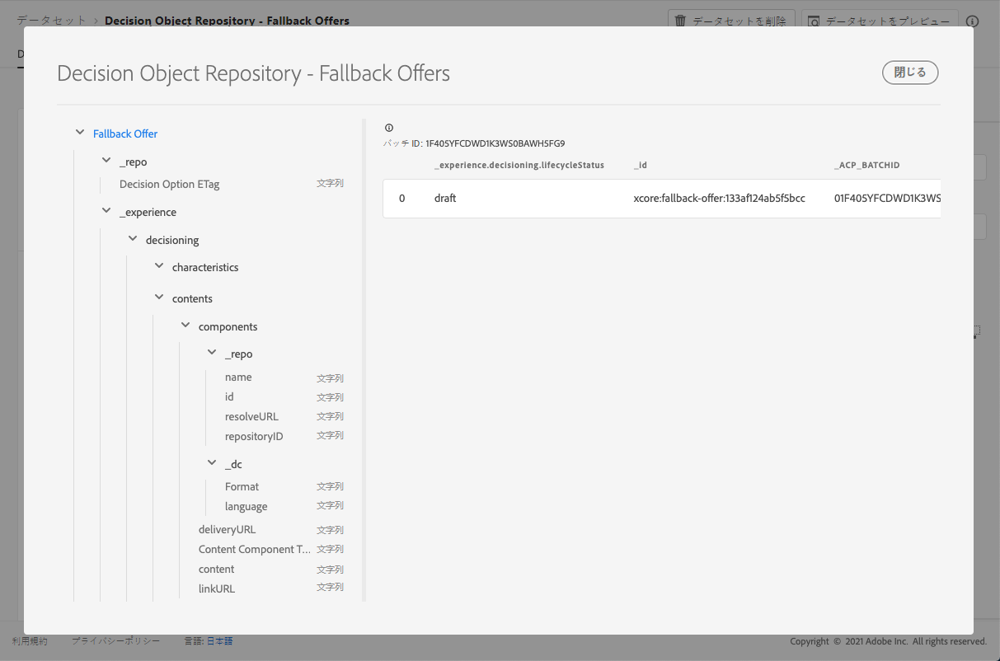

# フォールバックがデータセットを提供 {#fallback-dataset}

オファーが変更されるたびに、フォールバック用に自動生成されたデータセットが更新されます。

データセット内の最後の成功したバッチが右側に表示されます。 データセットのスキーマの階層ビューが左側のペインに表示されます。

>[!NOTE]
>
>この節 ](../export-catalog/access-dataset.md) で [ は、オファーライブラリの各オブジェクトについて、書き出したデータセットにアクセスする方法について説明します。

以下に、データセットで **[!UICONTROL Decision Object Repository - Fallback Offers]** 使用可能なすべてのフィールドの一覧を示します。

## 識別子 {#identifier}

**フィールド:** _id
**タイトル:** 識別子
**説明:** レコードの一意の識別子。**タイプ:** string

## _experience {#experience}

**フィールド:** _experience
**タイプ:** object

### _experience > decisioning

**フィールド:** decisioning
**タイプ:** object

#### _experience > decisioning > の特長

**フィールド:** 特性
**タイトル:** 意思決定オプションの特性
**説明:** この特定の決定オプションに属しているその他のプロパティまたは属性を指定します。 各インスタンスによって、異なる特性が設定されていることがあります (マップ内のキー)。 属性とは、他の意思決定オプションを区別するために使用される名前と値のペアです。 特性は、この判断オプションを表すコンテンツ内の値として使用されます。また、オプションのパフォーマンスを分析して最適化するための機能としても使用されます。 各インスタンスの属性またはプロパティが同じである場合は、デシジョンオプション詳細から派生した拡張スキーマとして、そのアスペクトをモデル化する必要があります。**タイプ:** object

<!--Field under Characteristics without title = additionalProperties? Desc = Value of the property. Type: string-->

#### _experience > decisioning > コンテンツ

**フィールド:** コンテンツ
**タイトル:** コンテンツの詳細
**説明:** Decision item を別のコンテキストで表示するためのコンテンツアイテムです。 1つの決定オプションには、複数のコンテンツのバリエーションを含めることができます。 コンテンツとは、(デジタル) 利用状況において、対象ユーザーに向けられる情報を示します。 コンテンツは、チャネルを通じて特定の場所に配信されます。**タイプ:** array

**_experience > decisioning > contents > components**

**フィールド:** コンポーネント
**説明:** 意思決定オプションを表すコンテンツのコンポーネントです。すべての言語バリエーションが含まれています。 特定のコンポーネントについては、「dx: format」、「dc: subject」および「dc: language」、またはそれらの組み合わせによって確認できます。 このメタデータは、オファーに関連付けられたコンテンツを見つけたり、表現したりするために使用されます。**タイプ:** array
**必要になります。** &quot;_type&quot;、&quot;_dc&quot; <!--TBC?-->

* **_experience > decisioning > contents > component > Content Component Type**

   **フィールド:** _type
   **タイトル:** コンテンツコンポーネントタイプ
   **説明:** 各値がコンテンツコンポーネントに割り当てられた型にマップされている一連の uri です。 コンテンツ表現の一部のコンシューマーにとって、@type 値は、コンテンツコンポーネントの追加のプロパティを記述するスキーマへの参照として使用されることが想定されています。
   **タイプ:** string

* **_experience > decisioning > contents > components > _dc**

   **フィールド:** _dc
   **タイプ:** object
   **必須:** 「format」

   * **書式**

      **フィールド:** フォーマット
      **タイトル:** フォーマット
      **説明:** リソースの物理的またはディジタル manifestation 通常、フォーマットには、リソースのメディアタイプが含まれている必要があります。 フォーマットを使用して、リソースを表示または操作するために必要なソフトウェア、ハードウェア、またはその他の機器を決定することができます。 推奨されるベストプラクティスは、被制御語彙 (インターネットメディアタイプ ] のリスト (http://www.iana.org/割り当て/メディアタイプ) の [ リストなど) から値を選択することです。この方法では、コンピューターのメディアフォーマットを定義します。
      **タイプ:** string
      **例:** &quot;application/vnd adobe photoshop&quot;

   * **言語**

      **フィールド:** 言語
      **タイトル:** 言語
      **説明: リソースの言語または言語を示し** ます。 \N 言語は、IETF RFC 3066 ](https://www.ietf.org/rfc/rfc3066.txt) で定義 [ されている言語コードに指定されています。 BCP 47 の一部であり、これは XDM の他の場所で使用されます。
      **タイプ:** array
      **例:** &quot;\n&quot;、&quot;pt-BR&quot;、&quot;es-es&quot;

* **_experience > decisioning > contents > components > _repo**

   **フィールド:** _repo
   **タイプ:** object

   * **コード**

      **フィールド:** id
      **説明:** コンテンツリポジトリ内のアセットを参照するためのオプションの一意の識別子。 プラットフォーム Api を使用してイメージを取得する場合、クライアントでは、アセットを取得するために、追加のプロパティ「リポジトリ: resolveUrl」が必要になることがあります。
      **タイプ:** string
      **例:** &quot;urn :aaid: sc :US: 6dc33479-13ca-4b19-b25d-c805eff8a69e&quot;

   * **氏名**

      **フィールド:** 名前
      **説明:** 外部アセットが保存されているリポジトリが見つからない場合は、「リポジトリ: id」というヒントが表示されます。
      **タイプ:** string

   * **repositoryID**

      **フィールド:** repositoryID
      **説明:** コンテンツリポジトリ内のアセットを参照するためのオプションの一意の識別子。 プラットフォーム Api を使用してイメージを取得する場合、クライアントでは、アセットを取得するために、追加のプロパティ「リポジトリ: resolveUrl」が必要になることがあります。
      **タイプ:** string
      **例:** &quot;C87932A55B06F7070A49412D@AdobeOrg&quot;

   * **resolveURL**

      **フィールド:** resolveurl
      **説明:** コンテンツリポジトリ内のアセットを読み取るためのオプションの一意のリソースロケーター。 これにより、アセットが管理される場所や、どの Api を呼び出すかをクライアントが理解していなくても、アセットを容易に取得できるようになります。 これは HAL リンクに似ていますが、セマンティクスがより単純で、purposeful になります。
      **タイプ:** string
      **例:** &quot;https://plaftform.adobe.io/resolveByPath? path =&quot;/mycorp/content/projectx/fragment/prod/herobanners/banner14.html3 &quot;&quot;

* **_experience > decisioning > コンテンツ > コンポーネント > コンテンツ**

   **フィールド:** コンテンツ
   **説明:** コンテンツを直接保持するためのオプションフィールド。 このコンポーネントは、アセットリポジトリ内のコンテンツを参照するのではなく、単純なコンテンツを直接保持できます。 このフィールドは、コンポジット、複雑、バイナリコンテンツアセットには使用されません。
   **タイプ:** string

* **_experience > decisioning > コンテンツ > コンポーネント > deliveryURL**

   **フィールド:** deliveryurl
   **説明:** コンテンツ配信ネットワークまたはサービスエンドポイントからアセットを取得するための、オプションの一意のリソースロケーターです。 この URL を使用して、ユーザーエージェントがパブリックアセットにアクセスすることができます。
   **タイプ:** string
   **例:** &quot;https://cdn.adobe.io/content/projectx/fragment/prod/static/1232324wd32.jpeg&quot;

* **_experience > decisioning > contents > components > linkURL**

   **フィールド:** linkURL
   **説明:** ユーザー操作に使用する、オプションの一意のリソースロケーターを指定します。 この URL は、エンドユーザーがユーザーエージェント内を参照するために使用され、追跡することができます。
   **タイプ:** string
   **例:** &quot;https://cdn.adobe.io/tracker?code=23432&amp;redirect=/content/projectx/fragment/prod/static/1232324wd32.jpeg&quot;

**_experience > decisioning > コンテンツ > 配置**

**フィールド:** 配置
**タイトル:** 設置
**説明:** 適合させる場所。 値は、参照されるオファーの配置の URI (@id) です。 スキーマの https://ns.adobe.com/experience/decisioning/placement を参照してください。**タイプ:** string

#### _experience > decisioning > ライフサイクルの状態

**フィールド:** lifecycleStatus
**タイトル:** ライフサイクルの状態
**説明:** ライフサイクル状態では、オブジェクトを使用したワークフローの実行が許可されます。 状態は、オブジェクトが表示されたり、関係があると考えられる場所に影響する場合があります。 状態の変更は、そのオブジェクトを使用しているクライアントまたはサービスによって行われます。**タイプ:** string
**指定可能な値:** 「下書き」 (初期設定)、「許可」、「有効」、「完了」、「アーカイブ」

#### _experience > decisioning > デシジョンオプション名

**フィールド:** 名前
**タイトル:** 「意思決定オプション」の名前
**説明:** 様々なユーザーインターフェイスに表示されるオプション名です。**タイプ:** string

#### _experience > decisioning > タグ

**フィールド:** タグ
**タイトル:** タグ
**説明:** このエンティティに関連付けられたタグのセット。 これらのタグは、フィルター式で使用され、全体のインベントリがサブセット (カテゴリ) に制限されます。**タイプ:** array

<!--Field without name under tags: Description: An identifier of a tag object. The value is the @id of the tag that is referenced. See tag schema: https://ns.adobe.com/experience/decisioning/tag. Type: string-->

## _repo {#repo}

**フィールド:** _repo
**タイプ:** object

### _repo > ディシジョンオプション ETag

**フィールド:** etag
**タイトル:** 決定オプション ETag
**説明:** スナップショットが作成されたときに意思決定オプションオブジェクトに指定されていたバージョンです。**タイプ:** string
