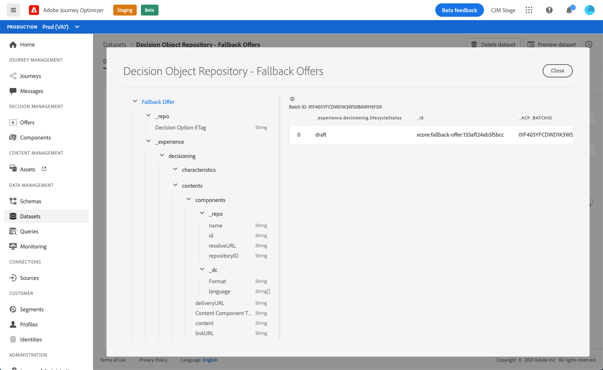

# フォールバックオファーデータセット {#fallback-dataset}

>[!TIP]
>
>[!DNL Adobe Journey Optimizer] の新しい決定機能である決定が、コードベースのエクスペリエンスチャネルとメールチャネルを通じて使用できるようになりました。 [詳細情報](../../experience-decisioning/gs-experience-decisioning.md)

オファーが変更されるたびに、フォールバックオファーの自動生成データセットが更新されます。

正常に更新された、データセットの最新のバッチが右側に表示されます。 データセットのスキーマの階層ビューが左側のペインに表示されます。

>[!NOTE]
>
>削除済みのフォールバックオファーは、データセット内でアーカイブ済みとしてマークされます。

次に、**[!UICONTROL 決定オブジェクトリポジトリー（フォールバックオファー）]**&#x200B;データセットで使用できるすべてのフィールドのリストを示します。

+++ 識別子

**フィールド：**_id
**タイトル：**識別子
**説明：** レコードの一意のID。
**タイプ：**&#x200B;文字列

+++

+++ _experience

**フィールド：** _experience
**タイプ：**&#x200B;オブジェクト

+++

+++ _experience > decisioning

**フィールド：**決定
**タイプ：**&#x200B;オブジェクト

+++

+++ _experience > decisioning > characteristics

**フィールド：**特性
**タイトル：**決定オプションの特性
**説明：**この特定の決定オプションに属する追加のプロパティまたは属性。 異なるインスタンスは、異なる特性（マップ内のキー）を持つことができます。 特性は、名前と値のペアを使用して、決定オプションを他の決定オプションと区別します。 特性は、この決定オプションを表すコンテンツの値として、またオプションのパフォーマンスを分析および最適化する機能として使用されます。 すべてのインスタンスが同じ属性またはプロパティを持つ場合、その側面は、決定オプションの詳細から派生する拡張スキーマとしてモデル化する必要があります。
**タイプ：**&#x200B;オブジェクト

+++

<!--Field under Characteristics without title = additionalProperties? Desc = Value of the property. Type: string-->

+++ _experience > decisioning > contents

**フィールド：**内容
**タイトル：** コンテンツの詳細
**説明：** コンテンツ項目を使用して、異なるコンテキストで決定項目をレンダリングします。 1 つの決定オプションに複数のコンテンツのバリアントを含めることができます。 コンテンツとは、（デジタル）エクスペリエンスでの消費に対してオーディエンスに向けられた情報です。 コンテンツは、チャネルを通じて特定の配置に配信されます。
**型：**&#x200B;配列

+++

+++_experience > decisioning > contents > components

**フィールド：** コンポーネント
**説明：**&#x200B;決定オプションを表すコンテンツのコンポーネント（言語バリエーションをすべて含む）。 特定のコンポーネントを見つけるには、「dx:format」、「dc:subject」、「dc:language」、またはこれらの組み合わせを使用します。 このメタデータは、オファーに関するコンテンツを見つける場合や表す場合に使用され、プレースメント契約に従って統合します。
**型：**配列
**必須：** &quot;_type&quot;, &quot;_dc&quot; <!--TBC?-->

* **_experience > decisioning > contents > components > Content Component Type**

  **フィールド：**_type
  **タイトル：**コンテンツコンポーネントタイプ
  **説明：**各値がコンテンツコンポーネントに指定されたタイプにマッピングされる URI の列挙セット。 コンテンツ表示域を使用する一部のコンテンツは、@type 値がコンテンツコンポーネントの追加のプロパティを記述するスキーマへの参照であることを要求します。
  **タイプ：**&#x200B;文字列

* **_experience > decisioning > contents > components > _dc**

  **フィールド：**_dc
  **タイプ：**オブジェクト
  **必須：**&quot;format&quot;

   * **形式**

     **フィールド：** format
     **タイトル：**形式
     **説明：**&#x200B;リソースの物理的またはデジタル表現。 通常、形式にはリソースのメディアタイプを含める必要があります。 形式は、リソースの表示や操作に必要なソフトウェア、ハードウェア、その他の機器を特定するために使用できます。 推奨されるベストプラクティスは、制御された語彙（コンピューターのメディア形式を定義する[インターネットメディアタイプ]（http://www.iana.org/ assignments/media-types/）など）のリストから値を選択することです。
     **タイプ：**文字列
     **例：**&quot;application/vnd.adobe.photoshop&quot;

   * **言語**

     **フィールド：** language
     **タイトル：**言語
     **説明：**&#x200B;言語またはリソースの言語。 \n言語は、XDM の他の場所で使用される[IETF RFC 3066](https://www.ietf.org/rfc/rfc3066.txt)（BCP 47の一部）で定義されている言語コードで指定されます。
     **型：**配列
     **例：**&quot;\n&quot;、&quot;pt-BR&quot;、&quot;es-ES&quot;

* **_experience > decisioning > contents > components > _repo**

  **フィールド：** _repo
  **タイプ：**&#x200B;オブジェクト

   * **id**

     **フィールド：** id
     **説明：**&#x200B;コンテンツリポジトリー内のアセットを参照する一意の識別子（オプション）。 Platform API を使用して表示域を取得する場合、クライアントにはプロパティ \&quot;repo:resolveUrl\&quot; が追加され、アセットを取得できます。
     **タイプ：**文字列
     **例：** &quot;urn:aaid:sc:US:6dc33479-13ca-4b19-b25d-c805eff8a69e&quot;

   * **名前**

     **フィールド：** name
     **説明：**\&quot;repo:id\&quot; によって外部アセットを保存するリポジトリの場所に関するヒント。
     **タイプ：**&#x200B;文字列

   * **repositoryID**

     **フィールド：** repositoryID
     **説明：**&#x200B;コンテンツリポジトリー内のアセットを参照する一意の識別子（オプション）。 Platform API を使用して表示域を取得する場合、クライアントにはプロパティ \&quot;repo:resolveUrl\&quot; が追加され、アセットを取得できます。
     **タイプ：**文字列
     **例：**&quot;C87932A55B06F7070A49412D@AdobeOrg&quot;

   * **resolveURL**

     **フィールド：** resolveURL
     **説明：** コンテンツリポジトリー内のアセットを読み取るための一意のリソースロケーター（オプション）。 これにより、アセットの管理場所と呼び出す API をクライアントが把握していなくても、アセットを取得しやすくなります。 これは HAL リンクに似ていますが、セマンティクスはより単純で目的があります。
     **タイプ：**文字列
     **例：**&quot;https://plaftform.adobe.io/resolveByPath?path=&quot;/mycorp/content/projectx/fragment/prod/herobanners/banner14.html3&quot;&quot;

* **_experience > decisioning > contents > components > content**

  **フィールド：** content
  **説明：**コンテンツを直接格納するフィールド（オプション）。 アセットリポジトリ内のコンテンツを参照する代わりに、コンポーネントは単純なコンテンツを直接保持できます。 このフィールドは、複合、複雑およびバイナリのコンテンツアセットには使用されません。
  **タイプ：**&#x200B;文字列

* **_experience > decisioning > contents > components > deliveryURL**

  **フィールド：** deliveryURL
  **説明：**コンテンツ配信ネットワークまたはサービスエンドポイントからアセットを取得する一意のリソースロケーター（オプション）。 この URL は、ユーザーエージェントからアセットに公開でアクセスするために使用されます。
  **タイプ：**文字列
  **例：**&quot;https://cdn.adobe.io/content/projectx/fragment/prod/static/1232324wd32.jpeg&quot;

* **_experience > decisioning > contents > components > linkURL**

  **フィールド：** linkURL
  **説明：**ユーザーインタラクション用の一意のリソースロケーター（オプション）。 この URL は、エンドユーザーをユーザーエージェントで参照するために使用され、追跡できます。
  **タイプ：**文字列
  **例：**&quot;https://cdn.adobe.io/tracker?code=23432&amp;redirect=/content/projectx/fragment/prod/static/1232324wd32.jpeg&quot;

+++

+++ _experience > decisioning > contents > Placement

**フィールド：** プレースメント
**タイトル：**配置
**説明：**準拠するプレースメント。 この値は、参照するオファープレースメントの URI（@id）です。 スキーマ https://ns.adobe.com/experience/decisioning/placement を参照してください。
**タイプ：**&#x200B;文字列

+++ 

+++ _experience > decisioning > Lifecycle Status

**フィールド：** lifecycleStatus
**タイトル：** ライフサイクルステータス
**説明：** ライフサイクルステータスでは、オブジェクトを使用してワークフローを実行できます。 ステータスは、オブジェクトの表示場所や関連性が高いと見なされる場所に影響を与える場合があります。 ステータスの変更は、オブジェクトを使用するクライアントまたはサービスによって実行されます。
**タイプ：**文字列
**指定可能な値：** 「ドラフト」（デフォルト）、「承認済み」、「ライブ」、「完了」、「アーカイブ済み」

+++

+++ _experience > decisioning > Decision Option Name

**フィールド：** name
**タイトル：**決定オプション名
**説明：**様々なユーザーインターフェイスに表示されるオプション名。
**タイプ：**&#x200B;文字列

+++

+++ _experience > decisioning > tags

**フィールド：** タグ
**タイトル：** タグ
**説明：**このエンティティに関連付けられているコレクション修飾子（以前は「タグ」と呼ばれていました）のセット。 コレクション修飾子は、フィルター式で使用され、在庫全体をサブセット（カテゴリ）に制限します。
**型：**&#x200B;配列

+++

<!--Field without name under collection qualifiers: Description: An identifier of a collection qualifier object. The value is the @id of the collection qualifier that is referenced. See tag schema: https://ns.adobe.com/experience/decisioning/tag. Type: string-->

+++ _repo

**フィールド：** _repo
**タイプ：**&#x200B;オブジェクト

+++

+++ _repo／決定オプション ETag

**フィールド：** etag
**タイトル：**決定オプション ETag
**説明：** スナップショットの取得時に決定オプションオブジェクトが存在したリビジョン。
**タイプ：**&#x200B;文字列

+++
