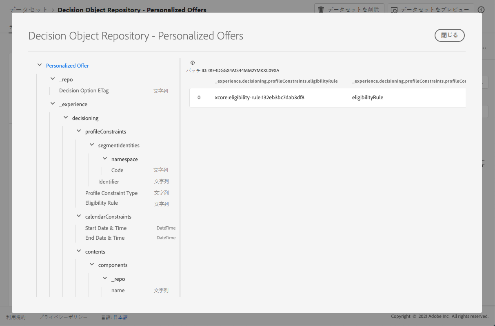

# パーソナライズされたオファーのデータセット {#offers-dataset}

オファーを変更するたびに、パーソナライズされたコンテンツオファーの自動生成データセットが更新されます。

データセット内の最新の成功したバッチが右側に表示されます。データセットのスキーマの階層ビューが左側のウィンドウに表示されます。

>[!NOTE]
>
>[この節](../export-catalog/access-dataset.md)では、オファーライブラリの各オブジェクト用に書き出されたデータセットにアクセスする方法を説明します。

次に、**[!UICONTROL 決定オブジェクトリポジトリ（パーソナライズされたオファー）]**&#x200B;データセットで使用できるすべてのフィールドのリストを示します。

<!--Personalized offers form the set of choices for a decision. The objective for decisioning is to take a large inventory of items and apply numerous constraint rules to that inventory to narrow it down and then to rank the qualifying options according to a criteria. The resulting propositions assemble and personalize the experience for specific individuals.-->

## 識別子

**フィールド：**_id
**タイトル：**識別子
**説明：**&#x200B;レコードの一意の識別子。**タイプ：**&#x200B;文字列

## _experience

**フィールド：**_experience
**タイプ：**&#x200B;オブジェクト

### _experience／決定

**フィールド：**decisioning
**型：**&#x200B;オブジェクト

#### _experience > decisioning > calendarConstraints

**フィールド：** calendarConstraints
**タイトル：**カレンダー制約の詳細
**説明：**カレンダー制約は、決定オプションが指定された日付範囲で有効かどうかを決定します。その日付範囲外では、オプションを提案できません。
**タイプ：**&#x200B;オブジェクト

* **終了日時**

   **フィールド：** endDate
   **タイトル：**終了日時
   **説明：**決定オプションの有効期限の終了日。終了日を過ぎたオプションは、決定プロセスで提案できなくなりました。
   **タイプ：**&#x200B;文字列

* **開始日時**

   **フィールド：** startDate
   **タイトル：**開始日時
   **説明：**決定オプションの有効性の開始日。開始日に達していないオプションは、決定プロセスでまだ提案できません。
   **タイプ：**&#x200B;文字列

#### _experience > decisioning > characteristics

**フィールド：** characteristics
**タイトル：**決定オプションの特性
**説明：**この特定の決定オプションに属する追加のプロパティまたは属性。異なるインスタンスは、異なる特性（マップ内のキー）を持つことができます。特性は、名前と値のペアを使用して、決定オプションを他の決定オプションと区別します。特性は、この決定オプションを表すコンテンツの値として、またオプションのパフォーマンスを分析および最適化する機能として使用されます。すべてのインスタンスが同じ属性またはプロパティを持つ場合、その側面は、決定オプションの詳細から派生する拡張スキーマとしてモデル化する必要があります。
**タイプ：**&#x200B;オブジェクト

#### _experience > decisioning > contents

**フィールド：** contents
**タイトル：**コンテンツ詳細
**説明：**異なるコンテキストで決定項目をレンダリングするコンテンツ項目。1 つの決定オプションに複数のコンテンツのバリアントを含めることができます。コンテンツとは、（デジタル）エクスペリエンスでの消費に対してオーディエンスに向けられた情報です。コンテンツは、チャネルを通じて特定の配置に配信されます。
**タイプ：**&#x200B;配列

**_experience > decisioning > contents > components**

**フィールド：**components
**説明：**&#x200B;決定オプションを表すコンテンツの構成要素（すべての言語のバリアントも含む）。特定のコンポーネントを見つけるには、「dx:format」、「dc:subject」、「dc:language」、またはこれらの組み合わせを使用します。このメタデータは、オファーに関するコンテンツを見つける場合や表す場合に使用され、プレースメント契約に従って統合します。**型：**配列
**必須：**&quot;_type&quot;, &quot;_dc&quot;<!--TBC?-->

* **_experience > decisioning > contents > components > Content Component Type**

   **フィールド：**_type
   **タイトル：**コンテンツコンポーネントタイプ
   **説明：**各値がコンテンツコンポーネントに指定されたタイプにマッピングされる URI の列挙セット。コンテンツ表示域を使用する一部のコンテンツは、@type 値が、コンテンツコンポーネントの追加のプロパティを記述するスキーマへの参照であることを要求しています。
   **タイプ：**&#x200B;文字列

* **_experience > decisioning > contents > components > _dc**

   **フィールド：**_dc
   **タイプ：**オブジェクト
   **必須：**&quot;format&quot;

   * **形式**

      **フィールド：** format
      **タイトル：**形式
      **説明：**&#x200B;リソースの物理的またはデジタル表現。通常、形式にはリソースのメディアタイプを含める必要があります。形式は、リソースの表示や操作に必要なソフトウェア、ハードウェア、その他の機器を特定するために使用できます。推奨されるベストプラクティスは、制御された語彙から値を選択することです（例えば、コンピューターのメディア形式を定義する[インターネットメディアタイプ](http://www.iana.org/assignments/media-types/)のリスト）。
      **タイプ：**文字列
      **例：**&quot;application/vnd.adobe.photoshop&quot;

   * **言語**
      **フィールド：** language
      **タイトル：**言語
      **説明：**&#x200B;言語またはリソースの言語。\n言語は、XDM の他の場所で使用される[IETF RFC 3066](https://www.ietf.org/rfc/rfc3066.txt)（BCP 47の一部）で定義されている言語コードで指定されます。
      **タイプ：**配列
      **例：**&quot;\n&quot;、&quot;pt-BR&quot;、&quot;es-ES&quot;

* **_experience > decisioning > contents > components > _repo**

   **フィールド：** _repo
   **タイプ：**&#x200B;オブジェクト

   * **id**

      **フィールド：** id
      **説明：**コンテンツリポジトリー内のアセットを参照する一意の識別子（オプション）。Platform API を使用して表示域を取得する場合、クライアントは追加のプロパティ「repo:resolveUrl」を要求してアセットを取得できます。
      **タイプ：**文字列
      **例：** &quot;urn:aaid:sc:US:6dc33479-13ca-4b19-b25d-c805eff8a69e&quot;

   * **名前**

      **フィールド：** name
      **説明：**\&quot;repo:id\&quot; によって外部アセットを保存するリポジトリの場所に関するヒント。
      **タイプ：**&#x200B;文字列

   * **repositoryID**

      **フィールド：** repositoryID
      **説明：** コンテンツリポジトリー内のアセットを参照する一意の識別子（オプション）。Platform API を使用して表示域を取得する場合、クライアントは追加のプロパティ「repo:resolveUrl」を要求してアセットを取得できます。
      **タイプ：**文字列
      **例：**&quot;C87932A55B06F7070A49412D@AdobeOrg&quot;

   * **resolveURL**

      **フィールド：** resolveURL
      **説明：** コンテンツリポジトリー内のアセットを読み取るための一意のリソースロケーター（オプション）。これにより、アセットの管理場所と呼び出す API をクライアントが把握していなくても、アセットを取得しやすくなります。これは HAL リンクに似ていますが、セマンティクスはより単純で目的があります。
      **タイプ：**文字列
      **例：**&quot;https://plaftform.adobe.io/resolveByPath?path=&quot;/mycorp/content/projectx/fragment/prod/herobanners/banner14.html3&quot;&quot;

* **_experience > decisioning > contents > components > content**

   **フィールド：** content
   **説明：**コンテンツを直接格納するフィールド（オプション）。アセットリポジトリ内のコンテンツを参照する代わりに、コンポーネントは単純なコンテンツを直接保持できます。このフィールドは、複合、複雑およびバイナリのコンテンツアセットには使用されません。
   **タイプ：**&#x200B;文字列

* **_experience > decisioning > contents > components > deliveryURL**

   **フィールド：** deliveryURL
   **説明：**コンテンツ配信ネットワークまたはサービスエンドポイントからアセットを取得する一意のリソースロケーター（オプション）。この URL は、ユーザーエージェントからアセットに公開でアクセスするために使用されます。
   **タイプ：**文字列
   **例：**&quot;https://cdn.adobe.io/content/projectx/fragment/prod/static/1232324wd32.jpeg&quot;

* **_experience > decisioning > contents > components > linkURL**

   **フィールド：** linkURL
   **説明：**ユーザーインタラクション用の一意のリソースロケーター（オプション）。この URL は、エンドユーザーをユーザーエージェントで参照するために使用され、追跡できます。
   **タイプ：**文字列
   **例：**&quot;https://cdn.adobe.io/tracker?code=23432&amp;redirect=/content/projectx/fragment/prod/static/1232324wd32.jpeg&quot;

**_experience > decisioning > contents > Placement**

**フィールド：**placement
**タイトル：**プレースメント
**説明：**&#x200B;準拠するプレースメント。この値は、参照するオファープレースメントの URI（@id）です。スキーマ https://ns.adobe.com/experience/decisioning/placement を参照してください。**型：**&#x200B;文字列

#### _experience > decisioning > Lifecycle Status

**フィールド：** lifecycleStatus
**タイトル：**ライフサイクルステータス
**説明：**ライフサイクルステータスを使用すると、オブジェクトを使用してワークフローを実行できます。ステータスは、オブジェクトの表示場所や関連性が高いと見なされる場所に影響を与える場合があります。ステータスの変更は、オブジェクトを使用するクライアントまたはサービスによって実行されます。
**型：**文字列
**使用可能な値：** &quot;ドラフト&quot;（デフォルト）、&quot;承認済み&quot;、&quot;ライブ&quot;、&quot;完了&quot;、&quot;アーカイブ済み&quot;

#### _experience／決定／決定オプション名

**フィールド：** name
**タイトル：**決定オプション名
**説明：**&#x200B;様々なユーザーインターフェイスに表示されるオプション名。**タイプ：**&#x200B;文字列

#### _experience > decisioning > profileConstraints

**フィールド：** profileConstraints
**タイトル：**プロファイル制約の詳細
**説明：**プロファイル制約は、このコンテキストにおいて、現時点でオプションがこのプロファイル ID に適合するかどうかを決定します。プロファイル制約で各オプションの値を考慮する必要がない場合（オプション選択のオプションが不変である場合）、「false」と評価されるプロファイル制約では、オプション選択全体がキャンセルされます。一方、オプションをパラメーターとするプロファイル制約ルールは、要件を満たすオプションを選択するたびに評価されます。
**タイプ：**&#x200B;オブジェクト

**_experience > decisioning > profileConstraints > Description**

**フィールド：**description
**タイトル：**説明
**説明：**&#x200B;プロファイル制約の説明。このプロファイルの制約が設けられた経緯や理由、どのオプションが含まれ、除外されるかについて、人間が判読できる形で意図を伝えるために使用します。**型：**&#x200B;文字列

**_experience > decisioning > profileConstraints > Eligibility Rule**

**フィールド：**eligibilityRule
**タイトル：**実施要件ルール
**説明：**&#x200B;特定のプロファイルや、その他の特定のコンテキスト XDM オブジェクトに対して、「true」または「false」と評価される決定ルールへの参照。ルールは、オプションが特定のプロファイルに該当するかどうかを決定するために使用されます。値は、参照される決定ルールの URI（@id）です。スキーマ https://ns.adobe.com/experience/decisioning/rule を参照してください。**型：**&#x200B;文字列

**_experience > decisioning > profileConstraints > Profile Constraint Type**

**フィールド：** profileConstraintType
**タイトル：**プロファイル制約タイプ
**説明：**制約が現在設定されているかどうか、また制約がどのように表現されているかを判定します。 ルールを通じて、または 1 つ以上のセグメントメンバーシップを通じて決定されます。
**型：**文字列
**使用可能な値：**
* 「なし」（デフォルト）
* 「eligibilityRule」:「プロファイル制約は、制約付きアクションが許可される前に true と評価される必要がある単一の規則として表されます。」
* 「anySegments」:「プロファイル制約は 1 つ以上のセグメントとして表され、制約付きアクションが許可される前に、プロファイルは少なくとも 1 つのセグメントのメンバーである必要があります。」
* 「allSegments」:「プロファイル制約は 1 つ以上のセグメントとして表され、制約付きアクションが許可される前に、プロファイルはすべてのセグメントのメンバーである必要があります。」
* 「rules」:「プロファイル制約は、制約付きアクションが許可される前にすべてが true と評価される必要がある実施要件、適用性、適合性など、様々なルールとして表されます。」

**_experience > decisioning > profileConstraints > Segment Identifiers**

**フィールド：**segmentIdentities
**タイトル：**セグメント識別子
**説明：**セグメントの識別子
**タイプ：**&#x200B;配列

* **識別子**

   **フィールド：**_id
   **タイトル：**識別子
   **説明：**関連する名前空間のセグメント識別子。
   **タイプ：**&#x200B;文字列

* **名前空間**

   **フィールド：** namespace
   **タイトル：**名前空間
   **説明：**&#x200B;属性に関連付けられた名前空間`xid` 。
   **タイプ：**オブジェクト
   **必須：**「コード」

   * **コード**

      **フィールド：**code
      **タイトル：**コード
      **説明：**コードは、人が読める名前空間の識別子であり、ID グラフ処理に使用される技術名前空間 ID をリクエストするために使用できます。
      **タイプ：**&#x200B;文字列

* **エクスペリエンス識別子**

   **フィールド：**xid
   **タイトル：**エクスペリエンス識別子
   **説明：**存在する場合、この値は、すべての名前空間内の名前空間スコープ識別子全体で一意の名前空間間識別子を表します。
   **タイプ：**&#x200B;文字列

#### _experience > decisioning > ranking

**フィールド：** ranking
**タイトル：**ランキングの詳細
**説明：**ランク（優先度）。決定基準のコンテキストに基づいて、「最良のアクション」と見なされる項目を定義します。実施要件制約を満たす選択したすべてのオプションの中から、ランキング順序によって提案する上位（または上位N）のオプションが決定されます。
**タイプ：**&#x200B;オブジェクト

**_experience > decisioning > ranking > Order Evaluation**

**フィールド：**order
**タイトル：**順序評価
**説明：** 1 つ以上の決定オプションの相対的な順序の評価。序数の値が大きいオプションは、序数の値が小さいオプションよりも優先的に選択されます。この方法で決定された値は順序付けできますが、それらの間の距離は測定できず、合計も積も計算できません。主な傾向を測る数値として序数データに使用できるのは、中央値とモードだけです。**タイプ：**&#x200B;オブジェクト

* **スコア関数**

   **フィールド：**function
   **タイトル：**スコア関数
   **説明：**この決定オプションの数値スコアを計算する関数への参照。決定オプションは、そのスコアで並べ替えられます（ランク付け）。このプロパティの値は、on オプションを指定して一度に呼び出す関数の URI（@id）です。https://ns.adobe.com/experience/decisioning/function のスキーマを参照してください。
   **タイプ：**&#x200B;文字列

* **順序評価の種類**

   **フィールド：**orderEvaluationType
   **タイトル：**順序評価のタイプ
   **説明：**使用する順序評価メカニズム、決定オプションの静的優先度、すべてのオプションの数値を計算するスコア関数、またはリストを受け取って順序を決定するランキング戦略を指定します。
   **タイプ：**文字列
   **指定可能な値：**「static」、「scoringFunction」、「rankingStrategy」

* **ランキング戦略**

   **フィールド：**rankingStrategy
   **タイトル：**ランキング戦略
   **説明：**決定オプションのリストをランク付けする戦略への参照。決定オプションは、順序付きリストで返されます。このプロパティの値は、on オプションを指定して一度に呼び出す関数の URI（@id）です。https://ns.adobe.com/experience/decisioning/rankingStrategy のスキーマを参照してください。
   **タイプ：**&#x200B;文字列

**_experience > decisioning > ranking > Priority**

**フィールド：**優先度
**タイトル：**優先度
**説明：**1 つの決定オプションの他のすべてのオプションに対する優先度。順序関数が指定されていないオプションは、このプロパティを使用して優先付けされます。優先度が高いオプションは、優先度が低いオプションの前に選択されます。条件を満たす、最高優先度のオプションが複数ある場合、1 つがランダムに選択され、決定の提案に使用されます。
**型：**整数
**最小値：**0
**デフォルト値：** 0

#### _experience／決定／タグ

**フィールド：** tags
**タイトル：**タグ
**説明：**このエンティティに関連付けられたタグのセット。タグは、フィルター式で使用され、在庫全体をサブセット（カテゴリ）に制限します。
**タイプ：**&#x200B;配列

<!--Field without name under tags: Description: An identifier of a tag object. The value is the @id of the tag that is referenced. See tag schema: https://ns.adobe.com/experience/decisioning/tag. Type: string-->

## _repo

**フィールド：**_repo
**タイプ：**&#x200B;オブジェクト

### _repo／決定オプション ETag

**フィールド：**etag
**タイトル：**決定オプション ETag
**説明：**&#x200B;決定オプションオブジェクトがスナップショットを取得した際に表示されたリビジョン。**タイプ：**&#x200B;文字列

