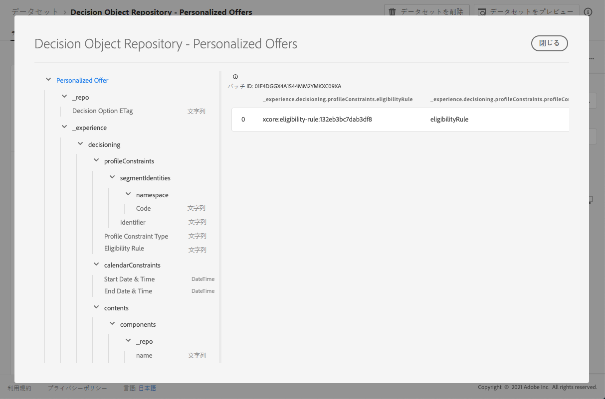

# パーソナライズされたオファーデータセット{#offers-dataset}

オファーが変更されるたびに、パーソナライズされたコンテンツオファー用の自動生成データセットが更新されます。

データセット内で成功した最新のバッチが右側に表示されます。 データセットのスキーマの階層表示が左側のペインに表示されます。

>[!NOTE]
>
>[このセクション](../export-catalog/access-dataset.md)で、オファーライブラリの各オブジェクト用に書き出したデータセットにアクセスする方法を説明します。

パーソナライズされたオファーは、決定の選択肢のセットとなります。 判定の目的は、大量の品目のインベントリを作成し、そのインベントリに多数の制約ルールを適用して絞り込み、条件に従って条件付きオプションをランク付けすることです。 作成される提案は、特定の個人向けにエクスペリエンスを組み立ててパーソナライズします。

以下に、**[!UICONTROL Decision Object Repository - Personalizedオファー]**&#x200B;データセットで使用できるすべてのフィールドのリストを示します。

## 識別子

レコードの一意の識別子。
型：文字列

## _エクスペリエンス

### 判定

#### calendarConstraints

**カレンダ制約の詳細**。カレンダーの制約は、日付範囲を指定して、決定オプションが有効かどうかを決定します。 その日付範囲外では、このオプションは提案できません。
タイプ：object

* **終了日時**

   決定オプションの有効期限の終了日。 終了日を過ぎたオプションは、判定プロセスで提案できなくなります。

   型：文字列

* **開始日時**

   決定オプションの有効性の開始日。 開始日に達していないオプションは、まだ決定プロセスで提案できません。

   型：文字列

#### 特性

**決定オプションの特性**。この特定の決定オプションに属する追加のプロパティまたは属性。 異なるインスタンスは異なる特性を持つことができます（マップ内のキー）。 特性は、名前と値のペアで、1つの決定オプションを他の決定オプションと区別するために使用されます。 特性は、この決定オプションを表すコンテンツの値として、また、オプションのパフォーマンスを分析し最適化する機能として使用されます。 すべてのインスタンスが同じ属性またはプロパティを持つ場合、その縦横比は、決定オプションの詳細から派生する拡張スキーマとしてモデル化する必要があります。

タイプ：object

#### contents

**コンテンツの詳細**。異なるコンテキストで決定項目をレンダリングするコンテンツ項目です。 1つの決定オプションに複数のコンテンツのバリエーションを含めることができます。 コンテンツとは、（デジタル）エクスペリエンスでの消費のオーディエンスに向けた情報です。 コンテンツは、チャネルを介して特定の場所に配信されます。

タイプ：array

* **コンポ**
ーネント：決定オプションを表すコンテンツのコンポーネントです。これには、その言語のすべての異形が含まれます。「dx:format」、「dc:subject」、「dc:language」、またはこれらの組み合わせで、特定のコンポーネントが見つかります。 このメタデータは、オファーに関連付けられたコンテンツを検索または表し、配置契約に従って統合するために使用されます。

   * **コンテンツコンポーネント**
タイプ各値がコンテンツコンポーネントに指定された型にマップされるURIの列挙型セット。コンテンツ表現の一部のコンシューマーは、@type値が、コンテンツコンポーネントの追加のプロパティを説明するスキーマの参照であることを期待しています。
型：文字列

   * **_dc**

      * ****
形式リソースの物理的またはデジタル的な表示。通常、「形式」にはリソースのメディアタイプを含める必要があります。 形式は、リソースの表示や操作に必要なソフトウェア、ハードウェア、その他の機器を特定するために使用できます。ベストプラクティスは、制御された用語から値を選択することです(例えば、コンピューターのメディア形式を定義する[インターネットメディアタイプ](http://www.iana.org/ assignments/media-types/)のリスト)。

         型：文字列

         例：&quot;application/vnd.adobe.photoshop&quot;

      * ****
言語リソースの言語。\n言語は[IETF RFC 3066](https://www.ietf.org/rfc/rfc3066.txt)で定義されているとおり、XDMの他の場所で使用されるBCP 47の一部である言語コードで指定されます。

         型：文字列

         例：&quot;/n&quot;、&quot;pt-BR&quot;、&quot;es-ES&quot;
   * **_repo**

      * **id**

         コンテンツリポジトリ内のアセットを参照するためのオプションの一意の識別子。 プラットフォームAPIを使用して表現を取得する場合、クライアントは追加のプロパティ\&quot;repo:resolveUrl\&quot;を期待してアセットを取得できます。

         型：文字列

      * **name**

         \&quot;repo:id\&quot;によって外部アセットを保存するリポジトリの場所に関するヒントがいくつかあります。

         型：文字列

      * **repositoryID**

         コンテンツリポジトリ内のアセットを参照するためのオプションの一意の識別子。 プラットフォームAPIを使用して表現を取得する場合、クライアントは追加のプロパティ\&quot;repo:resolveUrl\&quot;を期待してアセットを取得できます。

         型：文字列

         例：&quot;C87932A55B06F7070A49412D@AdobeOrg&quot;

      * **resolveURL**

         コンテンツリポジトリ内のアセットを読み取るためのオプションの一意のリソースロケーターです。 これにより、クライアントがアセットの管理場所や呼び出すAPIを把握しなくても、アセットを簡単に取得できます。 これはHALリンクに似ていますが、セマンティックはよりシンプルで目的に合っています。

         型：文字列

         例：&quot;https://plaftform.adobe.io/resolveByPath?path=&quot;/mycorp/content/projectx/fragment/prod/herobanners/banner14.html3&amp;quot&quot;
   * **content**

      コンテンツを直接保持するオプションのフィールドです。 コンポーネントは、アセットリポジトリ内のコンテンツを参照する代わりに、単純なコンテンツを直接保持できます。 このフィールドは、複合、複雑およびバイナリのコンテンツアセットには使用されません。

      型：文字列

   * **deliveryURL**

      コンテンツ配信ネットワークまたはサービスエンドポイントからアセットを取得する、オプションの一意のリソースロケーターです。 このURLは、ユーザーエージェントによって公開されたアセットにアクセスするために使用されます。

      型：文字列

      例：&quot;https://cdn.adobe.io/content/projectx/fragment/prod/static/1232324wd32.jpeg&quot;

   * **linkURL**

      ユーザー操作に対するオプションの一意のリソースロケーター。 このURLは、エンドユーザをユーザエージェント内で参照するために使用され、追跡できます。

      型：文字列

      例：&quot;https://cdn.adobe.io/tracker?code=23432&amp;redirect=/content/projectx/fragment/prod/static/1232324wd32.jpeg

* **配置**

   準拠する場所です。 値は、参照されるオファー配置の URI（@id）です。スキーマhttps://ns.adobe.com/experience/decisioning/placementを参照してください。

#### ライフサイクルステータス

ライフサイクルステータスを使用すると、オブジェクトに対してワークフローを実行できます。 ステータスは、オブジェクトが表示される場所や関連性があると見なされる場所に影響を与える場合があります。 ステータスの変更は、オブジェクトを使用するクライアントまたはサービスによって実行されます。
タイプ：string
可能な値：ドラフト、承認済み、ライブ、完了、アーカイブ

#### Decision Option Name

オプション名。 この名前は、様々なユーザーインターフェイスで表示されます。型：文字列

#### プロファイル制約の詳細

プロファイル制約は、このコンテキストで、現在のところ、このプロファイルIDに対してオプションが適格かどうかを決定します。 プロファイル制約は、各オプションの値を考慮する必要がない場合、つまり、オプション選択のオプションが不変である場合、「false」と評価されるプロファイル制約は、オプション選択全体をキャンセルします。 一方、プロファイルをパラメータとするオプション制約ルールは、オプション選択の各修飾オプションに対して評価されます。
タイプ：object

* **説明**

   プロファイル制約の説明。 このプロファイル制約が構築された方法や理由、また、この制約に含まれるオプションや除外されるオプションについて、人間が理解できる意図を伝えるために使用されます。
型：文字列

* **実施要件ルール**

   特定のプロファイルおよび/または他の指定されたコンテキストXDMオブジェクトに対してtrueまたはfalseと評価されるデシジョンルールへの参照です。 このルールは、特定のプロファイルに該当するかどうかを判断するために使用します。 値は、参照される決定ルールのURI (@id)です。 スキーマhttps://ns.adobe.com/experience/decisioning/ruleを参照してください。

   型：文字列

* **プロファイル制約タイプ**

   拘束が現在設定されているかどうか、および拘束の表現方法を決定します。 ルールまたは1つ以上のセグメントメンバーシップを使用している可能性があります。
タイプ：string
可能な値：

   * なし

   * &quot;eligibilityRule&quot;:「プロファイル制約は、制約付きアクションを許可する前にtrueと評価する必要がある単一の規則として表されます」、

   * 「任意のセグメント」:「プロファイル制約は1つ以上のセグメントとして表され、制約付きアクションが許可される前に、プロファイルは少なくとも1つのセグメントのメンバーである必要があります」、

   * 「すべてのセグメント」:「プロファイル制約は1つ以上のセグメントとして表され、制約付きアクションを許可する前に、プロファイルがすべてのセグメントのメンバである必要があります」、

   * &quot;rules&quot;:「プロファイル制約は、適格性、適用性、適合性など、様々な規則で表現され、制約付きアクションが許可される前にすべてtrueに評価する必要があります」

* **セグメント識別子**

   セグメントの識別子

   * **識別子**

      関連名前空間内のセグメントのID。

      型：文字列

   * **名前空間**

      `xid` 属性に関連付けられた名前空間。

      タイプ：object

      * **コード**

         コードは、人間が読める名前空間の識別子であり、ID グラフ処理に使用される技術名前空間 ID をリクエストするために使用できます。

         型：文字列
   * **エクスペリエンス識別子**

      存在する場合、この値は、すべての名前空間内のすべての名前空間スコープ識別子全体で一意の名前空間間識別子を表します。

      型：文字列

#### ランキングの詳細

ランク（優先度） 判断基準のコンテキストに基づいて\&quot;最良のアクション\&quot;と見なされるものを定義します。 適格性の制約を満たす選択したすべてのオプションの中で、ランキング順序によって提案する上位（または上位N）のオプションが決定されます。

タイプ：object

* **注文の評価**

   1つ以上の決定オプションの相対順序の評価。 順序の値が高いオプションは、順序の値が低いオプションよりも選択されます。 この方法で決定される値は並べ替えることができますが、間の距離は測定できず、合計も製品も計算できません。 中央値とモードは、序数データに使用できる中心的傾向の唯一の測定値です。

   タイプ：object

   * **スコアリング関数**

      この決定オプションの数値スコアを計算する関数への参照です。 次に、そのスコアに基づいて決定オプションが並べ替えられます。 このプロパティの値は、onオプションで一度に呼び出す関数のURI (@id)です。 スキーマhttps://ns.adobe.com/experience/decisioning/functionを参照してください。

      型：文字列

   * **注文の評価タイプ**

      使用する順序評価メカニズム、決定オプションの静的優先度、各リストの数値を計算するスコアリング関数、または注文のを受け取るランキング戦略を指定します。

      型：文字列

      可能な値：&quot;static&quot;, &quot;scoringFunction&quot;, &quot;rankingStrategy&quot; <!--(TBC)-->

   * **ランキングの戦略**

      意思決定リストをランク付けする戦略への参照。 決定オプションは、順序どおりのリストで返されます。 このプロパティの値は、onオプションで一度に呼び出す関数のURI (@id)です。 スキーマhttps://ns.adobe.com/experience/decisioning/rankingStrategyを参照してください。

      型：文字列

* **優先度**

   1つの決定オプションの優先度を、他のすべてのオプションと比較した場合の優先度です。 注文関数が指定されていないオプションは、このプロパティを使用して優先付けされます。 優先順位の高いオプションは、優先順位の低いオプションよりも先に選択されます。 2つ以上の条件を満たすオプションが最も高い優先度の値を共有する場合、1つは一様なランダムで選択され、意思決定の提案に使用されます。

   タイプ：integer

   最小値：0

   デフォルト値：0

#### タグ

このエンティティに関連付けられたタグのセットです。 タグは、フィルタ式で使用され、在庫全体をサブセット(カテゴリ)に制限します。

* **item**

   タグオブジェクトの識別子。 値は、参照されるタグの@idです。 タグスキーマを参照してください。https://ns.adobe.com/experience/decisioning/tag

## _repo

### 決定オプションETag

スナップショットが作成された時点での決定オプションオブジェクトのリビジョン。

型：文字列

