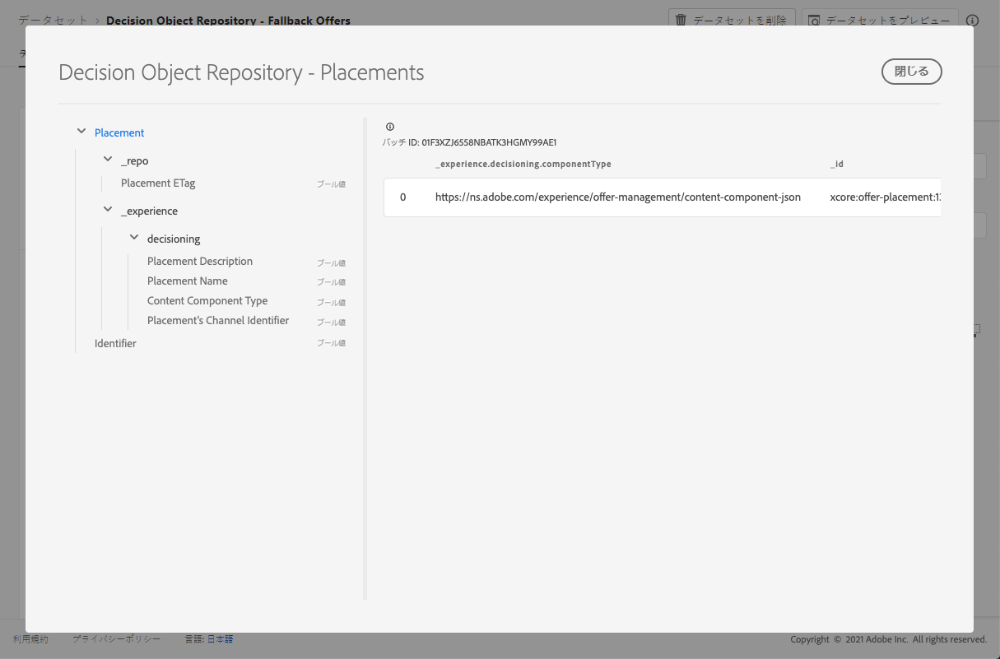

# 配置データセット{#placements-dataset}

オファーが変更されるたびに、自動生成された配置のデータセットが更新されます。

データセット内で成功した最新のバッチが右側に表示されます。 データセットのスキーマの階層表示が左側のペインに表示されます。

>[!NOTE]
>
>[このセクション](../export-catalog/access-dataset.md)で、オファーライブラリの各オブジェクト用に書き出したデータセットにアクセスする方法を説明します。

プレースメントは、パーソナライズされたメッセージの場所または場所を表します。 これは、パーソナライゼーションの判断が提供するコンテンツの技術的な制約を設定するために使用します。 また、配置は、この配置が関係するエクスペリエンスイベントが生成される場合に、特定のタイプの指標を生成する要求を表します。 例えば、この配置により、エンドユーザーに表示される電子メール内のクリック可能なパーソナライズされた画像を容易にすることができます。 配置は、例えば、アセンブルされたエクスペリエンスから、画像のクリックがエクスペリエンスイベントー内でhttps://ns.adobe.com/xdm/data/metrics/web/linkclicksという指標とこの配置への参照と共にレポートされるようにリクエストする場合があります。

以下に、**[!UICONTROL Decision Object Repository - Placements]**&#x200B;データセットで使用できるすべてのフィールドのリストを示します。

## 識別子

レコードの一意の識別子。

型：文字列

## _エクスペリエンス

### 判定

#### プレースメントのチャネルID

提案がなされたチャネル。 値は有効なチャネルURIです。 https://ns.adobe.com/xdm/channels/channelを参照してください。

型：文字列

#### コンテンツコンポーネントの種類

各値がコンテンツコンポーネントに指定された型にマップされるURIの列挙型セットです。 コンテンツ表現の一部のコンシューマーは、@type値が、コンテンツコンポーネントの追加のプロパティを説明するスキーマの参照であることを期待しています。

型：文字列

#### MIMEメディアタイプ

その配置に必要なコンポーネントのメディアタイプに対する制約。 異なる画像形式など、1つのコンポーネントに複数のメディアタイプが存在する可能性があります。

型：文字列

#### 配置の説明

メッセージ配信全体での動的コンテンツの使用方法について、人間が理解できる意図を伝えるために使用されます。 Webページ内の特定のスペースが「バナー」であることは、正式な方法ではなく、説明を介して伝えられることがよくあります。

型：文字列

#### 配置名

人間の操作で参照する配置の割り当て名。

型：文字列

## _repo

### ETagの配置

スナップショットが作成された時点での決定オプションオブジェクトのリビジョン。

型：文字列
