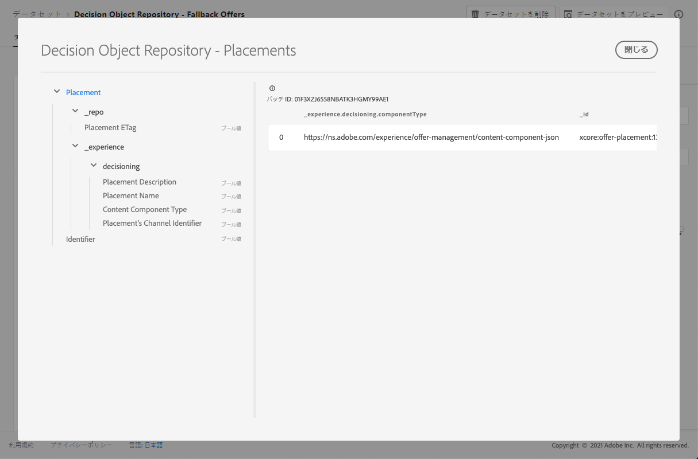

# 配置データセット {#placements-dataset}

オファーが変更されるたびに、配置用に自動生成されたデータセットが更新されます。

データセット内の最後の成功したバッチが右側に表示されます。 データセットのスキーマの階層ビューが左側のペインに表示されます。

>[!NOTE]
>
>この節 ](../export-catalog/access-dataset.md) で [ は、オファーライブラリの各オブジェクトについて、書き出したデータセットにアクセスする方法について説明します。

以下に、データセットで **[!UICONTROL Decision Object Repository - Placements]** 使用可能なすべてのフィールドの一覧を示します。

<!--A placement describes a location or place in a personalized message. It is used to set technical constraints for content that the personalization decision supplies. The placement also represents a request to produce certain types of metrics when an experience event is produced where this placement is involved. For instance, the placement facilitates a personalized clickable image inside an email shown to an end-user. The placement may for instance request from the assembled experience that the click on its image gets reported in an experience event with a metric https://ns.adobe.com/xdm/data/metrics/web/linkclicks and a reference to this placement.-->

## 識別子 {#identifier}

**フィールド:** _id
**タイトル:** 識別子
**説明:** レコードの一意の識別子。**タイプ:** string

## _experience {#experience}

**フィールド:** _experience
**タイプ:** object

### _experience > decisioning

**フィールド:** decisioning
**タイプ:** object

#### _experience > decisioning > 配置のチャネル識別子

**フィールド:** channelID
**タイトル:** 配置のチャンネル識別子
**説明:** プロポジションが実行された経路。 値は有効なチャネル URI です。 Https://ns.adobe.com/xdm/channels/channel を参照してください。**タイプ:** string

#### _experience > decisioning > コンテンツコンポーネントタイプ

**フィールド:** componenttype
**タイトル:** コンテンツコンポーネントタイプ
**説明:** 各値がコンテンツコンポーネントに割り当てられた型にマップされる Uri の列挙セット。 コンテンツ表現の一部のコンシューマーにとって、@type 値は、コンテンツコンポーネントの追加のプロパティを記述するスキーマへの参照として使用されることが想定されています。**タイプ:** string

#### _experience > decisioning > contentTypes

**フィールド:** contentTypes
**タイプ:** array

**_experience > decisioning > contentTypes > MIME Media タイプ**

**タイトル:** MIME メディアタイプ
**説明:** このような配置では、必要なコンポーネントのメディアの種類を制限します。 様々なイメージ形式などの1つのコンポーネントに対して、複数のメディアタイプを設定することができます。**タイプ:** string

#### _experience > decisioning > 配置説明

**フィールド:** 説明
**タイトル:** 配置の説明
**説明:** これは、メッセージ配信全体での動的コンテンツの使用方法について、人間が読み取ることができるようにするために使用されます。 Web ページ内の「バナー」という特定のスペースは、説明によって送られることが多く、正式なメソッドでは使用されません。**タイプ:** string

#### _experience > decisioning > Placement Name

**フィールド:** 名前
**タイトル:** 配置名
**説明:** ユーザーの操作において、その配置を参照するために割り当てられている名前です。**タイプ:** string

## _repo {#repo}

**フィールド:** _repo
**タイプ:** object

### _repo > Placement ETag

**フィールド:** etag
**タイトル:** 配置 ETag
**説明:** スナップショットが作成されたときに意思決定オプションオブジェクトに指定されていたバージョンです。**タイプ:** string
