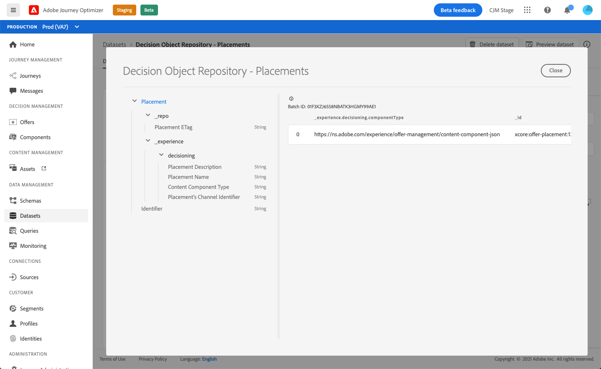

# プレースメントデータセット {#placements-dataset}

>[!TIP]
>
>[!DNL Adobe Journey Optimizer] の新しい決定機能である決定が、コードベースのエクスペリエンスチャネルとメールチャネルを通じて使用できるようになりました。 [詳細情報](../../experience-decisioning/gs-experience-decisioning.md)

オファーを変更するたびに、プレースメントの自動生成データセットが更新されます。

正常に更新された、データセットの最新のバッチが右側に表示されます。 データセットのスキーマの階層ビューが左側のペインに表示されます。

>[!NOTE]
>
>[この節](../export-catalog/access-dataset.md)では、オファーライブラリの各オブジェクト用にエクスポートしたデータセットにアクセスする方法を説明します。

以下に、**[!UICONTROL 決定オブジェクトリポジトリー（プレースメント）]**&#x200B;データセットで使用できるすべてのフィールドのリストを示します。

<!--A placement describes a location or place in a personalized message. It is used to set technical constraints for content that the personalization decision supplies. The placement also represents a request to produce certain types of metrics when an experience event is produced where this placement is involved. For instance, the placement facilitates a personalized clickable image inside an email shown to an end-user. The placement may for instance request from the assembled experience that the click on its image gets reported in an experience event with a metric https://ns.adobe.com/xdm/data/metrics/web/linkclicks and a reference to this placement.-->

+++ 識別子

**フィールド：**_id
**タイトル：**識別子
**説明：** レコードの一意のID。
**タイプ：**&#x200B;文字列

+++

+++ _experience

**フィールド：** _experience
**タイプ：**&#x200B;オブジェクト

+++

+++ _experience > decisioning

**フィールド：**決定
**タイプ：**&#x200B;オブジェクト

+++

+++ _experience > decisioning > Placement&#39;s Channel Identifier

**フィールド：** channelID
**タイトル：** プレースメントのチャネル Id
**説明：**提案が行われたチャネル。 値は有効なチャンネル URI です。 https://ns.adobe.com/xdm/channels/channel を参照してください。
**タイプ：**&#x200B;文字列

+++

+++ _experience > decisioning > Content Component Type

**フィールド：** componentType
**タイトル：**コンテンツコンポーネントタイプ
**説明：**各値がコンテンツコンポーネントに指定された型にマッピングされる URI の列挙セット。 コンテンツ表示域を使用する一部のコンテンツは、@type 値がコンテンツコンポーネントの追加のプロパティを記述するスキーマへの参照であることを要求します。
**タイプ：**&#x200B;文字列

+++

+++ _experience > decisioning > contentTypes

**フィールド：** contentTypes
**タイプ：**&#x200B;配列

+++

+++_experience > decisioning > contentTypes > MIME Media Type

**タイトル：** MIME メディアタイプ
**説明：**そのプレースメントで想定されるコンポーネントのメディアタイプの制約。 異なる画像形式など、1 つのコンポーネントに対して複数のメディアタイプが存在する場合があります。
**型：**&#x200B;文字列

+++

+++ _experience > decisioning > Placement Description

**フィールド：**description
**タイトル：**配置の説明
**説明：**動的コンテンツが全体的なメッセージ配信でどのように使用されるかについて、人間が読みやすい意図を伝えるために使用されます。 Web ページ内の特定のスペースが「バナー」と呼ばれる場合、多くの場合正式な方法ではなく、説明を使用して伝えられます。
**タイプ：**&#x200B;文字列

+++

+++ _experience > decisioning > Placement Name

**フィールド：** name
**タイトル：** プレースメント名
**説明：**人間とのやり取りにおいて、プレースメントを参照するために割り当てられた名前。
**タイプ：**&#x200B;文字列

+++

+++ _repo

**フィールド：** _repo
**タイプ：**&#x200B;オブジェクト

+++

+++ _repo／プレースメント ETag

**フィールド：** etag
**タイトル：** プレースメント ETag
**説明：** スナップショットの取得時に決定オプションオブジェクトが存在したリビジョン。
**タイプ：**&#x200B;文字列

+++
