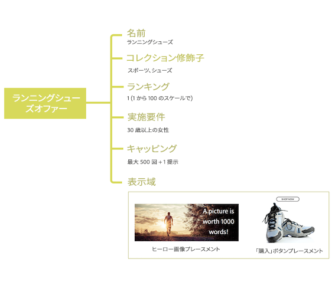

# 意思決定管理の概要 {#about-decision-management}

[!DNL Journey Optimizer] を使用すると、すべてのタッチポイントをまたいで、適切なタイミングで最高のオファーとエクスペリエンスを顧客に提供できます。デザインが完了すると、パーソナライズされたオファーを使用してオーディエンスをターゲットに設定できます。

意思決定管理では、マーケティングオファーの一元化されたライブラリと、Adobe Experience Platform が作成するリッチなリアルタイムプロファイルにルールと制約を適用する意思決定エンジンを使用して、的確なオファーを適切なタイミングで顧客に送信します。

意思決定管理の機能は、2 つの主要コンポーネントで構成されています。

* **一元化されたオファーライブラリ**&#x200B;は、オファーを構成する様々な要素を作成および管理し、それらの規則と制約を定義するインターフェイスです。
* **Offer Decisioning エンジン**&#x200B;は、Adobe Experience Platform のデータとリアルタイム顧客プロファイルをオファーライブラリとともに活用し、オファーの配信に適切な時間、顧客およびチャネルを選択します。

次のような利点があります。

* 複数のチャネル間でパーソナライズされたオファーを提供することで、キャンペーンのパフォーマンスを向上できる。
* ワークフローの向上：マーケティングチームは、複数の配信やキャンペーンを作成するのではなく、配信を 1 件だけ作成し、テンプレートの様々な部分のオファーを変えることで、ワークフローを改善することができる。
* キャンペーンや顧客にオファーを表示する回数を制御できる。

➡️ [ 意思決定管理の詳細については、次のビデオを参照してください ](#video)

>[!NOTE]
>
>**Offer Decisioning** アプリケーションサを利用する [ Adobe Experience Platform](https://experienceleague.adobe.com/docs/experience-platform/landing/home.html?lang=ja){target="_blank"} ユーザーの場合は、この節で説明する意思決定管理機能もすべて適用されます。

## オファーと決定について {#about-offers-and-decisions}

**オファー**&#x200B;は、顧客に提示される条件を定義するコンテンツ、実施要件ルール、制約で構成されます。

これは、**オファーライブラリ**&#x200B;を使用して作成されます。オファーライブラリでは、実施要件ルールと制約を複数のコンテンツに関連付けてオファーを作成および公開できる一元的なオファーカタログを提供します（[オファーライブラリのユーザーインターフェイス](../get-started/user-interface.md)を参照）。

オファーライブラリがオファーで強化されたら、オファーを&#x200B;**決定**&#x200B;に統合できます。

決定とは、配信ターゲットに応じて提供すべき最適なオファーを選択するために、Offer Decisioning エンジンを利用するオファーのコンテナです。

## よくあるユースケース {#common-use-cases}

意思決定管理の機能および Adobe Experience Platform との統合により、多くのユースケースが対象となり、顧客エンゲージメントやコンバージョンを向上できます。

* Adobe Experience Platform のデータに基づいて、訪問した顧客の目標地点に一致するオファーを web サイトのホームページに表示します。

  

* 顧客がいずれかの店舗に接近するとプッシュ通知を送信し、顧客の属性（ロイヤルティレベル、性別、以前の購入など）に応じて使用可能なオファーを通知します。

  

* 意思決定管理は、顧客がサポートチームに連絡する際のエクスペリエンスを向上できるようサポートします。
意思決定管理 API を使用すると、顧客が取り消したオファーと次善のオファーに関する情報を、コールセンター担当者のポータルに表示することができます。

  

## 意思決定管理へのアクセスの許可 {#granting-acess-to-decision-management}

意思決定管理機能へのアクセス権限および使用権限は、[Adobe Admin Console](https://helpx.adobe.com/jp/enterprise/managing/user-guide.html){target="_blank"} で管理します。

意思決定管理機能へのアクセス権を付与するには、**[!UICONTROL 製品プロファイル]**&#x200B;を作成し、対応する権限をユーザーに割り当てる必要があります。[!DNL Journey Optimizer] ユーザーと権限の管理について詳しくは、[ この節 ](../../administration/permissions.md) を参照してください。

意思決定管理に特有の権限の一覧については、[この節](../../administration/high-low-permissions.md#decisions-permissions)を参照してください。

## 用語集 {#glossary}

意思決定管理を使用する際の主な概念のリストを以下に示します。

* **キャッピング**&#x200B;または&#x200B;**フリークエンシーキャップ**：キャッピングは、オファーの提示回数を定義する制約として使用されます。キャップには、組み合わせターゲットオーディエンスでオファーを何回提案できるか（「合計キャップ数」と）と、同じエンドユーザーにオファーを提案できる回数（「プロファイルキャップ」）の 2 つがあります。

* **コレクション**：マーケターが事前に定義した条件（オファーのカテゴリなど）に基づくオファーのサブセットです。

* **決定**：オファーの選択を通知するロジックが含まれています。

* **決定ルール**：決定ルールは、パーソナライズされたオファーに追加される制約で、実施要件を決定するためにプロファイルに適用されます。

* **実施要件を満たすオファー**：有効なオファーは、プロファイルに一貫して提供できる、上流で定義された制約を満たします。

* **意思決定管理**：ビジネスロジックと決定ルールを使用して、エンドユーザー向けにパーソナライズされたオファーエクスペリエンスを作成し、あらゆるチャネルやアプリケーションで配信できます。

* **フォールバックオファー：**&#x200B;フォールバックオファーは、コレクション内のパーソナライズされたオファーに対してエンドユーザーが適格でない場合に表示されるデフォルトのオファーです。

* **オファー**：オファーは、オファーを表示する資格のあるユーザーを指定するルールが関連付けられているマーケティングメッセージです。

* **オファーライブラリ**：オファーライブラリは、パーソナライズされたオファーやフォールバックオファー、決定ルールおよび決定を管理するために使用される一元化されたライブラリです。

* **パーソナライズされたオファー**：パーソナライズされたオファーは、実施要件ルールと制約に基づいてカスタマイズ可能な、マーケティングメッセージです。

* **プレースメント**：プレースメントとは、エンドユーザーに対してオファーが表示される場所またはコンテキストです。

* **優先度**：優先度を使用して、実施要件、カレンダー、キャッピングなど、すべての制約を満たすオファーをランク付けします。

* **表現**：表現とは、オファーを表示する場所や言語など、1 つのチャネルが使用する情報です。

## チュートリアルビデオ{#video}

### 意思決定管理とは {#what-is-offer-decisioning}

以下のビデオでは、 意思決定管理の主な機能、アーキテクチャおよび使用例を紹介しています。

>[!VIDEO](https://video.tv.adobe.com/v/326961?quality=12&learn=on)

### オファーの定義と管理 {#use-offer-decisioning}

次のビデオでは、意思決定管理を使用してオファーを定義および管理し、リアルタイムの顧客データを活用する方法を示します。

>[!VIDEO](https://video.tv.adobe.com/v/326841?quality=12&learn=on)

