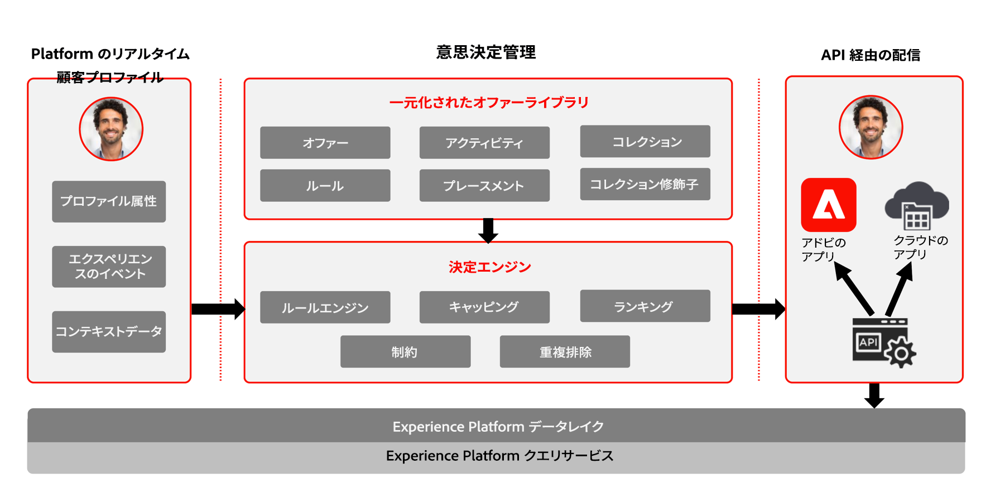

# 意思決定管理について {#about-decision-management}

[!DNL Journey Optimizer] を使用すると、すべてのタッチポイントをまたいで、適切なタイミングで最高のオファーとエクスペリエンスを顧客に提供できます。デザインが完了すると、パーソナライズされたオファーを使用してオーディエンスをターゲットに設定できます。

意思決定管理では、マーケティングオファーの一元化されたライブラリと、Adobe Experience Platform が作成するリッチなリアルタイムプロファイルにルールと制約を適用する意思決定エンジンを使用して、的確なオファーを適切なタイミングで顧客に送信します。

意思決定管理の機能は、2 つの主要コンポーネントで構成されています。

* **一元化されたオファーライブラリ**&#x200B;は、オファーを構成する様々な要素を作成および管理し、それらの規則と制約を定義するインターフェイスです。
* **Offer Decisioning エンジン**&#x200B;は、Adobe Experience Platform のデータとリアルタイム顧客プロファイルをオファーライブラリとともに活用し、オファーの配信に適切な時間、顧客およびチャネルを選択します。

次のような利点があります。

* 複数のチャネルをまたいでパーソナライズされたオファーを配信することで、キャンペーンのパフォーマンスを向上しました。
* ワークフローの向上：マーケティングチームは、複数の配信やキャンペーンを作成する代わりに、1 つの配信を作成することでワークフローを向上させ、テンプレートの様々な部分でオファーを変更できます。
* キャンペーンおよび顧客全体でオファーが表示される回数を制御します。

➡️ [意思決定管理について詳しくは、これらのビデオをご覧ください](#video)

>[!NOTE]
>
>次のような場合： [Adobe Experience Platform](https://experienceleague.adobe.com/docs/experience-platform/landing/home.html?lang=ja){target="_blank"} を利用しているユーザー **Offer decisioning** アプリケーションの場合は、この節で説明する意思決定管理機能もすべて適用されます。

## オファーと決定について {#about-offers-and-decisions}

An **オファー** は、顧客に提示する条件を定義するコンテンツ、実施要件ルールおよび制約で構成されています。

を使用して作成します **オファーライブラリ**&#x200B;は、実施要件ルールと制約を複数のコンテンツに関連付けてオファーを作成および公開できる、一元化されたオファーカタログを提供します（ [オファーライブラリのユーザーインターフェイス](../get-started/user-interface.md)）に設定します。

オファーライブラリがオファーで強化されたら、オファーを&#x200B;**決定**&#x200B;に統合できます。

決定とは、配信ターゲットに応じて提供すべき最適なオファーを選択するために、Offer Decisioning エンジンを利用するオファーのコンテナです。

## よくあるユースケース {#common-use-cases}

意思決定管理の機能および Adobe Experience Platform との統合により、多くのユースケースが対象となり、顧客エンゲージメントやコンバージョンを向上できます。

* Adobe Experience Platformからのデータに基づいて、web サイトのホームページに、訪問顧客の興味ポイントに一致するオファーを表示します。

  

* 顧客が店舗の 1 つに近づいた場合、属性（ロイヤルティレベル、性別、以前の購入など）に応じて、使用可能なオファーを思い出させるプッシュ通知を送信します。

  

* 意思決定管理は、顧客がサポートチームに連絡する際のエクスペリエンスを向上できるようサポートします。
意思決定管理 API を使用すると、顧客が取り消したオファーと次善のオファーに関する情報を、コールセンター担当者のポータルに表示することができます。

  

## 意思決定管理へのアクセスの許可 {#granting-acess-to-decision-management}

意思決定管理機能へのアクセス権限および使用権限は、[Adobe Admin Console](https://helpx.adobe.com/jp/enterprise/managing/user-guide.html){target="_blank"} で管理します。

意思決定管理機能へのアクセス権を付与するには、**[!UICONTROL 製品プロファイル]**&#x200B;を作成し、対応する権限をユーザーに割り当てる必要があります。[!DNL Journey Optimizer] のユーザーと権限の管理について詳しくは、[この節](../../administration/permissions.md)を参照してください。

意思決定管理に特有の権限の一覧については、[この節](../../administration/high-low-permissions.md#decisions-permissions)を参照してください。

## 用語集 {#glossary}

意思決定管理を使用する際の主な概念のリストを以下に示します。

* **Capping** または **フリークエンシーキャップ**：キャッピングは、オファーの提示回数を定義する制約として使用されます。 上限には、組み合わせたターゲットオーディエンスに対してオファーを提案できる回数（「合計上限数」とも呼ばれます）と、1 つのオファーを同じエンドユーザーに提案できる回数（「プロファイルキャップ」とも呼ばれます）の 2 種類があります。

* **コレクション**：マーケターが事前に定義した条件（オファーのカテゴリなど）に基づくオファーのサブセットです。

* **決定**：オファーの選択を通知するロジックが含まれています。

* **決定ルール**：決定ルールは、パーソナライズされたオファーに追加される制約で、実施要件を決定するためにプロファイルに適用されます。

* **実施要件を満たすオファー**：実施要件を満たすオファーは、アップストリームで定義された制約を満たし、プロファイルに一貫して提示することができます。

* **意思決定管理**：ビジネスロジックと決定ルールを使用して、エンドユーザー向けにパーソナライズされたオファーエクスペリエンスを作成し、あらゆるチャネルやアプリケーションで配信できます。

* **フォールバックオファー**：フォールバックオファーは、エンドユーザーがコレクション内のパーソナライズされたオファーの対象でない場合に表示されるデフォルトのオファーです。

* **オファー**：オファーは、オファーを表示する資格のあるユーザーを指定するルールが関連付けられているマーケティングメッセージです。

* **オファーライブラリ**：オファーライブラリは、パーソナライズされたオファーやフォールバックオファー、決定ルールおよび決定を管理するために使用される一元化されたライブラリです。

* **パーソナライズされたオファー**：パーソナライズされたオファーは、実施要件ルールおよび制約に基づいてカスタマイズできるマーケティングメッセージです。

* **Placements**：プレースメントは、エンドユーザーに対してオファーが表示される場所またはコンテキストです。

* **優先度**：優先度は、実施要件、カレンダー、キャッピングなど、すべての制約を満たすオファーをランク付けするために使用されます。

* **表示域**：表示域は、チャネルがオファーを表示するために使用する情報（場所や言語など）です。

## チュートリアルビデオ{#video}

### 意思決定管理とは {#what-is-offer-decisioning}

以下のビデオでは、 意思決定管理の主な機能、アーキテクチャおよび使用例を紹介しています。

>[!VIDEO](https://video.tv.adobe.com/v/326961?quality=12&learn=on)

### オファーの定義と管理 {#use-offer-decisioning}

次のビデオでは、意思決定管理を使用してオファーを定義および管理し、リアルタイムの顧客データを活用する方法を示します。

>[!VIDEO](https://video.tv.adobe.com/v/326841?quality=12&learn=on)

