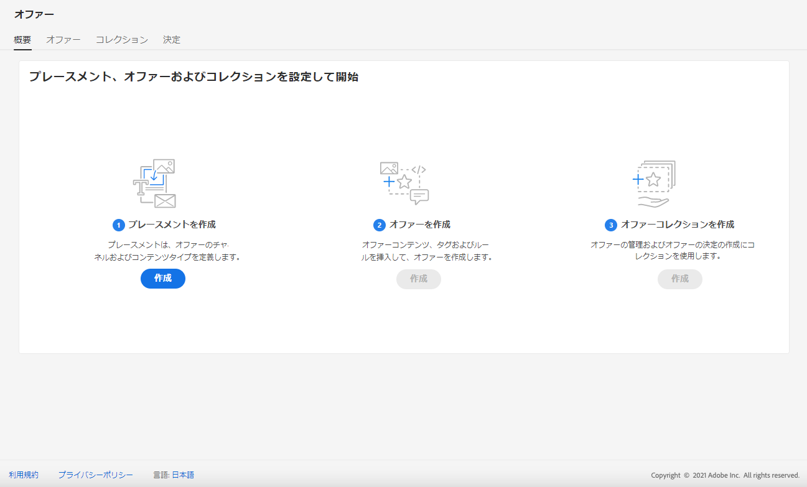
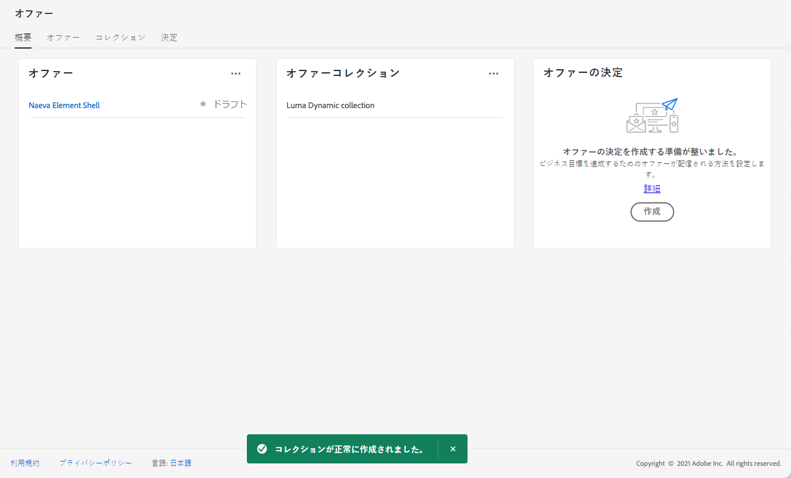

# ユーザーインターフェイス {#user-interface}

オファーライブラリを使用すると、配置と表示を1つにまとめて管理することができます。また、作成したすべての意思決定にもアクセスできます。

>[!NOTE]
>
>オファーライブラリへのアクセスに問題がある場合、またはその機能の一部に問題がある場合は、必要な権限が付与されていることを管理ユーザーに確認してください。 「意思決定管理 ](starting-offer-decisioning.md#granting-acess-to-decision-management) へのアクセスの許可」を参照してください [ 。

メニューを使用して、パーソナライズされた  **[!UICONTROL Offers]** フォールバックを管理し、コレクションに整理して、次のように意思決定を行います。

* **[!UICONTROL Overview]**: New to [!DNL decision management] ? 画面に表示される手順に従って、導入、提供、コレクションの設定を行います。 に慣れて [!DNL decision management] いる場合は、最新のオファー、コレクション、および決定について概要を説明します。 概要 ](#overview) を参照してください [ 。

* **[!UICONTROL Offers]**: パーソナライズされたフォールバックにアクセスすることも、新しい機能を作成することもできます。 キャンペーン ](../offer-library/creating-personalized-offers.md) の作成および [ 代替オファー ](../offer-library/creating-fallback-offers.md) の作成を参照してください [ 。

* **[!UICONTROL Collections]**: 静的および動的オファーのコレクションを作成および管理します。 「オファーコレクション ](../offer-library/creating-collections.md) について」を参照してください [ 。

* **[!UICONTROL Decisions]**: オファーを提供するための決定を作成および管理します。 「意思決定 ](../offer-activities/create-offer-activities.md) の作成」を参照してください [ 。

**[!UICONTROL Components]**&#x200B;メニューを使用して、オファーを作成するために必要なコンポーネントを管理します。

* **[!UICONTROL Placements]**: オファーが表示される場所を作成および管理します。 配置の作成 ](../offer-library/creating-placements.md) を参照してください [ 。

* **[!UICONTROL Tags]**: オファーを整理してフィルター処理するためのタグを作成および管理します。 タグ ](../offer-library/creating-tags.md) の作成を参照してください [ 。

* **[!UICONTROL Rules]**: オファーが表示される際の条件を管理します。 「意思決定規則 ](../offer-library/creating-decision-rules.md) の作成」を参照してください [ 。

* **[!UICONTROL Rankings]**: ランク付けの計算を作成および管理して、特定の位置に最初に表示するオファーを決定します。 ランク付け数式 ](../ranking/create-ranking-formulas.md) の作成を参照してください [ 。

## 大まか {#overview}

を初めて使用する [!DNL decision management] 場合、このタブでは、 **[!UICONTROL Overview]** 最初の特典の作成を開始するために必要な主な手順を説明しています。

画面に表示される手順に従って、配置、提示、コレクションの作成を開始します。

最初のステップが完了したら、「決定事項の提示」を行うよう求めるメッセージが表示されます。

>[!NOTE]
>
>このセクション ](../offer-library/key-steps.md) で [ は、の作成に関する主な手順について説明します。

詳しく [!DNL decision management] は、少なくとも1つのオファーの決定を既に作成している場合、このタブに **[!UICONTROL Overview]** は、最新の提供情報、コレクション、および決定事項が表示されます。

選択した項目に関する詳細情報に直接アクセスするには、サービスまたは決定をクリックします。

**[!UICONTROL View all]**&#x200B;ボタンをクリックして、オファー、コレクション、決定リストにアクセスします。

## 検索とフィルター情報 {#search-and-filter-information}

検索バー **を使用して** 、特定の項目を検索します。

**リストの左上にある「フィルター」アイコンをクリックして、フィルター** にアクセスすることもできます。 これを使用すると、異なる条件に基づいて表示されているエレメントをフィルター処理できます。 例えば、電子メール通信チャネルとイメージタイプコンテンツに対して作成された配置をフィルター処理できます。

## 表示する情報のカスタマイズ {#customize-displayed-information}

意思決定管理メニューからのリストは、リストの右上にある「設定」ボタンを使用してパーソナライズできます。

これにより、必要に応じて表示する情報を選択できます。

列のカスタマイズは各ユーザーに対して保存されることに注意してください。

## 情報ペイン {#information-pane}

様々なリストで、エレメントを選択すると、エレメントの情報を取得したり、エレメントの基本的なアクションを実行したりするための情報ペインが表示されます。

「製品サポート」および「意思決定」リストでは、複数のエレメントに対して一括操作を実行することもできます。 これを行うには、必要なオファーまたは判断を選択してから、情報ペインから実行するアクションを選択します。

また、既存の申し出を複製して、その **[!UICONTROL Draft]** 状態のコピーを作成することもできます。 これは、情報ペイン、オファー、または意志決定の詳細ビューのいずれかを使用して行うことができます。

## オファーと決定の変更ログ {#changes-logs}

オファーライブラリを使用すると、申し出や決定に加えられたすべての変更を視覚化できます。 そのためには、リストに表示されている名前をクリックして、その名前を表示し、「」タブを選択 **[!UICONTROL Change log]** します。

この画面に表示されたすべての変更と、変更を実行したユーザー名が表示されます。

