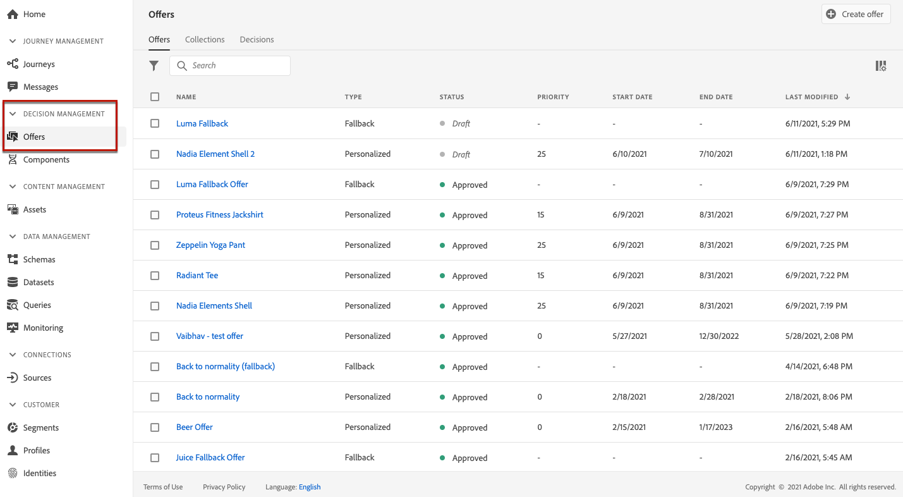
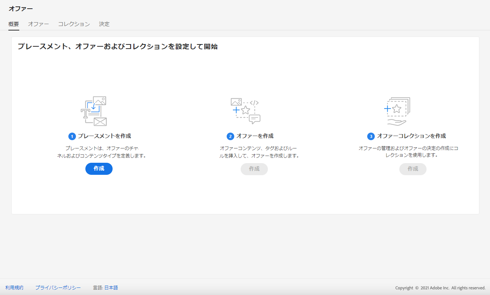
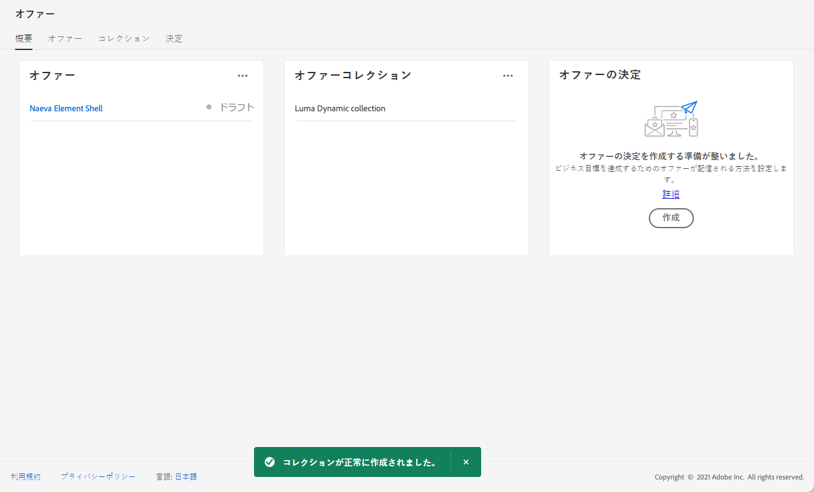
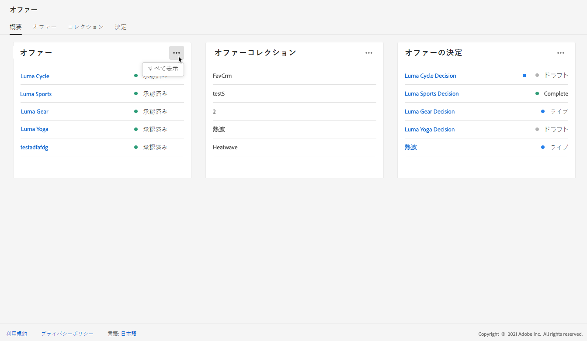
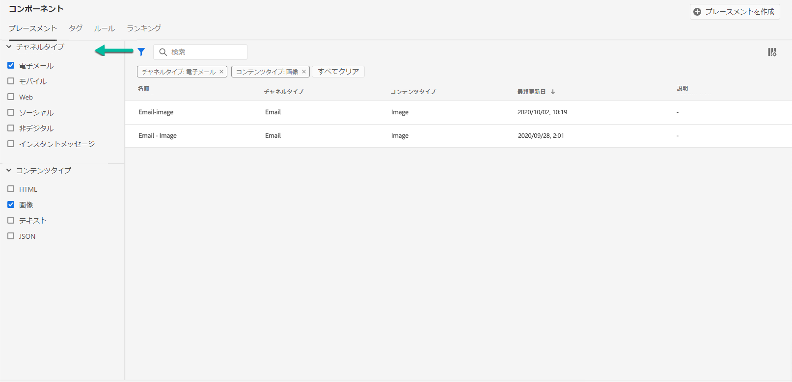
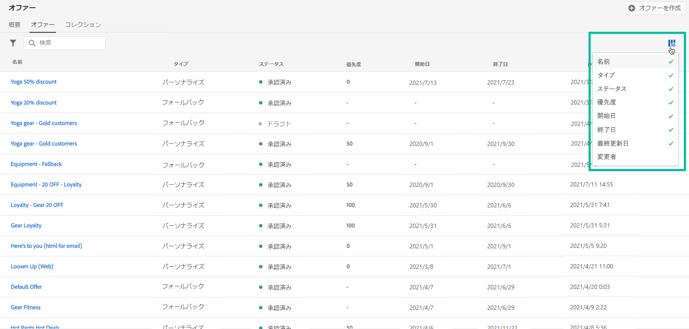
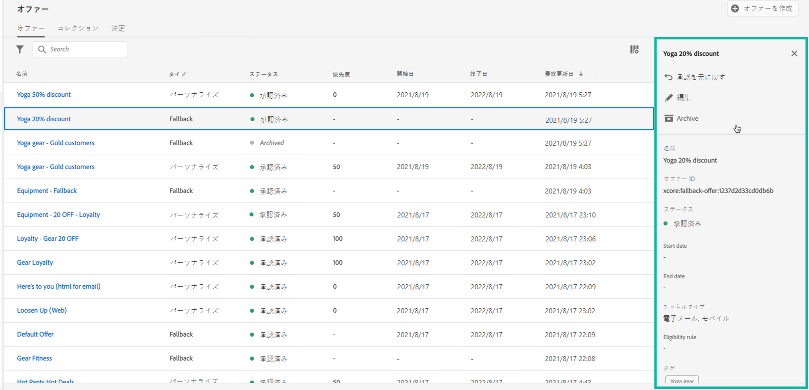
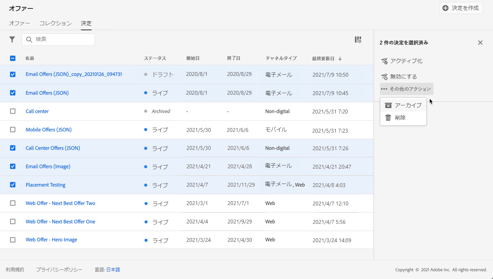
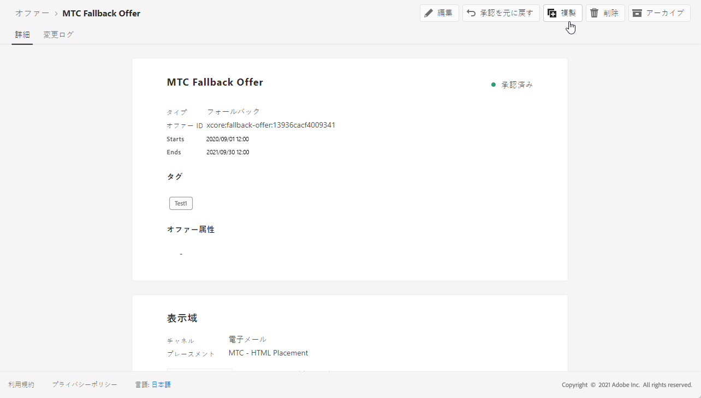
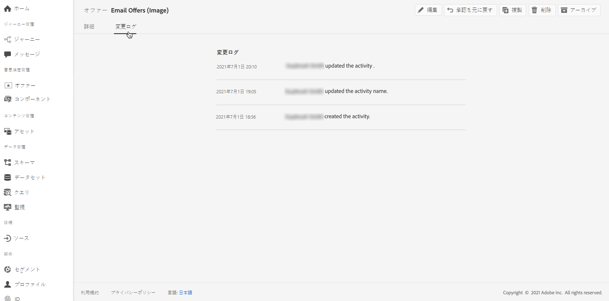

# ユーザーインターフェイス {#user-interface}

オファーライブラリを使用すると、プレースメントとオファーを 1 か所で作成および管理できるだけでなく、作成されたすべての決定（旧称：オファーアクティビティ）にアクセスできます。

>[!NOTE]
>
>オファーライブラリまたはその機能の一部へのアクセスで問題が発生した場合は、必要な権限が付与されているかどうかを管理者に確認してください。[意思決定管理へのアクセスの許可](starting-offer-decisioning.md#granting-acess-to-decision-management)を参照してください。

**[!UICONTROL オファー]**&#x200B;メニューを使用すると、パーソナライズされたオファーやフォールバックオファーを管理し、それらを整理してコレクションにまとめ、決定を作成して配信することができます。

* **[!UICONTROL 概要]**：[!DNL Offer Decisioning] を使用するのは初めてですか？画面上の手順に従って、プレースメント、オファーおよびコレクションの設定を開始します。[!DNL Offer Decisioning] について既に熟知している場合は、最新のオファー、コレクションおよび決定の概要を把握します。[概要](#overview)を参照してください。

* **[!UICONTROL オファー]**：パーソナライズされたフォールバックオファーにアクセスするか、新しいオファーを作成します。[オファーの作成](../offer-library/creating-personalized-offers.md)および[フォールバックオファーの作成](../offer-library/creating-fallback-offers.md)を参照してください。

* **[!UICONTROL コレクション]**：静的なオファーコレクションと動的なオファーコレクションを作成および管理します。詳細は[オファーコレクションについて](../offer-library/creating-collections.md)を参照してください。

* **[!UICONTROL 決定]**：オファーを提供するための決定を作成および管理します。[決定を作成する](../offer-activities/create-offer-activities.md)を参照してください。

**[!UICONTROL コンポーネント]**&#x200B;メニューを使用して、オファーの作成に必要なコンポーネントを管理します。

* **[!UICONTROL プレースメント]**：オファーを表示するプレースメントを作成および管理します。詳細は[プレースメントの作成](../offer-library/creating-placements.md)を参照してください。

* **[!UICONTROL タグ]**：タグを作成および管理して、オファーを整理およびフィルタリングします。詳細は[タグの作成](../offer-library/creating-tags.md)を参照してください。

* **[!UICONTROL ルール]**：オファーが提示される条件を管理します。詳細は[決定ルールの作成](../offer-library/creating-decision-rules.md)を参照してください。

* **[!UICONTROL ランキング]**：ランキング式を作成および管理して、特定のプレースメントに対して最初に提示するオファーを決定します。See [ランキング式の作成](../offer-library/create-ranking-formulas.md)を参照してください。

## 概要 {#overview}

[!DNL Offer Decisioning] を初めて使用する場合は、初めてのオファー決定の作成を開始するために必要な主な手順を「**[!UICONTROL 概要]**」タブで確認します。

画面上の手順に従って、プレースメント、オファーおよびコレクションの作成を開始します。

これらの最初の手順が完了すると、オファー決定（旧称：オファーアクティビティ）を作成するよう求められます。

>[!NOTE]
>
>オファーを作成して決定で使用するための主な手順については、[この節](../offer-library/key-steps.md)を参照してください。

[!DNL Offer Decisioning] の知識があり、少なくとも 1 つのオファー決定を作成済みの場合は、「**[!UICONTROL 概要]**」タブに最新のオファー、コレクションおよび決定が表示されます。

オファーまたは決定をクリックして、選択した項目の詳細に直接アクセスします。

「**[!UICONTROL すべて表示]**」ボタンをクリックして、オファー、コレクションまたは決定リストにアクセスします。

## 情報の検索とフィルタリング {#search-and-filter-information}

**検索バー**&#x200B;を使用して、特定の項目を検索します。

**フィルター**&#x200B;にアクセスするには、リストの左上にあるフィルターアイコンをクリックすることもできます。使用すると、様々な条件に従って表示される要素をフィルターできます。例えば、メール通信チャネル用に作成したプレースメントや画像タイプのコンテンツをフィルターできます。

## 表示情報のカスタマイズ {#customize-displayed-information}

意思決定管理メニューのリストは、リストの右上にある設定ボタンを使用してパーソナライズできます。

これにより、表示する情報を必要に応じて選択できます。

列のカスタマイズは、各ユーザーに対して保存されます。

## 情報ペイン {#information-pane}

様々なリストで、要素を選択して情報ペインを表示し、要素に関する情報を取得したり、基本的な操作を実行したりできます。

オファーと決定リストを使用して、複数の要素に対して一括アクションを実行することもできます。これを行うには、目的のオファーまたは決定を選択し、情報ペインから実行するアクションを選択します。

また、既存のオファーや決定を複製して、 **[!UICONTROL ドラフト]**&#x200B;ステータスのコピーを作成することもできます。これは、情報ペイン、オファーまたは決定の詳細表示から実行できます。

## オファーと決定の変更ログ {#changes-logs}

オファーライブラリを使用すると、オファーまたは決定に対して実行されたすべての変更を表示できます。すべての変更を表示するには、リストでオファーまたは決定の名前をクリックして開き、「 **[!UICONTROL 変更ログ]**」タブを選択します。

加えられたすべての変更と、変更を行ったユーザーの名前がこの画面に表示されます。

