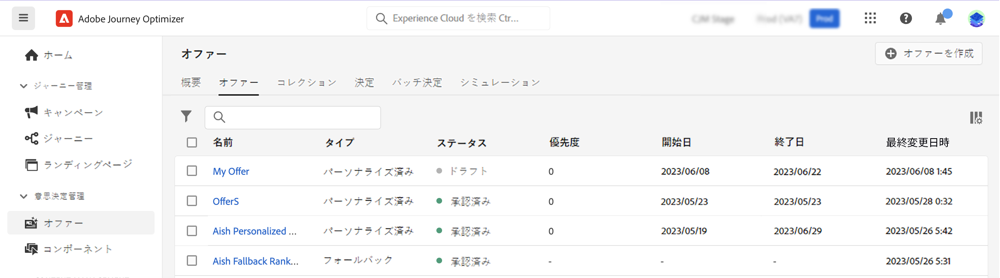
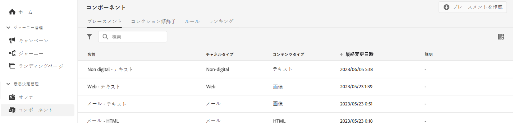
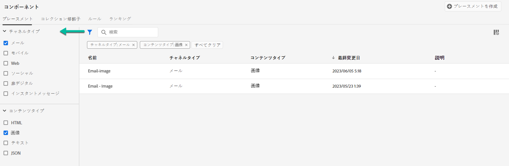
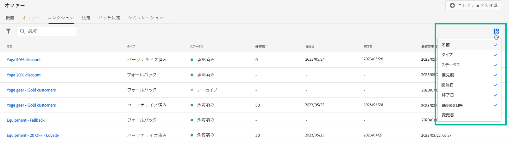
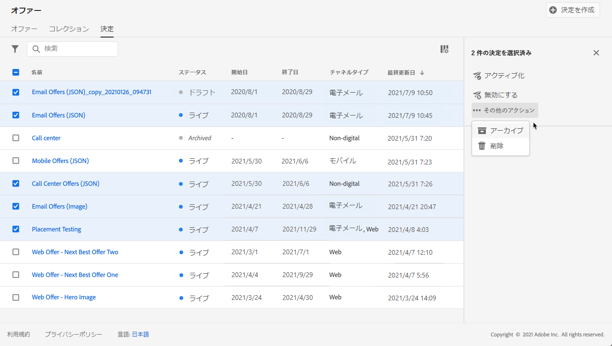
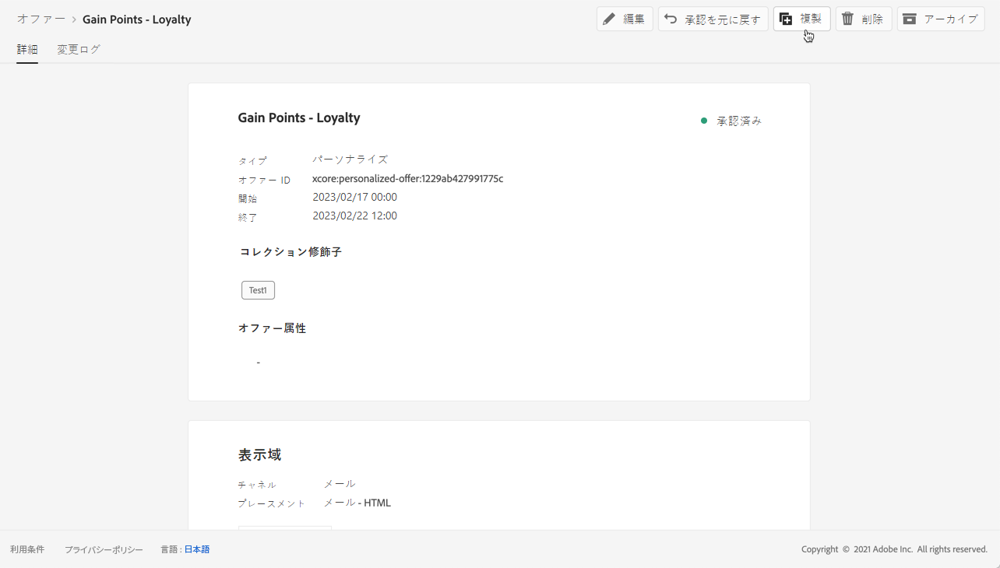
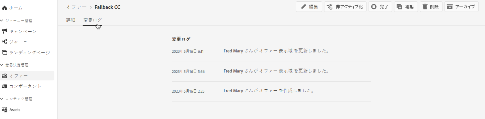

# ユーザーインターフェイス {#user-interface}

オファーライブラリを使用すると、プレースメントとオファーを1か所で作成および管理でき、作成されたすべての決定(旧オファーアクティビティ)にアクセスできます。

**[!UICONTROL オファー]**&#x200B;メニューを使用して、パーソナライズされたオファーとフォールバックのメニューを管理し、コレクションに編成して、意思決定を作成して配信します。

* **[!UICONTROL オファー]**:パーソナライズされたオファーとフォールバックのユーザーにアクセスしたり、新しいユーザーを作成したりできます。[オファーの作成](../offer-library/creating-personalized-offers.md)および[フォールバックオファーの作成](../offer-library/creating-fallback-offers.md)を参照してください。

* **[!UICONTROL コレクション]**:静的コレクションとダイナミックオファーコレクションを作成および管理します。[オファーコレクションについて](../offer-library/creating-collections.md)を参照してください。

* **[!UICONTROL 判断]**:オファーを提供するための意思決定を作成し、管理します。[決定を作成する](../offer-activities/create-offer-activities.md)を参照してください。

**[!UICONTROL コンポーネント]**&#x200B;メニューを使用して、オファーの作成に必要なコンポーネントを管理します。

* **[!UICONTROL 配置]**:オファーを表示するプレースメントを作成および管理します。[プレースメントの作成](../offer-library/creating-placements.md)を参照してください。

* **[!UICONTROL タグ]**:タグを作成して管理し、オファーを整理およびフィルタリングします。[タグの作成](../offer-library/creating-tags.md)を参照してください。

* **[!UICONTROL ルール]**:オファーが表示される条件を管理します。[決定ルールの作成](../offer-library/creating-decision-rules.md)を参照してください。

* **[!UICONTROL ランク]**:ランキング式を作成および管理して、特定のプレースメントに対して最初に表示するオファーを決定します。[ランキング式の作成](../offer-library/create-ranking-formulas.md)を参照してください。

## 情報の検索とフィルター

**検索バー**&#x200B;を使用して、特定の項目を検索します。

**フィルター**&#x200B;にアクセスするには、リストの左上にあるフィルターアイコンをクリックすることもできます。使用すると、様々な条件に従って表示される要素をフィルターできます。例えば、E メール通信チャネル用に作成したプレースメントや画像タイプのコンテンツをフィルターできます。

## 表示情報のカスタマイズ

デシジョン管理メニューのリストは、リストの右上にある設定ボタンを使用して、パーソナライズできます。

これにより、必要に応じて表示する情報を選択できます。

列のカスタマイズは、ユーザごとに保存されることに注意してください。

## 情報ペイン

様々なリストで、要素を選択して情報ペインを表示し、要素に関する情報を取得したり、基本的な操作を実行したりできます。

オファーと決定リストを使用して、複数の要素に対してバルクアクションを実行することもできます。 これを行うには、目的のオファーまたは決定を選択し、実行するアクションを情報ペインから選択します。

また、既存のオファーを重複したり、**[!UICONTROL ドラフト]**&#x200B;の状態でコピーを作成する場合にも注意してください。 これは、情報ペイン、オファー、または意思決定の詳細表示から実行できます。

## オファーと決定の変更ログ{#changes-logs}

オファーライブラリを使用すると、オファーまたは決定に対して行われたすべての変更を表示できます。 これを行うには、リストでオファー名をクリックしてまたは決定を開き、**[!UICONTROL 「変更ログ]**」タブを選択します。

加えられたすべての変更と、変更を行ったユーザーの名前がこの画面に表示されます。

