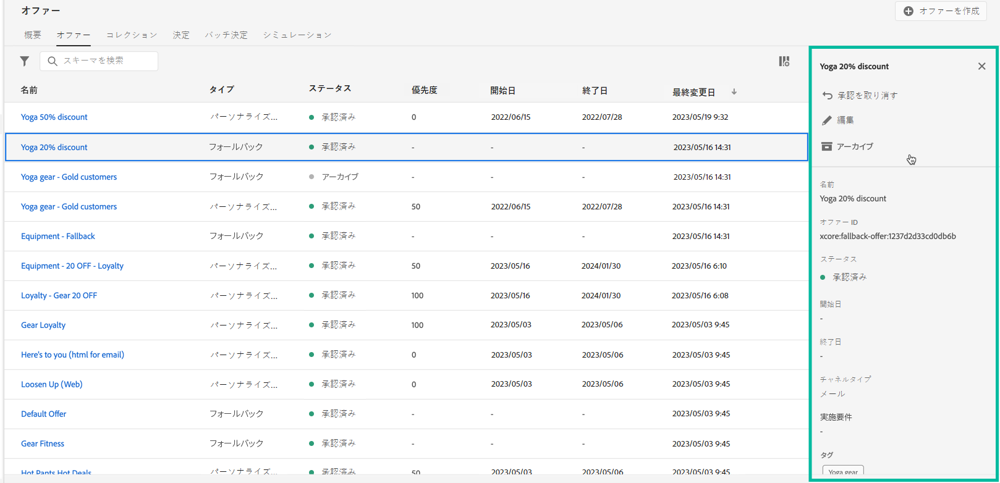

# オファーライブラリのユーザーインターフェイス {#user-interface}

左側のパネルの「**[!UICONTROL 意思決定管理]**」セクションには、意思決定管理機能にアクセスできる次の 2 つのメニューが表示されます。

**[!UICONTROL オファー]**&#x200B;メニューでは、オファーを管理および配信できます。

* **[!UICONTROL 概要]**：[!DNL decision management] を使用するのは初めてですか？画面上の手順に従って、プレースメント、オファーおよびコレクションの設定を開始します。[!DNL decision management] について既に熟知している場合は、最新のオファー、コレクションおよび決定の概要を把握します。[詳細情報](#overview)
* **[!UICONTROL オファー]**：パーソナライズされたオファーとフォールバックオファーを作成してアクセスします。[オファー](../offer-library/creating-personalized-offers.md)と[フォールバックオファー](../offer-library/creating-fallback-offers.md)の作成方法を学習
* **[!UICONTROL コレクション]**：オファーを静的なコレクションと動的なコレクションに整理します。[詳細情報](../offer-library/creating-collections.md)
* **[!UICONTROL 決定]**：オファーを提供するための決定を作成および管理します。[詳細情報](../offer-activities/create-offer-activities.md)
* **[!UICONTROL バッチ決定]**：特定の Adobe Experience Platform オーディエンスに含まれるすべてのプロファイルにオファーの決定を配信します。[詳細情報](../batch-delivery.md)
* **[!UICONTROL シミュレーション]**：特定のプレースメントのテストプロファイルに配信されるオファーをシミュレートして、意思決定のロジックを検証します。[詳細情報](../offer-activities/simulation.md)

**[!UICONTROL コンポーネント]**&#x200B;メニューを使用して、オファーと意思決定の作成に必要なコンポーネントを作成および管理します。

* **[!UICONTROL プレースメント]**：オファーを表示するプレースメントを作成および管理します。[詳細情報](../offer-library/creating-placements.md)
* **[!UICONTROL コレクション修飾子]**：コレクション修飾子（旧称「タグ」）を作成および管理して、オファーを整理およびフィルタリングします。[詳細情報](../offer-library/creating-tags.md)
* **[!UICONTROL ルール]**：オファーを提示する条件を管理します。[詳細情報](../offer-library/creating-decision-rules.md)
* **[!UICONTROL ランキング]**：ランキング式を作成および管理して、特定のプレースメントに対して最初に提示するオファーを決定します。[詳細情報](../ranking/create-ranking-formulas.md)

>[!NOTE]
>
>意思決定管理またはその機能の一部へのアクセスで問題が発生した場合は、必要な権限が付与されているかどうかを管理者に確認してください。[意思決定管理へのアクセスの許可](starting-offer-decisioning.md#granting-access-to-decision-management)を参照してください。

## 概要 {#overview}

[!DNL decision management] を初めて使用する場合は、初めてのオファー決定の作成を開始するために必要な主な手順を「**[!UICONTROL 概要]**」タブで確認します。画面上の手順に従って、プレースメント、オファーおよびコレクションの作成を開始します。これらの最初の手順が完了したら、オファーの決定を作成するよう求められます。

>[!NOTE]
>
>オファーを作成して決定で使用するための主な手順については、[この節](../offer-library/key-steps.md)を参照してください。

[!DNL decision management] の知識があり、少なくとも 1 つのオファー決定を作成済みの場合は、「**[!UICONTROL 概要]**」タブに最新のオファー、コレクションおよび決定が表示されます。

オファーまたは決定をクリックして、選択した項目の詳細に直接アクセスします。

「**[!UICONTROL すべて表示]**」ボタンをクリックして、オファー、コレクションまたは決定リストにアクセスします。

## 情報の検索とフィルタリング {#search-and-filter-information}

**検索バー**&#x200B;を使用して、特定の項目を検索します。

**フィルター**&#x200B;にアクセスするには、リストの左上にあるフィルターアイコンをクリックすることもできます。使用すると、様々な条件に従って表示される要素をフィルターできます。例えば、メール通信チャネル用に作成したプレースメントや画像タイプのコンテンツをフィルターできます。

## 表示情報のカスタマイズ {#customize-displayed-information}

意思決定管理メニューのリストは、リストの右上にある設定ボタンを使用してパーソナライズできます。

これにより、表示する情報を必要に応じて選択できます。

列のカスタマイズは、各ユーザーに対して保存されます。

## 情報ペイン {#information-pane}

様々なリストで、要素を選択して情報ペインを表示し、要素に関する情報を取得したり、基本的な操作を実行したりできます。

オファーと決定リストを使用して、複数の要素に対して一括アクションを実行することもできます。これを行うには、目的のオファーまたは決定を選択し、情報ペインから実行するアクションを選択します。

また、既存のオファーや決定を複製して、 **[!UICONTROL ドラフト]**&#x200B;ステータスのコピーを作成することもできます。これは、情報ペイン、オファーまたは決定の詳細表示から実行できます。

## オファーと決定の変更ログ {#changes-logs}

[!DNL Journey Optimizer] を使用すると、オファーまたは決定に対して実行されたすべての変更を表示できます。これを行うには、左メニューから&#x200B;**[!UICONTROL 監査]**&#x200B;メニューにアクセスします。[リソースに対するアクションを監査する方法を説明します](../../privacy/audit-logs.md)
