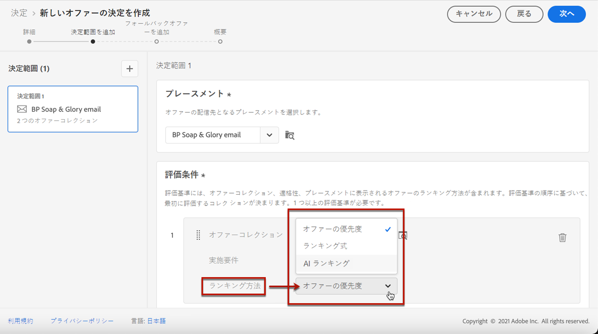
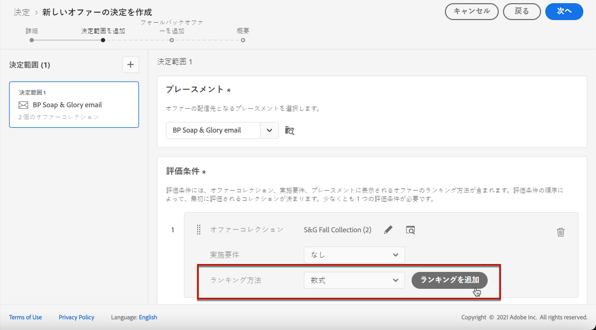
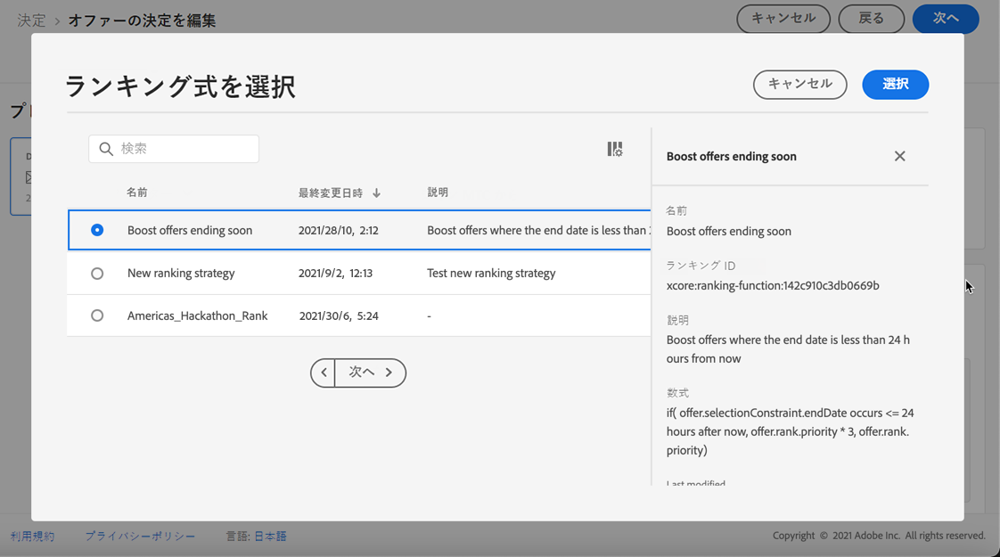
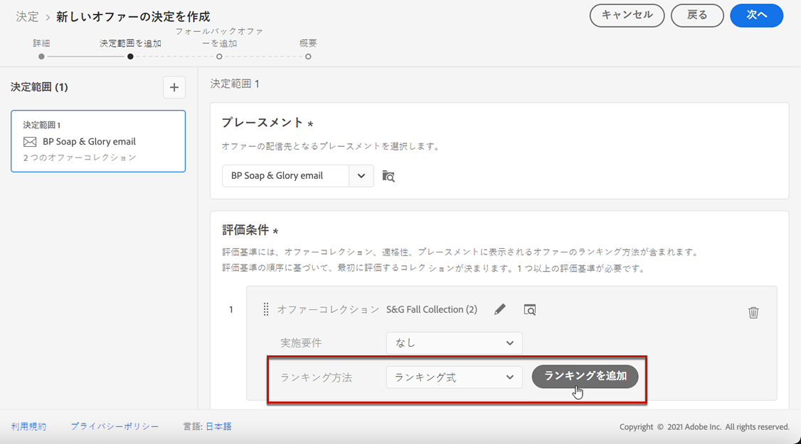
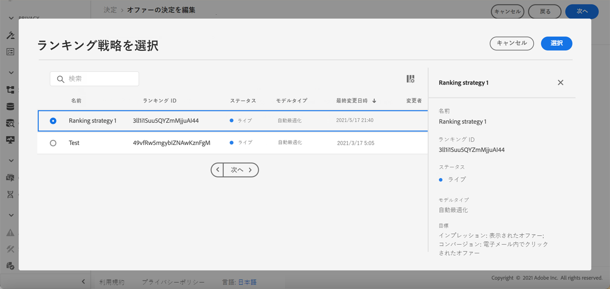

# 決定でのオファー選択の設定 {#offers-selection-in-decisions}

指定のプレースメントに対して実施要件を満たすオファーが複数ある場合、決定を設定する際に各プロファイルに最適なオファーを選択する方法を選べます。オファーのランク付けは、次の基準で行えます。

* オファーの優先度
* ランキング式
* [AI ランキング](#use-ranking-strategy)

## オファーの優先度 {#offer-priority}

決定において指定のプレースメントに対して実施要件を満たすオファーが複数ある場合、デフォルトでは、**優先度**&#x200B;が最も高いオファーが最初に顧客に配信されます。

オファーの優先度スコアは、オファーの作成時に割り当てられます。パーソナライズされたオファーを作成する方法については、[この節](../offer-library/creating-personalized-offers.md)を参照してください。

## ランキング式 {#assign-ranking-formula}

Journey Optimizer では、オファーの優先度に加えて、**ランキング式**&#x200B;を作成できます。これらは、特定のプレースメントに対して最初に表示するオファーを決定する数式であり、オファーの優先度スコアを考慮するものではありません。

例えば、終了日が今から 24 時間以内のすべてのオファーの優先度を上げることもできますし、プロファイルの目標地点が「実行中」の場合は「実行中」カテゴリのオファーの優先度を上げることもできます。

ランキング式を作成する方法については、 [この節](../ranking/create-ranking-formulas.md)を参照してください。

式を作成したら、決定内のプレースメントに割り当てることができます。これを行うには、以下の手順に従います。

1. 決定を作成するか、既存の決定を編集します。詳しくは、[決定の作成](../offer-activities/create-offer-activities.md)を参照してください。

1. オファーを含むプレースメントを追加します。[プレースメントの作成](../offer-library/creating-placements.md)を参照してください。

1. 各プレースメントに対して、コレクションを追加します。[コレクションの作成](../offer-library/creating-collections.md)を参照してください。

1. ランキング方法として「**[!UICONTROL 式]**」を選択し、「**[!UICONTROL ランキングを追加]**」をクリックします。

   

1. 目的の式を選択し、「**[!UICONTROL 選択]**」をクリックします。

   

これで、ランキング式がプレースメントに関連付けられました。

このプレースメントで提示するための実施要件を満たすオファーが複数ある場合、決定は選択した式を使用して、最初に配信するオファーを計算します。

## AI ランキング {#use-ranking-strategy}

<!--If you are an [Adobe Experience Platform](https://experienceleague.adobe.com/docs/experience-platform/landing/home.html){target="_blank"} user leveraging the **Offer Decisioning** application service,-->

AI モデルを選択して、特定のプロファイルに表示するオファーを自動的にランク付けする、トレーニング済みモデルシステムを使用することもできます。AI モデルの作成方法については、[この節](../ranking/create-ranking-strategies.md)を参照してください。

AI モデルを作成したら、決定内のプレースメントに割り当てることができます。これを行うには、次の手順に従います。

1. 決定を作成するか、既存の決定を編集します。詳しくは、[決定の作成](../offer-activities/create-offer-activities.md)を参照してください。

1. オファーを含むプレースメントを追加します。[プレースメントの作成](../offer-library/creating-placements.md)を参照してください。

1. 各プレースメントに対して、コレクションを追加します。[コレクションの作成](../offer-library/creating-collections.md)を参照してください。

1. オファーのランキング方法として「**[!UICONTROL AI ランキング]** 」をドロップダウンリストから選択して、「**[!UICONTROL ランキングを追加]**」をクリックします。

   

1. 作成した AI モデルを選択します。モデルの詳細がすべて表示されます。

   

1. 「**[!UICONTROL 選択]**」をクリックします。これで、AI モデルがプレースメントに関連付けられました。

複数のオファーが適格な場合、トレーニング済みモデルシステムは、特定のプレースメントに対して最初に提示するオファーを決定します。

