# 決定の作成 {#create-offer-activities}

決定とは、配信ターゲットに応じて提供すべき最適なオファーを選択するために、オファー決定エンジンを利用するオファーのコンテナです。

➡️ [ オファーアクティビティの作成方法については、このビデオを参照してください ](#video)

**[!UICONTROL オファー]**&#x200B;メニューの「**[!UICONTROL 決定]**」タブに決定が一覧表示されます。フィルターは、ステータスや開始日、終了日に応じて決定を取得するのに役立ちます。

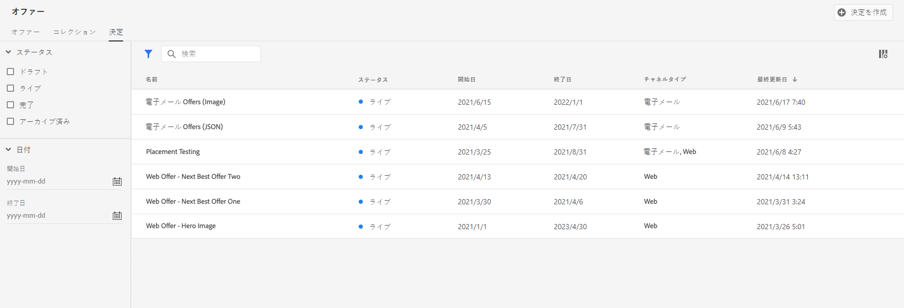

決定を作成する前に、以下のコンポーネントがオファーライブラリに作成されていることを確認してください。

* [プレースメント](../offer-library/creating-placements.md)
* [コレクション](../offer-library/creating-collections.md)
* [パーソナライズされたオファー](../offer-library/creating-personalized-offers.md)
* [フォールバックオファー](../offer-library/creating-fallback-offers.md)

## 決定の作成 {#create-activity}

>[!CONTEXTUALHELP]
>id="ajo_decisioning_decision_details"
>title="オファーの決定の詳細"
>abstract="決定の名前を指定し、必要に応じて開始日時と終了日時を定義します。決定にカスタムデータ使用ラベルまたはコアデータ使用ラベルを割り当てるには、「**[!UICONTROL アクセスを管理]**」を選択します。"

1. 決定リストにアクセスし、「**[!UICONTROL 決定を作成]**」をクリックします。

1. 決定の名前を指定します。

1. 必要に応じて開始日時と終了日時を指定し、「**[!UICONTROL 次へ]**」をクリックします。

   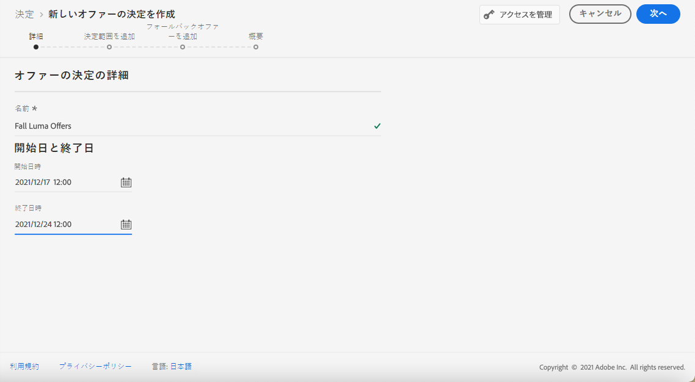

1. 決定にカスタムデータ使用ラベルまたはコアデータ使用ラベルを割り当てるには、「**[!UICONTROL アクセスを管理]**」を選択します。[詳しくは、オブジェクトレベルのアクセス制御（OLAC）を参照してください](../../administration/object-based-access.md)

## 決定範囲の定義 {#add-decision-scopes}

>[!CONTEXTUALHELP]
>id="ajo_decisioning_decision_scopes"
>title="決定範囲"
>abstract="オファーの決定に対して 1 つまたは複数の範囲を設定し、表示するオファーを決定します。そのためには、プレースメントと、このプレースメントに関連する評価条件を選択します。"

>[!CONTEXTUALHELP]
>id="ajo_decisioning_decision_placement"
>title="プレースメント"
>abstract="オファーの配信先となるプレースメントを選択します。"

>[!CONTEXTUALHELP]
>id="ajo_decisioning_decision_evaluation"
>title="評価条件"
>abstract="評価条件は、実施要件制約に関連付けられたオファーコレクションと、プレースメントに表示されるオファーを決定するランキング方法で構成されます。評価条件の順序によって、最初に評価されるコレクションが決まります。少なくとも 1 つの評価条件が必要です。"

1. ドロップダウンリストからプレースメントを選択します。これは、決定の最初の決定範囲に追加されます。

   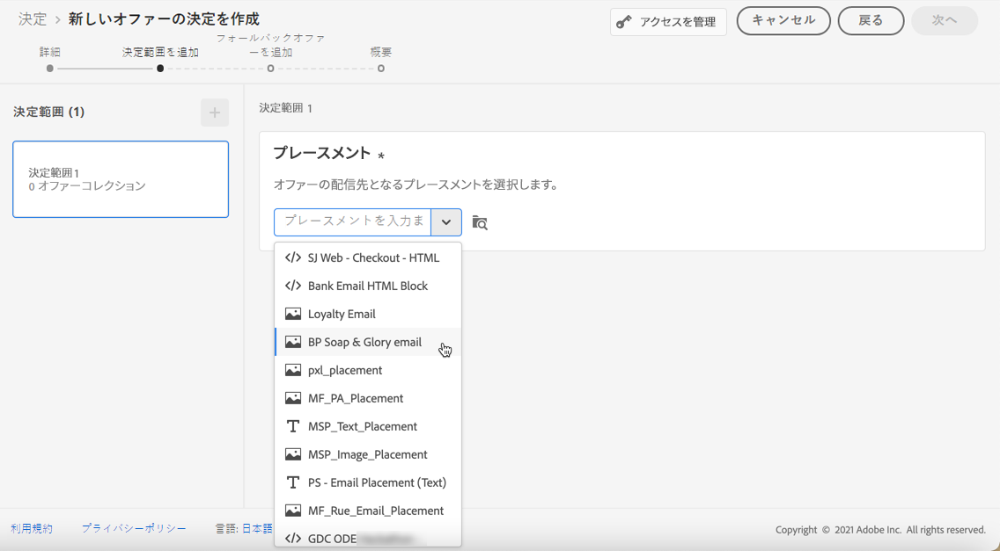

1. 「 **[!UICONTROL 追加]**」をクリックして、このプレースメントの評価条件を選択します。

   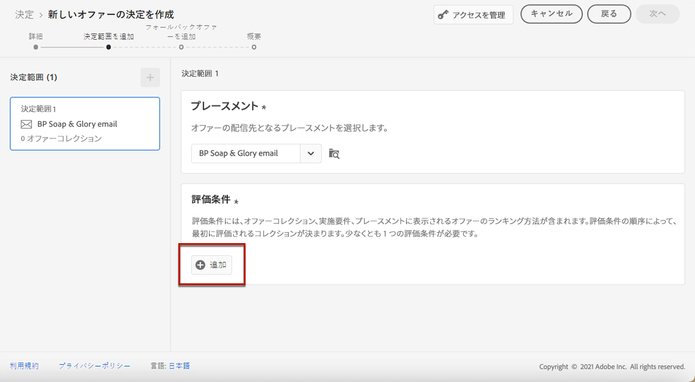

   各条件は、実施要件制約に関連付けられたオファーコレクションと、プレースメントに表示されるオファーを決定するためのランキング方法で構成されます。

   >[!NOTE]
   >
   >少なくとも 1 つの評価条件が必要です。

1. 考慮するオファーを含んだコレクションを選択し、「**[!UICONTROL 追加]**」をクリックします。

   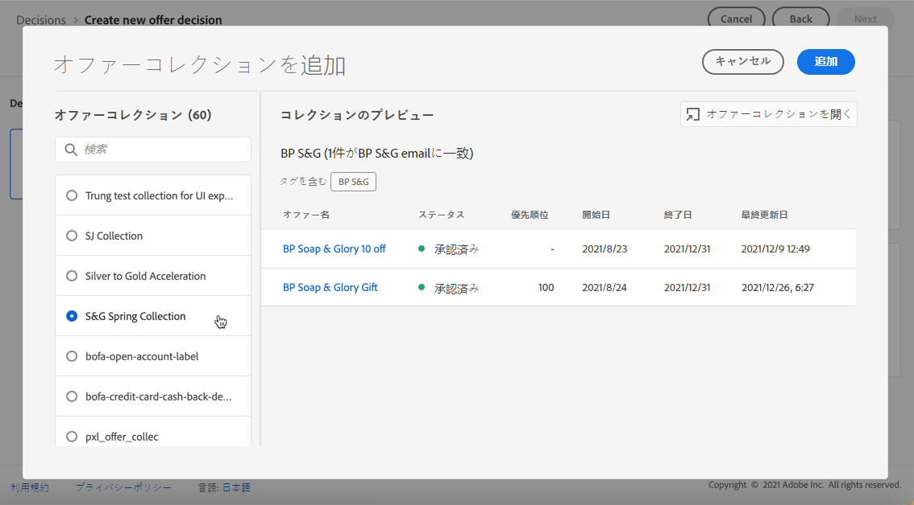

   >[!NOTE]
   >
   >「**[!UICONTROL オファーコレクションを開く]**」リンクをクリックすると、コレクションのリストが新しいタブに表示されます。ここで、コレクションとそれに含まれるオファーを参照できます。

   選択したコレクションが条件に追加されます。

   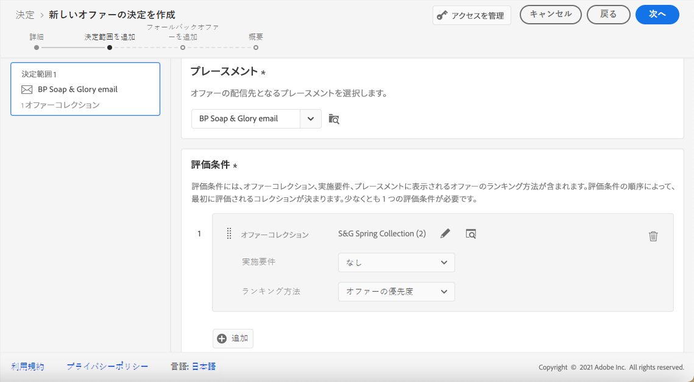

1. 「**[!UICONTROL 実施要件]**」フィールドを使用して、このプレースメントのオファーの選択を制限します。

   この制約は、**決定ルール**&#x200B;または 1 つ以上の **Adobe Experience Platform オーディエンス**&#x200B;を使用して適用できます。この両方について詳しくは、[この節](../offer-library/add-constraints.md#segments-vs-decision-rules)を参照してください。

   * オファーの選択を Experience Platform オーディエンスのメンバーに限定するには、「**[!UICONTROL オーディエンス]**」を選択したあと、「**[!UICONTROL オーディエンスを追加]**」をクリックします。

     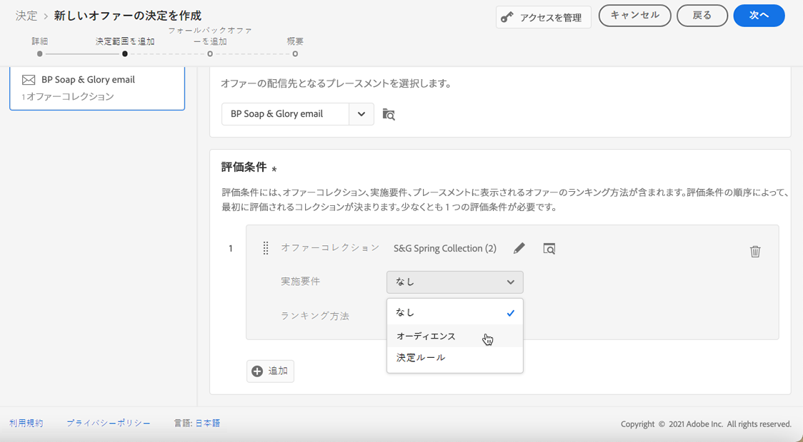

     左側のパネルから 1 つまたは複数のオーディエンスを追加し、**[!UICONTROL かつ]**／**[!UICONTROL または]**&#x200B;論理演算子を使用してそれらを結合します。

     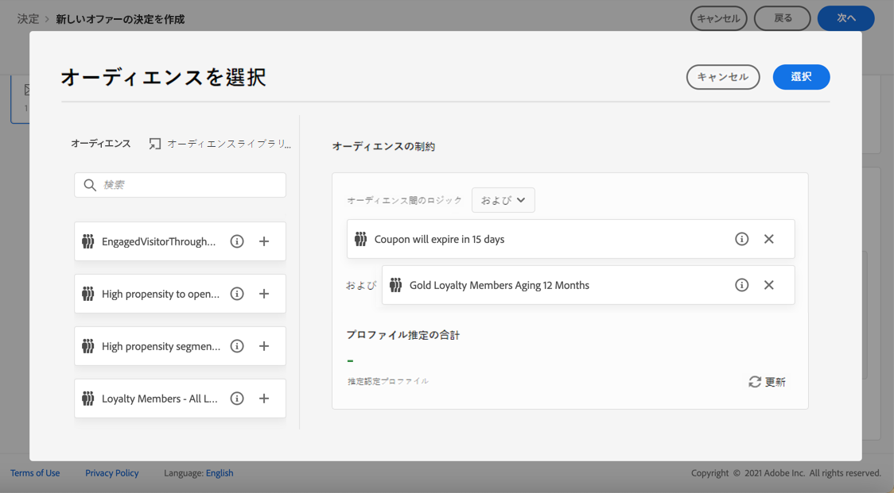

     オーディエンスの操作方法については、[この節](../../audience/about-audiences.md)を参照してください。

   * 決定ルールに選択制約を追加する場合は、「**[!UICONTROL 決定ルール]**」オプションを使用し、任意のルールを選択します。

     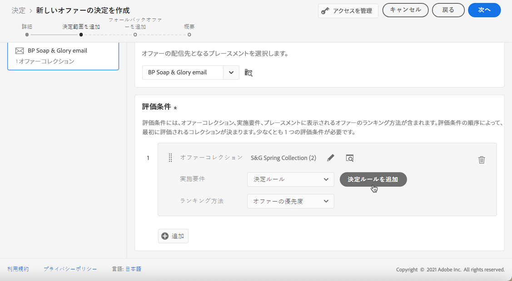

     決定ルールの作成方法については、 [この節](../offer-library/creating-decision-rules.md)を参照してください。

1. オーディエンスまたは決定ルールを選択すると、推定される認定プロファイルに関する情報が表示されます。「**[!UICONTROL 更新]**」をクリックして、データを更新します。

   >[!NOTE]
   >
   >プロファイルの予測は、ルールパラメーターにコンテキストデータなど、プロファイルに含まれていないデータが含まれている場合は使用できません。例えば、現在の気温が 80 ℃以上であることを条件とする実施要件ルールがあります。

   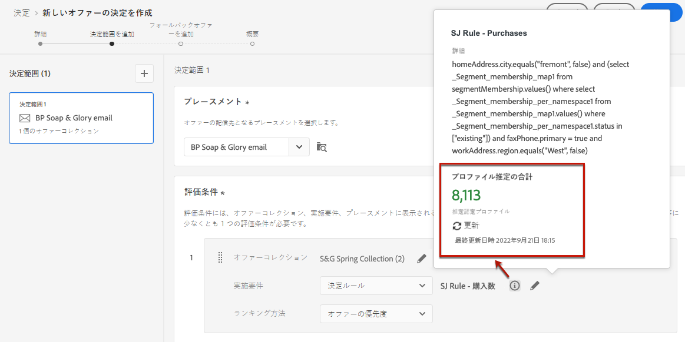

1. プロファイルごとに最適なオファーを選択するためのランキング方法を定義します。[詳細情報](../offer-activities/configure-offer-selection.md)

   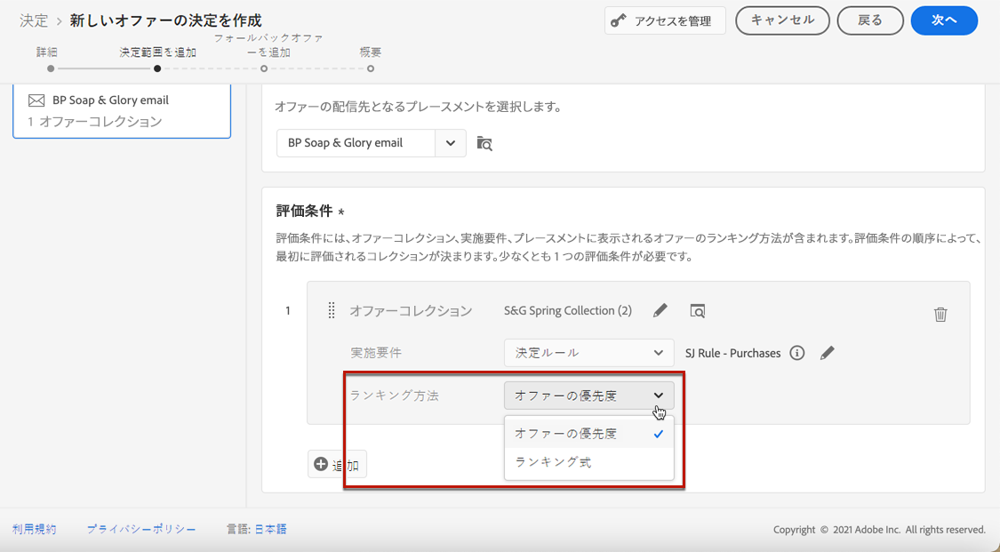

   * このプレースメントに対して、実施要件を満たすオファーが複数ある場合、デフォルトでは、**[!UICONTROL オファーの優先度]**&#x200B;メソッドがオファーで定義された値を使用します。優先度スコアが最も高いオファーがユーザーに配信されます。

   * 特定の計算済みスコアを使用して配信する実施要件を満たすオファーを選択する場合は、「**[!UICONTROL 数式]**」または「**[!UICONTROL AI モデル]**」を選択します。[詳細情報](../offer-activities/configure-offer-selection.md)

1. 「**[!UICONTROL 追加]**」をクリックすると、同じプレースメントに対する条件をさらに定義できます。

   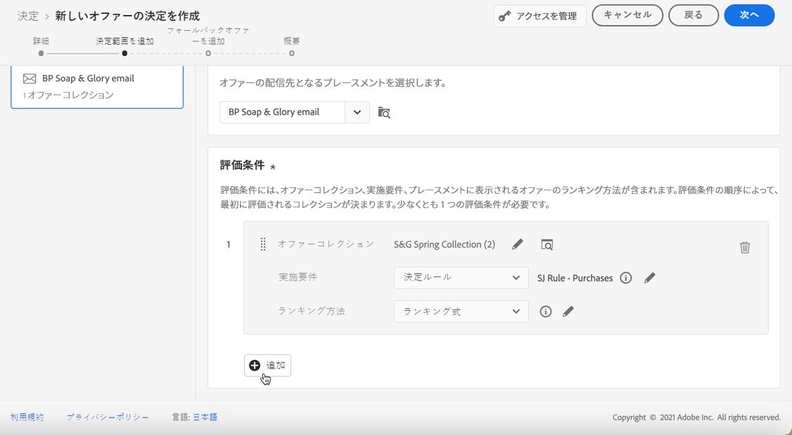

1. 複数の条件を追加した場合、それらは特定の順序で評価されます。シーケンスに最初に追加されたコレクションが最初に評価され、以下同様に評価されます。[詳細情報](#evaluation-criteria-order)

   デフォルトの順序を変更するには、コレクションをドラッグ＆ドロップして、任意に並べ替えることができます。

   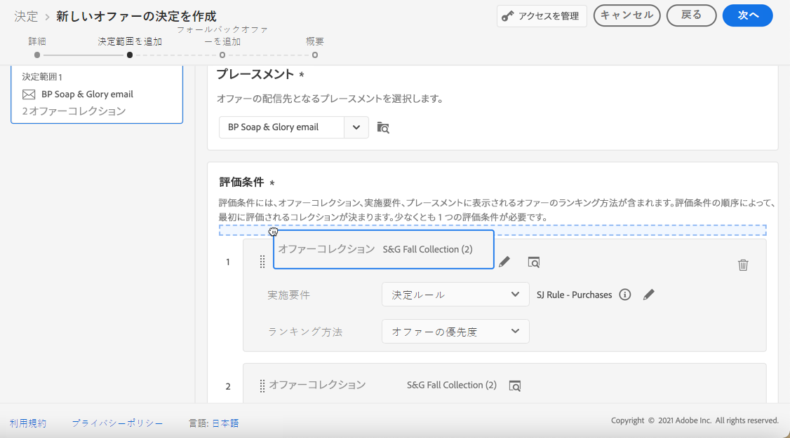

1. また、複数の条件を同時に評価することもできます。それには、コレクションを別のコレクションの上にドラッグ＆ドロップします。

   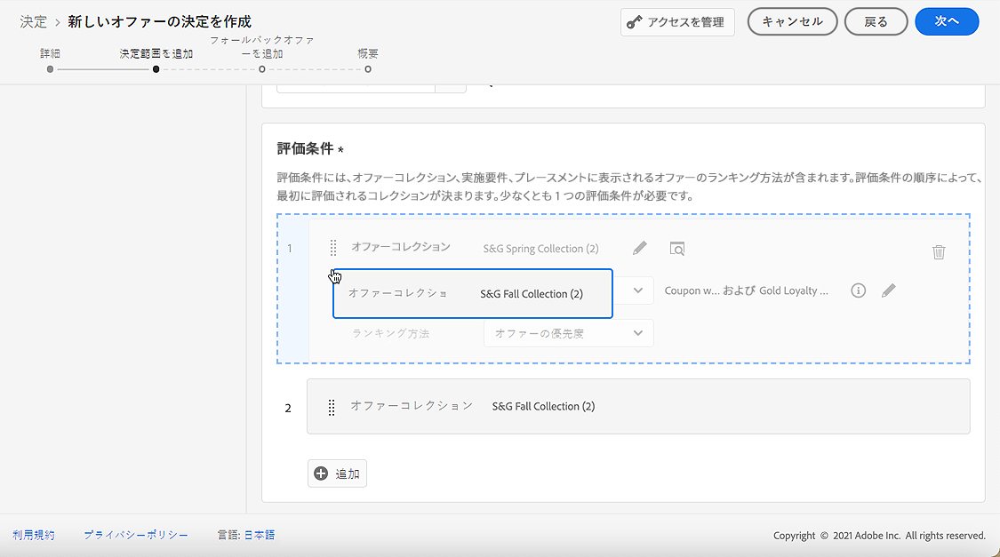

   これで同じランクになるので、これらは同時に評価されます。[詳細情報](#evaluation-criteria-order)

   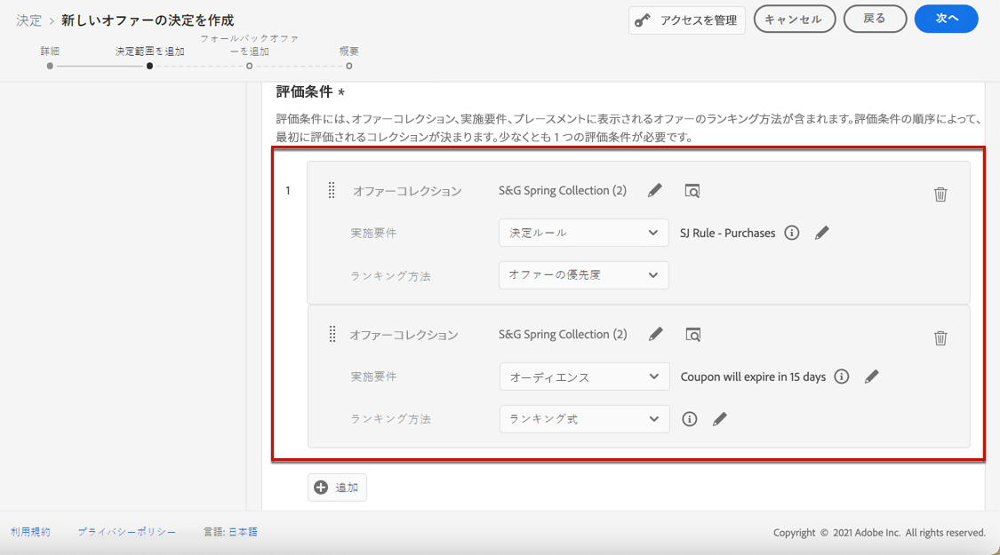

   >[!CAUTION]
   >
   >* [AI モデル](../ranking/ai-models.md) が評価条件グループで使用される場合、そのグループ内のすべての評価条件は AI ランキング方法を使用し、同じ特定の AI モデルを使用する必要があります。
   >
   >* また、AI モデルを使用できる評価条件グループは 1 つだけです。決定範囲内の他のグループは、他のランキング方法（優先度または数式）を使用する必要があります。[詳しくは、ランキング方法を参照してください](../offer-activities/configure-offer-selection.md)

1. この決定の一部としてオファーに別のプレースメントを追加するには、「**[!UICONTROL 新しいスコープ]**」ボタンを使用します。決定範囲ごとに、上記の手順を繰り返します。

   

   >[!NOTE]
   >
   >複数の決定範囲を追加すると、評価条件の順序が影響を受けます。[詳細情報](#multiple-scopes)

### 評価条件の順序 {#evaluation-criteria-order}

上記のように、評価条件は、コレクション、実施要件制約およびランキングメソッドで構成されます。評価条件を評価する順序を設定できますが、複数の評価条件を組み合わせて、個別にではなくまとめて評価することもできます。

#### 1 つの範囲を使用 {#one-scope}

1 つの決定範囲内で、複数の条件とそのグループ化によって、条件の優先度と実施要件を満たすオファーのランキングが決まります。最初の条件の優先度が最も高く、同じ「グループ」内で結合された条件も同じ優先度になります。

例えば、2 つのコレクションがあり、1 つは評価条件 A に、もう 1 つは評価条件 B にあるとします。リクエストは、2 つのオファーを送り返すことです。評価条件 A の 2 つの実施要件を満たすオファーがあり、評価条件 B の 3 つの実施要件を満たすオファーがあるとします。

* 2 つの評価条件が&#x200B;**組み合わされていない**&#x200B;か、順序が同じでない場合（1 と 2）、評価条件の上位 2 つの実施要件を満たすオファーが最初の行に返されます。最初の評価条件に実施要件を満たすオファーが 2 つない場合、決定エンジンは次の評価条件に順番に進み、まだ必要なオファーを見つけ、必要に応じて最終的にフォールバックを返します。

  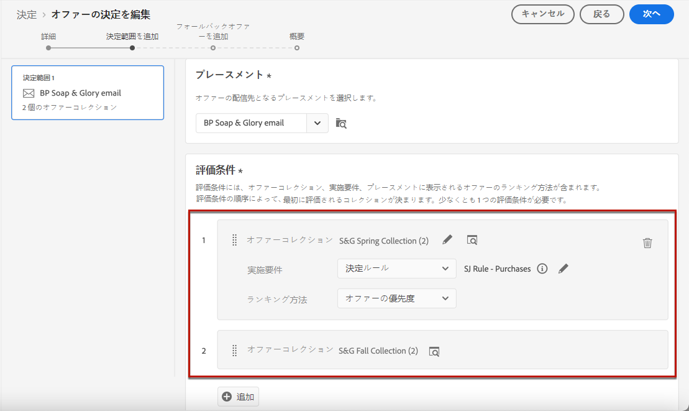

* 2 つのコレクションを&#x200B;**同時に評価**&#x200B;する場合、評価条件 A からの実施要件を満たすオファーが 2 つと、評価条件 B からの実施要件を満たすオファーが 3 つあるので、5 つのオファーはすべて、それぞれのランキングメソッドで決定した値に基づいてまとめられます。リクエストされたオファー数は 2 つなので、これら 5 つのオファーのうち上位 2 つの実施要件を満たすオファーが返されます。

  

+++ **複数の条件がある場合の例**

次に、1 つの範囲に対して複数の条件があり、それらが異なるグループに分かれている例について考えてみましょう。

3 つの条件を定義しました。条件 1 と条件 2 はグループ 1 で結合され、条件 3 は独立しています（グループ 2）。

各条件の実施要件を満たすオファーとその優先度（ランキング関数評価で使用）は、次のとおりです。

* グループ 1：
   * 条件 1 -（オファー 1、オファー 2、オファー 3）- 優先度 1
   * 条件 2 -（オファー 3、オファー 4、オファー 5）- 優先度 1

* グループ 2：
   * 条件 3 -（オファー 5、オファー 6）- 優先度 0

優先順位が最も高い条件のオファーが最初に評価され、ランク付けされたオファーリストに追加されます。

**反復 1：**

条件 1 および条件 2 のオファーは、一緒に評価されます（オファー 1、オファー 2、オファー 3、オファー 4、オファー 5）。結果が次のようになったとします。

オファー 1 - 10
オファー 2 - 20
オファー 3 - 30（条件 1 から）、45（条件 2 から）。両者の中で最も高いものが考慮されるので、45 が考慮されます。
オファー 4 - 40
オファー 5 - 50

ランク付けされたオファーは、次のようになります。オファー 5、オファー 3、オファー 4、オファー 2、オファー 1。

**反復 2：**

条件 3 のオファーが評価されます（オファー 5、オファー 6）。結果が次のようになったとします。

* オファー 5 - 上記の結果に既に存在するので、評価されません。
* オファー 6 - 60

ランク付けされたオファーは、次のようになります。オファー 5 、オファー 3、オファー 4、オファー 2、オファー 1、オファー 6。

+++

#### 複数の範囲を使用 {#multiple-scopes}

**重複がオフの場合**

複数の決定範囲を 1 つの決定に追加し、プレースメント間での重複が許可されていない場合、実施要件を満たすオファーはリクエスト内の決定範囲の順に順次選択されます。

>[!NOTE]
>
>**[!UICONTROL プレースメント間での重複を許可]**&#x200B;パラメーターはプレースメントレベルで設定されます。重複が決定リクエスト内のいずれかのプレースメントに対して false に設定されている場合、リクエスト内のすべてのプレースメントは false 設定を継承します。[詳しくは、重複パラメーターを参照してください](../offer-library/creating-placements.md)

次のような 2 つの決定範囲を追加した例を見てみましょう。

* 範囲 1：実施要件を満たすオファーは 4 つあり（オファー 1、オファー 2、オファー 3、オファー 4）、リクエストに対して 2 つのオファーが返送されます。
* 範囲 2：実施要件を満たすオファーは 4 つ（オファー 1、オファー 2、オファー 3、オファー 4）あり、リクエストに対して 2 つのオファーが返送されます。

+++ **例 1**

選択結果は次のとおりです。

1. 範囲 1 の実施要件を満たす上位 2 つのオファー（オファー 1、オファー 2）が返されます。
1. 範囲 2 の実施要件を満たす残りの上位 2 つのオファー（オファー 3、オファー 4）が返されます。

+++

+++ **例 2**

この例では、オファー 1 がフリークエンシーキャップ制限に達しました。[詳しくは、フリークエンシーキャップを参照してください](../offer-library/add-constraints.md#capping)

選択結果は次のとおりです。

1. 範囲 1 の実施要件を満たす残りの上位 2 つのオファー（オファー 2、オファー 3）が返されます。
1. 範囲 2 の実施要件を満たす残りのオファー（オファー 4）が返されます。

+++

+++ **例 3**

この例では、オファー 1 とオファー 3 がフリークエンシーキャップ制限に達しました。[詳しくは、フリークエンシーキャップを参照してください](../offer-library/add-constraints.md#capping)

選択結果は次のとおりです。

1. 範囲 1 の実施要件を満たす残りの上位 2 つのオファー（オファー 2、オファー 4）が返されます。
1. 範囲 2 に実施要件を満たすオファーが残っていないので、[フォールバックオファー](#add-fallback)が返されます。

+++

**重複がオンの場合**

プレースメント間での重複が許可されている場合は、異なるプレースメント間で同じオファーを何度も提案できます。重複を有効にすると、システムは複数のプレースメントに対して同じオファーを検討します。[詳しくは、重複パラメーターを参照してください](../offer-library/creating-placements.md)

上記と同じ例で、次のような 2 つの決定範囲を追加した場合を見てみましょう。

* 範囲 1：実施要件を満たすオファーは 4 つあり（オファー 1、オファー 2、オファー 3、オファー 4）、リクエストに対して 2 つのオファーが返送されます。
* 範囲 2：実施要件を満たすオファーは 4 つ（オファー 1、オファー 2、オファー 3、オファー 4）あり、リクエストに対して 2 つのオファーが返送されます。

+++ **例 1**

選択結果は次のとおりです。

1. 範囲 1 の実施要件を満たす上位 2 つのオファー（オファー 1、オファー 2）が返されます。
1. 範囲 2 の実施要件を満たす同じ上位 2 つのオファー（オファー 1、オファー 2）が返されます。

+++

+++ **例 2**

この例では、オファー 1 がフリークエンシーキャップ制限に達しました。[詳しくは、フリークエンシーキャップを参照してください](../offer-library/add-constraints.md#capping)

選択結果は次のとおりです。

1. 範囲 1 の実施要件を満たす残りの上位 2 つのオファー（オファー 2、オファー 3）が返されます。

1. 範囲 2 の実施要件を満たす同じ残りの上位 2 つのオファー（オファー 2、オファー 3）が返されます。

+++

+++ **例 3**

この例では、オファー 1 とオファー 3 がフリークエンシーキャップ制限に達しました。[詳しくは、フリークエンシーキャップを参照してください](../offer-library/add-constraints.md#capping)

選択結果は次のとおりです。

1. 範囲 1 の実施要件を満たす残りの上位 2 つのオファー（オファー 2、オファー 4）が返されます。

1. 範囲 2 の実施要件を満たす同じ残りの上位 2 つのオファー（オファー 2、オファー 4）が返されます。

+++

## フォールバックオファーの追加 {#add-fallback}

>[!CONTEXTUALHELP]
>id="ajo_decisioning_decision_fallback"
>title="フォールバックオファーの追加"
>abstract="決定範囲を定義したら、オファーの実施要件ルールと制約に一致しない顧客への最後の手段として提示されるフォールバックオファーを定義します。"

決定範囲を定義したら、オファーの実施要件ルールと制約に一致しない顧客への最後の手段として提示されるフォールバックオファーを定義します。

それには、決定で定義されたプレースメントに使用可能なフォールバックオファーのリストから選択し、「**[!UICONTROL 次へ]**」をクリックします。

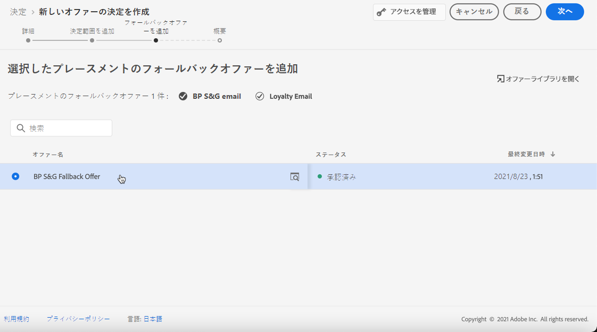

>[!NOTE]
>
>「**[!UICONTROL オファーライブラリを開く]**」リンクをクリックして、オファーのリストを新しいタブに表示できます。

## 決定のレビューと保存 {#review}

すべてが正しく設定されている場合は、決定プロパティの概要が表示されます。

1. 顧客にオファーを提示するために、決定を使用する準備ができていることを確認します。すべての決定範囲と、その中に含まれるフォールバックオファーが表示されます。

   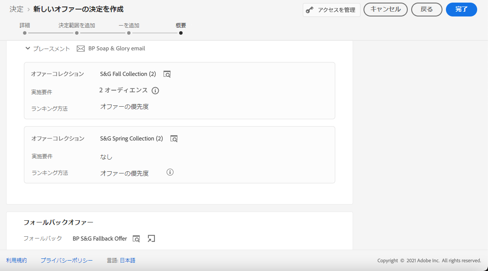

1. 各プレースメントを展開または折りたたむことができます。プレースメントごとに、使用可能なオファー、実施要件およびランキングの詳細をプレビューできます。また、推定認定プロファイルに関する情報を表示することもできます。「**[!UICONTROL 更新]**」をクリックして、データを更新します。

   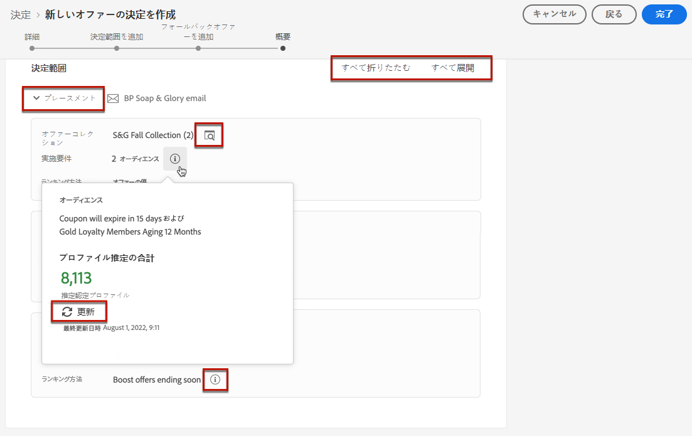

1. 「**[!UICONTROL 完了]**」をクリックします。
1. 「**[!UICONTROL 保存して有効化]**」を選択します。

   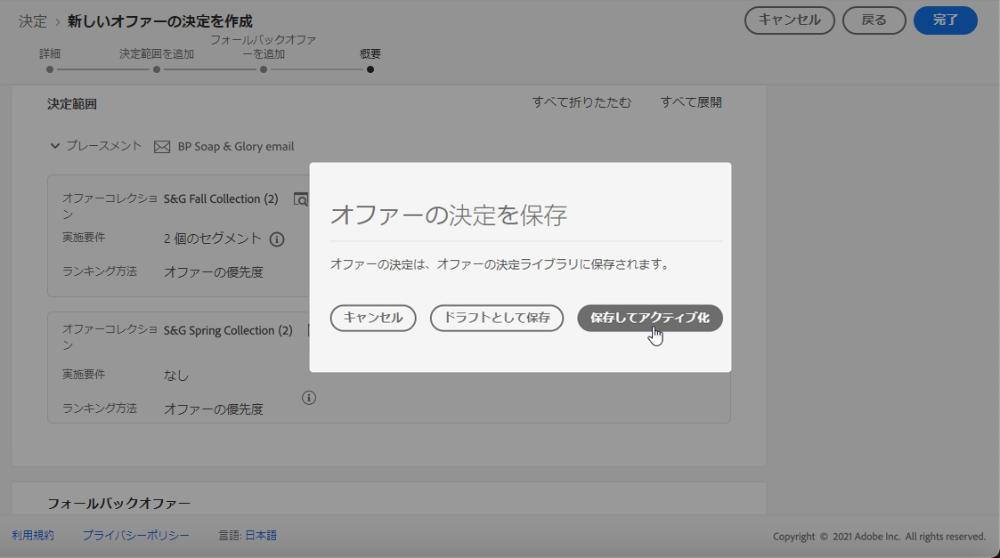

   また、決定をドラフトとして保存し、後で編集して有効にすることもできます。

決定は、前のステップで有効にしたかどうかに応じて、**[!UICONTROL ライブ]**&#x200B;または&#x200B;**[!UICONTROL ドラフト]**&#x200B;のステータスでリストに表示されます。

これで、顧客にオファーを提供するために決定を使用する準備が整いました。

## 決定リスト {#decision-list}

決定リストから決定を選択して、プロパティを表示できます。ここから編集したり、ステータス（**ドラフト**、**ライブ**、**完了**、**アーカイブ済み**）を変更したり、決定を複製したり、削除したりできます。

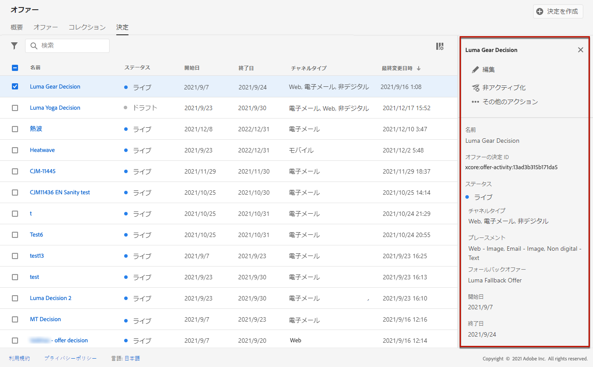

「**[!UICONTROL 編集]**」ボタンを選択して、決定編集モードに戻ります。このモードで、決定の[詳細](#create-activity)、[決定範囲](#add-decision-scopes)および[フォールバックオファー](#add-fallback)を変更できます。

>[!IMPORTANT]
>
>ジャーニーのメッセージで使用されるオファーの決定に変更が加えられた場合は、ジャーニーを非公開にして、再公開する必要があります。これにより、変更がジャーニーのメッセージに取り込まれ、メッセージが最新の更新と一致するようになります。

ライブ決定を選択し、「**[!UICONTROL 無効化]**」をクリックして、決定のステータスを&#x200B;**[!UICONTROL ドラフト]**&#x200B;に戻します。

ステータスを再度「**[!UICONTROL ライブ]**」に設定するには、表示されている「**[!UICONTROL 有効化]**」ボタンを選択します。

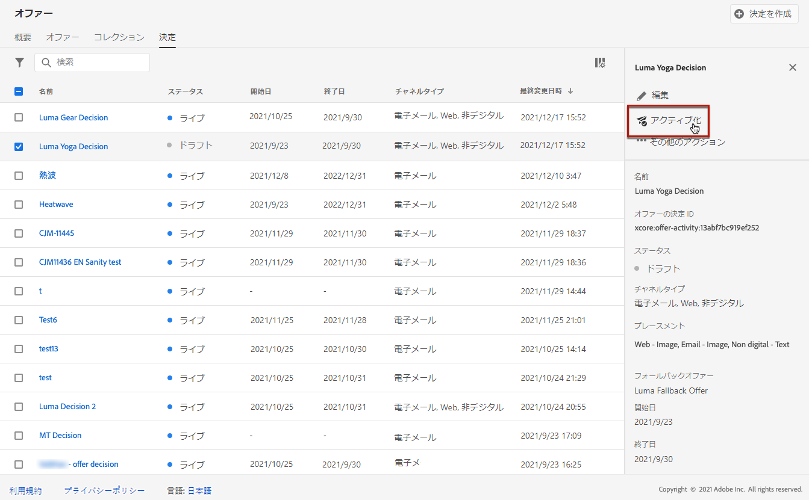

「**[!UICONTROL その他のアクション]**」ボタンをクリックすると、以下に示すアクションが有効になります。

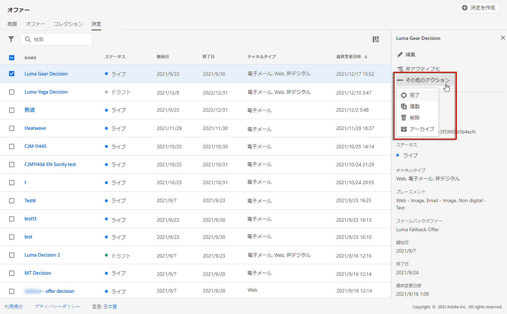

* **[!UICONTROL 完了]**：決定のステータスを&#x200B;**[!UICONTROL 完了]**&#x200B;に設定します。これは、決定を呼び出すことができなくなったことを意味します。このアクションは、有効化された決定に対してのみ使用できます。決定は引き続きリストから利用できますが、ステータスを&#x200B;**[!UICONTROL ドラフト]**&#x200B;または&#x200B;**[!UICONTROL 承認済み]**&#x200B;に戻すことはできません。複製、削除またはアーカイブのみが可能です。

* **[!UICONTROL 複製]**：同じプロパティ、決定範囲およびフォールバックオファーを持つ決定を作成します。デフォルトでは、新しい決定のステータスは&#x200B;**[!UICONTROL ドラフト]**&#x200B;になります。

* **[!UICONTROL 削除]**：決定をリストから削除します。

  >[!CAUTION]
  >
  >決定とその内容にアクセスできなくなります。このアクションは取り消せません。
  >
  >決定が別のオブジェクトで使用されている場合は、削除できません。

* **[!UICONTROL アーカイブ]**：決定のステータスを&#x200B;**[!UICONTROL アーカイブ済み]**&#x200B;に設定します。決定は引き続きリストから使用できますが、ステータスを&#x200B;**[!UICONTROL ドラフト]**&#x200B;または&#x200B;**[!UICONTROL 承認済み]**&#x200B;に戻すことはできません。複製または削除のみ可能です。

該当するチェックボックスを選択することで、複数の決定のステータスを同時に削除または変更することもできます。

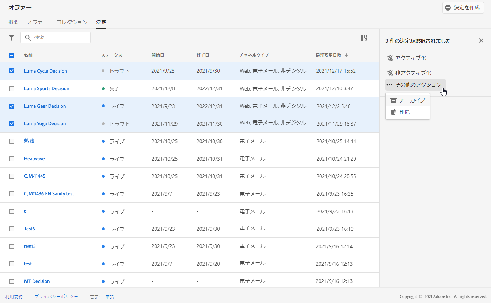

ステータスが異なる複数の決定のステータスを変更する場合は、関係のあるステータスのみが変更されます。

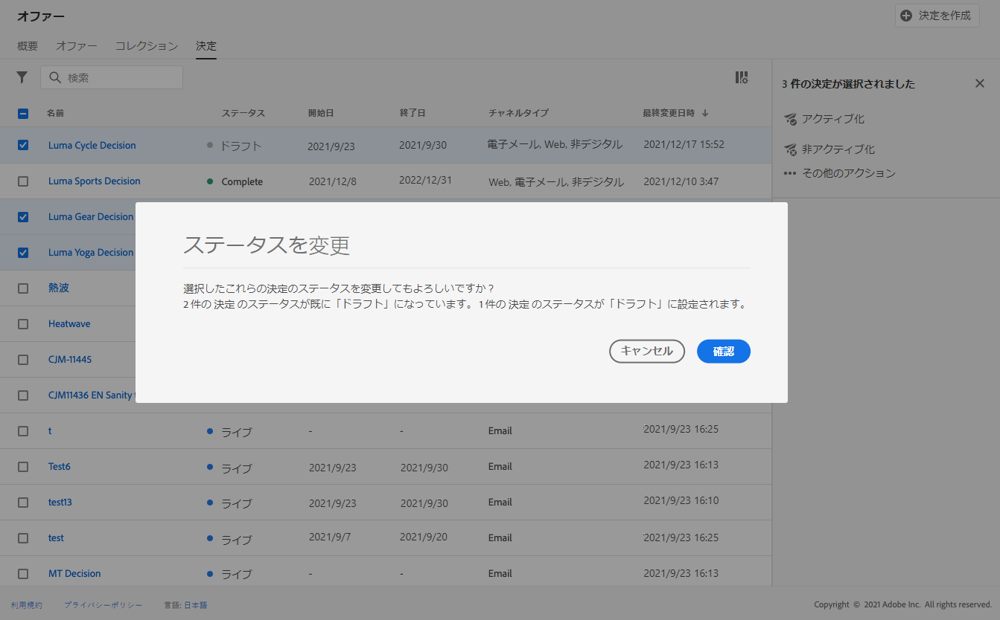

決定が作成されたら、その名前をリストからクリックできます。

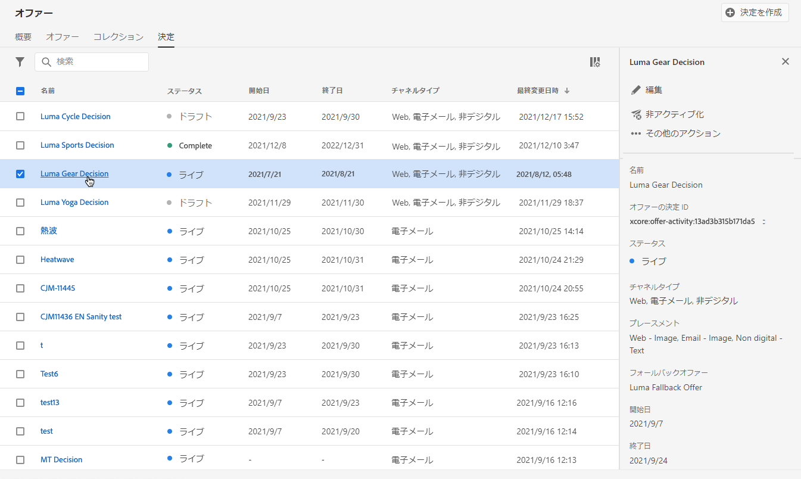

これにより、その決定の詳細情報にアクセスできます。「**[!UICONTROL 変更ログ]**」タブを選択して、決定に加えられた[すべての変更を監視](../get-started/user-interface.md#changes-log)します。

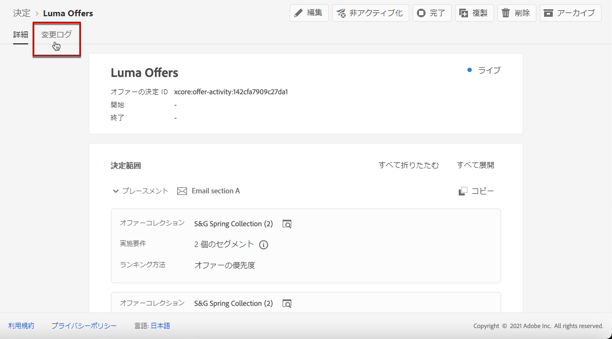

## チュートリアルビデオ{#video}

意思決定管理でオファーアクティビティを作成する方法を説明します。

>[!VIDEO](https://video.tv.adobe.com/v/329606?quality=12)

