# 決定の作成 {#create-offer-activities}

決定（旧称：オファーアクティビティ）はオファーのコンテナで、配信のターゲットに応じて、配信する最適なオファーを選ぶために Offer Decisioning エンジンを利用します。

➡️ [ビデオでこの機能を確認する](#video)

**[!UICONTROL オファー]**&#x200B;メニューの「**[!UICONTROL 決定]**」タブに決定が一覧表示されます。フィルターは、ステータスや開始日、終了日に応じて決定を取得するのに役立ちます。

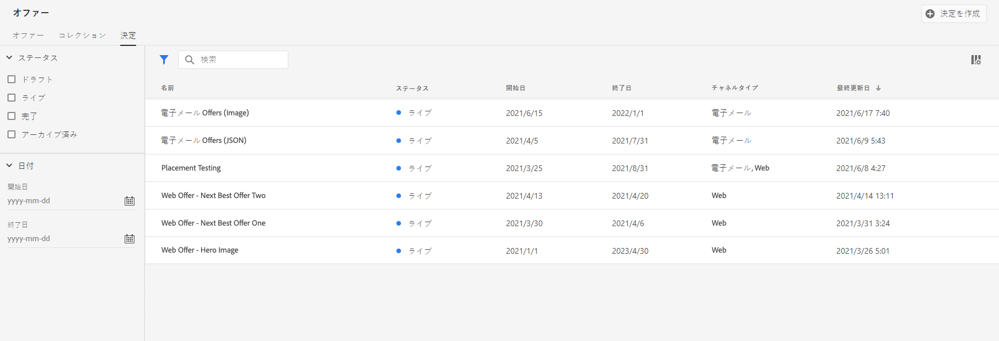

決定を作成する前に、以下のコンポーネントがオファーライブラリに作成されていることを確認してください。

* [プレースメント](../offer-library/creating-placements.md)
* [コレクション](../offer-library/creating-collections.md)
* [パーソナライズされたオファー](../offer-library/creating-personalized-offers.md)
* [フォールバックオファー](../offer-library/creating-fallback-offers.md)

## 決定の作成 {#create-activity}

1. 決定リストにアクセスし、「**[!UICONTROL 決定を作成]**」をクリックします。

1. 決定の名前を指定します。

1. 必要に応じて開始日時と終了日時を指定し、「**[!UICONTROL 次へ]**」をクリックします。

   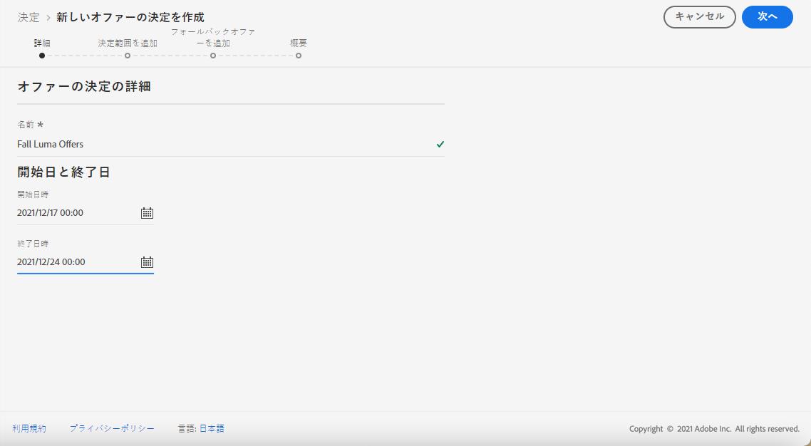

## 決定範囲の定義 {#add-decision-scopes}

1. ドロップダウンリストからプレースメントを選択します。これは、決定の最初の決定範囲に追加されます。

   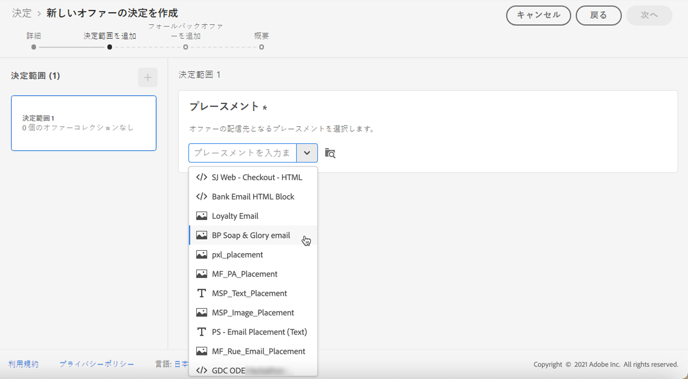

1. 「 **[!UICONTROL 追加]**」をクリックして、このプレースメントの評価条件を選択します。

   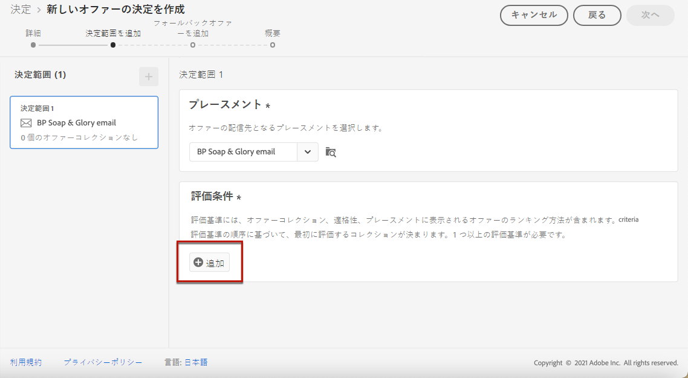

   各条件は、実施要件制約に関連付けられたオファーコレクションと、プレースメントに表示されるオファーを決定するためのランキング方法で構成されます。

   >[!NOTE]
   >
   >少なくとも 1 つの評価条件が必要です。

1. 考慮するオファーを含んだコレクションを選択し、「**[!UICONTROL 追加]**」をクリックします。

   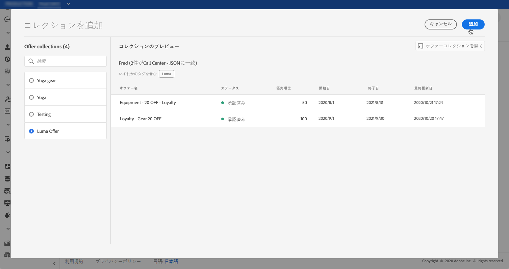

   >[!NOTE]
   >
   >「**[!UICONTROL オファーコレクションを開く]**」リンクをクリックすると、コレクションのリストが新しいタブに表示されます。ここで、コレクションとそれに含まれるオファーを参照できます。

   選択したコレクションが条件に追加されます。

   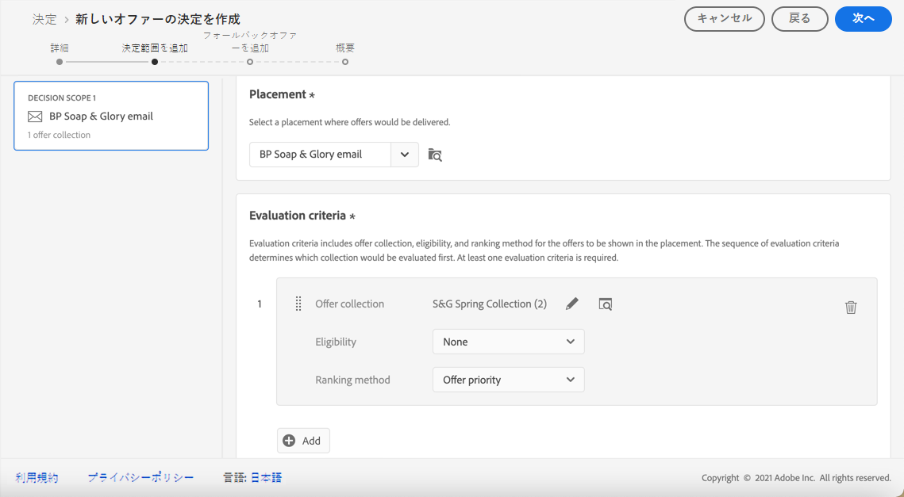

1. 「**[!UICONTROL 実施要件]**」フィールドを使用して、このプレースメントのオファーの選択を制限します。

   この制約は、**決定ルール**&#x200B;または 1 つ以上の **Adobe Experience Platform セグメント**&#x200B;を使用して適用できます。この両方について詳しくは、[この節](#segments-vs-decision-rules)を参照してください。

   * オファーの選択を Experience Platform セグメントのメンバーに限定するには、「**[!UICONTROL セグメント]**」を選択したあと、「**[!UICONTROL セグメントを追加]**」をクリックします。

      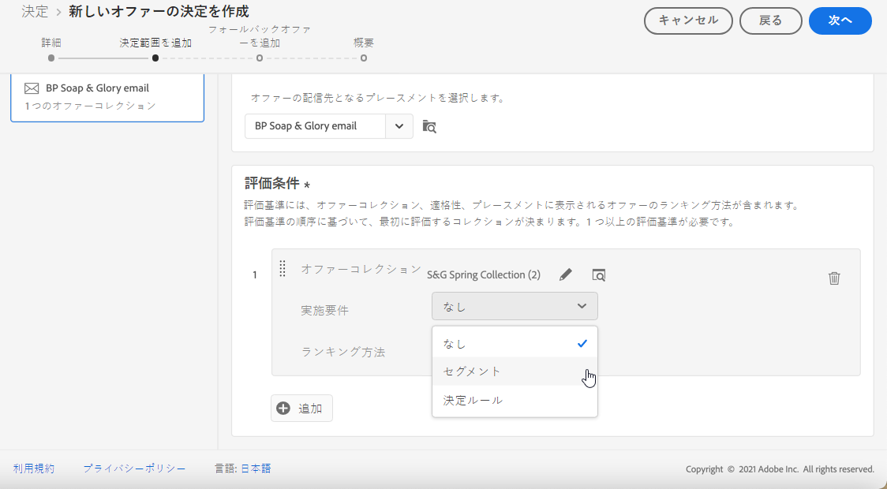

      左側のパネルから 1 つまたは複数のセグメントを追加し、 **[!UICONTROL かつ]**／**[!UICONTROL または]**&#x200B;論理演算子を使用してそれらのセグメントを組み合わせます。

      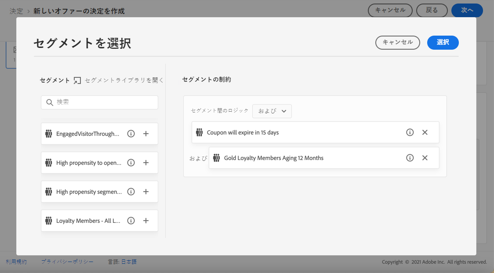

      セグメントの操作方法については、[この節](../../segment/about-segments.md)を参照してください。

   * 決定ルールに選択制約を追加する場合は、「**[!UICONTROL 決定ルール]**」オプションを使用し、任意のルールを選択します。

      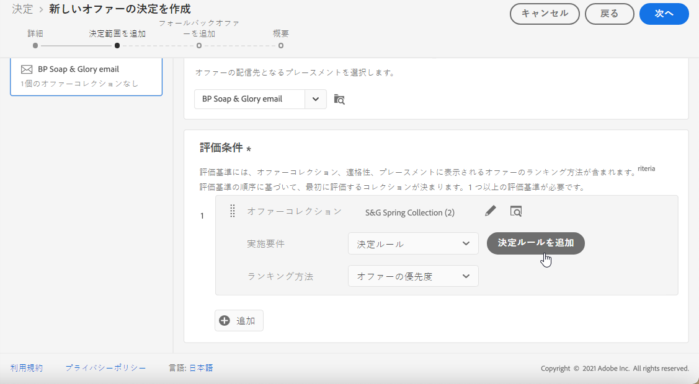

      決定ルールの作成方法については、 [この節](../offer-library/creating-decision-rules.md)を参照してください。

1. プロファイルごとに最適なオファーを選択するためのランキング方法を定義します。

   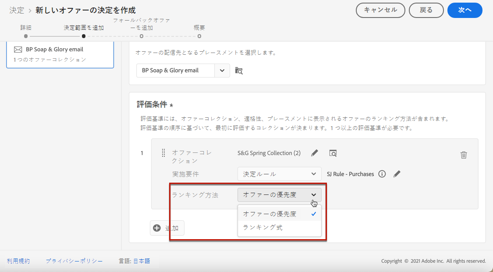

   * このプレースメントに対して実施要件を満たすオファーが複数ある場合、デフォルトでは、優先度スコアが最も高いオファーが顧客に配信されます。

   * 特定の数式を使用して、実施要件を満たす配信対象オファーを選択する場合は、「**[!UICONTROL ランキング式]**」を選択します。 オファーのランク付けの方法については、[この節](../offer-activities/configure-offer-selection.md)を参照してください。

1. 「**[!UICONTROL 追加]**」をクリックすると、同じプレースメントに対する条件をさらに定義できます。

   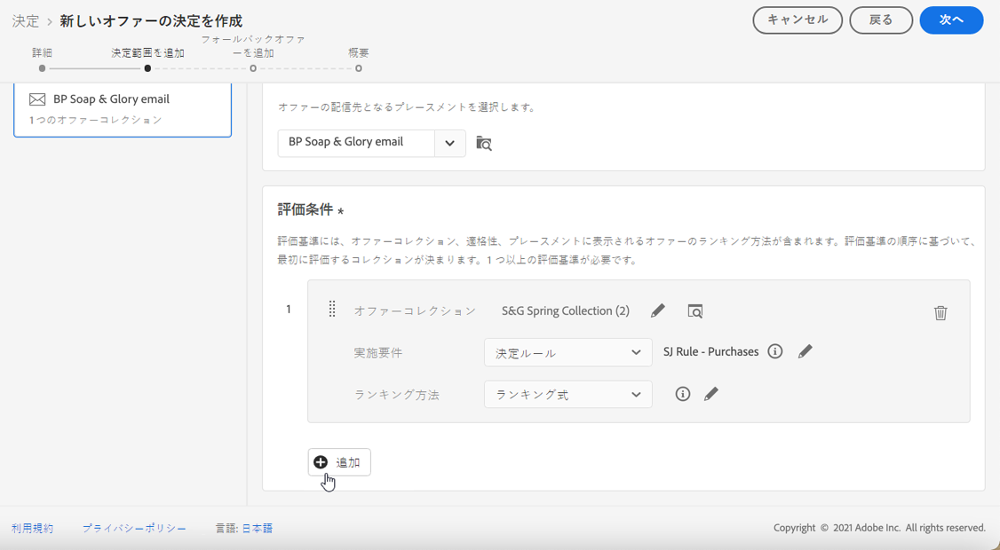

1. 複数の条件を追加した場合、それらは特定の順序で評価されます。シーケンスに最初に追加されたコレクションが最初に評価され、以下同様に評価されます。

   デフォルトの順序を変更するには、コレクションをドラッグ＆ドロップして、任意に並べ替えることができます。

   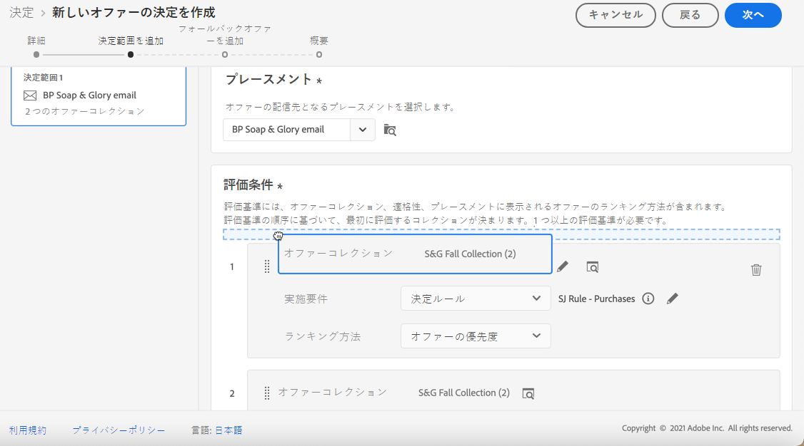

1. また、複数の条件を同時に評価することもできます。それには、コレクションを別のコレクションの上にドラッグ＆ドロップします。

   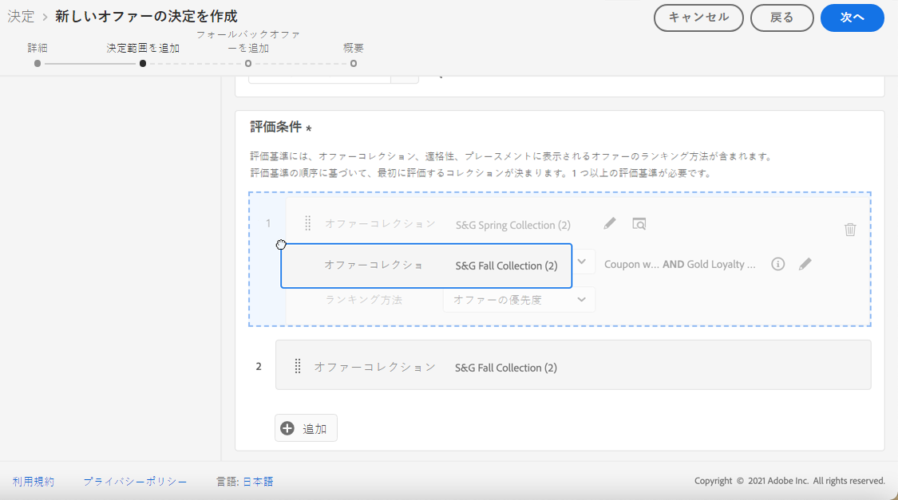

   これで同じランクになるので、これらは同時に評価されます。

   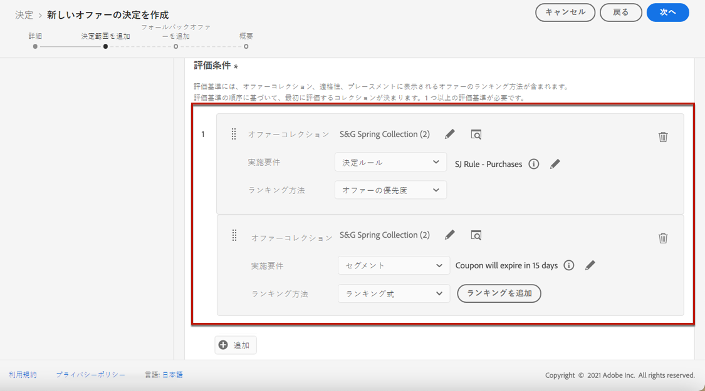

1. この決定の一部としてオファーに別のプレースメントを追加するには、「**[!UICONTROL 新しいスコープ]**」ボタンを使用します。決定範囲ごとに、上記の手順を繰り返します。

   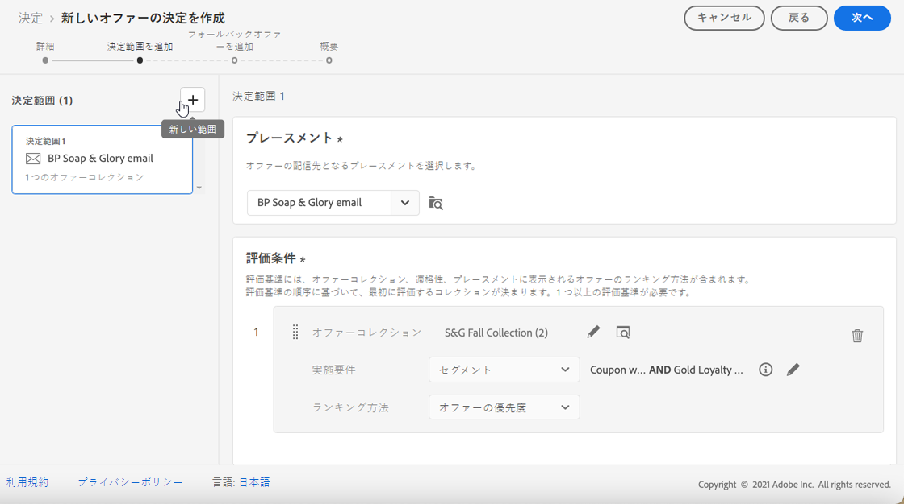

### セグメントと決定ルールの使用上の違い {#segments-vs-decision-rules}

<!--to move to create-offers?-->

制約を適用するには、1 つまたは複数の **Adobe Experience Platform セグメント**&#x200B;のメンバーにオファーの選択を限定するか、**決定ルール**&#x200B;を使用します。どちらの手段もそれぞれ異なる使用法に対応します。

基本的に、セグメントの出力はプロファイルのリストです。一方、決定ルールは、決定プロセス中に単一プロファイルに対してオンデマンドで実行される関数です。 この 2 つの使用法の違いを以下に詳しく説明します。

* **セグメント**

   セグメントは、プロファイル属性とエクスペリエンスイベントに基づく特定のロジックに一致する Adobe Experience Platform プロファイルのグループです。 ただし、オファー管理ではセグメントの再計算は行われないので、オファーを提示する際にセグメントが最新でない可能性があります。

   セグメントの詳細については、[この節](../../segment/about-segments.md)を参照してください。

* **決定ルール**

   一方、決定ルールは、Adobe Experience Platform で使用可能なデータに基づいており、オファーを誰に表示できるかを決定します。 特定のプレースメントのオファーまたは決定でルールが選択されると、決定が行われるたびにそのルールが実行されるので、各プロファイルが最新かつ最適なオファーを確実に取得できます。

   決定ルールについて詳しくは、[この節](../offer-library/creating-decision-rules.md)を参照してください。

## フォールバックオファーの追加 {#add-fallback}

決定範囲を定義したら、オファーの実施要件ルールと制約に一致しない顧客への最後の手段として提示されるフォールバックオファーを定義します。

それには、決定で定義されたプレースメントに使用可能なフォールバックオファーのリストから選択し、「**[!UICONTROL 次へ]**」をクリックします。

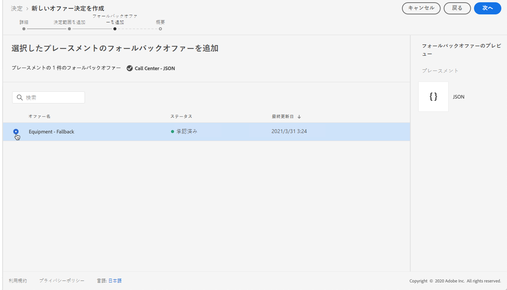

>[!NOTE]
>
>「**[!UICONTROL オファーライブラリを開く]**」リンクをクリックして、オファーのリストを新しいタブに表示できます。

## 決定のレビューと保存 {#review}

すべてが正しく設定されている場合は、決定プロパティの概要が表示されます。

1. 顧客にオファーを提示するために、決定を使用する準備ができていることを確認します。すべての決定範囲と、その中に含まれるフォールバックオファーが表示されます。

   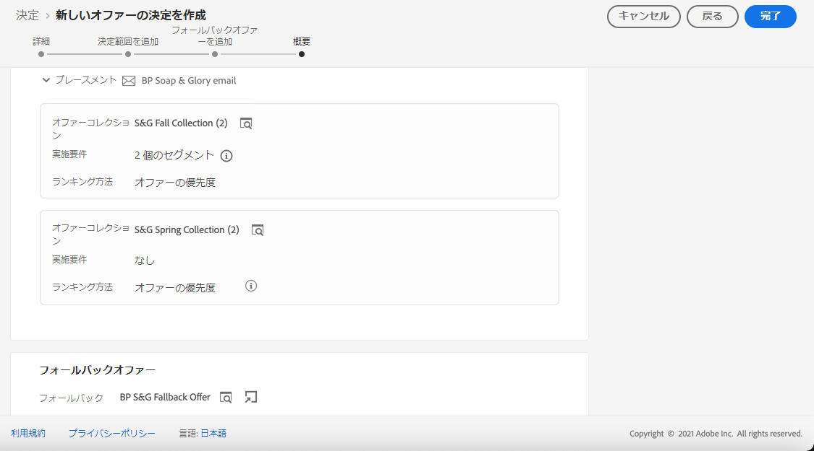

   各プレースメントを展開または折りたたむことができます。また、プレースメントごとに、使用可能なオファー、実施要件およびランキングの詳細をプレビューすることもできます。

   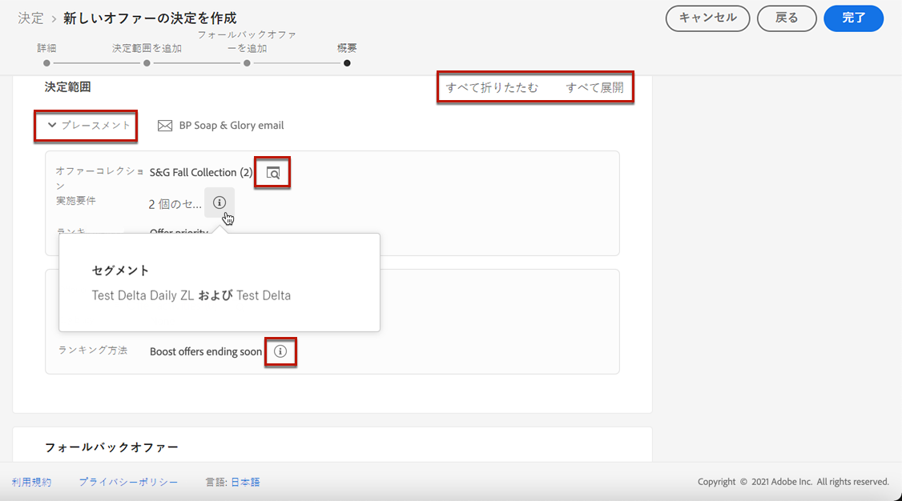

1. 「**[!UICONTROL 完了]**」をクリックします。
1. 「**[!UICONTROL 保存して有効化]**」を選択します。

   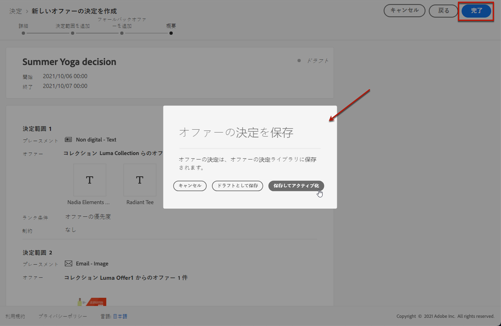

   また、決定をドラフトとして保存し、後で編集して有効にすることもできます。

決定は、前のステップで有効にしたかどうかに応じて、**[!UICONTROL ライブ]**&#x200B;または&#x200B;**[!UICONTROL ドラフト]**&#x200B;のステータスでリストに表示されます。

これで、顧客にオファーを提供するために決定を使用する準備が整いました。

## 決定リスト {#decision-list}

決定リストから決定を選択して、プロパティを表示できます。ここから編集したり、ステータス（**ドラフト**、**ライブ**、**完了**、**アーカイブ済み**）を変更したり、決定を複製したり、削除したりできます。

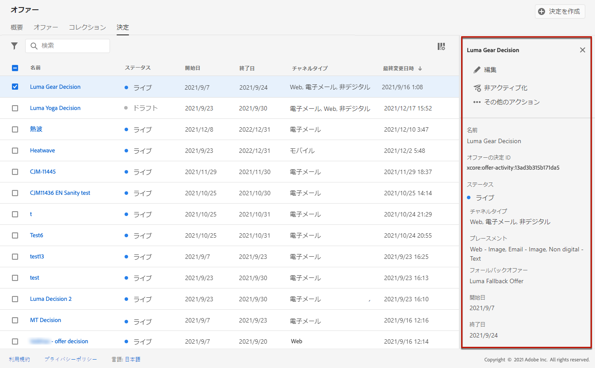

「**[!UICONTROL 編集]**」ボタンを選択して、決定編集モードに戻ります。このモードで、決定の[詳細](#create-activity)、[決定範囲](#add-decision-scopes)および[フォールバックオファー](#add-fallback)を変更できます。

ライブ決定を選択し、「**[!UICONTROL 無効化]**」をクリックして、決定のステータスを&#x200B;**[!UICONTROL ドラフト]**&#x200B;に戻します。

ステータスを再度「**[!UICONTROL ライブ]**」に設定するには、表示されている「**[!UICONTROL 有効化]**」ボタンを選択します。

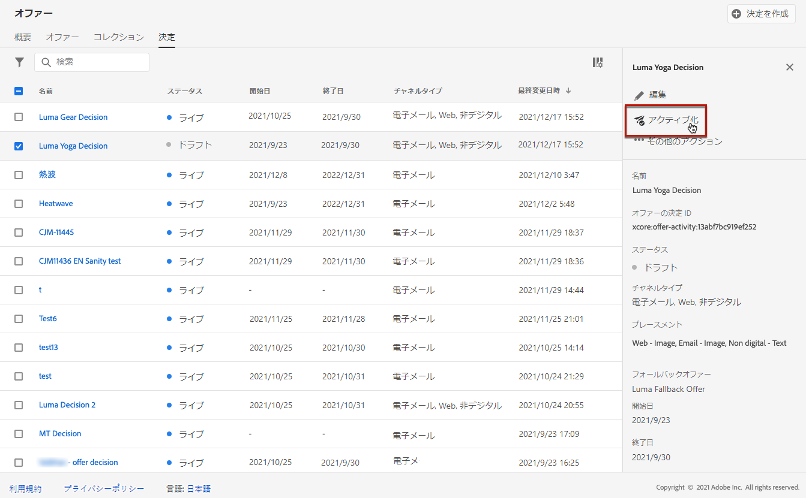

「**[!UICONTROL その他のアクション]**」ボタンをクリックすると、以下に示すアクションが有効になります。

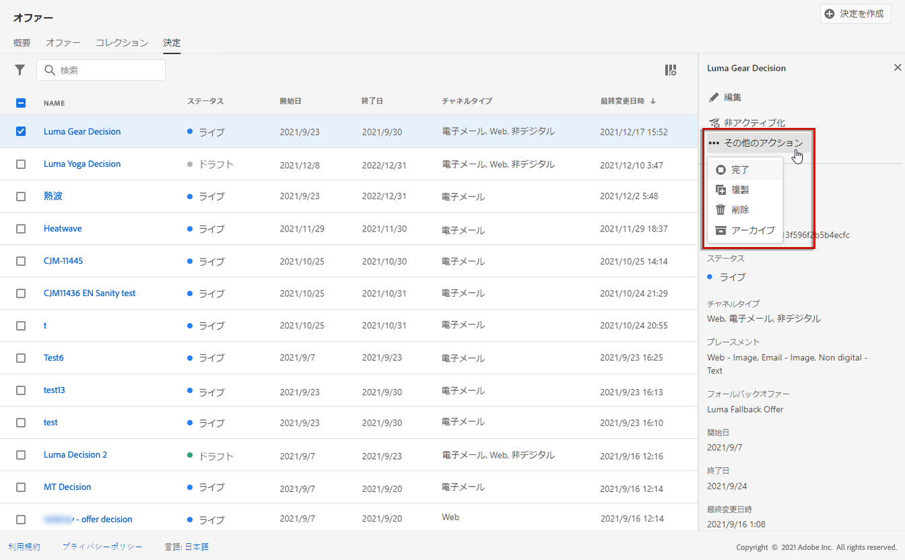

* **[!UICONTROL 完了]**：決定のステータスを&#x200B;**[!UICONTROL 完了]**&#x200B;に設定します。これは、決定を呼び出すことができなくなったことを意味します。このアクションは、有効化された決定に対してのみ使用できます。 決定は引き続きリストから利用できますが、ステータスを&#x200B;**[!UICONTROL ドラフト]**&#x200B;または&#x200B;**[!UICONTROL 承認済み]**&#x200B;に戻すことはできません。複製、削除またはアーカイブのみが可能です。

* **[!UICONTROL 複製]**：同じプロパティ、決定範囲およびフォールバックオファーを持つ決定を作成します。デフォルトでは、新しい決定のステータスは&#x200B;**[!UICONTROL ドラフト]**&#x200B;になります。

* **[!UICONTROL 削除]**：決定をリストから削除します。

   >[!CAUTION]
   >
   >決定とその内容にアクセスできなくなります。 このアクションは取り消しできません。
   >
   >決定が別のオブジェクトで使用されている場合は、削除できません。

* **[!UICONTROL アーカイブ]**：決定のステータスを&#x200B;**[!UICONTROL アーカイブ済み]**&#x200B;に設定します。決定は引き続きリストから使用できますが、ステータスを&#x200B;**[!UICONTROL ドラフト]**&#x200B;または&#x200B;**[!UICONTROL 承認済み]**&#x200B;に戻すことはできません。複製または削除のみ可能です。

該当するチェックボックスを選択することで、複数の決定のステータスを同時に削除または変更することもできます。

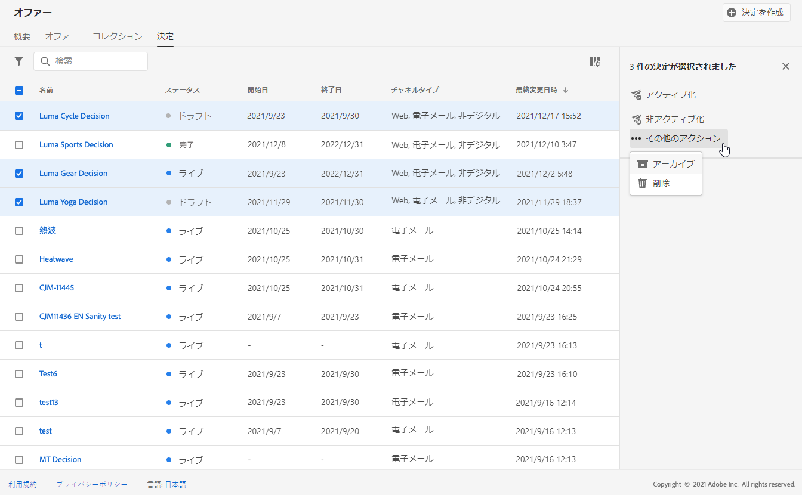

異なるステータスを持つ複数の決定のステータスを変更する場合は、関係のあるステータスのみ変更されます。

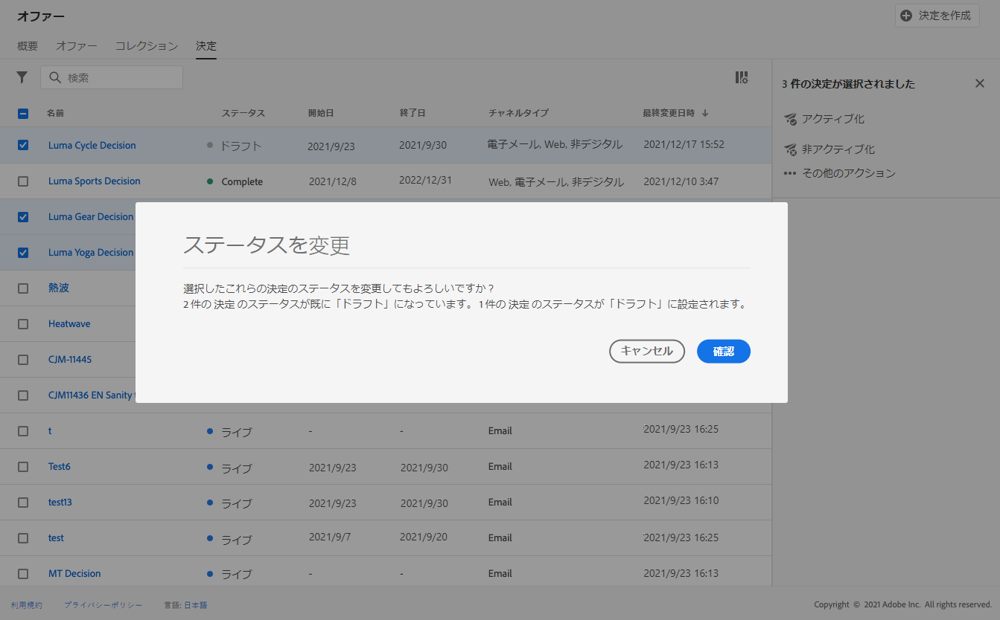

決定が作成されたら、その名前をリストからクリックできます。

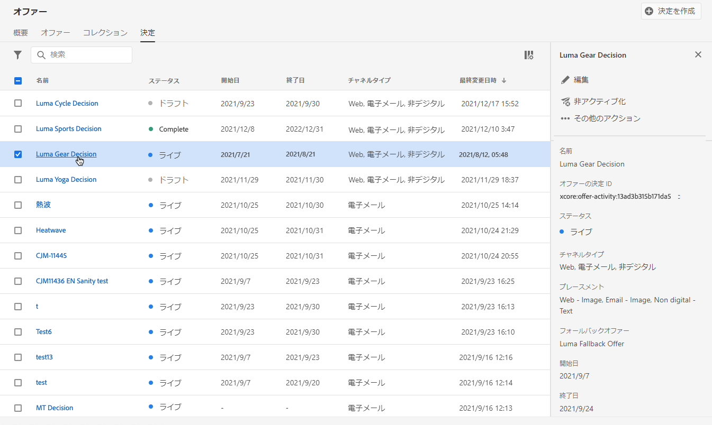

これにより、その決定の詳細情報にアクセスできます。「**[!UICONTROL 変更ログ]**」タブを選択して、決定に加えられた[すべての変更を監視](../get-started/user-interface.md#changes-log)します。

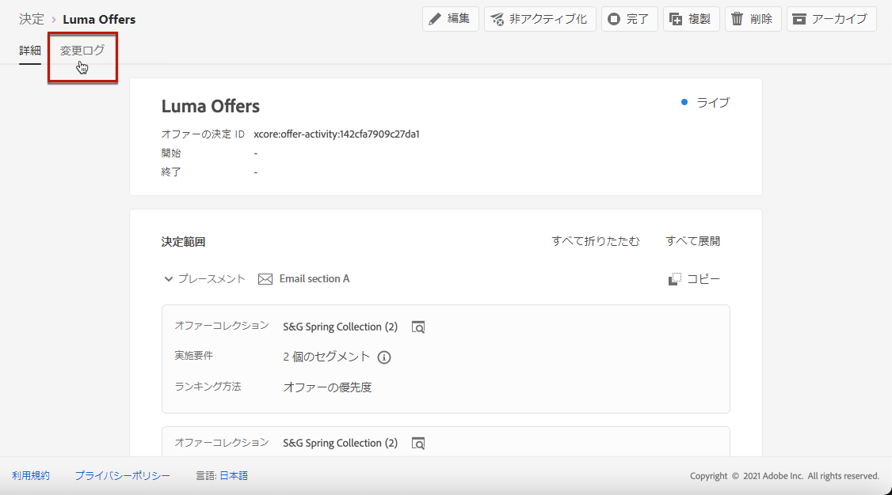

## チュートリアルビデオ {#video}

>[!NOTE]
>
>このビデオは、Adobe Experience Platformで構築された Offer Decisioning アプリケーションサービスに当てはまります。ただし、Journey Optimizer のコンテキストでオファーを使用する際の一般的なガイダンスを提供しています。

>[!VIDEO](https://video.tv.adobe.com/v/329606?quality=12)
