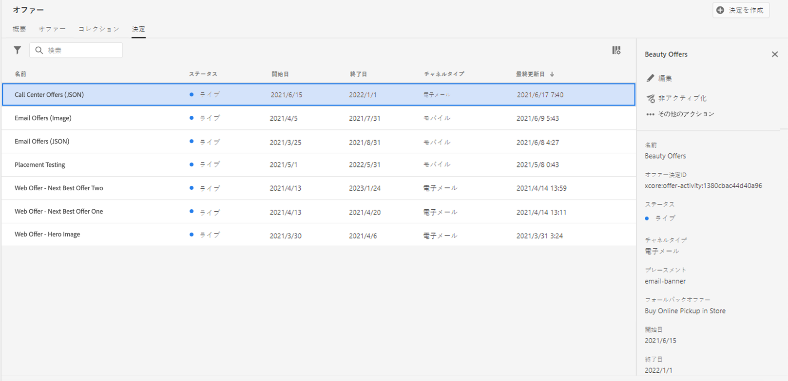

# 決定を作成{#create-offer-activities}

決定(旧称オファーアクティビティ)は、オファーのコンテナです。オファーのターゲットに応じて、提供する最適なオファーを選ぶために、配信決定エンジンを利用します。

 [この機能をビデオで確認](#video)

決定のリストは、**[!UICONTROL オファー]**&#x200B;メニュー/**[!UICONTROL 決定]**&#x200B;タブからアクセスできます。 フィルターは、ステータスや開始、終了日に応じた決定を取得するのに役立ちます。

決定を作成する前に、以下のコンポーネントがオファーライブラリに作成されていることを確認してください。

* [プレースメント](../offer-library/creating-placements.md),
* [コレクション](../offer-library/creating-collections.md),
* [パーソナライズされたオファー](../offer-library/creating-personalized-offers.md)
* [フォールバックオファー](../offer-library/creating-fallback-offers.md)

## 決定{#create-activity}を作成

1. 意思決定リストにアクセスし、[**[!UICONTROL アクティビティの作成]**]をクリックします。

1. 決定の名前と開始、終了日時を指定し、「**[!UICONTROL 次へ]**」をクリックします。

   

## 決定の追加 {#add-decisions}

1. リストから配置をドラッグ&amp;ドロップして決定に追加し、**[!UICONTROL 追加コレクション]**&#x200B;をクリックします。

   

1. 考慮するオファーを含んだコレクションを選択し、「**[!UICONTROL 追加]**」をクリックします。

   

1. 選択したオファーがプレースメントに追加されます。 この例では、コールセンターソリューションにオファーを提示することを目的とした JSON タイプのプレースメントに表示される 2 つのオファーを選択しました。

   

1. このプレースメントに対して、実施要件を満たすオファーが複数ある場合、デフォルトでは、優先度スコアが最も高いオファーが顧客に配信されます。

   実施要件を満たす配信対象オファーを特定の数式を使用して選択する場合は、**[!UICONTROL Rank offers by]** ドロップダウンリストからランキング式を選択します。詳しくは、[こちらの節](../offer-activities/configure-offer-selection.md)を参照してください。

1. 「**[!UICONTROL 制約]**」フィールドにより、このプレースメントのオファーの選択が制限されます。 この制約は、決定ルールまたは 1 つ以上の Adobe Experience Platform セグメントを使用して適用できます。

   オファーの選択を Adobe Experience Platform セグメントのメンバーに限定するには、「**[!UICONTROL セグメント]**」を選択し、「**[!UICONTROL セグメントを追加]**」をクリックします。

   

   左側のペインから 1 つまたは複数のセグメントを追加し、**[!UICONTROL かつ]**／**[!UICONTROL または]**&#x200B;論理演算子を使用してそれらを結合したあと、「**[!UICONTROL 選択]**」をクリックして確認します。

   セグメントの操作方法について詳しくは、[セグメンテーションサービスドキュメント](https://experienceleague.adobe.com/docs/experience-platform/segmentation/home.html?lang=ja)を参照してください。

   

   決定ルールを使用してこのプレースメントに選択制約を追加する場合は、「**[!UICONTROL 決定ルール]**」オプションを選択し、目的のルールを左ペインから「**[!UICONTROL 決定ルール]**」領域にドラッグします。 決定ルールの作成方法について詳しくは、[この節](../offer-library/creating-decision-rules.md)を参照してください。

   

## フォールバックオファーの追加 {#add-fallback}

オファーの実施要件ルールと制約に一致しない顧客に最後の手段として提示するフォールバックオファーを選択し、「**[!UICONTROL 次へ]**」をクリックします。

## 決定を確認して保存{#review}

すべてが正しく設定され、お客様にオファーを提示するための使用準備が整ったら、「**[!UICONTROL 完了]**」をクリックし、「**[!UICONTROL 保存して]**&#x200B;をアクティブにします。

また、後で編集してアクティブにするために、決定をドラフトとして保存することもできます。

この決定は、リストで&#x200B;**[!UICONTROL ライブ]**&#x200B;または&#x200B;**[!UICONTROL ドラフト]**&#x200B;のステータスと共に表示されます。状態は、前の手順でアクティブにしたかどうかによって異なります。

これで、顧客にオファーを提供するために使用する準備が整いました。オファーを選択してプロパティを表示できます。また、オファーを編集したり抑制したりできます。

オファーの提供について詳しくは、次の節を参照してください。

* [メッセージの追加パーソナライズされたオファー](../../deliver-personalized-offers.md)
* [APIを使用したオファーの配信](../api-reference/decisions-api/deliver-offers.md)

>[!NOTE]
>
>決定が作成されたら、リストで名前をクリックして詳細情報にアクセスし、**[!UICONTROL 変更ログ]**&#x200B;タブを使用して行った変更をすべて表示できます([オファーと変更ログ](../get-started/user-interface.md#changes-log)を参照)。

## チュートリアルビデオ {#video}

>[!NOTE]
>
>このビデオは、Adobe Experience Platformで構築されたOffer decisioningアプリケーションサービスに適用されます。 しかし、Journey Optimizerの状況でオファーを使用する際の一般的なガイダンスを提供しています。

>[!VIDEO](https://video.tv.adobe.com/v/329606?quality=12)
