# 意思決定の構築 {#create-offer-activities}

>[!TIP]
>
>[!DNL Adobe Journey Optimizer]の新しい決定機能である決定機能が、コードベースのエクスペリエンスとメールチャネルで利用できるようになりました。 [詳細情報](../../experience-decisioning/gs-experience-decisioning.md)

決定とは、配信のターゲットに応じて、配信する最適なオファーを選択するために、オファー決定エンジンを活用するオファーのコンテナです。

➡️ [&#x200B; オファーアクティビティの作成方法については、このビデオをご覧ください](#video)

決定のリストには、**[!UICONTROL オファー]** メニュー/**[!UICONTROL 決定]** タブからアクセスできます。 フィルターを使用すると、ステータスまたは開始日と終了日に応じて決定を取得できます。

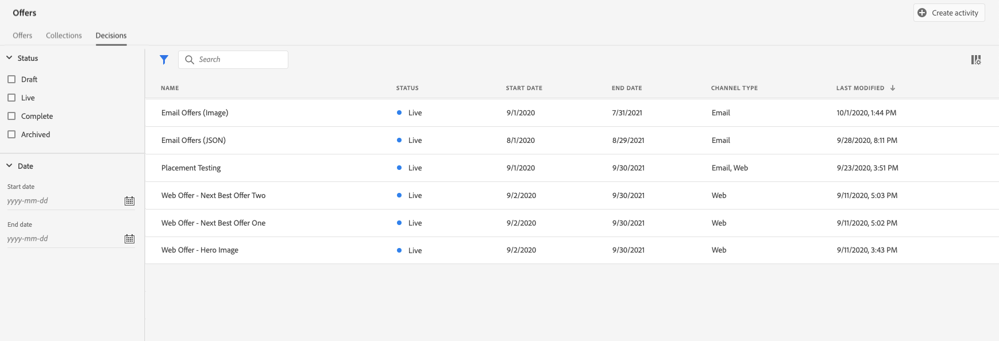

決定を作成する前に、次のコンポーネントがオファーライブラリに作成されていることを確認します。

* [配置](../offer-library/creating-placements.md)
* [コレクション](../offer-library/creating-collections.md)
* [パーソナライズされたオファー](../offer-library/creating-personalized-offers.md)
* [フォールバックオファー](../offer-library/creating-fallback-offers.md)

## 決定の策定 {#create-activity}

>[!CONTEXTUALHELP]
>id="ajo_decisioning_decision_details"
>title="オファー決定詳細"
>abstract="決定の名前を指定し、必要に応じて開始日時と終了日時を定義します。 カスタムまたはコアのデータ使用ラベルを決定に割り当てるには、**[!UICONTROL アクセスの管理]**&#x200B;を選択します。"

1. 決定リストにアクセスし、**[!UICONTROL 決定を作成]**&#x200B;をクリックします。

1. 決定の名前を指定します。

1. 必要に応じて開始日時と終了日時を定義し、**[!UICONTROL 次へ]**&#x200B;をクリックします。

   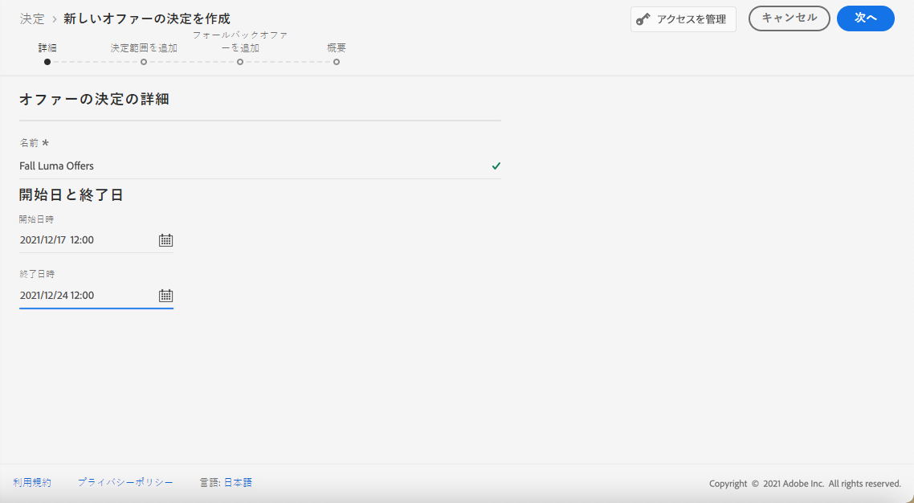

1. カスタムまたはコアのデータ使用ラベルを決定に割り当てるには、**[!UICONTROL アクセスの管理]**&#x200B;を選択します。 [&#x200B; オブジェクトレベルのアクセス制御（OLAC）について詳しく見る](../../administration/object-based-access.md)

## 決定範囲の定義 {#add-decision-scopes}

>[!CONTEXTUALHELP]
>id="ajo_decisioning_decision_scopes"
>title="決定範囲"
>abstract="表示するオファーを決定するオファー決定用の1つまたは複数の範囲を設定します。 これは、このプレースメントのプレースメントと関連する評価基準を選択することによって行われます。"

>[!CONTEXTUALHELP]
>id="ajo_decisioning_decision_placement"
>title="配置"
>abstract="オファーを配信するプレースメントを選択します。"

>[!CONTEXTUALHELP]
>id="ajo_decisioning_decision_evaluation"
>title="評価基準"
>abstract="評価基準は、適格性制約に関連付けられたオファーコレクションと、プレースメントに表示するオファーを決定するランキング方法で構成されます。 評価基準の順序によって、最初に評価するコレクションが決まります。 少なくとも1つの評価基準が必要です。"

1. ドロップダウンリストからプレースメントを選択します。 決定の最初の決定範囲に追加されます。

   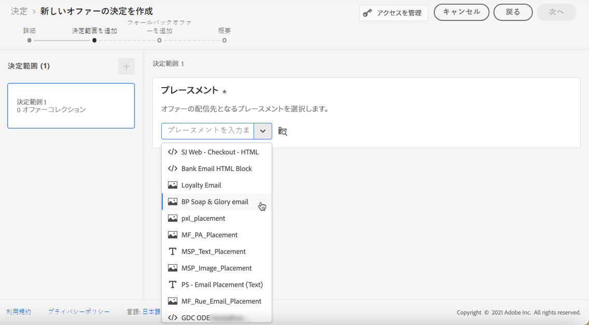

1. 「**[!UICONTROL 追加]**」をクリックして、このプレースメントの評価条件を選択します。

   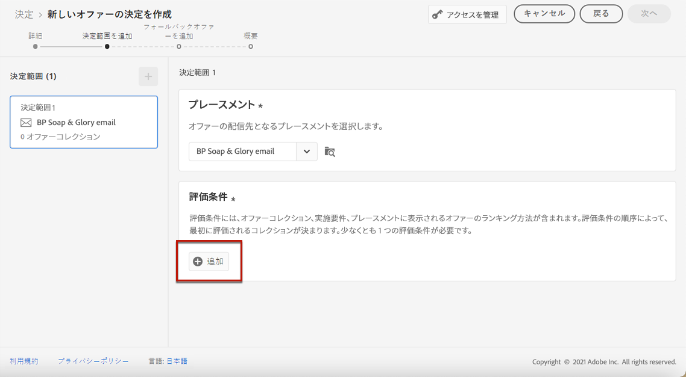

   各条件は、適格性制約に関連付けられたオファーコレクションと、プレースメントに表示するオファーを決定するランキング方法で構成されます。

   >[!NOTE]
   >
   >少なくとも1つの評価基準が必要です。

1. 検討するオファーを含むオファーコレクションを選択し、**[!UICONTROL 追加]**&#x200B;をクリックします。

   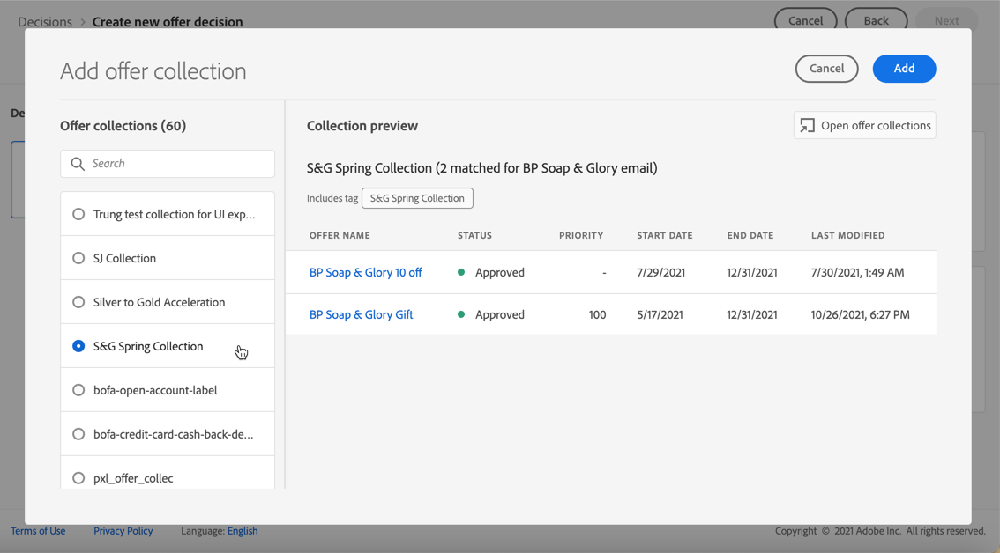

   >[!NOTE]
   >
   >「**[!UICONTROL オファーコレクションを開く]**」リンクをクリックすると、コレクションのリストを新しいタブに表示できます。このタブを使用すると、コレクションとそのコレクションに含まれるオファーを参照できます。

   選択したコレクションが基準に追加されます。

   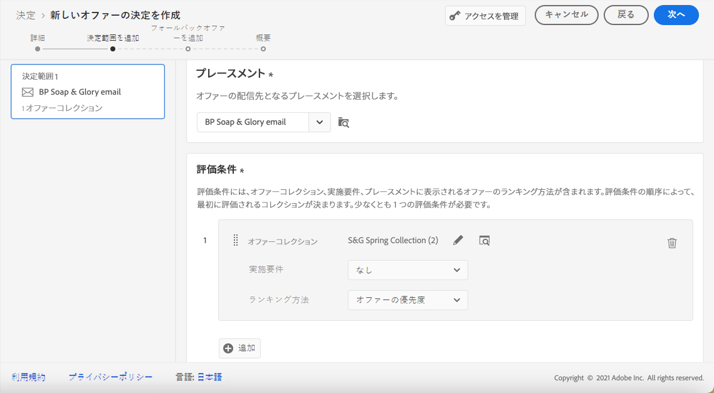

1. このプレースメントのオファーの選択を制限するには、**[!UICONTROL 実施要件]** フィールドを使用します。

   この制約は、**決定ルール**、または1つまたは複数の&#x200B;**Adobe Experience Platform オーディエンス**&#x200B;を使用して適用できます。 両方について詳しくは、[このセクション &#x200B;](../offer-library/add-constraints.md#segments-vs-decision-rules)を参照してください。

   * オファーの選択範囲をExperience Platform オーディエンスのメンバーに限定するには、「**[!UICONTROL オーディエンス]**」を選択し、「**[!UICONTROL オーディエンスを追加]**」をクリックします。

     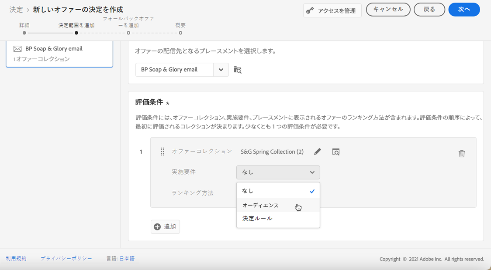

     左側のペインから1つまたは複数のオーディエンスを追加し、**[!UICONTROL And]** / **[!UICONTROL Or]**&#x200B;論理演算子を使用して組み合わせます。

     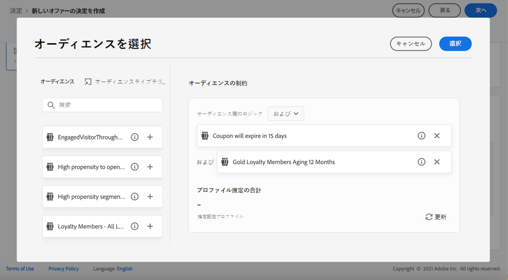

     [このセクション &#x200B;](../../audience/about-audiences.md)で、オーディエンスの操作方法について説明します。

   * 決定ルールで選択制約を追加する場合は、**[!UICONTROL 決定ルール]** オプションを使用して、選択したルールを選択します。

     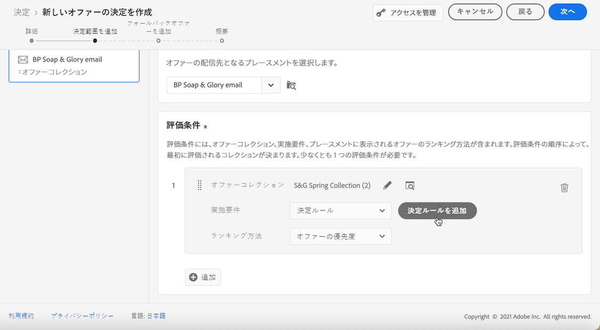

     決定ルールの作成方法については、[このセクション &#x200B;](../offer-library/creating-decision-rules.md)を参照してください。

1. オーディエンスまたは決定ルールを選択すると、推定された適格プロファイルに関する情報が表示されます。 「**[!UICONTROL 更新]**」をクリックしてデータを更新します。

   >[!NOTE]
   >
   >プロファイルの見積もりは、ルールパラメーターにコンテキストデータなどのプロファイルに含まれていないデータが含まれている場合は使用できません。 例えば、現在の天気を≥80度にする必要がある条件ルールがあります。

   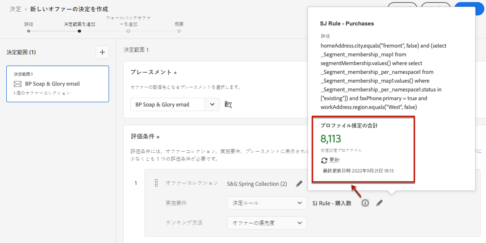

1. 各プロファイルに最適なオファーを選択するために使用するランキング方法を定義します。 [詳細情報](../offer-activities/configure-offer-selection.md)。

   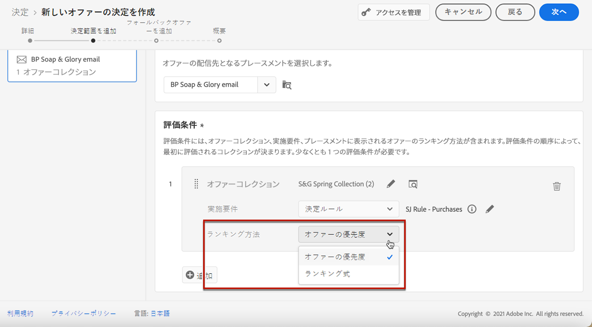

   * デフォルトでは、複数のオファーがこのプレースメントの対象となる場合、**[!UICONTROL オファー優先度]** メソッドは、オファーで定義された値を使用します。優先度スコアが最も高いオファーは、ユーザーに配信されます。

   * 特定の計算スコアを使用して、配信する対象オファーを選択する場合は、**[!UICONTROL 式]**&#x200B;または&#x200B;**[!UICONTROL AI モデル]**&#x200B;を選択します。 [詳細情報](../offer-activities/configure-offer-selection.md)。

1. 「**[!UICONTROL 追加]**」をクリックして、同じプレースメントの条件をさらに定義します。

   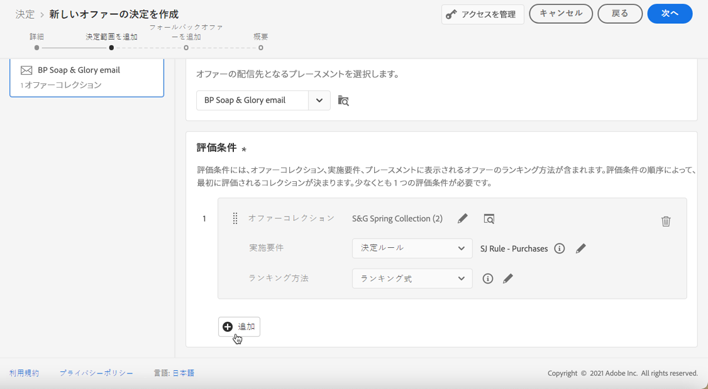

1. 複数の基準を追加すると、特定の順序で評価されます。 シーケンスに追加された最初のコレクションが最初に評価されます。 [詳細情報](#evaluation-criteria-order)

   デフォルトシーケンスを変更するには、コレクションをドラッグ&amp;ドロップして、必要に応じて並べ替えることができます。

   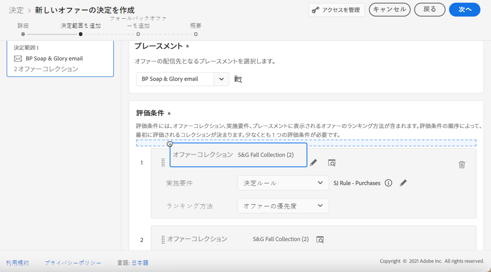

1. 複数の基準を同時に評価することもできます。 これを行うには、コレクションを別のコレクションの上にドラッグ&amp;ドロップします。

   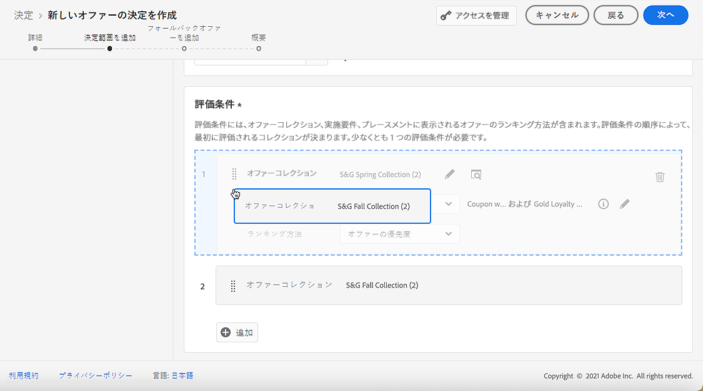

   彼らは今、同じランクを持っているので、同時に評価されます。 [詳細情報](#evaluation-criteria-order)

   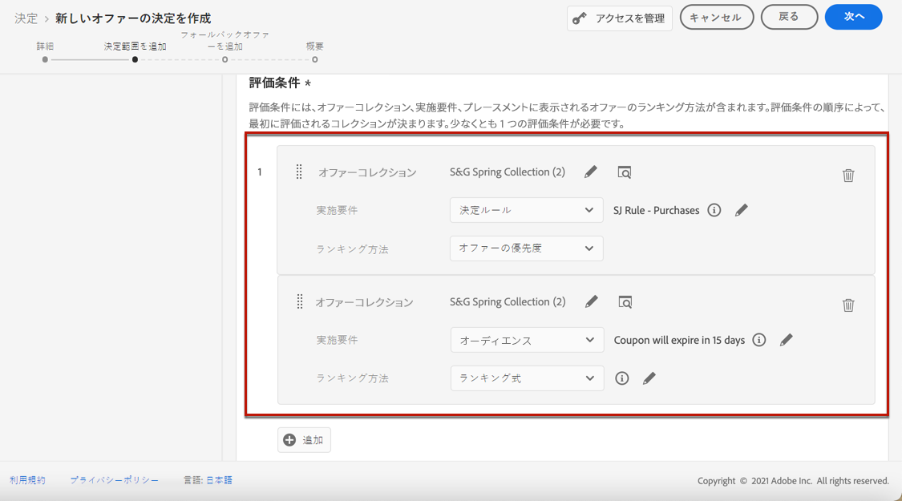

   >[!CAUTION]
   >
   >* [AI モデル &#x200B;](../ranking/ai-models.md)が評価基準グループで使用されている場合、そのグループ内のすべての評価基準でAI ランキング方法を使用する必要があり、同じ特定のAI モデルを使用する必要があります。
   >
   >* AI モデルを使用できる評価基準グループは1つだけです。 決定範囲内のその他のグループは、他のランキング方法（優先度または数式）を使用する必要があります。 [&#x200B; ランキング方法について詳しく見る](../offer-activities/configure-offer-selection.md)

1. この決定の一環としてオファーに別のプレースメントを追加するには、**[!UICONTROL 新しい範囲]** ボタンを使用します。 各決定範囲について、上記の手順を繰り返します。

   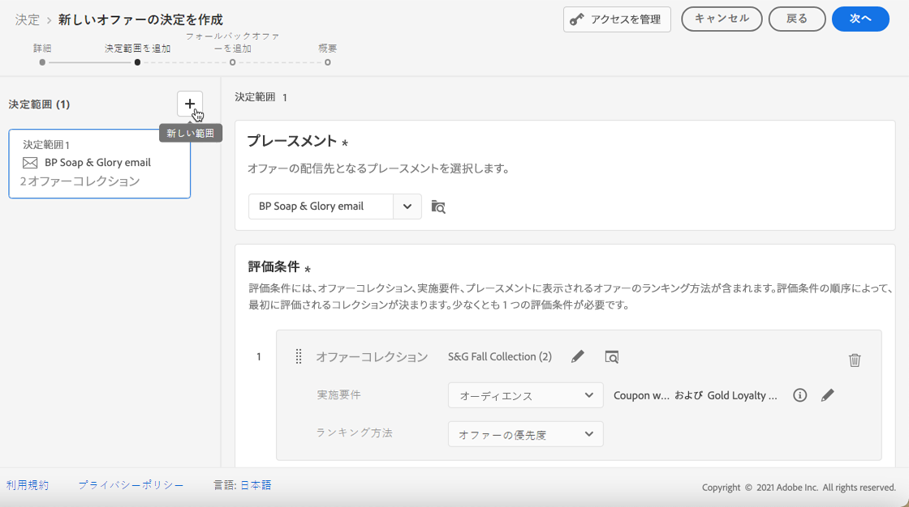

   >[!NOTE]
   >
   >複数の決定範囲を追加する場合、評価基準の順序が影響を受けます。 [詳細情報](#multiple-scopes)

### 評価基準の順序 {#evaluation-criteria-order}

上述したように、評価基準は、コレクション、適格性制約、ランキング方法で構成されます。 評価基準を評価する順序付けを設定できますが、複数の評価基準を組み合わせて評価し、個別に評価しないようにすることもできます。

#### ひとつの範囲で {#one-scope}

単一の決定範囲では、複数の基準とそのグループ化によって、条件の優先順位と対象となるオファーのランキングが決まります。 最初の基準は最優先度が高く、同じ「グループ」内で組み合わされた基準は同じ優先度を持ちます。

例えば、評価基準Aと評価基準Bの2つのコレクションがあります。リクエストは、2つのオファーを送り返すことです。 評価基準Aから2つの適格なオファーと、評価基準Bから3つの適格なオファーがあるとします。

* 2つの評価条件が&#x200B;**結合されていない**&#x200B;または順序付き（1および2）の場合、評価条件の上位2つの実施要件を満たすオファーが1行目に返されます。 最初の評価基準に対して2つの実施要件を満たすオファーがない場合、決定エンジンは次の評価基準に順番に進み、まだ必要なオファー数を見つけ、最終的に必要に応じてフォールバックを返します。

  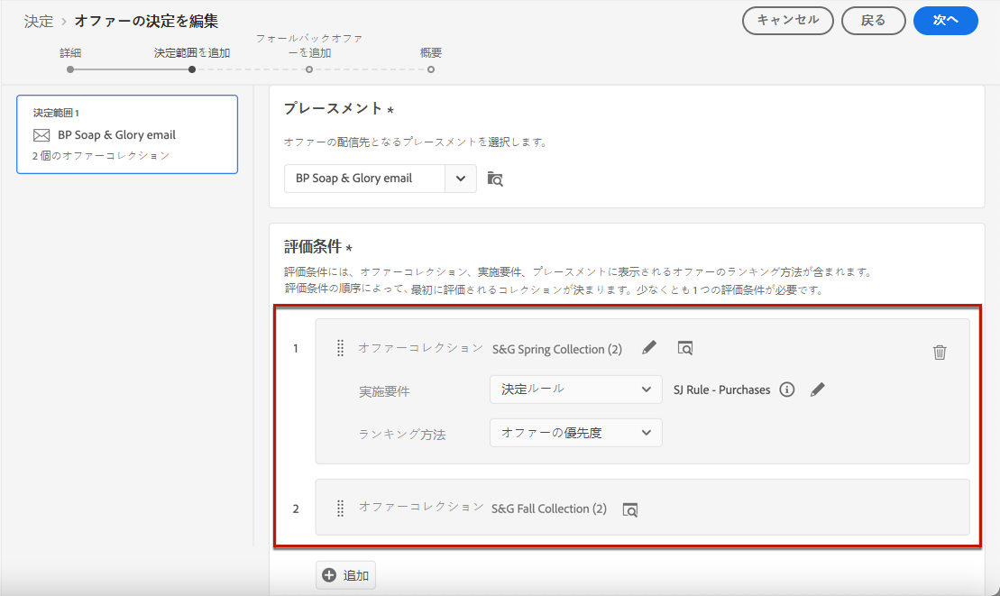

* 2つのコレクションが同時に&#x200B;**評価される場合**、評価条件Aから2つの実施要件を満たすオファーと評価条件Bから3つの実施要件を満たすオファーが存在する場合、5つのオファーはすべて、それぞれのランキング方法で決定された値に基づいてスタックされます。 2つのオファーがリクエストされるので、これらの5つのオファーの上位2つの対象オファーが返されます。

  

+++ **複数の条件を持つ例**

次に、1つのスコープに対して複数の基準があり、それらを異なるグループに分けた例を考えてみましょう。

3つの基準を定義しました。 基準1と基準2はグループ 1で結合され、基準3は独立しています（グループ 2）。

各条件の対象となるオファーとその優先順位（ランキング関数評価で使用）は次のとおりです。

* グループ 1:
   * 条件1 - （オファー1、オファー2、オファー3） – 優先度1
   * 条件2 - （オファー3、オファー4、オファー5） – 優先度1

* グループ 2:
   * 条件3 - （オファー5、オファー6） – 優先度0

最も優先度の高い基準のオファーが最初に評価され、ランク付けされたオファーリストに追加されます。

**反復1:**

条件1と条件2のオファーは一緒に評価されます（オファー1、オファー2、オファー3、オファー4、オファー5）。 結果は次のようになります。

オファー1 - 10
オファー2 - 20
条件1では3～30を、条件2では45を提供します。 両方の最高が考慮されるので、45が考慮されます。
オファー4 - 40
オファー5 - 50

オファー5、オファー3、オファー4、オファー2、オファー1がランク付けされました。

**反復2:**

条件3のオファーが評価されます（オファー5、オファー6）。 結果は次のようになります。

* オファー5 – 上記の結果に既に存在するため、評価されません。
* オファー6 - 60

ランク付けされたオファーは、オファー5、オファー3、オファー4、オファー2、オファー1、オファー6です。

+++

#### 複数のスコープを持つ {#multiple-scopes}

**重複が無効な場合**

決定に複数の決定範囲を追加し、プレースメント間で重複が許可されない場合、実施要件を満たすオファーは、リクエストの決定範囲の順序に従って順次選択されます。

>[!NOTE]
>
>**[!UICONTROL プレースメント間で重複を許可]** パラメーターは、プレースメントレベルで設定されます。 決定リクエストのプレースメントに対して重複がfalseに設定されている場合、リクエスト内のすべてのプレースメントはfalse設定を継承します。 [複製パラメーターの詳細](../offer-library/creating-placements.md)

次に、2つの決定範囲を追加した例を示します。

* スコープ 1：対象となるオファーは4つあり（オファー1、オファー2、オファー3、オファー4）、2つのオファーが返送されます。
* スコープ 2：対象となるオファーは4つあり（オファー1、オファー2、オファー3、オファー4）、2つのオファーが返送されます。

+++ **例1**

選択範囲は次のとおりです。

1. スコープ 1の対象となる上位2つのオファー（オファー1、オファー2）が返されます。
1. スコープ 2の対象となる残りの上位2つのオファー（オファー3、オファー4）が返されます。

+++

+++ **例2**

この例では、オファー1は頻度キャップの制限に達しました。 [頻度の上限について詳しく見る](../offer-library/add-constraints.md#capping)

選択範囲は次のとおりです。

1. スコープ 1の残りの上位2つの実施要件を満たすオファー（オファー2、オファー3）が返されます。
1. スコープ 2の対象となる残りのオファーが返されます（オファー4）。

+++

+++ **例3**

この例では、オファー1とオファー3は使用頻度の上限に達しました。 [頻度の上限について詳しく見る](../offer-library/add-constraints.md#capping)

選択範囲は次のとおりです。

1. スコープ 1の残りの上位2つの実施要件を満たすオファーが返されます（オファー2、オファー4）。
1. スコープ 2の対象となる残りのオファーはないため、[&#x200B; フォールバックオファー](#add-fallback)が返されます。

+++

**重複が**&#x200B;にある場合

すべてのプレースメントで重複が許可されている場合、異なるプレースメントで同じオファーを複数回提案できます。 有効にすると、複数のプレースメントに対して同じオファーが考慮されます。 [複製パラメーターの詳細](../offer-library/creating-placements.md)

上記と同じ例で、次のような2つの決定範囲を追加しました。

* スコープ 1：対象となるオファーは4つあり（オファー1、オファー2、オファー3、オファー4）、2つのオファーが返送されます。
* スコープ 2：対象となるオファーは4つあり（オファー1、オファー2、オファー3、オファー4）、2つのオファーが返送されます。

+++ **例1**

選択範囲は次のとおりです。

1. スコープ 1の対象となる上位2つのオファー（オファー1、オファー2）が返されます。
1. スコープ 2の対象となる上位2つのオファー（オファー1、オファー2）が返されます。

+++

+++ **例2**

この例では、オファー1は頻度キャップの制限に達しました。 [頻度の上限について詳しく見る](../offer-library/add-constraints.md#capping)

選択範囲は次のとおりです。

1. スコープ 1の残りの上位2つの実施要件を満たすオファー（オファー2、オファー3）が返されます。

1. スコープ 2の対象となる残りの上位2つのオファー（オファー2、オファー3）が返されます。

+++

+++ **例3**

この例では、オファー1とオファー3は使用頻度の上限に達しました。 [頻度の上限について詳しく見る](../offer-library/add-constraints.md#capping)

選択範囲は次のとおりです。

1. スコープ 1の残りの上位2つの実施要件を満たすオファーが返されます（オファー2、オファー4）。

1. スコープ 2の対象となる残りの上位2つのオファー（オファー2、オファー4）が返されます。

+++

## フォールバックオファーの追加 {#add-fallback}

>[!CONTEXTUALHELP]
>id="ajo_decisioning_decision_fallback"
>title="フォールバックオファーの追加"
>abstract="決定範囲を定義したら、オファーの実施要件ルールと制約に一致しない顧客に対する最後の手段として表示されるフォールバックオファーを定義します。"

決定範囲を定義したら、オファーの実施要件ルールと制約に一致しない顧客に対する最後の手段として表示される[&#x200B; フォールバックオファー](../offer-library/creating-fallback-offers.md)を定義します。

これを行うには、決定で定義されたプレースメントに対して使用可能なフォールバックオファーのリストから選択します。

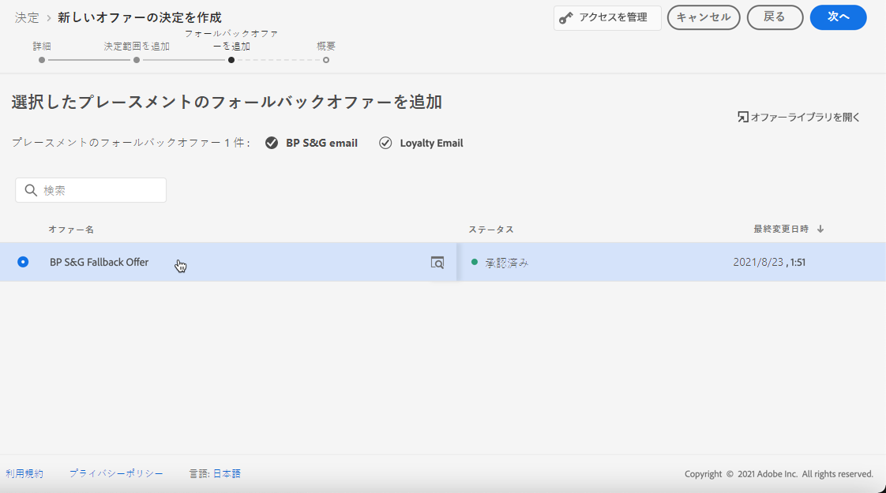

>[!NOTE]
>
>フォールバックオファーには、決定内で使用されるすべての表現を含める必要があります。 例えば、決定内に5つのオファーがあり、それぞれに異なる表現がある場合、フォールバックオファーに5つの表現を含める必要があります。

選択したら、**[!UICONTROL 次へ]**&#x200B;をクリックします。

「**[!UICONTROL オファーライブラリを開く]**」リンクをクリックすると、新しいタブにオファーのリストを表示できます。

## 決定の確認と保存 {#review}

すべてが適切に設定されている場合は、決定プロパティの概要が表示されます。

1. 顧客にオファーを提供する準備が整っていることを確認します。 すべての決定範囲と、その中に含まれるフォールバックオファーが表示されます。

   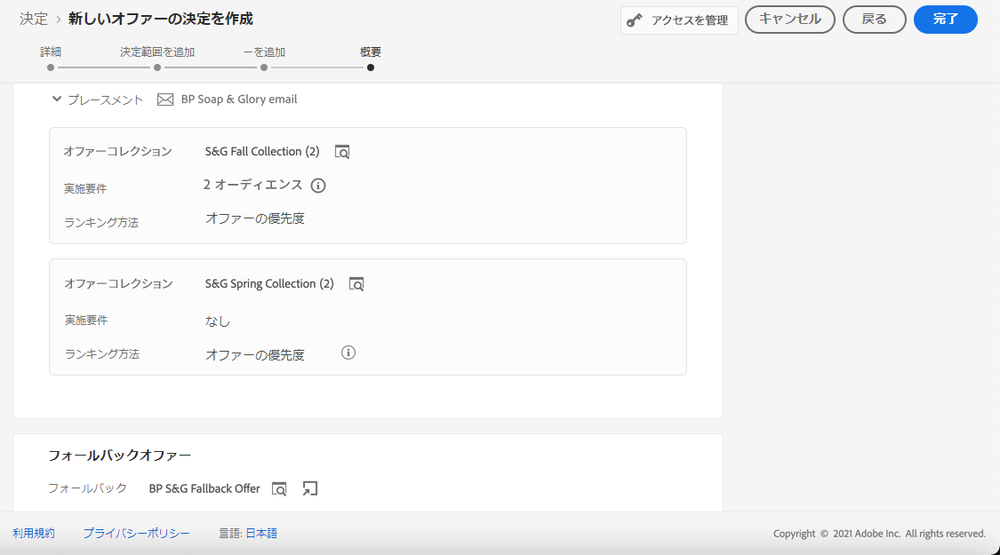

1. 各プレースメントを展開または折りたたむことができます。 各プレースメントの利用可能なオファー、適格性、ランキングの詳細をプレビューできます。 また、推定された適格プロファイルに関する情報を表示することもできます。 「**[!UICONTROL 更新]**」をクリックしてデータを更新します。

   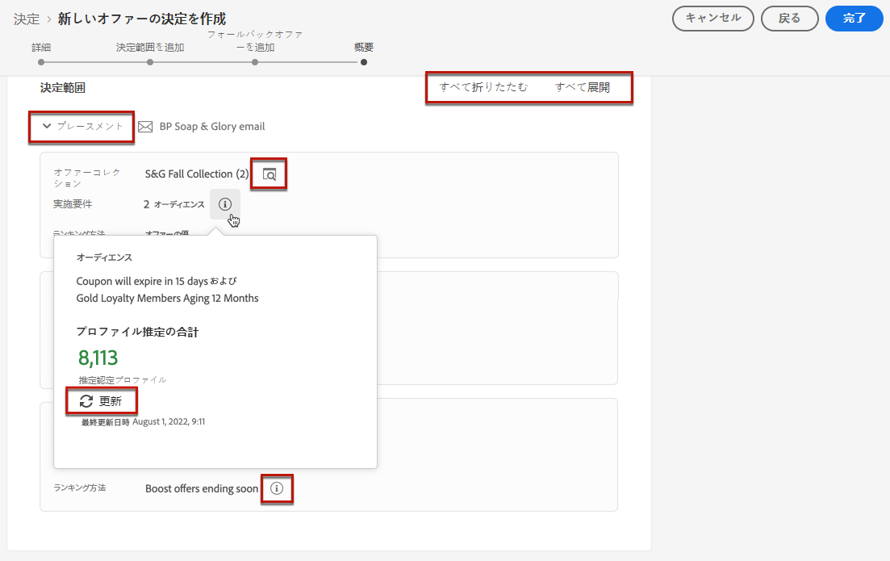

1. 「**[!UICONTROL 完了]**」をクリックします。
1. **[!UICONTROL 保存してアクティブ化]**&#x200B;を選択します。

   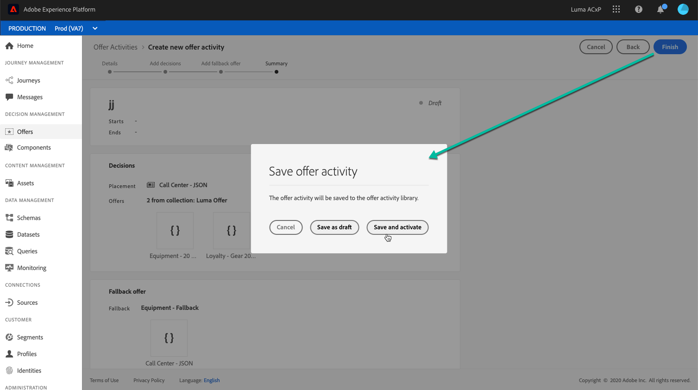

   決定をドラフトとして保存して、後で編集してアクティベートすることもできます。

決定は、前の手順でアクティベートしたかどうかに応じて、**[!UICONTROL ライブ]**&#x200B;または&#x200B;**[!UICONTROL ドラフト]**&#x200B;のステータスでリストに表示されます。

これで、顧客にオファーを配信する準備が整いました。

## 決定リスト {#decision-list}

決定リストから、決定を選択してプロパティを表示できます。 そこから、ステータス（**ドラフト**、**ライブ**、**完了**、**アーカイブ**）の変更、決定の複製、削除を行うこともできます。

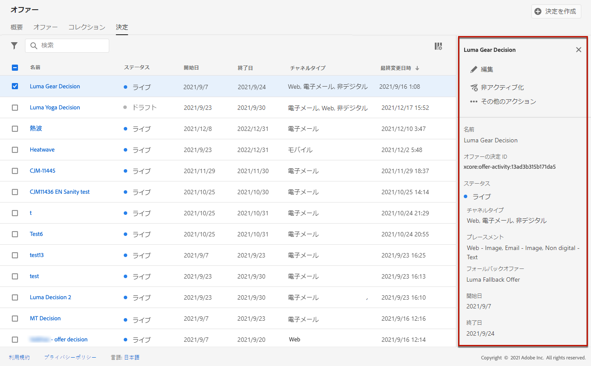

**[!UICONTROL 編集]** ボタンを選択して、決定の[詳細](#create-activity)、[決定範囲](#add-decision-scopes)および[&#x200B; フォールバックオファー](#add-fallback)を変更できる決定編集モードに戻ります。

>[!IMPORTANT]
>
>ジャーニーのメッセージで使用されているオファー決定に変更が加えられた場合は、ジャーニーを非公開にして再公開する必要があります。  これにより、変更がジャーニーのメッセージに組み込まれ、メッセージが最新の更新と一致することが確認されます。

ライブ決定を選択し、**[!UICONTROL 無効化]**&#x200B;をクリックして、決定ステータスを&#x200B;**[!UICONTROL ドラフト]**&#x200B;に戻します。

ステータスを&#x200B;**[!UICONTROL Live]**&#x200B;に再度設定するには、現在表示されている&#x200B;**[!UICONTROL アクティブ化]** ボタンを選択します。

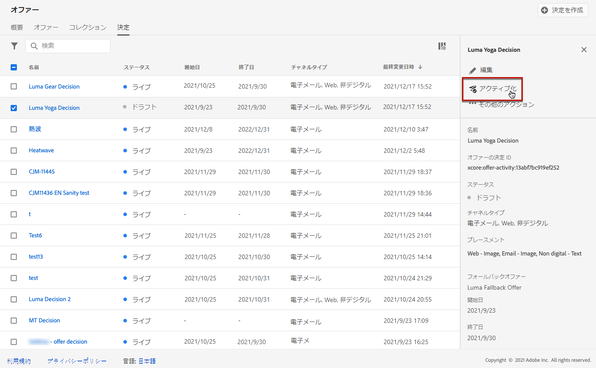

「**[!UICONTROL その他のアクション]**」ボタンを使用すると、以下のアクションが有効になります。

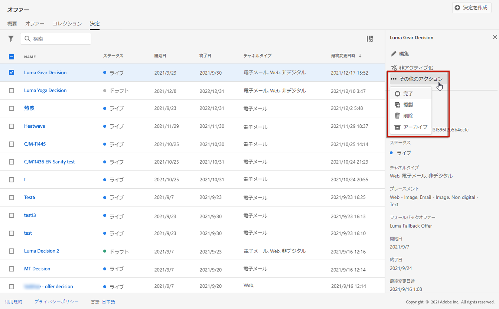

* **[!UICONTROL 完了]**：決定のステータスを&#x200B;**[!UICONTROL 完了]**&#x200B;に設定します。つまり、決定を呼び出すことはできません。 このアクションは、アクティブな決定でのみ使用できます。 決定はリストからまだ利用できますが、ステータスを&#x200B;**[!UICONTROL ドラフト]**&#x200B;または&#x200B;**[!UICONTROL 承認済み]**&#x200B;に戻すことはできません。 複製、削除、アーカイブのみ可能です。

* **[!UICONTROL 重複]**：同じプロパティ、決定範囲、フォールバックオファーを使用して決定を作成します。 デフォルトでは、新しい決定のステータスは&#x200B;**[!UICONTROL ドラフト]**&#x200B;です。

* **[!UICONTROL 削除]**：決定をリストから削除します。

  >[!CAUTION]
  >
  >決定とそのコンテンツにアクセスできなくなります。 この操作は元に戻せません。
  >
  >決定が別のオブジェクトで使用されている場合は、削除できません。

* **[!UICONTROL アーカイブ]**：決定ステータスを&#x200B;**[!UICONTROL アーカイブ]**&#x200B;に設定します。 決定はリストからまだ利用できますが、ステータスを&#x200B;**[!UICONTROL ドラフト]**&#x200B;または&#x200B;**[!UICONTROL 承認済み]**&#x200B;に戻すことはできません。 複製または削除することしかできません。

対応するチェックボックスを選択して、複数の決定のステータスを同時に削除または変更することもできます。

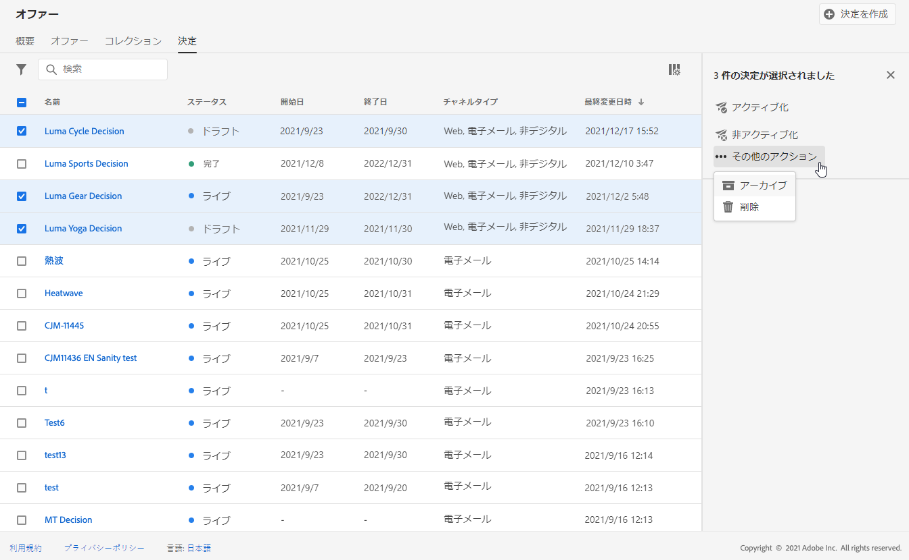

ステータスが異なる複数の決定のステータスを変更する場合は、関連するステータスのみが変更されます。

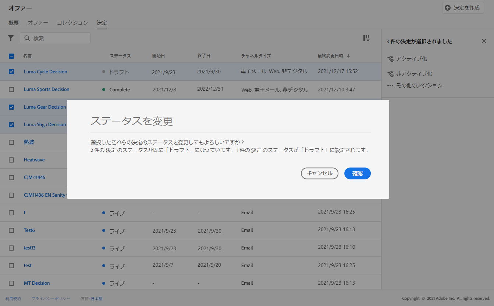

決定を作成したら、リストからその決定の名前をクリックできます。

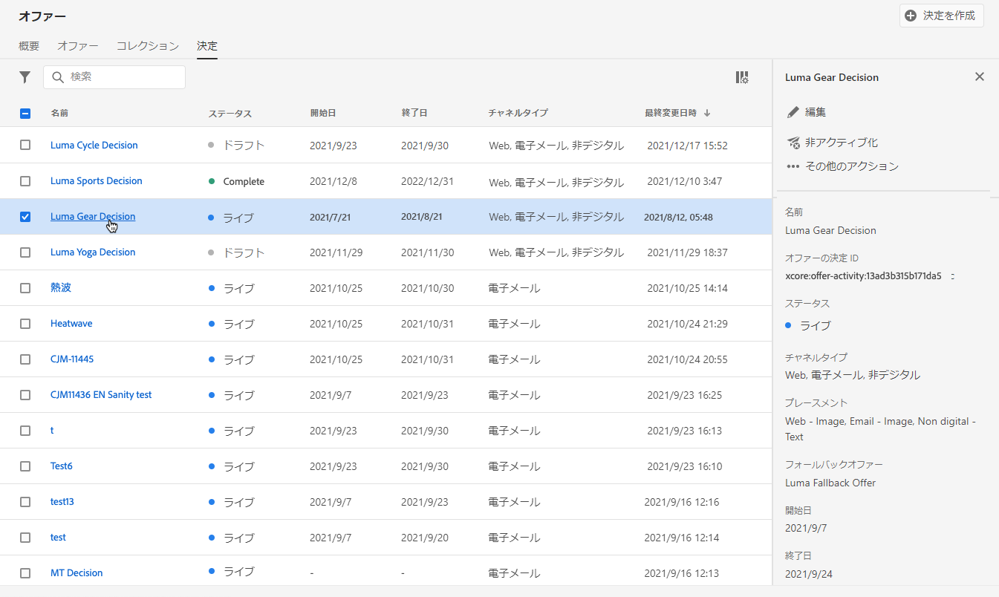

これにより、その決定の詳細情報にアクセスできます。 「**[!UICONTROL ログの変更]**」タブを選択して、[決定に加えられたすべての変更](../get-started/user-interface.md#changes-logs)を監視します。

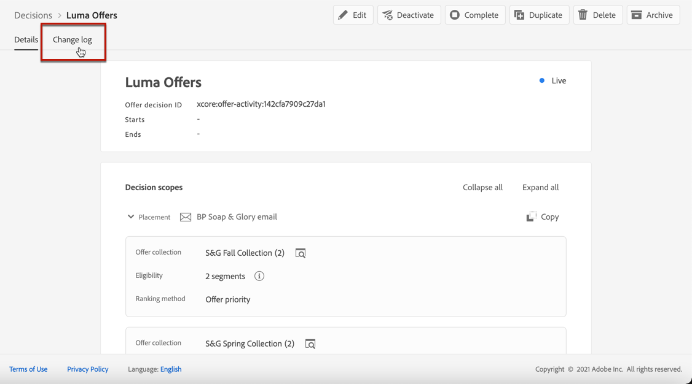

## チュートリアルビデオ{#video}

意思決定管理でオファーアクティビティを作成する方法について説明します。

>[!VIDEO](https://video.tv.adobe.com/v/329606?quality=12)

