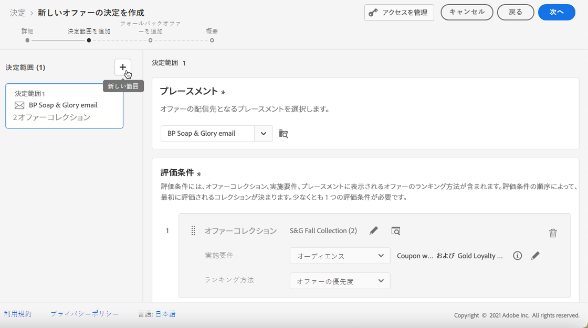

# 意思決定の作成 {#create-offer-activities}

意思決定は、配信対象に応じて、最適なオファーを選ぶためにオファーの意思決定エンジンを利用できるようにするためのコンテナとして使用されます。

➡️ [ このビデオに提供される機能の作成方法について説明しています。](#video)

決定のリストにアクセスするには、 **[!UICONTROL Offers]** メニュー > **[!UICONTROL Decisions]** tab を表示します。 フィルターを使用すると、状態や開始日と終了日を基準として、決定を取得することができます。

決定を行う前に、次のコンポーネントがオファーライブラリに作成されていることを確認してください。

* [配置](../offer-library/creating-placements.md)
* [コレクション](../offer-library/creating-collections.md)
* [カスタマイズされたキャンペーン](../offer-library/creating-personalized-offers.md)
* [フォールバックオファー](../offer-library/creating-fallback-offers.md)

## 意思決定の作成 {#create-activity}

1. 決定リストにアクセスし、をクリック **[!UICONTROL Create decision]** します。

1. 意思決定の名前を指定します。

1. 必要に応じて開始日と終了日を定義してから、をクリック **[!UICONTROL Next]** します。

   

1. カスタムまたは中核のデータ使用状況ラベルを決定に割り当てるには、を選択 **[!UICONTROL Manage access]** します。 [オブジェクトレベルのアクセス制御について詳しくは、OLAC の説明を参照してください。](../../administration/object-based-access.md)

## デシジョンスコープの定義 {#add-decision-scopes}

1. ドロップダウンリストから場所を選択します。 この機能は、決定において最初の決定範囲に追加されます。

   

1. クリックし **[!UICONTROL Add]** て、この配置の評価基準を選択します。

   

   各条件は、適格性制約に関連付けられた offer コレクション、およびその位置に表示するランク付けによって決定されるランキング法によって構成されます。

   >[!NOTE]
   >
   >少なくとも1つの検証条件を指定する必要があります。

1. 検討するサービスが含まれているオファーコレクションを選択し、をクリック **[!UICONTROL Add]** します。

   

   >[!NOTE]
   >
   >このリンクをクリック **[!UICONTROL Open offer collections]** すると、コレクションのリストが新しいタブに表示されます。これを使用すると、コレクションとその中に含まれているオファーを参照できます。

   選択されたコレクションが条件に追加されます。

   

1. **[!UICONTROL Eligibility]**&#x200B;このフィールドを使用して、この場所に対するオファーの選択を制限します。

   この制約は、decision ルール **を使用するか、1つまたは複数** の Adobe 体験プラットフォームセグメント **を使用し** て適用することができます。このセクション ](../offer-library/add-constraints.md#segments-vs-decision-rules) では、両方に [ ついて詳しく説明します。

   * 経験プラットフォームセグメントのメンバーに対するオファーの選択を制限するには、を選択 **[!UICONTROL Segments]** し、をクリック **[!UICONTROL Add segments]** します。

      

      左側のペインで1つまたは複数のセグメントを追加し、論理演算子を使用して **[!UICONTROL And]** **[!UICONTROL Or]** 結合します。

      

      この節 ](../../segment/about-segments.md) では [ 、セグメントの操作方法について説明します。

   * 選択制約をデシジョンルールとともに追加する場合は、このオプションを使用 **[!UICONTROL Decision rule]** して、選択するルールを選択します。

      

      この節 ](../offer-library/creating-decision-rules.md) で [ は、決定ルールを作成する方法について説明します。

1. セグメントまたは意志決定ルールを選択すると、見積もりが適用されているプロファイルに関する情報が表示されます。 データを更新するには、をクリック **[!UICONTROL Refresh]** します。

   >[!NOTE]
   >
   >ルールパラメーターには、プロファイルにないデータ (コンテキストデータなど) が含まれている場合は、プロファイル見積を使用できません。 例えば、現在の気象に80度の≥が必要な適格性ルールを指定します。

   

1. 各プロファイルに最適なオファーを選択するために使用するランク付け方法を定義します。

   

   * デフォルトでは、複数のオファーがこのような条件に適合している場合は、優先度が最も高いオファーがユーザーに届けられます。

   * 納品対象の製品を選択するための特定のフォーミュラを使用する場合は、「」を選択 **[!UICONTROL Ranking formula]** します。 この節 ](../offer-activities/configure-offer-selection.md) では、サービスの [ ランク付けを行う方法について説明します。

1. をクリックし **[!UICONTROL Add]** て、同じ配置についてさらに多くの条件を定義します。

   

1. 複数の条件を追加すると、指定した順序で評価されます。 シーケンスに追加された最初のコレクションが最初に評価されます。

   初期設定の順序を変更するには、コレクションをドラッグ &amp; ドロップして、必要に応じて並べ替えることができます。

   

1. 同時に複数の条件を評価することもできます。 そのためには、別のコレクションの上にコレクションをドラッグ &amp; ドロップします。

   

   これで、同じランクになり、同時に評価されるようになりました。

   

1. この決定の一部として、その他の特典を追加するには、ボタンを使用 **[!UICONTROL New scope]** します。 各デシジョンスコープについて、上記の手順を繰り返します。

   

## 予備オファーの追加 {#add-fallback}

決定範囲を定義したら、適格性ルールと制約に一致しない顧客への最終手段として提示される代替提示を定義します。

これを行うには、選択された意思について、使用可能な「予備」オファーのリストから目的の設定を選択し、をクリック **[!UICONTROL Next]** します。

>[!NOTE]
>
>このリンクをクリック **[!UICONTROL Open offer library]** すると、新しいタブに一覧のリストが表示されます。

## 意思決定のレビューと保存 {#review}

すべてが適切に設定されている場合は、デシジョンプロパティの一覧が表示されます。

1. お客様にオファーを提供するために、決定を行う準備ができていることを確認してください。 すべての意志決定スコープとその中に含まれているフォールバックオファーが表示されます。

   

1. 各配置を展開したり折りたたむことができます。 使用可能なオファー、適格性、ランキングについての詳細を表示できます。 また、見積もり対象のプロファイルに関する情報を表示することもできます。 データを更新するには、をクリック **[!UICONTROL Refresh]** します。

   

1. をクリック **[!UICONTROL Finish]** します。
1. を選択 **[!UICONTROL Save and activate]** します。

   

   また、決定をドラフトとして保存して、後で編集したりアクティブ化したりすることもできます。

選択された意思決定は、アクティブ化したかどうかによって、前の手順に従ってリスト **[!UICONTROL Live]** **[!UICONTROL Draft]** に表示されます。

この機能を使用して、ユーザーに製品を提供する準備が整いました。

## 意思決定リスト {#decision-list}

意思決定リストから、そのプロパティを表示するかどうかを選択できます。 さらに、編集、状態の変更 ( **下書き** 、 **ライブ** 、 **完全** 、 **アーカイブ** )、複製、または削除を行うこともできます。

**[!UICONTROL Edit]**&#x200B;ボタンを選択して「意思決定機能」モードに戻り、詳細情報 ](#create-activity) 、 [ デシジョンスコープ ](#add-decision-scopes) [ 、予備製品 ](#add-fallback) を変更 [ することができます。

ライブ意思決定を選択し、をクリック **[!UICONTROL Deactivate]** して、決定状況をに **[!UICONTROL Draft]** 設定します。

状態をに **[!UICONTROL Live]** 再設定するには、表示されたボタンを選択し **[!UICONTROL Activate]** ます。

このボタンを **[!UICONTROL More actions]** 使用すると、以下に説明する操作を実行できます。

* **[!UICONTROL Complete]**: 意思決定のステータスをに設定します。これに **[!UICONTROL Complete]** よって、意志決定をもはや呼び出すことはできません。 このアクションは、アクティベートによって決定される場合にのみ使用できます。 この設定はリストから選択することはできますが、そのステータスを「または **[!UICONTROL Approved]** 」に **[!UICONTROL Draft]** 戻すことはできません。複製、削除、またはアーカイブのみを使用できます。

* **[!UICONTROL Duplicate]**&#x200B;次の例では、同じプロパティ、ディシジョンスコープおよび代替オファーを使用して、決定を作成します。 デフォルトでは、新しい意思決定には状態が **[!UICONTROL Draft]** 設定されています。

* **[!UICONTROL Delete]**: リストから決定が削除されます。

   >[!CAUTION]
   >
   >これにより、決定とそのコンテンツにアクセスできなくなります。 このアクションを取り消すことはできません。
   >
   >この決定が別のオブジェクトで使用されている場合は、削除することはできません。

* **[!UICONTROL Archive]**: 決定状態をに **[!UICONTROL Archived]** 設定します。 この設定はリストから選択することはできますが、そのステータスを「または **[!UICONTROL Approved]** 」に **[!UICONTROL Draft]** 戻すことはできません。複製または削除することはできます。

また、複数の意思決定の状態を一度に削除または変更することによって、それらのチェックボックスをオンにすることもできます。

様々な状態 whith 複数の意思決定の状態を変更する場合は、関連する状態のみが変更されます。

決定が作成されたら、リストから名前をクリックします。

これにより、その決定に関する詳細情報にアクセスできるようになります。 この決定に加えられたすべての変更 ](../get-started/user-interface.md#changes-log) を監視するに [ は、 **[!UICONTROL Change log]** このタブを選択します。

## 操作方法のビデオ{#video}

意思決定管理で提供を作成する方法について説明します。

>[!VIDEO](https://video.tv.adobe.com/v/329606?quality=12)

