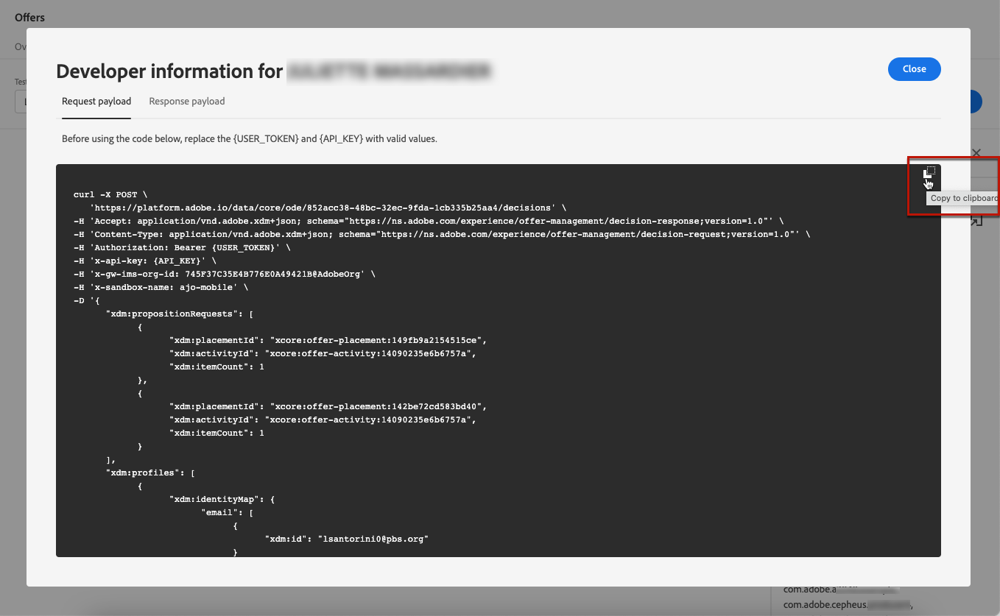

# シミュレーションの作成 {#create-simulations}

## シミュレーションについて {#about-simulation}

決定ロジックを検証するために、特定のプレースメントの場合にテストプロファイルに配信されるオファーをシミュレートできます。

<!--Simulation allows you to view the results of offer decisions as a selected profile.-->

これにより、ターゲットの受信者に影響を与えずに、オファーの様々なバージョンをテストして改良できます。

>[!NOTE]
>
>この機能は、[!DNL Decisions] API への単一のリクエストをシミュレートします。詳しくは、[決定 API を使用したオファーの配信](../api-reference/decisions-api/deliver-offers.md)を参照してください。

この機能にアクセスするには、**[!UICONTROL 意思決定管理]**／**[!UICONTROL オファー]**&#x200B;メニューから「**[!UICONTROL シミュレーション]**」タブを選択します。

<!--
➡️ [Discover this feature in video](#video)
-->

## テストプロファイルの選択 {#select-test-profiles}

まず、シミュレーションに使用するテストプロファイルを選択する必要があります。

1. 「**[!UICONTROL プロファイルを管理]**」をクリックします。

   

1. テストプロファイルの識別に使用する ID 名前空間を選択します。以下の例では、**Email** 名前空間を使用します。

   >[!NOTE]
   >
   >ID 名前空間は、メールアドレスや CRM ID などの識別情報のコンテキストを定義します。 Adobe Experience Platform の ID 名前空間について詳しくは、[この節](../../start/get-started-identity.md){target=&quot;_blank&quot;}を参照してください。

1. ID 値を入力し、「**[!UICONTROL 表示]**」をクリックして、使用可能なプロファイルを一覧表示します。

   

1. 別のプロファイルデータをテストする場合は、他のプロファイルを追加し、選択を保存します。

   

1. 追加すると、すべてのプロファイルが「**[!UICONTROL テストプロファイル]**」ドロップダウンリストに一覧表示されます。保存したテストプロファイルを切り替えて、選択したプロファイルごとに結果を表示できます。

   

   >[!NOTE]
   >
   >選択したプロファイルは、 **[!UICONTROL シミュレーション]** を使用して削除されるまで、セッションからセッションへのタブ **[!UICONTROL プロファイルを管理]**.

1. 「**[!UICONTROL プロファイルの詳細]**」リンクをクリックすると、選択したプロファイルデータが表示されます。

<!--Learn more on [selecting test profiles](messages/preview.md#select-test-profiles)-->

## 決定範囲の追加 {#add-decision-scopes}

テストプロファイルでシミュレートするオファー決定を選択します。

1. 「**[!UICONTROL 決定範囲を追加]**」を選択します。

   

1. リストからプレースメントを選択します。

   

1. 使用可能な決定が表示されます。

   * 検索フィールドを使用して、選択を絞り込むことができます。
   * 「**[!UICONTROL オファー決定を開く]**」リンクをクリックして、作成したすべての決定のリストを開きます。詳しくは、[決定の作成](create-offer-activities.md)を参照してください。

   任意の決定を選択し、「**[!UICONTROL 追加]**」をクリックします。

   

1. 定義した決定範囲は、メインワークスペースに表示されます。

   リクエストするオファーの数を調整できます。 例えば、2 を選択した場合、この決定範囲では最適な 2 つのオファーが表示されます。

   

   >[!NOTE]
   >
   >最大 30 個のオファーをリクエストできます。

1. 上記の手順を繰り返して、決定を必要な数だけ追加します。

   

   >[!NOTE]
   >
   >複数の決定範囲を定義した場合でも、シミュレートされるのは 1 つの API リクエストのみです。

## シミュレーション設定の定義 {#define-simulation-settings}

シミュレーションのデフォルト設定を編集するには、次の手順に従います。

1. クリック **[!UICONTROL 設定]**.

   

1. 内 **[!UICONTROL 重複排除]** 「 」セクションで、決定や配置間の重複オファーを許可するように選択できます。 つまり、複数の決定/配置に同じオファーが割り当てられる場合があります。

   

   >[!NOTE]
   >
   >デフォルトでは、すべての重複排除フラグがシミュレーションに対して有効になっています。つまり、決定エンジンでは重複が許可されているため、複数の決定／配置をまたいで同じ提案を行うことができます。[!DNL Decisions] API リクエストのプロパティについて詳しくは、[この節](../api-reference/decisions-api/deliver-offers.md)を参照してください。

1. 内 **[!UICONTROL 応答の形式]** セクションで、コードビューにメタデータを含めるように選択できます。 対応するオプションをオンにし、目的のメタデータを選択します。 これらは、選択時にリクエストおよび応答ペイロードに表示されます **[!UICONTROL コードを表示]**. 詳しくは、 [シミュレーション結果の表示](#simulation-results) 」セクションに入力します。

   

   >[!NOTE]
   >
   >このオプションをオンにすると、すべての項目がデフォルトで選択されます。

1. 「**[!UICONTROL 保存]**」をクリックします。

>[!NOTE]
>
>現在、シミュレーションデータの場合は、 **[!UICONTROL ハブ]** API

<!--
In the **[!UICONTROL API for simulation]** section, select the API you want to use: **[!UICONTROL Hub]** or **[!UICONTROL Edge]**.
Hub and Edge are two different end points for simulation data.

In the **[!UICONTROL Context data]** section, you can add as many elements as needed.

    >[!NOTE]
    >
    >This section is hidden if you select Edge API in the section above. Hub allows the use of Context data, Edge does not.

Context data allows the user to add contextual data that could affect the simulation score.
For instance, let's say the customer has an offer for a discount on ice cream. In the rules for that offer, it can have logic that would rank it higher when the temperature is above 80 degrees. In simulation, the user could add context data: temperature=65 and that offer would rank lower, of they could add temperature=95 and that would rank higher.
-->

## シミュレーション結果の表示 {#simulation-results}

決定範囲を追加し、テストプロファイルを選択したら、結果を表示できます。

1. 「**[!UICONTROL 結果を表示]**」をクリックします。

   

1. 決定ごとに、選択したプロファイルに応じて、利用可能な最適なオファーが表示されます。

   詳細を表示するオファーを選択します。

   

1. クリック **[!UICONTROL コードを表示]** をクリックして、リクエストと応答のペイロードを表示します。 [詳細情報](#view-code)

1. リストから別のプロファイルを選択して、別のテストプロファイルに対するオファー決定の結果を表示します。

1. 決定範囲は、必要な回数だけ追加、削除または更新できます。

>[!NOTE]
>
>プロファイルを変更したり決定範囲を更新したりするたびに、「**[!UICONTROL 結果を表示]**」ボタンを使用して結果を更新する必要があります。

## コードを表示 {#view-code}

1. 以下を使用： **[!UICONTROL コードを表示]** ボタンをクリックして、リクエストと応答のペイロードを表示します。

   

   コードビューには、現在のユーザーの開発者情報が表示されます。 デフォルトでは、 **[!UICONTROL 応答ペイロード]** が表示されます。

   

1. クリック **[!UICONTROL 応答ペイロード]** または **[!UICONTROL リクエストペイロード]** :2 つのタブ間を移動します。

   

1. の外部でリクエストペイロードを使用するには [!DNL Journey Optimizer]  — トラブルシューティングの目的などで、 **[!UICONTROL クリップボードにコピー]** ボタンを使用して、コードビューの上に配置できます。

   

   <!--You cannot copy the response payload. ACTUALLY YES YOU CAN > to confirm with PM/dev? -->

   >[!NOTE]
   >
   >リクエストまたは応答ペイロードを独自のコードにコピーする場合は、{USER_TOKEN} および {API_KEY} を有効な値に置き換えてください。 これらの値を [Adobe Experience Platform API](https://experienceleague.adobe.com/docs/experience-platform/landing/platform-apis/api-authentication.html?lang=ja){target=&quot;_blank&quot;} ドキュメント。

