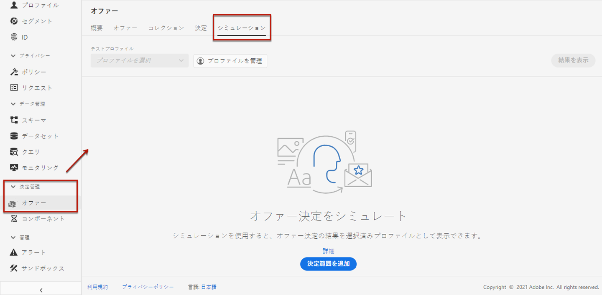
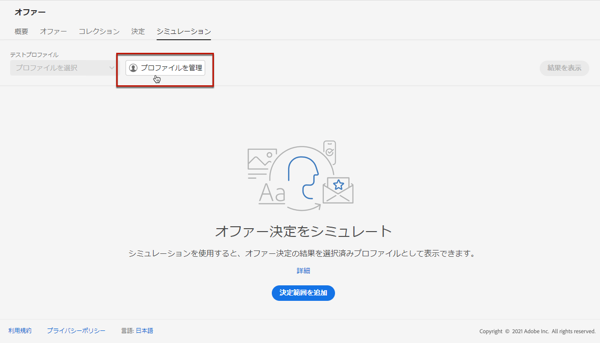
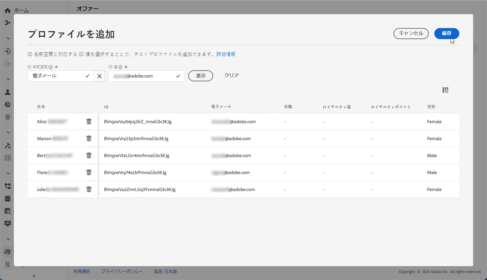
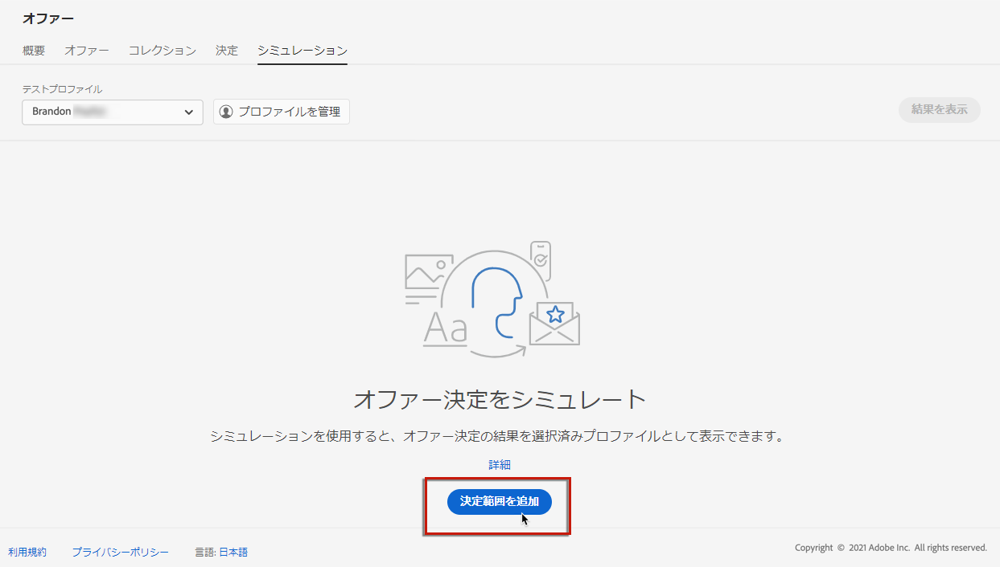
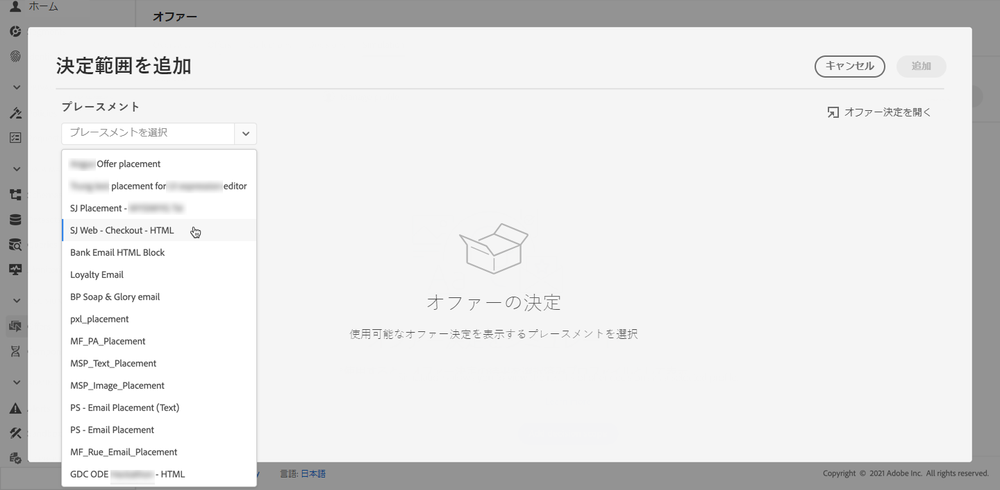
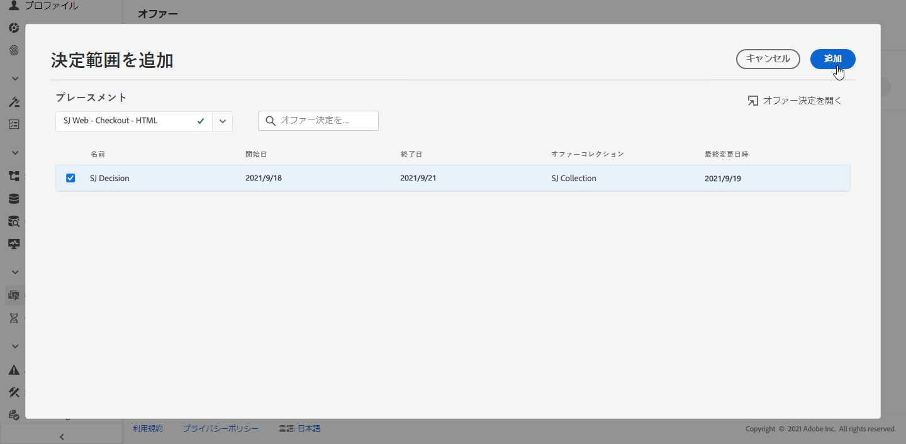
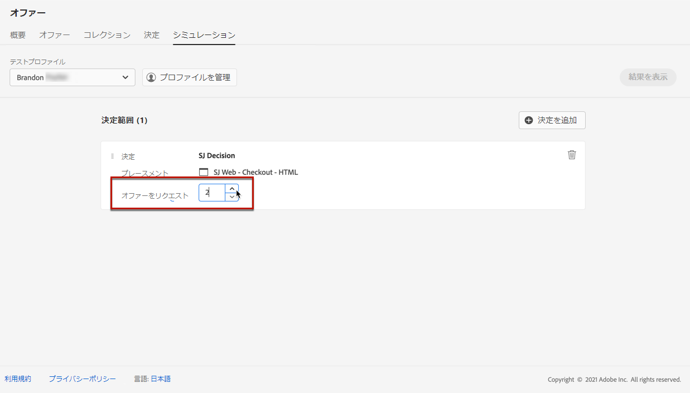
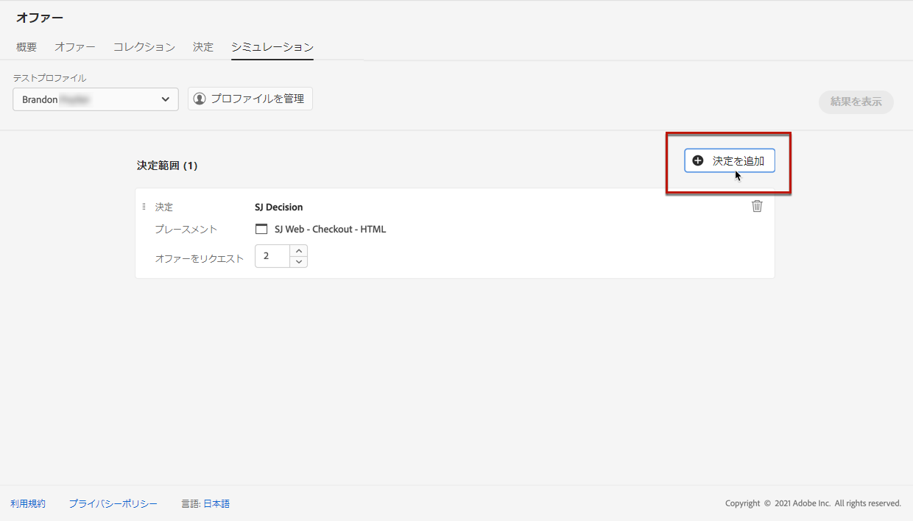
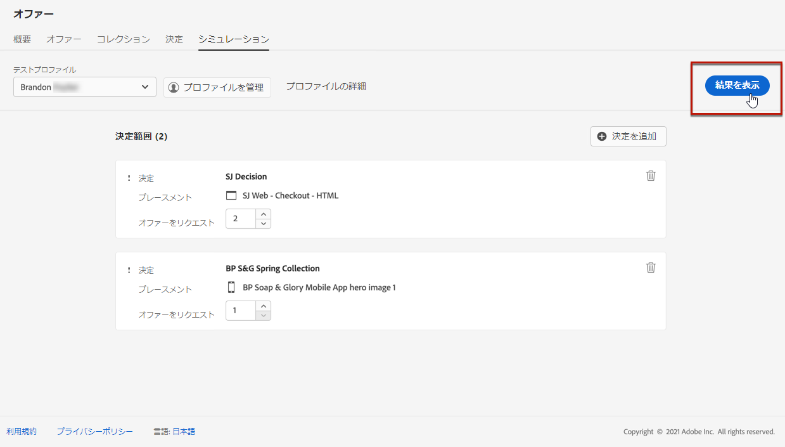
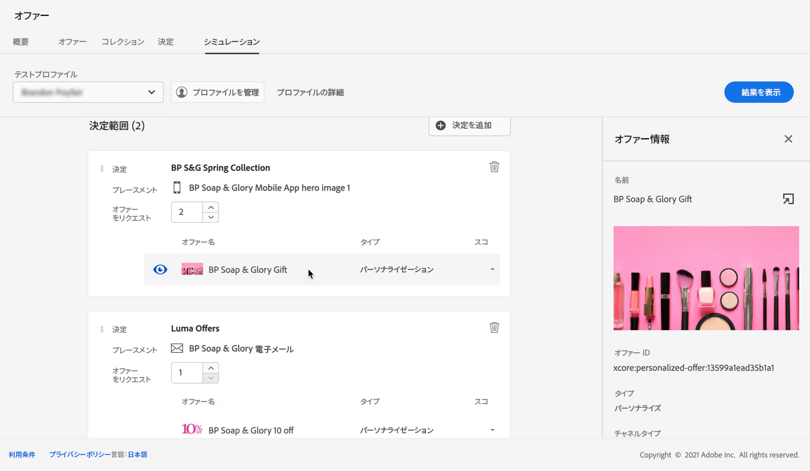

# シミュレーションを作成

## シミュレーションについて

判定ロジックを検証するには、特定の配置に対してテストプロファイルに配信されるオファーをシミュレートできます。

<!--Simulation allows you to view the results of offer decisions as a selected profile.-->

これにより、ターゲット受信者に影響を与えることなく、様々なバージョンのオファーをテストして調整できます。

>[!NOTE]
>
>この機能は、 [!DNL Decisions] API 詳細情報： [決定 API を使用してオファーを配信する](../api-reference/decisions-api/deliver-offers.md).

この機能にアクセスするには、 **[!UICONTROL シミュレーション]** タブ **[!UICONTROL 決定管理]** > **[!UICONTROL オファー]** メニュー

<!--
➡️ [Discover this feature in video](#video)
-->

## テストプロファイルの選択

まず、シミュレーションに使用するテストプロファイルを選択する必要があります。

1. クリック **[!UICONTROL プロファイルを管理]**.

   

1. テストプロファイルの識別に使用する ID 名前空間を選択します。 以下の例では、**メール**&#x200B;名前空間を使用します。

   >[!NOTE]
   >
   >ID 名前空間は、電子メールアドレスや CRM ID などの識別子のコンテキストを定義します。 Adobe Experience Platform の ID 名前空間については、[この節](../../get-started-identity.md){target=&quot;_blank&quot;}を参照してください。

1. ID 値を入力し、「 **[!UICONTROL 表示]** をクリックして、使用可能なプロファイルをリストします。

   

1. 別のプロファイルデータをテストする場合は、他のプロファイルを追加し、選択内容を保存します。

   

1. 追加すると、すべてのプロファイルがのドロップダウンリストに表示されます。 **[!UICONTROL テストプロファイル]**. 保存済みのテストプロファイルを切り替えて、選択した各プロファイルの結果を表示できます。

   

1. 次の項目をクリックします。 **[!UICONTROL プロファイルの詳細]** 選択したプロファイルデータを表示するリンク

<!--Learn more on [selecting test profiles](preview.md#select-test-profiles)-->

## 決定範囲の追加

次に、テストプロファイルでシミュレートするオファーの決定を選択します。

1. 選択 **[!UICONTROL 決定範囲を追加]**.

   

1. リストからプレースメントを選択します。

   

1. 使用可能な決定が表示されます。

   * 検索フィールドを使用して、選択を絞り込むことができます。
   * 次の項目をクリックします。 **[!UICONTROL オファーの決定を開く]** リンクをクリックして、作成したすべての決定のリストを開きます。 詳細情報： [決定](create-offer-activities.md).

   任意の決定を選択し、「 **[!UICONTROL 追加]**.

   

1. 定義した判定範囲は、メインワークスペースに表示されます。

   リクエストするオファーの数を調整できます。 例えば、「2」を選択した場合、この決定範囲に対して最も優れた 2 つのオファーが表示されます。

   

   >[!NOTE]
   >
   >最大 30 個のオファーをリクエストできます。

1. 上記の手順を繰り返して、必要な数の決定を追加します。

   

   >[!NOTE]
   >
   >複数の決定範囲を定義した場合でも、1 つの API リクエストのみがシミュレートされます。
   >
   >すべての重複除外フラグは、シミュレーションに対してデフォルトで有効になっています。つまり、決定エンジンでは重複が許可され、複数の決定にわたって同じ提案をおこなうことができます。 詳しくは、 [!DNL Decisions] の API リクエストプロパティ [この節](../api-reference/decisions-api/deliver-offers.md).

## シミュレーション結果の表示

決定範囲を追加し、テストプロファイルを選択したら、結果を表示できます。

1. クリック **[!UICONTROL 結果を表示]**.

   

1. 利用可能な最適なオファーは、各決定で選択したプロファイルに応じて表示されます。

   オファーを選択して詳細を表示します。

   

1. リストから別のプロファイルを選択して、別のテストプロファイルに対するオファーの決定の結果を表示します。

1. 決定範囲は、必要な回数だけ追加、削除または更新できます。

>[!NOTE]
>
>プロファイルを変更したり、決定範囲を更新したりするたびに、 **[!UICONTROL 結果を表示]** 」ボタンをクリックします。

<!--Questions

* Is it recommended to first select profiles or first add decision scopes?
* What does Request offer changes?
* Nothing displays when I click View results? Can't see any score...
* What's the typical example? i.e. how many decisions do you select, and how do you compare scores?
* What do you learn from simulation? i.e. if I selected 2 decisions and I compare the scores, which one is better or should I use for my customers?
* Is there a way to create relevant test profiles?
* Error on Profile details link.
* Is there a tutorial planned to be released?
* Why still a big red frame when no profile is found?

## Tutorial video {#video}

>[!NOTE]
>
>This video applies to the Offer Decisioning application service built on Adobe Experience Platform. However, it provides generic guidance to use Offer in the context of Journey Optimizer.

>[!VIDEO](https://video.tv.adobe.com/v/329606?quality=12)
-->