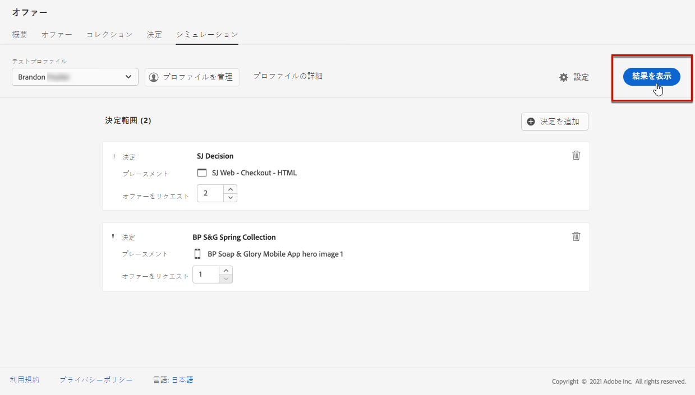

# シミュレーションの作成 {#create-simulations}

## シミュレーションについて {#about-simulation}

Decisioning ロジックを検証するには、指定された配置について、どのオファーがテストプロファイルに配信されるかをシミュレートします。

<!--Simulation allows you to view the results of offer decisions as a selected profile.-->

これにより、ターゲットの受信者に影響を与えることなく、様々なバージョンの特典をテストして改善することができます。

>[!NOTE]
>
>この機能では、API へ [!DNL Decisioning] の1つの要求がシミュレートされます。 Decisioning API ](../api-reference/offer-delivery-api/decisioning-api.md) を使用した配信オファーに [ ついて詳しく説明します。

この機能にアクセスするには、> **[!UICONTROL Offers]** メニューから **[!UICONTROL Decision management]** タブを選択し **[!UICONTROL Simulation]** ます。

>[!NOTE]
>
>シミュレーションが意思決定イベントを生成しないので、 [ 上限 ](../offer-library/creating-personalized-offers.md#capping) 値には影響しません。

<!--
➡️ [Discover this feature in video](#video)
-->

## 「プロファイルのテスト」を選択します。 {#select-test-profiles}

>[!CONTEXTUALHELP]
>id="ajo_decisioning_simulation_test_profile"
>title="テストプロファイルの追加"
>abstract="Id 名前空間とそれに対応する id 値を選択して、テストプロファイルを追加することができます。 シミュレーションで使用するには、既にテストプロファイルを使用できるようになっている必要があります。"
>additional-url="https://experienceleague.adobe.com/docs/journey-optimizer/using/segment/profiles/creating-test-profiles.html" text="テストプロファイルの作成"

最初に、シミュレーションに使用するテストプロファイルを選択する必要があります。

>[!CAUTION]
>
>これらのサービスに配信されるサービスをシミュレートするには、使用可能なテストプロファイルが必要になります。 テストプロファイル ](../../segment/creating-test-profiles.md) の作成方法に [ ついて説明します。

1. をクリック **[!UICONTROL Manage profile]** します。

   

1. テストプロファイルの識別に使用する id 名前空間を選択します。 この例では、電子メール **名前空間を使用** します。

   >[!NOTE]
   >
   >Id 名前空間は、電子メールアドレスや CRM ID などの識別子のコンテキストを定義します。 このセクション ](../../segment/get-started-identity.md) の Adobe エクスペリエンス Platform identity 名前空間 [ について詳しくは、{target = &quot;_blank&quot;} を参照してください。

1. Id 値を入力し、をクリック **[!UICONTROL View]** して使用可能なプロファイルを一覧表示します。

   

1. 別のプロファイルデータをテストして、選択したファイルを保存する場合は、他のプロファイルを追加します。

   

1. 追加されると、の下 **[!UICONTROL Test profile]** のドロップダウンリストに、すべてのプロファイルが一覧表示されます。 保存されているテストプロファイル間で切り替えて、選択した各プロファイルの結果を表示することができます。

   

   >[!NOTE]
   >
   >選択されたプロファイルは、を使用して **[!UICONTROL Manage profile]** 削除されるまで、 **[!UICONTROL Simulation]** セッション間のセッション間のテストプロファイルとしてタブに表示されたままになります。

1. このリンクをクリック **[!UICONTROL Profile details]** すると、選択したプロファイルデータが表示されます。

<!--Learn more on [selecting test profiles](messages/preview.md#select-test-profiles)-->

## デシジョンスコープの追加 {#add-decision-scopes}

次に、テストプロファイルでシミュレートするサービスの決定を選択します。

1. を選択 **[!UICONTROL Add decision scope]** します。

   

1. リストから場所を選択します。

   

1. 使用可能な決定が表示されます。

   * 「検索」フィールドを使用して、選択範囲を絞り込むことができます。
   * このリンクをクリック **[!UICONTROL Open offer decisions]** すると、作成したすべての意思決定のリストを開くことができます。 決定 ](create-offer-activities.md) について [ 詳しく説明します。

   目的の決定を選択し、をクリック **[!UICONTROL Add]** します。

   

1. 定義したデシジョンスコープがメインワークスペースに表示されます。

   要求するオファーの数を調整することができます。 例えば、「2」を選択した場合、この決定範囲に最高2種類のキャンペーンが表示されます。

   

   >[!NOTE]
   >
   >最大30個の特典を依頼できます。

1. 上記の手順を繰り返して、必要な数の意思決定を追加します。

   

   >[!NOTE]
   >
   >複数のデシジョンスコープを定義した場合でも、API 要求は1つだけシミュレートされます。

## シミュレーション設定の定義 {#define-simulation-settings}

シミュレーションの初期設定を編集するには、次の手順に従います。

1. をクリック **[!UICONTROL Settings]** します。

   

1. **[!UICONTROL Deduplication]**&#x200B;セクションでは、意志決定および配置において複製オファーを許可するかどうかを選択できます。これは、複数の意思決定や配置が、同じ申し出に割り当てられる可能性があることを意味します。

   

   >[!NOTE]
   >
   >デフォルトでは、すべての重複除外フラグがシミュレーションに対して有効になっています。これは、この意思決定エンジンによって複製が実行されることを意味します。 この節 ](../api-reference/offer-delivery-api/decisioning-api.md) で [ は、API 要求の [!DNL Decisioning] プロパティについて詳しく説明します。

1. **[!UICONTROL Response format]**&#x200B;セクションでは、コードビューにメタデータを含めるかどうかを選択できます。対応するオプションをオンにして、選択したメタデータを選択します。 これらのペイロードは、選択 **[!UICONTROL View code]** 時に要求と応答のペイロードに表示されます。 詳しくは、「シミュレーション結果 ](#simulation-results) の表示」を参照して [ ください。

   

   >[!NOTE]
   >
   >このオプションをオンにすると、すべてのアイテムが初期設定で選択されます。

1. をクリック **[!UICONTROL Save]** します。

>[!NOTE]
>
>現在、シミュレーションデータに使用できるのは、 **[!UICONTROL Hub]** API のみです。

<!--
In the **[!UICONTROL API for simulation]** section, select the API you want to use: **[!UICONTROL Hub]** or **[!UICONTROL Edge]**.
Hub and Edge are two different end points for simulation data.

In the **[!UICONTROL Context data]** section, you can add as many elements as needed.

    >[!NOTE]
    >
    >This section is hidden if you select Edge API in the section above. Hub allows the use of Context data, Edge does not.

Context data allows the user to add contextual data that could affect the simulation score.
For instance, let's say the customer has an offer for a discount on ice cream. In the rules for that offer, it can have logic that would rank it higher when the temperature is above 80 degrees. In simulation, the user could add context data: temperature=65 and that offer would rank lower, of they could add temperature=95 and that would rank higher.
-->

## シミュレーション結果の表示 {#simulation-results}

決定範囲を追加し、テストプロファイルを選択したら、結果を表示できます。

1. をクリック **[!UICONTROL View results]** します。

   

1. 最適なオファーは、選択した各プロファイルに基づいて表示されます。

   詳細情報を表示するサービスを選択します。

   

1. 要求と応答のペイロードを表示するには、をクリックし **[!UICONTROL View code]** ます。 [詳細情報](#view-code)

1. リストから別のプロファイルを選択して、別のテストプロファイルに対するオファーの決定の結果を表示します。

1. 必要に応じて、決定スコープを追加、削除または更新することができます。

>[!NOTE]
>
>プロファイルを変更またはデシジョンスコープを更新するたびに、ボタンを使用して **[!UICONTROL View results]** 結果を更新する必要があります。

## コードの表示 {#view-code}

1. **[!UICONTROL View code]**&#x200B;このボタンを使用して、要求と応答のペイロードを表示します。

   

   コードビューには、現在のユーザーの開発者向け情報が表示されます。 初期設定 **[!UICONTROL Response payload]** では、が表示されます。

   

1. **[!UICONTROL Request payload]**&#x200B;をクリックし **[!UICONTROL Response payload]** て2つのタブの間を移動します。

   

1. の外部での [!DNL Journey Optimizer] 要求ペイロードをトラブルシューティング目的で使用するには、コードビューの上部にあるボタンを使用して **[!UICONTROL Copy to clipboard]** コピーします。

   

   <!--You cannot copy the response payload. ACTUALLY YES YOU CAN > to confirm with PM/dev? -->

   >[!NOTE]
   >
   >要求または応答のペイロードを独自のコードにコピーする場合は、{USER_TOKEN} および {API_KEY} を有効な値に置き換えてください。 これらの値を Adobe 経験 Platform Api ](https://experienceleague.adobe.com/docs/experience-platform/landing/platform-apis/api-authentication.html) {target = &quot;_blank&quot;} マニュアルで取得する方法について [ 説明します。

