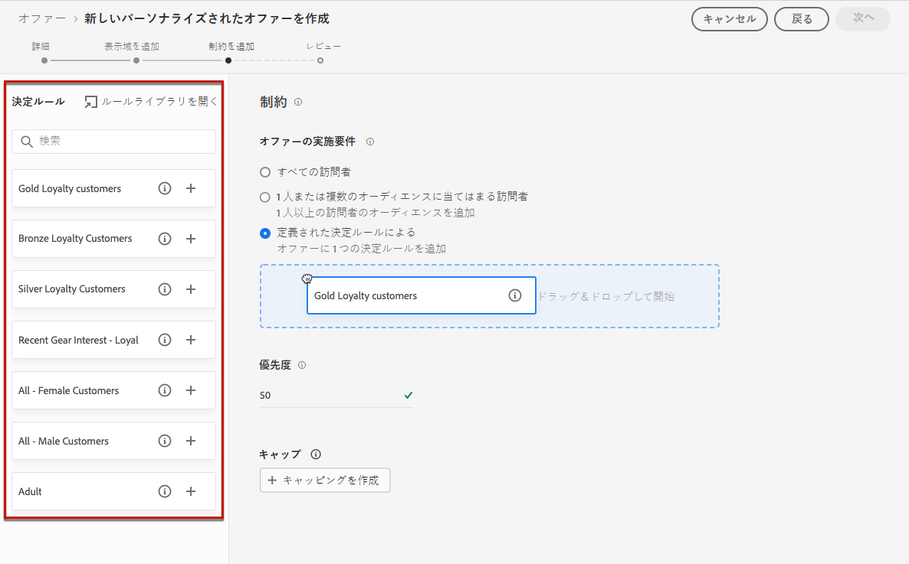
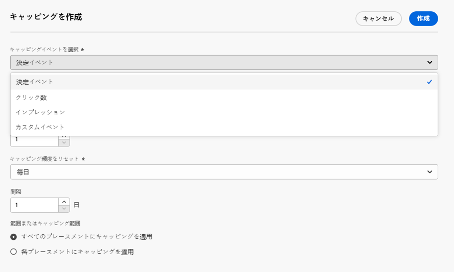
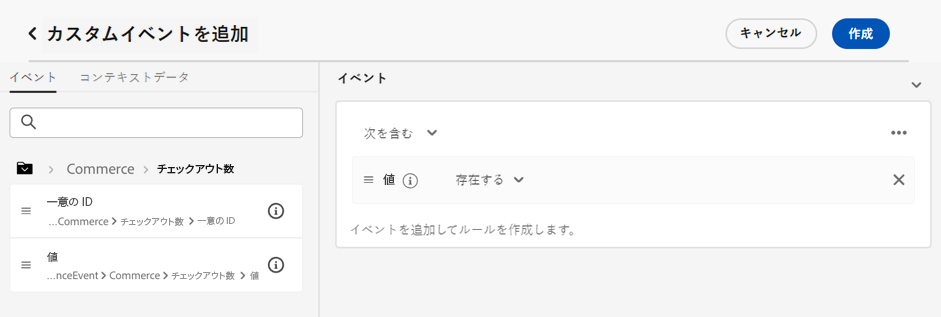
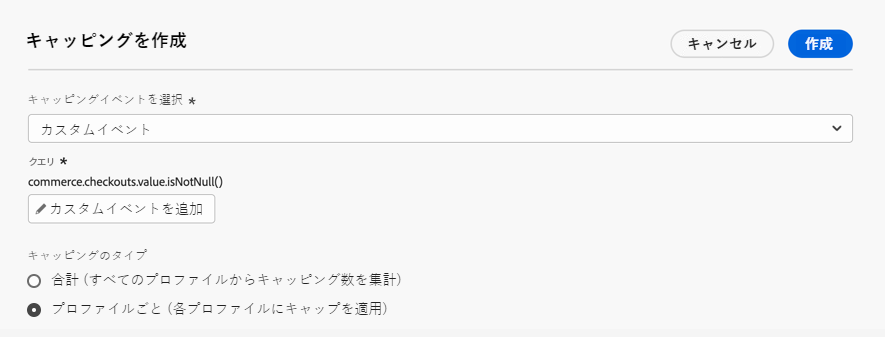
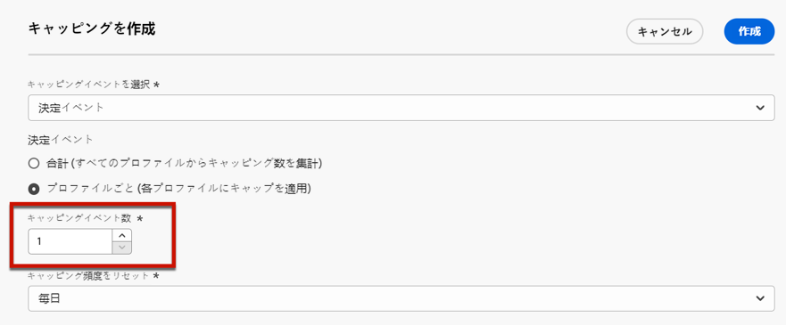

# オファーへの制約の追加 {#add-constraints}

>[!CONTEXTUALHELP]
>id="od_offer_constraints"
>title="オファー制約について"
>abstract="制約を使用すると、オファーを他のオファーと比較して優先順位付けしユーザーに提示する方法を指定できます。"

>[!CONTEXTUALHELP]
>id="ajo_decisioning_constraints"
>title="オファー制約について"
>abstract="制約を使用すると、オファーを他のオファーと比較して優先順位付けしユーザーに提示する方法を指定できます。"

>[!CONTEXTUALHELP]
>id="od_offer_priority"
>title="オファーの優先度について"
>abstract="このフィールドでは、オファーの優先度設定を指定できます。優先度は、実施要件、日付、制限などのすべての制約を満たすオファーをランク付けするための数値です。"

>[!CONTEXTUALHELP]
>id="ajo_decisioning_priority"
>title="優先度の設定"
>abstract="ユーザーが複数のオファーの対象となる場合、優先度は他のオファーと比較したオファーの優先度の定義に役立ちます。オファーの優先度が高いほど、他のオファーと比較して優先順位が高くなります。"

制約を使用すると、オファーを表示する条件を定義できます。

1. **[!UICONTROL オファー実施要件]**&#x200B;を設定します。[詳細情報](#eligibility)

   

1. ユーザーが複数のオファーの対象となる場合は、他のオファーと比較したオファーの「**[!UICONTROL 優先度]**」を定義します。オファーの優先度が高いほど、他のオファーと比較して優先順位が高くなります。

   

   >[!NOTE]
   >
   >オファーの優先度は、整数値（小数は含まない）にする必要があります。

1. オファーの&#x200B;**[!UICONTROL キャッピング]**&#x200B;を指定します。キャッピングはオファーが表示される回数を意味します。[詳細情報](#capping)

   

1. 「**[!UICONTROL 次へ]**」をクリックし、定義したすべての制約を確定します。

例えば、次の制約を設定した場合：

* オファーは、「ゴールドロイヤルティ顧客」決定ルールに一致するユーザーに対してのみ考慮されます。
* オファーの優先度は「50」に設定されています。つまり、このオファーは優先度が 1～49 のオファーより先に、優先度が 51 以上のオファーより後に表示されます。
* オファーは、すべてのプレースメントをまたいで、ユーザーごとに月に 1 回だけ提示されます。

## 実施要件 {#eligibility}

>[!CONTEXTUALHELP]
>id="ajo_decisioning_eligibility"
>title="実施要件の定義"
>abstract="デフォルトでは、どのプロファイルにもオファーの提示を受ける資格がありますが、オーディエンスまたは決定ルールを使用して、オファーを特定のプロファイルに制限できます。"

>[!CONTEXTUALHELP]
>id="od_offer_eligibility"
>title="オファー実施要件について"
>abstract="このセクションでは、決定ルールを使用して、オファーの対象となるユーザーを決定できます。"

<!--additional-url="https://video.tv.adobe.com/v/341373?captions=jpn" text="Watch demo video"-->

>[!CONTEXTUALHELP]
>id="ajo_decisioning_total_profile_estimate"
>title="合計プロファイル見積"
>abstract="オーディエンスまたは決定ルールを選択すると、推定される認定プロファイルに関する情報が表示されます。"

「**[!UICONTROL オファーの実施要件]**」セクションでは、オーディエンスまたは決定ルールを使用して定義する特定のプロファイルにオファーを制限できます。

>[!NOTE]
>
>**オーディエンス**&#x200B;と&#x200B;**決定ルール**&#x200B;の使用上の違いについて詳しくは、[この節](#segments-vs-decision-rules)を参照してください。

* デフォルトでは、「**[!UICONTROL すべての訪問者]**」オプションが選択されています。つまり、すべてのプロファイルがオファーを提示される資格があります。

  

* また、オファーの表示を、1 つまたは複数の [Adobe Experience Platform オーディエンス](../../audience/about-audiences.md)のメンバーに限定できます。

  それには、「**[!UICONTROL 1 つまたは複数のオーディエンスに分類される訪問者]**」オプションを有効にしたあと、左パネルから 1 つまたは複数のオーディエンスを追加し、**[!UICONTROL かつ]**／**[!UICONTROL または]**&#x200B;論理演算子を使用してそれらを結合します。

  

* 特定の[決定ルール](../offer-library/creating-decision-rules.md)をオファーに関連付ける場合は、**[!UICONTROL 定義済みの決定ルール]**&#x200B;を選択し、目的のルールを左ペインから&#x200B;**[!UICONTROL 決定ルール]**&#x200B;領域にドラッグします。

  

  >[!CAUTION]
  >
  >イベントベースのオファーは、現在 [!DNL Journey Optimizer] ではサポートされていません。[イベント](https://experienceleague.adobe.com/docs/experience-platform/segmentation/ui/segment-builder.html?lang=ja#events){target="_blank"}に基づいて決定ルールを作成しても、それをオファーで活用することはできません。

オーディエンスまたは決定ルールを選択すると、推定される認定プロファイルに関する情報が表示されます。「**[!UICONTROL 更新]**」をクリックして、データを更新します。

>[!NOTE]
>
>プロファイルの予測は、ルールパラメーターにコンテキストデータなど、プロファイルに含まれていないデータが含まれている場合は使用できません。例えば、現在の気温が 80 ℃以上であることを条件とする実施要件ルールがあります。

### オーディエンスと決定ルールの使用上の違い {#segments-vs-decision-rules}

制約を適用するには、オファーの選択を 1 つまたは複数の **Adobe Experience Platform オーディエンス**&#x200B;のメンバーに限定するか、**決定ルール**&#x200B;を使用します。どちらの手段もそれぞれ異なる使用法に対応します。

基本的に、オーディエンスの出力はプロファイルのリストです。一方、決定ルールは、決定プロセス中に単一プロファイルに対してオンデマンドで実行される関数です。この 2 つの使用法の違いを、以下に詳しく説明します。

* **オーディエンス**

  オーディエンスは、プロファイル属性とエクスペリエンスイベントに基づく特定のロジックに一致する Adobe Experience Platform プロファイルのグループです。ただし、オファー管理ではオーディエンスの再計算は行われないので、オファーを提示する際にオーディエンスが最新でない可能性があります。

  オーディエンスについて詳しくは、[この節](../../audience/about-audiences.md)を参照してください。

* **決定ルール**

  一方、決定ルールは、Adobe Experience Platform で使用可能なデータに基づいており、オファーを誰に表示できるかを決定します。特定のプレースメントのオファーまたは決定でルールが選択されると、決定が行われるたびにそのルールが実行されるので、各プロファイルが最新かつ最適なオファーを確実に取得できます。

  決定ルールについて詳しくは、[この節](creating-decision-rules.md)を参照してください。

## キャッピング {#capping}

>[!CONTEXTUALHELP]
>id="od_offer_globalcap"
>title="オファーキャッピングについて"
>abstract="このフィールドでは、オファーを提示できる回数を指定できます。"

>[!CONTEXTUALHELP]
>id="ajo_decisioning_capping"
>title="キャッピングの使用"
>abstract="顧客に過度の勧誘をしないようにするには、キャッピングを使用して、オファーを提示できる回数の上限を定義します。特定のオファーに対して最大 10 個のキャッピングルールを作成できます。"
>additional-url="https://experienceleague.adobe.com/ja/docs/journey-optimizer/using/decisioning/offer-decisioning/managing-offers-in-the-offer-library/configure-offers/add-constraints#capping-change-date" text="日付を変更すると、キャップに影響を与える場合があります"

キャッピングは、オファーを提示できる最大回数を定義する制約として使用されます。ユーザーが特定のオファーを受け取る回数を制限することで、顧客への過度の勧誘を防ぎ、最適なオファーを用いて各タッチポイントを最適化できます。

特定のオファーに対して最大 10 個のキャッピングルールを追加できます。キャッピングルールを設定するには、「**[!UICONTROL キャッピングを作成]**」ボタンをクリックし、次の手順に従います。

>[!CAUTION]
>
>以前に作成したオファーのフリークエンシーキャップを有効または無効にすることはできません。これを行うには、新しいオファーを作成する必要があります。

1. カウンターを増やすために、どの&#x200B;**[!UICONTROL キャッピングイベント]**&#x200B;を考慮するかを定義します。[詳細情報](#capping-event)

1. キャッピングをすべてのユーザーに適用するか、1 つのプロファイルのみに適用するかを選択します。[詳細情報](#capping-type)

1. オファーを提示できる回数を設定します。[詳細情報](#capping-count)

1. 「**[!UICONTROL 頻度]**」を設定して、キャッピングカウントをリセットする頻度を定義します。 [詳細情報](#frequency-capping)

1. オファーの複数の[表示域](add-representations.md)を定義した場合、キャッピングを「**すべてのプレースメントで**」または「**プレースメントごとに**」適用するかどうかを指定します。[詳細情報](#placements)

1. 保存および承認されると、定義した条件および期間に従って、このフィールドに指定した回数のオファーが提示された場合、配信は停止されます。

メモ：オファーの提案回数はメールの準備時に計算されます。例えば、複数のオファーを含んだメールを準備する場合、そのメールが送信されるかどうかに関係なく、それらのオファーの数はオファーの提示回数に加算されます。

<!--If an email delivery is deleted or if the preparation is done again before being sent, the capping value for the offer is automatically updated.-->

>[!NOTE]
>
>キャッピングカウンターは、オファーの有効期限切れ、またはオファーの開始日から 2 年後の、いずれか早い方でリセットされます。オファーの日付を定義する方法については、[この節](creating-personalized-offers.md#create-offer)を参照してください。

### キャッピングイベント {#capping-event}

>[!CONTEXTUALHELP]
>id="ajo_decisioning_frequency_capping_impression"
>title="インプレッション"
>abstract="キャッピングイベントとしてのインプレッションの使用は、インバウンドチャネルでのみ使用できます。"

「**[!UICONTROL キャッピングイベントを選択]**」フィールドでは、カウンターを増やすためにどのイベントを考慮するかを定義できます。

* **[!UICONTROL 決定イベント]**（デフォルト値）：1 つのオファーを提示できる最大回数。
* **[!UICONTROL クリック数]**：ユーザーがオファーをクリックできる最大回数。
* **[!UICONTROL インプレッション]**：1 人のユーザーに対してオファーを表示できる最大回数。

  >[!NOTE]
  >
  >インプレッションをキャッピングイベントとして使用できるのは、**インバウンドチャネル**&#x200B;のみです。

* **[!UICONTROL カスタムイベント]**：送信されるオファーの数の制限に使用するカスタムイベントを定義できます。例えば、引き換え回数が 10,000 になるまで、または特定のプロファイルが 1 回引き換えられるまでに引き換え回数を制限できます。これを行うには、[Adobe Experience Platform XDM](https://experienceleague.adobe.com/docs/experience-platform/xdm/home.html?lang=ja){target="_blank"} スキーマを使用してカスタムイベントルールを作成します。

  <!--For example, you can cap on the number of redemptions so that the offer can be shown until redemptions equal 10,000. You can only select XDM ExperienceEvents. -->

  次の例では、チェックアウト数を制限します。

   1. リストから&#x200B;**[!UICONTROL カスタムイベント]**&#x200B;を選択し、「**[!UICONTROL カスタムイベントを追加]**」ボタンを使用します。

   1. **[!UICONTROL カスタムイベントルールを作成]**&#x200B;ビルダーを使用して、関連イベントを選択します。 オファーを制限するユーザーアクションを選択できます。

      **[!UICONTROL Commerce]**／**[!UICONTROL チェックアウト]**／**[!UICONTROL 値]**&#x200B;を選択し、ドロップダウンリストから「**[!UICONTROL 存在する]**」を選択します。

      

   1. ルールが作成されると、**[!UICONTROL カスタムイベントクエリ]**&#x200B;フィールドに表示されます。

      

>[!CAUTION]
>
>決定イベントを除くすべてのキャッピングイベントでは、意思決定管理のフィードバックが自動的に収集されず、結果としてキャッピングカウンターの値が正しくカウントされない可能性があります。[詳細情報](../data-collection/data-collection.md)
>
>キャッピングカウンターで各キャッピングイベントを確実に追跡して反映させるには、エクスペリエンスイベントの収集に使用するスキーマに、そのイベントの正しいフィールドグループが含まれていることを確認します。[詳細情報](../data-collection/schema-requirement.md)

### キャッピングのタイプ {#capping-type}

キャッピングを適用する対象を、すべてのユーザー、または 1 つの特定のプロファイルに指定することもできます。

* **[!UICONTROL 合計]**&#x200B;を選択し、組み合わせたターゲットオーディエンス（つまり、すべてのユーザー）に対してオファーを提案できる回数を定義します。

  例えば、「超特価品 TV」を販売する電子機器小売業者の場合、オファーが返される回数は、すべてのプロファイルで 200 回に制限されます。

* **[!UICONTROL プロファイルごと]**&#x200B;を選択して、1 つのオファーを同じユーザーに対して提案できる回数を定義できます。

  例えば、「プラチナクレジットカード」のオファーを持つ銀行の場合、このオファーを 1 つのプロファイルにつき 5 回以上表示したくないとします。 実際、ユーザーがオファーを 5 回見て、それに対して何らかのアクションを起こしていない場合、その次に最適なオファーに対して行動する可能性が高いと考えられます。

### キャッピングカウント {#capping-count}

「**[!UICONTROL キャッピングカウント制限]**」フィールドでは、オファーを提示できる回数を指定できます。

>[!NOTE]
>
>数値は 0 より大きい整数にする必要があります。

例えば、チェックアウト数が考慮されるなどのカスタムキャッピングイベントを定義したとします。 「**[!UICONTROL キャッピングカウント制限]**」フィールドに「10」と入力すると、10 件を超えたチェックアウトは送信されなくなります。

### フリークエンシーキャップ {#frequency-capping}

>[!CONTEXTUALHELP]
>id="ajo_decisioning_frequency_capping"
>title="キャッピング頻度の設定"
>abstract="オファーのキャッピングカウンターを日単位、週単位または月単位でリセットするよう選択できます。フリークエンシーキャップを有効にしてオファーを公開すると、定義した頻度を変更できなくなります。"

「**[!UICONTROL キャッピング頻度をリセット]**」セクションでは、キャッピングカウントをリセットする頻度を定義できます。これを行うには、カウントの期間（毎日、毎週、毎月）を定義し、選択した日／週／月の数を入力します。例えば、キャッピングカウントを 2 週間ごとにリセットする場合は、対応するドロップダウンリストから「**[!UICONTROL 毎週]**」を選択し、他のフィールドに「**2**」と入力します。

>[!NOTE]
>
>フリークエンシーキャップカウンターのリセットは、定義した日（**UTC で午前 12 時**）、または該当する場合は週や月の最初の日に発生します。週の開始日は&#x200B;**日曜日**&#x200B;です。選択する期間は、**2 年**（つまり、それに相当する月数、週数、日数）を超えることはできません。
>
>オファーを公開した後は、頻度に選択した期間（毎月、毎週、毎日）を変更できなくなります。オファーのステータスが&#x200B;**[!UICONTROL ドラフト]**&#x200B;で、これまでにフリークエンシーキャップを有効にして公開したことがない場合であれば、フリークエンシーキャップを編集できます。

+++ **必読：Frequency capping API と Decision management API**

フリークエンシーキャップカウンターは 3 秒以内に更新され、[Edge Decisioning API](../api-reference/offer-delivery-api/start-offer-delivery-apis.md#edge) の決定で使用できます。

各ハブ地域は、1 つ以上のエッジリージョンに関連付けられています。フリークエンシーキャップルールが生成され、各ハブリージョンから関連するエッジリージョンに書き出されます。Edge Decisioning API を使用して決定が行われるたびに、システムは同じエッジリージョンで使用可能なルールを適用します。

* 一致ルールがある場合、プロファイルのフリークエンシーキャップカウンターが増分されます。
* そうしない場合、プロファイルにカウンターが作成されず、フリークエンシーキャップルールが適用されません。その結果、キャッピングしきい値を超えた場合でも、プロファイルは引き続きパーソナライズされたオファーを受け取ります。

例えば、組織のハブ地域を *NLD2* と見なして、ヨーロッパ（*IRL1* エッジ地域）から決定リクエストを送信しているとします。 このシナリオでは、ルールが（アイルランド）*IRL1* リージョンで使用可能なので、決定リクエストによってプロファイルのカウンターが増分されます。ただし、決定リクエストが（オランダ）*NLD2* ハブリージョンに関連付けられたエッジリージョンではなく、日本（*JPN3*）などのリージョンから発信された場合、カウンターは作成されず、フリークエンシーキャップルールは適用されません。

>[!NOTE]
>
>カウンターがエッジリージョンからハブリージョンに、またはハブリージョンからエッジリージョンに生成される場合、数分の遅延が発生することがあります。

組織に関連付けられているハブとエッジのリージョンについて詳しくは、アドビ担当者にお問い合わせください。

他の API では、フリークエンシーキャップカウンターは次のように更新されます。

* [Decisioning API](../api-reference/offer-delivery-api/start-offer-delivery-apis.md#decisioning) の決定では、トラフィックに応じて、フリークエンシーキャップカウンターが数分遅れて更新される場合があります。

* [Batch Decisioning API](../api-reference/offer-delivery-api/batch-decisioning-api.md) の決定では、フリークエンシーキャップカウンターが固定されたままのスナップショットが使用されます。同じスナップショットを使用する限り、カウンターは変更されません。

+++

### キャッピングと配置 {#placements}

オファーの複数の[表示域](add-representations.md)を定義した場合、キャッピングを「すべてのプレースメントで」または「プレースメントごとに」適用するかどうかを指定します。

* **[!UICONTROL すべてのプレースメントでキャッピングを適用]**：キャッピング数は、オファーに関連付けられたプレースメント全体のすべての決定の合計となります。

  例えば、オファーに&#x200B;**電子メール**&#x200B;プレースメントと **web** プレースメントがあり、**すべてのプレースメントのプロファイルあたりキャッピングを 2** に設定した場合、各プロファイルは、プレースメントミックスに関係なく、合計で最大 2 回オファーを受け取ることができます。

* **[!UICONTROL プレースメントごとにキャッピングを適用]**：キャッピング数は、各プレースメントに対して個別に決定回数が適用されます。

  例えば、オファーに&#x200B;**メール**&#x200B;プレースメントと **web** プレースメントがあり、**各プレースメントに対するプロファイルあたりのキャッピングを 2** に設定した場合、各プロファイルは、メールプレースメントに対して最大 2 回、web プレースメントに対してさらに 2 回、オファーを受け取ることができます。

### キャッピングに対する日付変更の影響 {#capping-change-date}

>[!CONTEXTUALHELP]
>id="ajo_decisioning_offer_change_date"
>title="日付を変更すると、キャップに影響を与える場合があります"
>abstract="このオファーにキャッピングが適用されている場合、開始日または終了日を変更するとオファーが影響を受ける可能性があります。"

オファーの日付を変更する場合は、次の条件を満たすとキャッピングに影響を与える可能性があるので、慎重に行う必要があります。

* オファーが[承認済み](#review)。
* [キャッピング](#capping)が既にオファーに適用済み。
* キャッピングがプロファイルごとに定義されている。

>[!NOTE]
>
>オファーの日付を定義する方法については、[この節](creating-personalized-offers.md#create-offer)を参照してください。

プロファイルごとのキャッピングでは、各プロファイルにキャッピング回数が保存されます。承認されたオファーの開始日と終了日を変更すると、以下に説明する様々なシナリオに従って、一部のプロファイルのキャッピングカウントが影響を受ける可能性があります。

以下は、**オファー開始日を変更**&#x200B;した場合に考えられるシナリオです。

| シナリオ： 次の場合... | 結果： 次に... | キャッピングカウントに対する影響の可能性 |
|--- |--- |--- |
| ...オファーの開始日が、元のオファーの開始日が開始する前に更新される | ...キャッピングカウントは新しい開始日に開始される。 | × |
| ...新しい開始日が現在の終了日より前 | ...キャッピングは新しい開始日から続行し、各プロファイルの以前のキャッピング数が繰り越される。 | × |
| ...新しい開始日が現在の終了日より後 | ...現在のキャッピングは期限切れになり、新しい開始日にすべてのプロファイルに対して新しいキャッピング数が 0 から再び開始される。 | ○ |

以下は、**オファー終了日を延長**&#x200B;した場合に考えられるシナリオです。

| シナリオ： 次の場合... | 結果： 次に... | キャッピングカウントに対する影響の可能性 |
|--- |--- |--- |
| ...元のオファーの終了日より前に決定リクエストが発生 | ...キャッピング数が更新され、各プロファイルの以前のキャッピング数が繰り越される。 | × |
| ...元の終了日より前に決定リクエストが発生していない | ...キャッピング回数は、各プロファイルの元の終了日にリセットされる。元の終了日の後に発生する新しい決定リクエストに対しては、新しいキャッピング数が 0 から再び開始されます。 | ○ |

**例**

元の開始日が **1月1日**、有効期限が **1月31日**&#x200B;に設定されたオファーがあるとします。

1. プロファイル X、Y、Z がオファーに表示されます。
1. **1月10日**&#x200B;に、オファーの終了日が **2月15日**&#x200B;に変更されました。
1. **1月11日から 1月31日**&#x200B;の間、プロファイル Z のみがオファーに表示されます。

   * 決定リクエストが&#x200B;**プロファイル Z の**&#x200B;元の終了日より前に発生したため、オファーの終了日は **2月15日**&#x200B;に延長されます。
   * ただし、**プロファイル X と Y** では、元の終了日より前のアクティビティが発生していないため、カウンターは期限切れになり、キャッピングカウントは **1月31日**&#x200B;に 0 にリセットされます。

