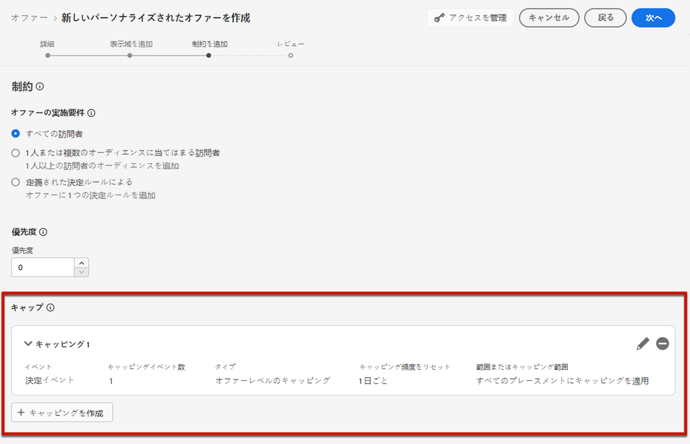
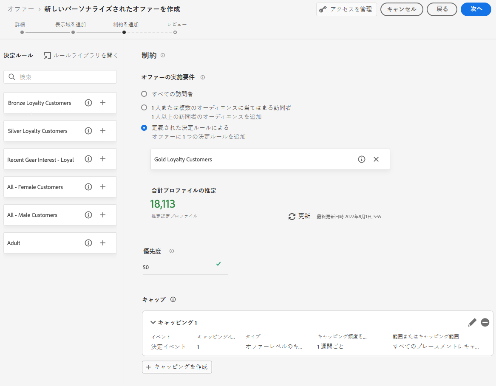
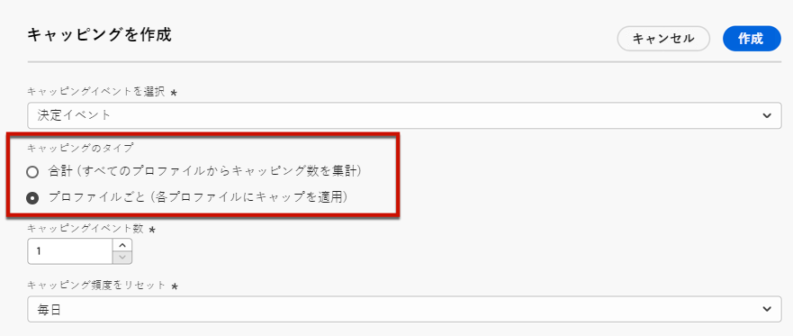

# オファーへの制約の追加 {#add-constraints}

>[!CONTEXTUALHELP]
>id="od_offer_constraints"
>title="オファー制約について"
>abstract="制約を使用すると、オファーを他のオファーと比較して優先順位付けしユーザーに提示する方法を指定できます。"

>[!CONTEXTUALHELP]
>id="od_offer_priority"
>title="オファーの優先度について"
>abstract="このフィールドでは、オファーの優先度設定を指定できます。優先度は、実施要件、日付、制限などのすべての制約を満たすオファーをランク付けするための数値です。"

>[!CONTEXTUALHELP]
>id="ajo_decisioning_priority"
>title="優先度"
>abstract="ユーザーが複数のオファーの対象となる場合、優先度は他のオファーと比較したオファーの優先度の定義に役立ちます。オファーの優先度が高いほど、他のオファーと比較して優先順位が高くなります。"

制約を使用すると、オファーを表示する条件を定義できます。

1. **[!UICONTROL オファー実施要件]**&#x200B;を設定します。[詳細情報](#eligibility)

   

1. ユーザーが複数のオファーの対象となる場合は、他のオファーと比較したオファーの「**[!UICONTROL 優先度]**」を定義します。オファーの優先度が高いほど、他のオファーと比較して優先順位が高くなります。

   

1. オファーの&#x200B;**[!UICONTROL キャッピング]**&#x200B;を指定します。キャッピングはオファーが表示される回数を意味します。[詳細情報](#capping)

   

1. 「**[!UICONTROL 次へ]**」をクリックし、定義したすべての制約を確定します。

例えば、次の制約を設定した場合：

* オファーは、「ゴールドロイヤルティ顧客」決定ルールに一致するユーザーに対してのみ考慮されます。
* オファーの優先度は「50」に設定されています。つまり、このオファーは優先度が 1～49 のオファーより先に、優先度が 51 以上のオファーより後に表示されます。
* オファーは、すべてのプレースメントをまたいで、ユーザーごとに 1 回だけ表示されます。

## 実施要件 {#eligibility}

>[!CONTEXTUALHELP]
>id="ajo_decisioning_eligibility"
>title="実施要件"
>abstract="オファーの実施要件を使用すると、セグメントや決定ルールを使用して定義する特定のプロファイルにオファーを制限できます。"

>[!CONTEXTUALHELP]
>id="od_offer_eligibility"
>title="オファー実施要件について"
>abstract="このセクションでは、決定ルールを使用して、オファーの対象となるユーザーを決定できます。"
>additional-url="https://video.tv.adobe.com/v/329373" text="デモビデオを見る"

「**[!UICONTROL オファーの実施要件]**」セクションでは、セグメントまたは決定ルールを使用して定義する特定のプロファイルにオファーを制限できます。

>[!NOTE]
>
>**セグメント**&#x200B;と&#x200B;**決定ルール**&#x200B;の使用上の違いについて詳しくは、[この節](#segments-vs-decision-rules)を参照してください。

* デフォルトでは、「**[!UICONTROL すべての訪問者]**」オプションが選択されています。これは、すべてのプロファイルがオファーを提示される資格があることを意味します。

   

* また、オファーの表示を、1 つまたは複数の [Adobe Experience Platform セグメント](../../segment/about-segments.md)のメンバーに限定できます。

   それには、「]**1 つまたは複数のセグメントに分類される訪問者**[!UICONTROL 」オプションを有効にしたあと、左ペインから 1 つまたは複数のセグメントを追加し、**[!UICONTROL And]**／**[!UICONTROL Or]** 論理演算子を使用してそれらを結合します。

   

* 特定の[決定ルール](../offer-library/creating-decision-rules.md)をオファーに関連付ける場合は、**[!UICONTROL 定義済みの決定ルール]**&#x200B;を選択し、目的のルールを左ペインから&#x200B;**[!UICONTROL 決定ルール]**&#x200B;領域にドラッグします。

   

   >[!CAUTION]
   >
   >イベントベースのオファーは、現在 [!DNL Journey Optimizer] ではサポートされていません。[イベント](https://experienceleague.adobe.com/docs/experience-platform/segmentation/ui/segment-builder.html?lang=ja#events){target=&quot;_blank&quot;}に基づいて決定ルールを作成した場合、それをオファーで活用することはできません。

### セグメントと決定ルールの使用上の違い {#segments-vs-decision-rules}

制約を適用するには、1 つまたは複数の **Adobe Experience Platform セグメント**&#x200B;のメンバーにオファーの選択を限定するか、**決定ルール**&#x200B;を使用します。どちらの手段もそれぞれ異なる使用法に対応します。

基本的に、セグメントの出力はプロファイルのリストです。一方、決定ルールは、決定プロセス中に単一プロファイルに対してオンデマンドで実行される関数です。この 2 つの使用法の違いを以下に詳しく説明します。

* **セグメント**

   セグメントは、プロファイル属性とエクスペリエンスイベントに基づく特定のロジックに一致する Adobe Experience Platform プロファイルのグループです。ただし、オファー管理ではセグメントの再計算は行われないので、オファーを提示する際にセグメントが最新でない可能性があります。

   セグメントの詳細については、[この節](../../segment/about-segments.md)を参照してください。

* **決定ルール**

   一方、決定ルールは、Adobe Experience Platform で使用可能なデータに基づいており、オファーを誰に表示できるかを決定します。特定のプレースメントのオファーまたは決定でルールが選択されると、決定が行われるたびにそのルールが実行されるので、各プロファイルが最新かつ最適なオファーを確実に取得できます。

   決定ルールについて詳しくは、[この節](creating-decision-rules.md)を参照してください。

## フリークエンシーキャップ {#capping}

>[!CONTEXTUALHELP]
>id="od_offer_globalcap"
>title="オファーキャッピングについて"
>abstract="このフィールドでは、オファーを提示できる回数を指定できます。"

>[!CONTEXTUALHELP]
>id="ajo_decisioning_capping"
>title="キャッピング"
>abstract="キャッピングは、オファーを提示できる最大回数を定義する制約として使用されます。"

キャッピングは、オファーを提示できる最大回数を定義する制約として使用されます。

ユーザーが特定のオファーを受け取る回数を制限すると、顧客への過度の勧誘を防ぎ、各タッチポイントをそれに適したオファーで最適化できます。

キャッピングを設定するには、次の手順に従います。

1. オファーを提示できる回数を定義します。

   

   >[!NOTE]
   >
   >数値は 0 より大きい整数にする必要があります。

1. キャッピングを適用する対象は、すべてのユーザーか、1 つの特定のプロファイルかを指定します。

   

   * **[!UICONTROL 合計]**&#x200B;を選択し、組み合わせたターゲットオーディエンス（つまり、すべてのユーザー）に対してオファーを提案できる回数を定義します。

      例えば、「超特価品 TV」を販売する電子機器小売業者の場合、オファーが返される回数は、すべてのプロファイルで 200 回に制限されます。

   * **[!UICONTROL プロファイルごと]**&#x200B;を選択して、1 つのオファーを同じユーザーに対して提案できる回数を定義できます。

      例えば、「プラチナクレジットカード」のオファーを持つ銀行の場合、このオファーを 1 つのプロファイルにつき 5 回以上表示したくないとします。実際、ユーザーがオファーを 5 回見て、それに対して何らかのアクションを起こしていない場合、その次に最適なオファーに対して行動する可能性が高いと考えられます。

1. オファーの複数の[表示域](#representations)を定義した場合、キャッピングを「**[!UICONTROL すべてのプレースメントで]**」または「**[!UICONTROL プレースメントごとに]**」適用するかどうかを指定します。

   

   * **[!UICONTROL すべてのプレースメントで]**：キャッピング数は、オファーに関連付けられたプレースメント全体のすべての決定の合計となります。

      例えば、オファーに&#x200B;**電子メール**&#x200B;プレースメントと **web** プレースメントがあり、**すべてのプレースメントのプロファイルあたりキャッピングを 2** に設定した場合、各プロファイルは、プレースメントミックスに関係なく、合計で最大 2 回オファーを受け取ることができます。

   * **[!UICONTROL プレースメントごとに]**：キャッピング数は、各プレースメントに対して個別に決定回数が適用されます。

      例えば、オファーに&#x200B;**電子メール**&#x200B;プレースメントと **web** プレースメントがあり、**各プレースメントに対するプロファイルあたりキャッピングを 2** に設定した場合、各プロファイルは、電子メールプレースメントに対して最大 2 回、web プレースメントに対してさらに 2 回、オファーを受け取ることができます。

1. 保存および承認されると、定義した条件に従って、このフィールドに指定した回数のオファーが提示された場合、配信は停止されます。

E メールの準備時に、オファーが提案された回数が計算されます。例えば、複数のオファーを含んだメールを準備する場合、そのメールが送信されるかどうかに関係なく、それらのオファーの数はオファーの提示回数に加算されます。

<!--If an email delivery is deleted or if the preparation is done again before being sent, the capping value for the offer is automatically updated.-->

>[!NOTE]
>
>キャッピングカウンターは、オファーの有効期限切れ、またはオファーの開始日から 2 年後の、いずれか早い方でリセットされます。オファーの日付を定義する方法については、[この節](creating-personalized-offers.md#create-offer)を参照してください。

### キャッピングに対する日付変更の影響 {#capping-change-date}

>[!CONTEXTUALHELP]
>id="ajo_decisioning_offer_change_date"
>title="日付を変更すると、キャッピングに影響を与える可能性があります"
>abstract="このオファーにキャッピングが適用されている場合、開始日または終了日を変更すると影響を受ける可能性があります。"

オファーの日付を変更する場合は、次の条件を満たすとキャッピングに影響を与える可能性があるので、慎重に行う必要があります。

* オファーが[承認済み](#review)。
* [キャッピング](#capping)が既にオファーに適用済み。
* キャッピングがプロファイルごとに定義されている。

>[!NOTE]
>
>オファーの日付を定義する方法については、[この節](creating-personalized-offers.md#create-offer)を参照してください。

プロファイルごとのフリークエンシーキャップでは、各プロファイルのキャッピング回数が保存されます。承認されたオファーの開始日と終了日を変更すると、以下に説明する様々なシナリオに従って、一部のプロファイルのキャッピングカウントが影響を受ける可能性があります。

以下は、**オファー開始日を変更**&#x200B;した場合に考えられるシナリオです。

| シナリオ： 次の場合... | 結果： 次に... | キャッピングカウントに対する影響の可能性 |
|--- |--- |--- |
| ...オファーの開始日が、元のオファーの開始日が開始する前に更新される | ...キャッピングカウントは新しい開始日に開始される。 | × |
| ...新しい開始日が現在の終了日より前 | ...キャッピングは新しい開始日から続行し、各プロファイルの以前のキャッピング数が繰り越される。 | × |
| ...新しい開始日が現在の終了日より後 | ...現在のキャッピングは期限切れになり、新しい開始日にすべてのプロファイルに対して新しいキャッピング数が 0 から再び開始される。 | ○ |

以下は、**オファー終了日を延長**&#x200B;した場合に考えられるシナリオです。

| シナリオ： 次の場合... | 結果： 次に... | キャッピングカウントに対する影響の可能性 |
|--- |--- |--- |
| ...元のオファーの終了日より前に決定リクエストが発生 | ...キャッピング数が更新され、各プロファイルの以前のキャッピング数が繰り越される。 | × |
| ...元の終了日より前に決定リクエストが発生していない | ...キャッピング回数は、各プロファイルの元の終了日にリセットされる。元の終了日の後に発生する新しい決定リクエストに対しては、新しいキャッピング数が 0 から再び開始されます。 | ○ |

**例**

元の開始日が **1月1日**、有効期限が **1月31日**&#x200B;に設定されたオファーがあるとします。

1. プロファイル X、Y、Z がオファーに表示されます。
1. **1月10日**&#x200B;に、オファーの終了日が **2月15日**&#x200B;に変更されました。
1. **1月11日から 1月31日**&#x200B;の間、プロファイル Z のみがオファーに表示されます。

   * 決定リクエストが&#x200B;**プロファイル Z の**&#x200B;元の終了日より前に発生したため、オファーの終了日は **2月15日**&#x200B;に延長されます。
   * ただし、**プロファイル X と Y** では、元の終了日より前のアクティビティが発生していないため、カウンターは期限切れになり、キャッピングカウントは **1月31日**&#x200B;に 0 にリセットされます。

