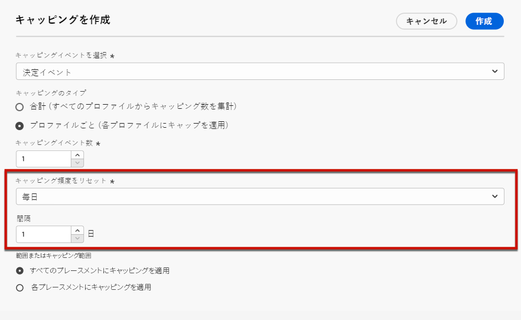
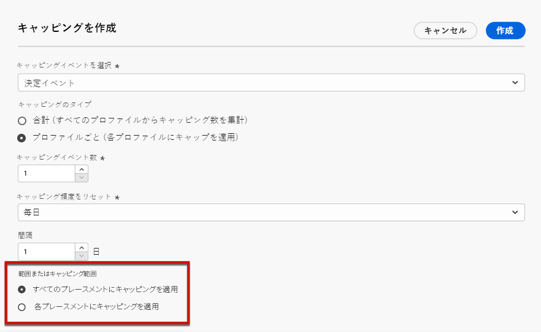

# 特典に制約を追加する {#add-constraints}

>[!CONTEXTUALHELP]
>id="od_offer_constraints"
>title="提供制約について"
>abstract="制約を使用すると、他の特典と比較して、オファーに優先順位を付け、ユーザーに提示する方法を指定できます。"

>[!CONTEXTUALHELP]
>id="ajo_decisioning_constraints"
>title="提供制約について"
>abstract="制約を使用すると、他の特典と比較して、オファーに優先順位を付け、ユーザーに提示する方法を指定できます。"

>[!CONTEXTUALHELP]
>id="od_offer_priority"
>title="オファーの優先順位について"
>abstract="このフィールドでは、オファーの優先度の設定を指定することができます。 Priority は、適格性、日付、および上限のすべての拘束条件を満たすランク付けに使用される番号です。"

>[!CONTEXTUALHELP]
>id="ajo_decisioning_priority"
>title="重要度の設定"
>abstract="ユーザーが複数のサービスを提供する場合は、他のサービスと比較して、その優先順位を定義することができます。 提供される優先度が高いほど、その優先度は他の製品と比較されます。"

制約を使用すると、オファーを表示するための条件を定義することができます。

1. を **[!UICONTROL Offer eligibility]** 設定します。 [詳細情報](#eligibility)

   

1. **[!UICONTROL Priority]**&#x200B;ユーザーが複数のオファーに限定されている場合は、他のサービスとの比較を定義します。提供される優先度が高いほど、その優先度は他の製品と比較されます。

   

1. オファーの表示回数を指定します。これ **[!UICONTROL Capping]** によって、オファーの表示回数を指定します。 [詳細情報](#capping)

   

1. 「」をクリックし **[!UICONTROL Next]** て、定義したすべての制約を確認します。

例えば、次のような制約を設定したとします。

* この申し出は、「ゴールドロイヤルティ顧客」意思決定ルールにのみ適合するユーザーに対して考慮されます。
* オファーの優先度は &quot;50&quot; に設定されています。これは、1 ~ 49 の優先度を指定し、さらにその後に、少なくとも51の優先順位を持つオファーが表示されることを意味します。
* このオファーは、すべてのユーザーに対して一度だけ提示されます。

## 適格性 {#eligibility}

>[!CONTEXTUALHELP]
>id="ajo_decisioning_eligibility"
>title="適格性の定義"
>abstract="初期設定では、すべてのプロファイルにその提案が表示されますが、セグメントまたはデシジョンルールを使用して、特定のプロファイルのみを提示することもできます。"

>[!CONTEXTUALHELP]
>id="od_offer_eligibility"
>title="特典の特典について"
>abstract="この節では、意志決定ルールを使用して、どのユーザーが申し出が適しているかを判断します。"
>additional-url="https://video.tv.adobe.com/v/329373" text="デモビデオを見る"

>[!CONTEXTUALHELP]
>id="ajo_decisioning_total_profile_estimate"
>title="プロファイル見積合計"
>abstract="セグメントまたは意志決定ルールを選択すると、見積もりが適用されているプロファイルに関する情報が表示されます。"

このセクションでは、 **[!UICONTROL Offer eligibility]** セグメントまたはデシジョンルールを使用して定義する特定のプロファイルのみを提供することができます。

>[!NOTE]
>
>この節 ](#segments-vs-decision-rules) では、 [ セグメント **** とデシジョンルール **の使用について詳しく説明して** います。

* デフォルト **[!UICONTROL All visitors]** では、このオプションが選択されているので、すべてのプロファイルが提供されます。

   

* また、1つまたは複数 [ の Adobe エクスペリエンスプラットフォームセグメント ](../../segment/about-segments.md) のメンバーに対するオファーの表示を制限することもできます。

   これを行うには、このオプションを有効 **[!UICONTROL Visitors who fall into one or multiple segments]** にしてから、左ペインで1つまたは複数のセグメントを追加し、論理演算子を使用して **[!UICONTROL And]** **[!UICONTROL Or]** 結合します。

   

* 特定 [ の判断規則 ](../offer-library/creating-decision-rules.md) をオファーに関連付けるには、を選択 **[!UICONTROL By defined decision rule]** してから、目的のルールを左側のウィンドウから領域に **[!UICONTROL Decision rule]** ドラッグします。

   

   >[!CAUTION]
   >
   >イベントベースのオファーは、で [!DNL Journey Optimizer] は現在サポートされていません。 イベント ](https://experienceleague.adobe.com/docs/experience-platform/segmentation/ui/segment-builder.html?lang=en#events) {target = &quot;_blank&quot;} に [ 基づいて意思決定ルールを作成すると、申し出に活用できなくなります。

セグメントまたは意志決定ルールを選択すると、見積もりが適用されているプロファイルに関する情報が表示されます。 データを更新するには、をクリック **[!UICONTROL Refresh]** します。

>[!NOTE]
>
>ルールパラメーターには、プロファイルにないデータ (コンテキストデータなど) が含まれている場合は、プロファイル見積を使用できません。 例えば、現在の気象に80度の≥が必要な適格性ルールを指定します。

### セグメント対決定ルールの使用 {#segments-vs-decision-rules}

制約を適用するために、1つまたは複数 **の Adobe エクスペリエンスプラットフォームセグメント** のメンバーだけを対象とするように制限することができます。また、別の用途に応じた意思決定規則 **を使用** することもできます。

基本的に、セグメントの出力はプロファイルのリストであり、決定ルールは、decisioning プロセス中に1つのプロファイルに対して要求によって実行される関数です。 この2つの使用方法の違いについては、次に説明します。

* **層**

   つまり、セグメントは、プロファイル属性や経験イベントに基づいて特定のロジックに一致する Adobe エクスペリエンスプラットフォームプロファイルのグループです。 ただし、オファー管理ではセグメントは再計算されません。これは、オファーの表示時には最新ではない可能性があります。

   この節 ](../../segment/about-segments.md) では、 [ セグメントについて詳しく説明しています。

* **決定ルール**

   これに対して、決定ルールは、Adobe 体験プラットフォームで利用可能なデータに基づいています。また、どのユーザーにどのオファーが表示されるかを決定するためにも使用されます。 特定の場所を指定した場合、または選択した場合は、決定が行われるたびにこのルールが実行されます。これにより、各プロファイルが最新かつ最適なオファーを取得することができます。

   このセクション ](creating-decision-rules.md) では、 [ 決定ルールについて詳しく説明します。

## 上限 {#capping}

>[!CONTEXTUALHELP]
>id="od_offer_globalcap"
>title="「上限機能について」"
>abstract="このフィールドでは、オファーを表示できる回数を指定することができます。"

>[!CONTEXTUALHELP]
>id="ajo_decisioning_capping"
>title="ソリッドカットの使用"
>abstract="Solicitating が過剰に使用されないようにするには、上限値を使用して、オファーリングの表示回数を指定します。"

>[!CONTEXTUALHELP]
>id="ajo_decisioning_frequency_capping"
>title="ソリッドカット線数の設定"
>abstract="このような場合は、デイリー、weekly、毎月のいずれかを選択して、上限を設定することができます。"

上限は、オファーの表示回数の最大値を定義する制約として使用されます。

ユーザーが特定のサービスを利用できる回数を制限することによって、solicitating を防ぐことができます。したがって、各 touchpoint を最適なオファーによって最適化することができます。

上限を設定するには、次の手順に従います。

1. オファーの表示回数を指定します。

   

   >[!NOTE]
   >
   >この数値は、0より大きい整数である必要があります。

1. 全ユーザーに対して、または1つの特定のプロファイルに対して、上限を適用するかどうかを指定します。

   

   * このチェックボックスをオン **[!UICONTROL In total]** にすると、すべてのユーザーを対象として、すべてのユーザーに対して提示されるキャンペーンの対象ユーザー数を指定できます。

      例えば、「TV doorbuster 商談」を利用している電子工学用販売会社の場合は、すべてのプロファイルに200回しか提供されないようにする必要があります。

   * このオプションを選択 **[!UICONTROL Per profile]** して、1つのユーザーに提示するオファー数を指定します。

      例えば、「プラチナクレジットカード」という申し出がある銀行なら、1つのプロファイルにこのオファーが5回を超える表示にならないようにします。 実際に、ユーザーは5回、その機能に対応していない場合は、次の最適なオファーで行動する可能性が高くなります。
   <!--
    Set the **[!UICONTROL Frequency]** to define how often the capping count is reset. To do so, define the time period for the counting (daily, weekly or monthly) and enter the number of days/weeks/months of your choice.
    
    >[!NOTE]
    >
    >The reset happens at 12am UTC, on the day that you defined or on the first day of the week/month when applicable. The week start day is Sunday.
    
    For example, if you want the capping count to be reset every 2 weeks, select **[!UICONTROL Weekly]** from the **[!UICONTROL Repeat]** drop-down list and type **2** in the other field. The reset will happen every other Sunday at 12pm UTC.
    -->

1. 申し出に対して複数 [ の表現 ](add-representations.md) を定義している場合は、ソリッド **[!UICONTROL Across all placements]** **[!UICONTROL For each placement]** 化を適用するかどうかを指定します。

   

   * **[!UICONTROL Across all placements]**: 上限値を使用すると、申し出に関連するすべての意思決定が合計されます。

      例えば、1つの申し出に電子メール **の配置と** Web **の配置が** ある場合、すべて **の配置においてプロファイルごとに2つの「上限** 」を設定すると、配置ミックスに関係なく、各プロファイルは合計2倍の割引を受け取ることができます。

   * **[!UICONTROL For each placement]**: 上限数は、各配置の決定回数を個別に適用します。

      例えば、1つの申し出に電子メール **の配置と** Web **配置が** ある場合に、各配置 **について各プロファイルに「2」の上限** を設定すると、各プロファイルは、電子メールの配置については最大2倍、web の配置については2倍の容量を追加することができます。

1. 保存と承認が完了したときに、このフィールドに指定されている条件とタイムフレームの値に従って指定された回数が表示されると、その配信は停止されます。

提示が提案される回数は、電子メールの準備時間に計算されます。 例えば、多数のサービスが含まれている電子メールを作成すると、電子メールが送信されたかどうかに関係なく、それらの数字が最大 cap に加算されます。

<!--If an email delivery is deleted or if the preparation is done again before being sent, the capping value for the offer is automatically updated.-->

>[!NOTE]
>
>上限を設定すると、オファーが期限切れになるか、オファー開始日の後2年後にリセットされます。 このセクション ](creating-personalized-offers.md#create-offer) で [ は、オファーの日付を定義する方法について説明します。

### 変更される日付を上限に変更した場合の影響 {#capping-change-date}

>[!CONTEXTUALHELP]
>id="ajo_decisioning_offer_change_date"
>title="日付の変更は、上限に影響する可能性があります。"
>abstract="このオファーに対して上限が適用されている場合は、開始日と終了日を変更したときに影響を受けることがあります。"

次の条件が満たされている場合は、上限に影響する可能性があるので、オファーの日付を変更する際には注意が必要です。

* 申し出が承認 ](#review) さ [ れます。
* [上限 ](#capping) は既に申し出に適用されています。
* 上限はプロファイルごとに定義されます。

>[!NOTE]
>
>このセクション ](creating-personalized-offers.md#create-offer) で [ は、オファーの日付を定義する方法について説明します。

1つのプロファイルに対する上限数は、各プロファイルの上限数を格納します。 許可されたオファーの開始日と終了日を変更する場合、次に示すシナリオによっては、一部のプロファイルの上限数が影響を受ける場合があります。

以下に、オファー開始日 **を変更する場合** に可能なシナリオを示します。

| シナリオ:   If... | 次のような結果   になります。 | 上限数に対する影響を与える可能性があります。 |
|--- |--- |--- |
| ...オファー開始日は、元のキャンペーン開始日が開始される前に更新されます。 | ...上限数は、新しい開始日から開始されます。 | 違います |
| ...新しい開始日が現在の終了日より前になっています。 | ...上限が開始されると、すべてのプロファイルで前の「上限」が維持されます。 | 違います |
| ...新しい開始日が現在の終了日よりも後になっています。 | ...現在の上限値は有効期限切れになり、新しい上限値は、新しい開始日のすべてのプロファイルについて0から再度開始されます。 | うん |

この場合 **** 、次のようなシナリオが考えられます。

| シナリオ:   If... | 次のような結果   になります。 | 上限数に対する影響を与える可能性があります。 |
|--- |--- |--- |
| ...decisioning リクエストは、元のキャンペーン終了日付より前に実行されます。 | ...上限数が更新され、各プロファイルの前の上限が維持されます。 | 違います |
| ...decisioning 要求は、元の終了日よりも前には実行されません。 | ...上限数は、各プロファイルの元の終了日にリセットされます。 新しい decisioning 要求があった場合、新しい上限値は0から再開始されます。 | うん |

**一**

最初の開始日が 1 **** 月、31 **日に設定** されているオファーがあるとします。

1. プロファイル X、Y、Z には申し出が表示されます。
1. 年1月 10 **日に** は、オファーの終了日が2月 15 **日に** 変更されました。
1. **Profile 年1月から12月まで** は、プロファイル Z のみが提供されています。

   * Decisioning 要求は profile Z **の最初の終了日** より前に行われているので、オファーの終了日を2月 15 **日に** 延長することもできます。
   * ただし、プロファイル X および Y **の** 最初の終了日付よりも前に実行された操作がないので、これらのカウンターは有効期限切れになり、1月 31 **日に** 0 にリセットされます。

