# オファーに表示域を追加する {#add-representations}

>[!CONTEXTUALHELP]
>id="ajo_decisioning_representation"
>title="表示域"
>abstract="表示域を追加して、メッセージでオファーを表示する場所を定義します。オファーの表示域が多いほど、異なるプレースメントコンテキストでオファーを使用する機会が多くなります。"

オファーは、メッセージの様々な場所に表示できます（画像付きトップバナー、段落内のテキスト、HTML ブロックなど）。オファーの表示域が多いほど、異なるプレースメントコンテキストでオファーを使用する機会が多くなります。

## オファーの表示域の設定 {#representations}

1 つ以上の表示域をオファーに追加して設定するには、以下の手順に従います。

1. 1 つ目の表示域で、まず、使用する&#x200B;**[!UICONTROL チャネル]**&#x200B;を選択します。

   

   >[!NOTE]
   >
   >選択したチャネルで使用可能なプレースメントのみが&#x200B;**[!UICONTROL プレースメント]**&#x200B;ドロップダウンリストに表示されます。

1. リストからプレースメントを選択します。

   「**[!UICONTROL プレースメント]**」ドロップダウンリストの横にあるボタンを使用して、すべてのプレースメントを参照することもできます。

   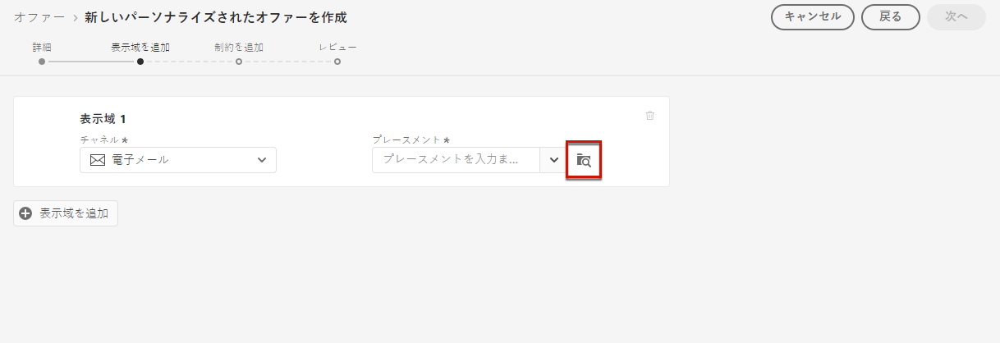

   そこからさらに、チャネルやコンテンツタイプに従ってプレースメントをフィルタリングすることもできます。プレースメントを選択し、「**[!UICONTROL 選択]**」をクリックします。

   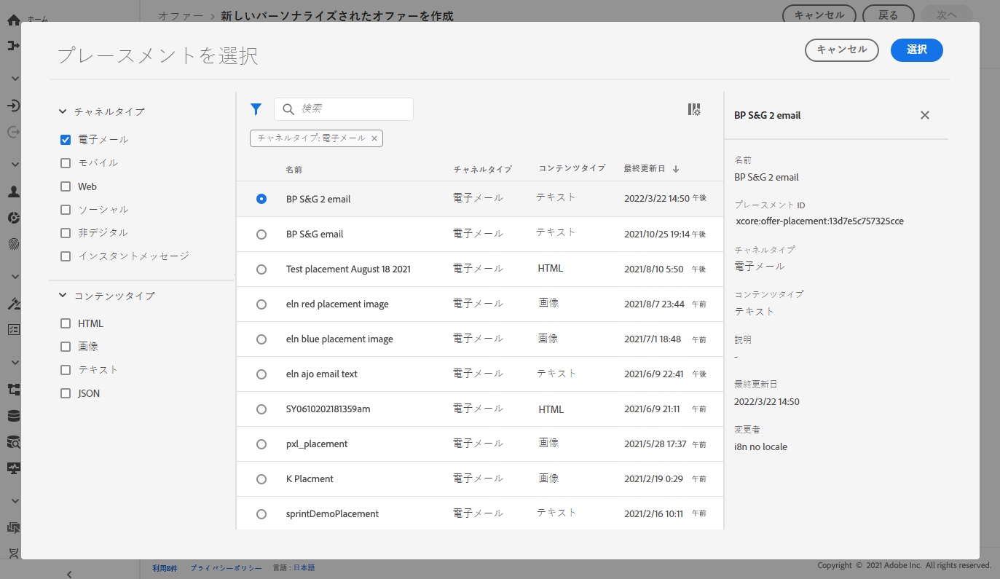

1. 表示域にコンテンツを追加します。[この節](#content)の手順を参照してください。

1. 画像や URL などのコンテンツを追加する際は、**[!UICONTROL 宛先リンク]**&#x200B;を指定できます。オファーをクリックしたユーザーは、対応するページに移動します。

   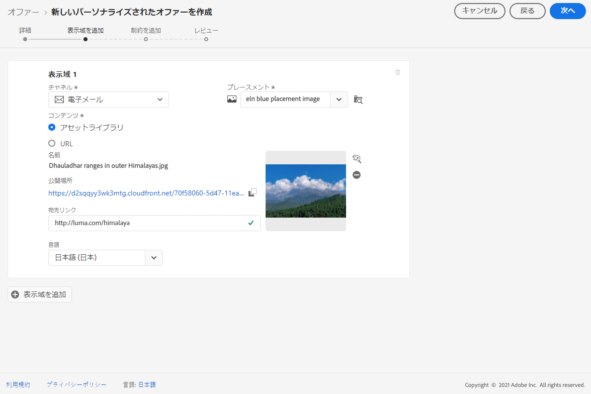

1. 最後に、目的の言語を選択して、ユーザーに表示する内容を識別および管理できるようにします。

1. さらに表示域を追加するには、「**[!UICONTROL 表示域を追加]**」ボタンを使用し、必要な数の表示域を追加します。

   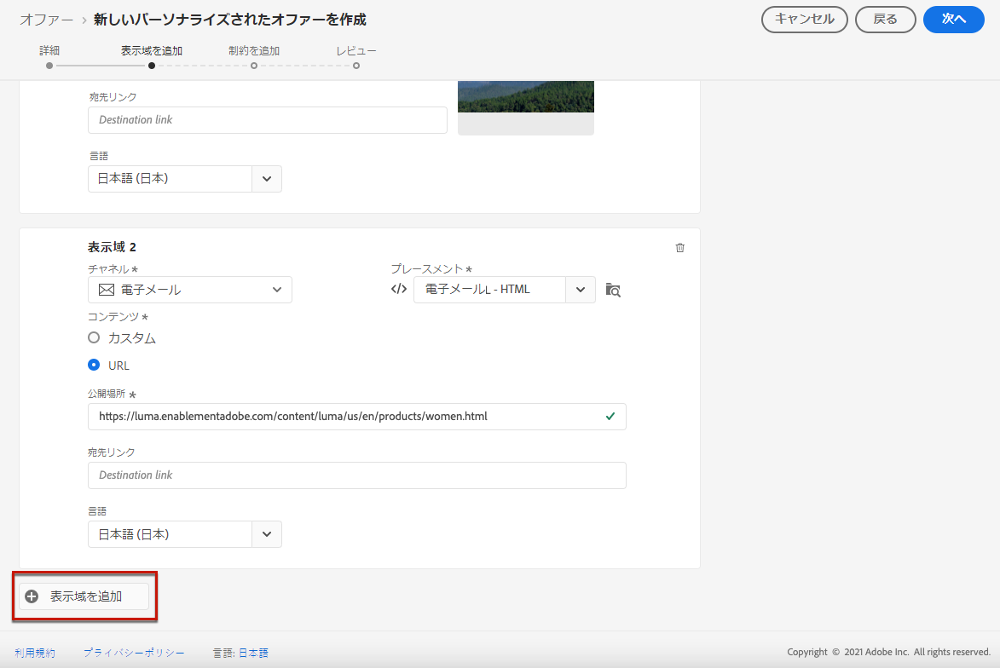

1. 表示域をすべて追加したら、「**[!UICONTROL 次へ]**」を選択します。

## 表示域のコンテンツの定義 {#content}

表示域には、様々なタイプのコンテンツを追加できます。

>[!NOTE]
>
>プレースメントのコンテンツタイプに対応するコンテンツのみ使用できます。

### 画像の追加 {#images}

選択したプレースメントが画像タイプの場合、**Adobe Experience Cloud アセット**&#x200B;ライブラリからコンテンツを取得して追加できます。このライブラリは、[!DNL Adobe Experience Manager Assets] に用意されている一元的なアセットリポジトリです。

>[!NOTE]
>
> [Adobe Experience Manager Assets Essentials](https://experienceleague.adobe.com/docs/experience-manager-assets-essentials/help/introduction.html?lang=ja){target="_blank"} と連携するには、組織に [!DNL Assets Essentials] をデプロイし、ユーザーが **Assets Essentials コンシューマーユーザー**&#x200B;または **Assets Essentials ユーザー**&#x200B;の製品プロファイルに登録されていることを確認する必要があります。詳しくは、[このページ](https://experienceleague.adobe.com/docs/experience-manager-assets-essentials/help/get-started-admins/deploy-administer.html?lang=ja){target="_blank"}を参照してください。

1. 「**[!UICONTROL アセットライブラリ]**」オプションを選択します。

1. 「**[!UICONTROL 参照]**」を選択します。

   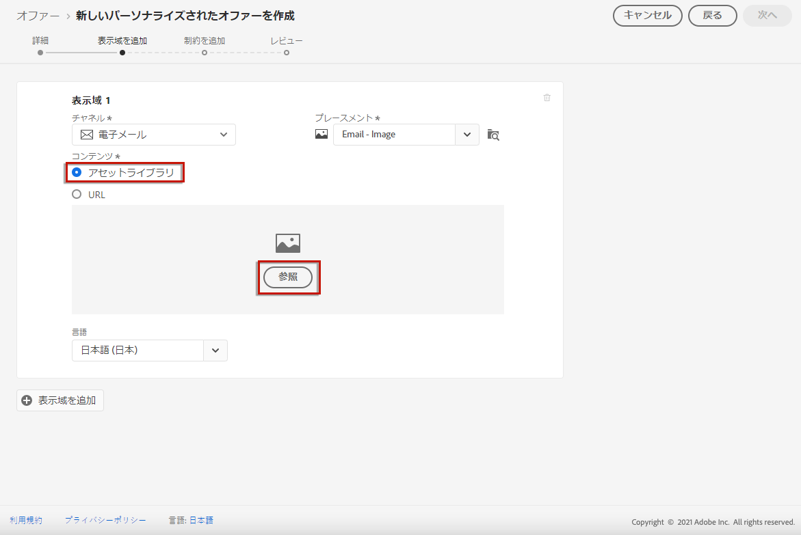

1. アセットを参照して、目的の画像を選択します。

1. 「**[!UICONTROL 選択]**」をクリックします。

   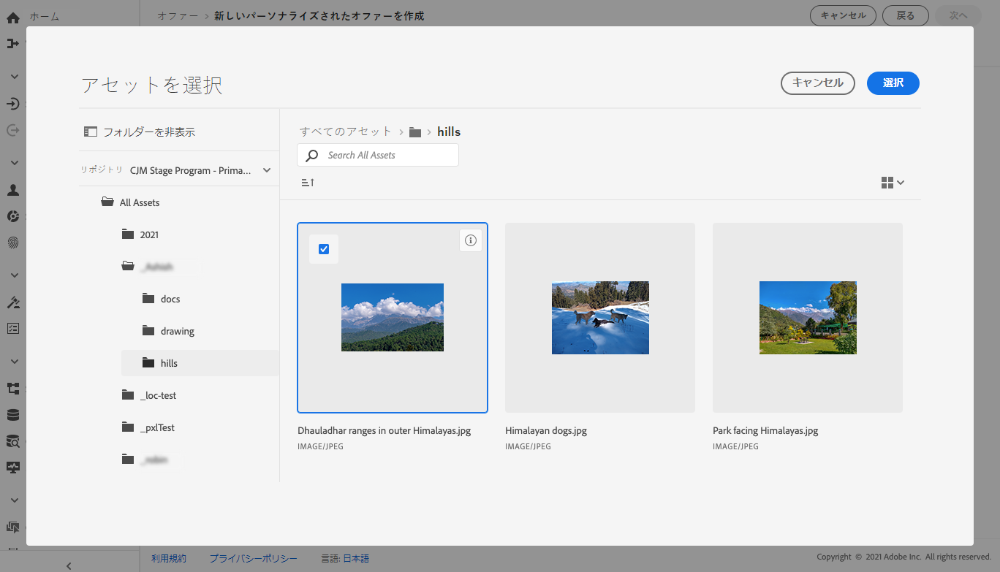

### HTML または JSON ファイルの追加 {#html-json}

選択したプレースメントが HTML タイプの場合、[Adobe Experience Cloud アセットライブラリ](https://experienceleague.adobe.com/docs/experience-manager-assets-essentials/help/introduction.html?lang=ja){target="_blank"}）から HTML または JSON コンテンツを取得して追加することもできます。

例えば、[Adobe Experience Manager](https://experienceleague.adobe.com/docs/experience-manager.html?lang=ja){target="_blank"} で HTML メールテンプレートを作成し、オファーコンテンツにそのファイルを使用したいとします。新しいファイルを作成する代わりに、テンプレートを&#x200B;**アセットライブラリ**&#x200B;にアップロードするだけで、オファーの表示域でテンプレートを再利用できます。

表示域でコンテンツを再利用するには、[この節](#images)の説明に従って&#x200B;**アセットライブラリ**&#x200B;を参照し、選択した HTML または JSON ファイルを選択します。

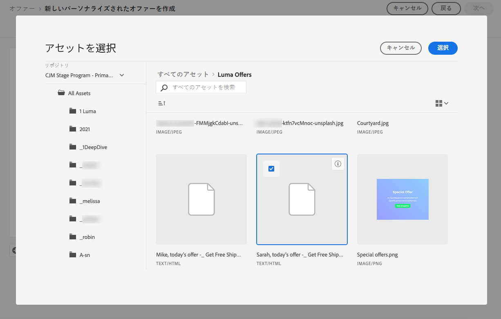

### URL の追加 {#urls}

外部の公開場所からコンテンツを追加するには、「**[!UICONTROL URL]**」を選択してから、追加するコンテンツの URL アドレスを入力します。

パーソナライゼーションエディターを使用して、URL をパーソナライズできます。詳しくは、[パーソナライゼーション](../../personalization/personalize.md#use-expression-editor)を参照してください。

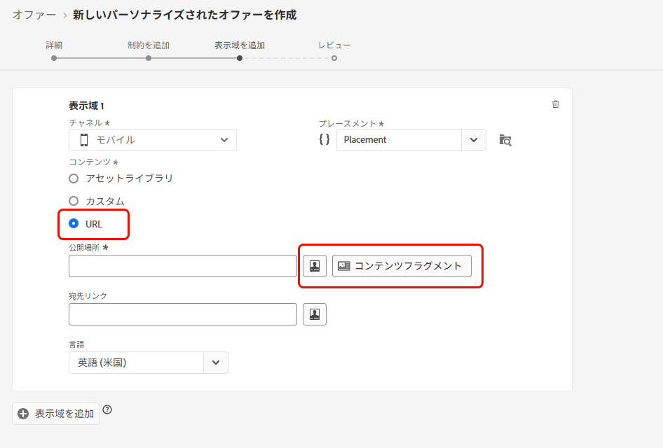

例えば、オファーとして表示される画像をパーソナライズする場合、都会での休暇を好むユーザーにはニューヨークのスカイラインを、ビーチでの休暇を好むユーザーにはハワイのノースショアを表示しようとします。

パーソナライゼーションエディターを使用して、結合スキーマで Adobe Experience Platform に保存されているプロファイル属性を取得します。[詳細情報](https://experienceleague.adobe.com/docs/experience-platform/profile/union-schemas/union-schemas-overview.html?lang=ja){target="_blank"}

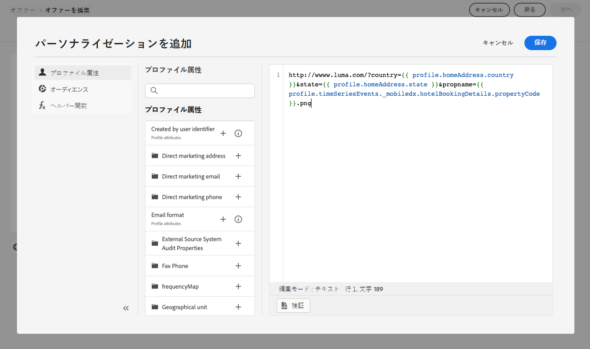

**[!UICONTROL 宛先リンク]**&#x200B;を指定すると、オファーをクリックしたユーザーが誘導される URL をパーソナライズすることもできます。

### カスタムテキストの追加 {#custom-text}

互換性のあるプレースメントを選択したときは、テキストタイプのコンテンツを挿入することもできます。

1. 「**[!UICONTROL カスタム]**」オプションを選択し、「**[!UICONTROL コンテンツを追加]**」をクリックします。

   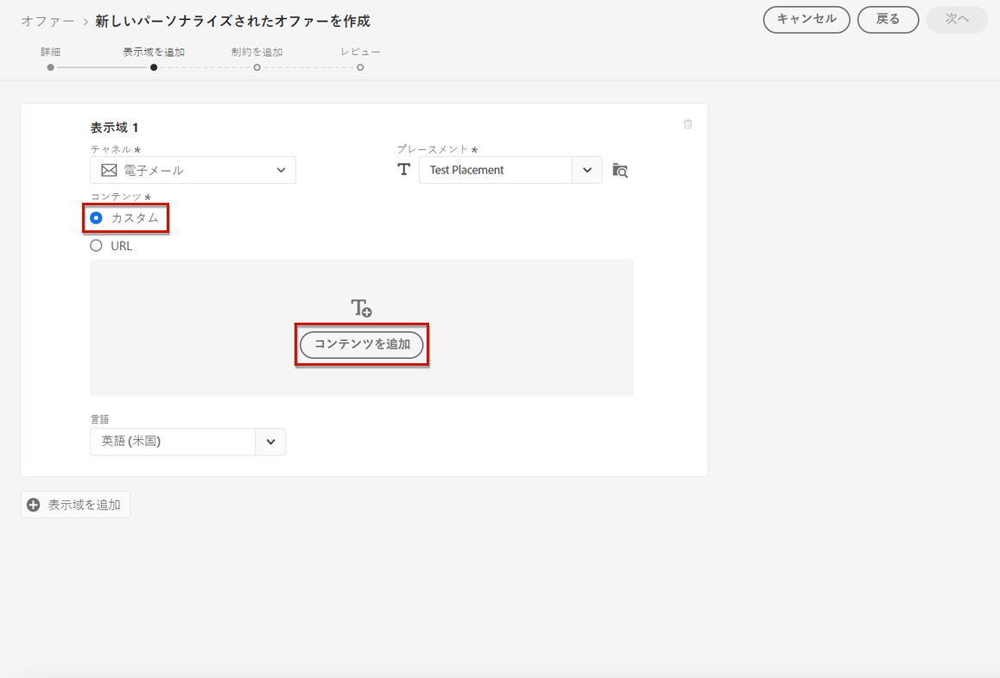

   >[!NOTE]
   >
   >このオプションは、画像タイプのプレースメントには使用できません。

1. オファーに表示されるテキストを入力します。

   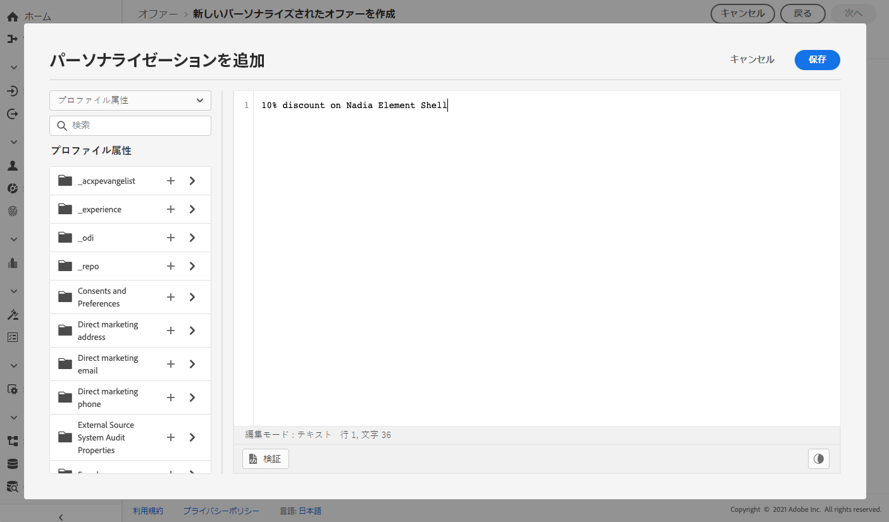

   パーソナライゼーションエディターを使用して、コンテンツをパーソナライズできます。詳しくは、[パーソナライゼーション](../../personalization/personalize.md#use-expression-editor)を参照してください。

   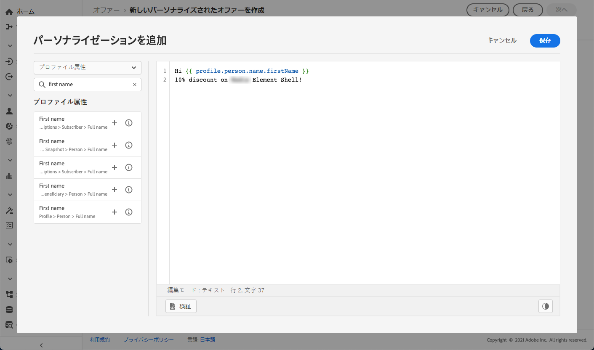

   >[!NOTE]
   >
   >意思決定管理に使用できるソースは、**[!UICONTROL プロファイル属性]**、**[!UICONTROL オーディエンス]**&#x200B;および&#x200B;**[!UICONTROL ヘルパー関数]**&#x200B;のみです。

## コンテキストデータに基づいた表示域のパーソナライズ{#context-data}

[Edge 決定](../api-reference/offer-delivery-api/edge-decisioning-api.md)呼び出しでコンテキストデータが渡されると、これらのデータを活用して表示域を動的にパーソナライズできます。例えば、決定が行われた時点の現在の気象状況などのリアルタイムの要因に基づいて、オファーの表示域を調整できます。

オファー表示域でコンテキストデータを使用するには、`profile.timeSeriesEvents.` 名前空間を使用して、コンテキストデータ変数を表示域コンテンツ内に直接組み込みます。

ユーザーのオペレーティングシステムに基づいてオファーの表示域をパーソナライズするために使用される構文の例を以下に示します。

```
 iosandroid 
```

コンテキストデータを含む、対応する Edge 決定リクエストは次のとおりです。

```
{
    "body": {
        "xdm": {
            "identityMap": {
                "Email": [
                    {
                        "id": "xyz@abc.com"
                    }
                ]
            },
            "device": {
                "model": "Apple"
            }
        },
        "extra": {
            "query": {
                "decisionScopes": [
                    "eyJ4ZG06..."
                ]
            }
        }
    }
}
```
