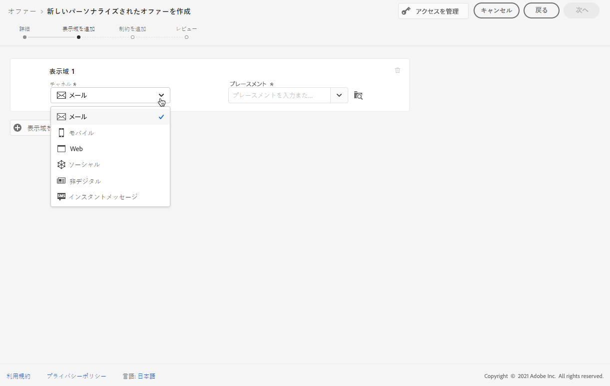

# オファーへの表示の追加 {#add-representations}

>[!CONTEXTUALHELP]
>id="ajo_decisioning_representation"
>title="表現"
>abstract="メッセージを表示する場所を定義するには、表現を追加します。 提供される表現が多いほど、異なる配置コンテキストで提供されている可能性が高くなります。"

このオファーは、ページの上部に表示されるバナーには、画像を使用して、段落内のテキストとして、HTML ブロックとして表示することができます。 提供される表現が多いほど、異なる配置コンテキストで提供されている可能性が高くなります。

## オファーの表示を設定します。 {#representations}

1つまたは複数の形式を申し出に追加し、構成するには、次の手順に従います。

1. 最初の形式については、使用するを選択 **[!UICONTROL Channel]** します。

   

   >[!NOTE]
   >
   >ドロップダウンリストに **[!UICONTROL Placement]** は、選択したチャンネル表示で利用可能な広告のみが表示されます。

1. リストから場所を選択します。

   ドロップダウンリストの **[!UICONTROL Placement]** 横にあるボタンを使用して、すべての配置を参照することもできます。

   

   このような場合でも、チャネルやコンテンツタイプに応じて、配置のフィルターを適用することができます。 配置を選択して、をクリック **[!UICONTROL Select]** します。

   

1. コンテンツを表現に追加します。 この節 ](#content) の説明を [ 参照してください。

1. イメージや URL などのコンテンツを追加する場合は、次の **[!UICONTROL Destination link]** ように指定できます。提供をクリックしたユーザーは、対応するページに送信されます。

   

1. 最後に、ユーザーに対して表示する項目を選択して管理するために、使用する言語を選択します。

1. 別の表現を追加するには、ボタンを使用 **[!UICONTROL Add representation]** して、必要な表現数を追加します。

   

1. すべてのイメージを追加したら、を選択 **[!UICONTROL Next]** します。

## イメージのコンテンツの定義 {#content}

様々なタイプのコンテンツを表現に追加できます。

>[!NOTE]
>
>配置のコンテンツタイプに対応するコンテンツのみを使用できます。

### イメージの追加 {#images}

イメージタイプが選択されている場合は、によっ [!DNL Adobe Experience Manager Assets Essentials] て提供されるアセットの一元的なリポジトリである、Adobe エクスペリエンスクラウドアセット **ライブラリから** のコンテンツを追加することができます。

>[!NOTE]
>
> Adobe Experience Manager _blank アセットを操作 [ するには、「プロジェクトを作成するには、その組織にデプロイ [!DNL Assets Essentials] する必要があります。また、ユーザーは、 **アセット Essentials Consumer users ユーザー** や **、アセット essentials** ユーザー向け製品プロファイルの一部であることを確認して ](https://experienceleague.adobe.com/docs/experience-manager-assets-essentials/help/introduction.html) ください。詳しくは、このページ ](https://experienceleague.adobe.com/docs/experience-manager-assets-essentials/help/get-started-admins/deploy-administer.html) の {target = &quot;_blank&quot;} を参照して [ ください。

1. **[!UICONTROL Asset library]**「オプション」を選択します。

1. を選択 **[!UICONTROL Browse]** します。

   

1. アセットを参照して選択したイメージを選択します。

1. をクリック **[!UICONTROL Select]** します。

   

### HTML ファイルまたは JSON ファイルの追加 {#html-json}

選択された配置が HTML タイプである場合は、Adobe エクスペリエンスクラウドアセットライブラリ ](https://experienceleague.adobe.com/docs/experience-manager-assets-essentials/help/introduction.html) から [ html または JSON コンテンツを追加することもできます {target = &quot;_blank&quot;})。

例えば、Adobe Experience Manager ](https://experienceleague.adobe.com/docs/experience-manager.html) の [ HTML 電子メールテンプレートを作成しました。 {target = &quot;_blank&quot;}、そのファイルをオファーコンテンツとして使用することができます。新しいファイルを作成する代わりに、アセットライブラリ **に** テンプレートをアップロードすれば、オファーの表示で再利用できます。

コンテンツを再利用するには、この節 ](#images) で [ 説明され **ているようにアセットライブラリ** を参照し、選択した HTML ファイルまたは JSON ファイルを選択します。

### Url の追加 {#urls}

外部に公開された場所にあるコンテンツを追加するには、「」を選択 **[!UICONTROL URL]** してから、追加するコンテンツの URL アドレスを入力します。

### カスタムテキストの追加 {#custom-text}

また、互換性のある位置を選択するときに、テキストタイプのコンテンツを挿入することもできます。

1. **[!UICONTROL Custom]**&#x200B;このオプションを選択し、をクリック **[!UICONTROL Add content]** します。

   

   >[!NOTE]
   >
   >このオプションは、イメージタイプの配置では使用できません。

1. 「オファー」に表示されるテキストを入力します。

   

   エクスプレッションエディターを使用して、コンテンツをカスタマイズすることができます。 パーソナル化 ](../../personalization/personalize.md#use-expression-editor) について [ 詳しく説明します。

   

   >[!NOTE]
   >
   >**[!UICONTROL Profile attributes]** **[!UICONTROL Segment memberships]** 意思決定管理には、および **[!UICONTROL Helper functions]** ソースのみを使用できます。

