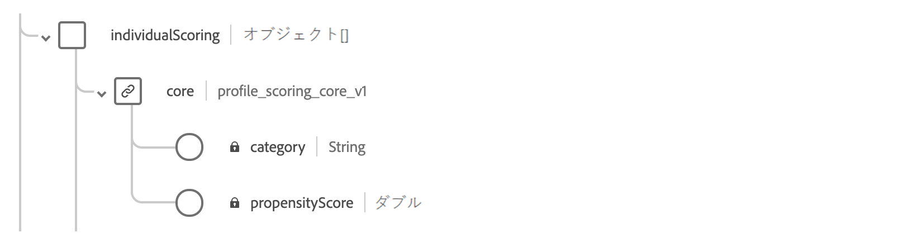
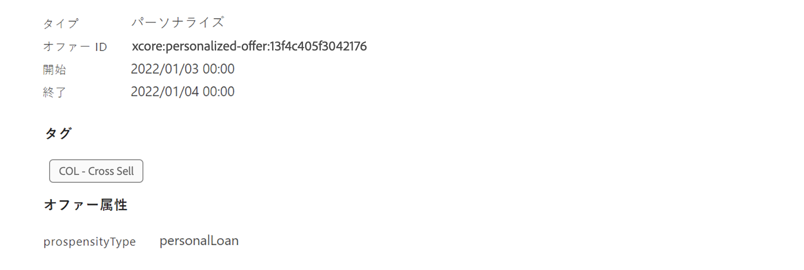

# ランキング式の作成 {#create-ranking-formulas}

## ランキング式について {#about-ranking-formulas}

**ランキング式** を使用すると、オファーの優先度スコアを考慮するのではなく、指定されたプレースメントに対して最初に提示するオファーを決定するルールを定義できます。

ランキング式は **PQL 構文**&#x200B;で表され、式中でプロファイル属性、コンテキストデータ、オファー属性を利用できます。PQL 構文の使用方法について詳しくは、[関連するドキュメント](https://experienceleague.adobe.com/docs/experience-platform/segmentation/pql/overview.html?lang=ja)を参照してください。

ランキング式を作成したら、決定内のプレースメントに割り当てることができます。詳しくは、[決定でのオファーの選択設定](../offer-activities/configure-offer-selection.md)を参照してください。

## ランキング式の作成 {#create-ranking-formula}

ランキング式を作成するには、次の手順に従います。

1. **[!UICONTROL コンポーネント]**&#x200B;メニューにアクセスし、「**[!UICONTROL ランキング]**」タブを選択します。作成済みのランキングのリストが表示されます。

   

1. 「**[!UICONTROL ランキングを作成]**」をクリックして、新しいランキング式を作成します。

   

1. ランキング式の名前、説明、数式を指定します。

   この例では、実際の気温が高い場合に、「hot」属性を持つすべてのオファーの優先度を上げます。そのために、**contextData.weather=hot** を判定の呼び出し時に渡しています。

   

1. 「**[!UICONTROL 保存]**」をクリックします。ランキング式が作成されたら、リストからその式を選択して詳細を取得し、式を編集または削除したりできます。

   これで、ランキング式を決定で使用して、プレースメントに対する実施要件を満たすオファーをランク付けする準備が整いました（「 [決定でのオファー選択の設定](../offer-activities/configure-offer-selection.md)」を参照してください）。

   

## ランキング式の例 {#ranking-formula-examples}

必要に応じて、様々なランキング式を作成できます。 以下に例を示します。

<!--
Boost by offer ID

Boost the priority of an offer with the offer ID *xcore:personalized-offer:13d213cd4cb328ec* by 5.

**Ranking formula:**

```
if( offer._id = "xcore:personalized-offer:13d213cd4cb328ec", offer.rank.priority + 5, offer.rank.priority)
```

Change the offer priority based on a certain profile attribute

Set the offer priority to 30 for offer *xcore:personalized-offer:13d213cd4cb328ec* if the user lives in the city of Bondi.

**Ranking formula:**

```
if( offer._id = "xcore:personalized-offer:13d213cd4cb328ec" and homeAddress.city.equals("Bondi", false), 30, offer.rank.priority)
```

Boost multiple offers by offer ID based on the presence of a profile's segment membership

Boost the priority of offers based on whether the user is a member of a priority segment, which is configured as an attribute in the offer.

**Ranking formula:**

```
if( segmentMembership.get("ups").get(offer.characteristics.prioritySegmentId).status in (["realized","existing"]), offer.rank.priority + 10, offer.rank.priority)
```
-->

### プロファイル属性に基づいた特定のオファー属性を持つオファーのブースト

オファーに対応する市区町村にプロファイルが住んでいる場合は、その市区町村内のすべてのオファーの優先度を 2 倍にします。

**ランキング式：**

```
if( offer.characteristics.city = homeAddress.city, offer.rank.priority * 2, offer.rank.priority)
```

### 終了日が今から 24 時間以内のオファーのブースト

**ランキング式：**

```
if( offer.selectionConstraint.endDate occurs <= 24 hours after now, offer.rank.priority * 3, offer.rank.priority)
```

### コンテキストデータに基づいた特定のオファー属性を持つオファーのブースト

決定の呼び出しで渡されるコンテキストデータに基づいて、特定のオファーの優先度を上げます。 例えば、決定の呼び出しで `contextData.weather=hot` が渡される場合は、`attribute=hot` を含んだすべてのオファーの優先度を上げる必要があります。

**ランキング式：**

```
if (@{_xdm.context.additionalParameters;version=1}.weather.isNotNull()
and offer.characteristics.weather=@{_xdm.context.additionalParameters;version=1}.weather, offer.rank.priority + 5, offer.rank.priority)
```

決定 API を使用する場合は、次の例のように、コンテキストデータをリクエスト本文のプロファイル要素に追加します。

**リクエスト本文から抜粋したコード：**

```
"xdm:profiles": [
{
    "xdm:identityMap": {
        "crmid": [
            {
            "xdm:id": "CRMID1"
            }
        ]
    },
    "xdm:contextData": [
        {
            "@type":"_xdm.context.additionalParameters;version=1",
            "xdm:data":{
                "xdm:weather":"hot"
            }
        }
    ]
 }],
```

### オファーされる製品を顧客が購入する傾向に基づいたオファーのブースト

航空会社の *travelInsurance* と *extraBaggage* を購入する傾向を計算する&#x200B;*顧客 AI* のインスタンスが 2 つある場合、次のランキング式では、保険または手荷物に特化したオファーについて、その商品の購入に関する顧客の傾向スコアが 90 より大きい場合は、優先度を（50 ポイントだけ）上げます。

ただし、*顧客 AI* インスタンスごとに、統合プロファイルスキーマ内に独自のオブジェクトが作成されるので、オファーの傾向タイプに基づいてスコアを動的に選択することはできません。したがって、`if` ステートメントを連結して、最初にオファーの傾向タイプを確認したあと、適切なプロファイルフィールドからスコアを抽出する必要があります。

**ランキング式：**

```
if ( offer.characteristics.propensityType = "extraBaggagePropensity" and _salesvelocity.CustomerAI.extraBaggagePropensity.score > 90, offer.rank.priority + 50,
    (
        if ( offer.characteristics.propensityType = "travelInsurancePropensity" and _salesvelocity.CustomerAI.insurancePropensity.score > 90, offer.rank.priority + 50, offer.rank.priority )
    )
)
```

さらに良い解決策は、スコアをプロファイルの配列に格納することです。次の例は、単純なランキング式だけを使用して、様々な傾向スコアで機能します。スコアの配列を含んだプロファイルスキーマがあることを想定しています。 この例では、インスタンステナントは *_salesvelocity* で、プロファイルスキーマには次の情報が含まれています。



これを前提として、例えば、次のようなプロファイルの場合、

```
{"_salesvelocity": {"individualScoring": [
                    {"core": {
                            "category":"insurance",
                            "propensityScore": 96.9
                        }},
                    {"core": {
                            "category":"personalLoan",
                            "propensityScore": 45.3
                        }},
                    {"core": {
                            "category":"creditCard",
                            "propensityScore": 78.1
                        }}
                    ]}
}
```

オファーには、スコアのカテゴリに一致する *propensityType* の属性が含まれています。



この場合、ランキング式では、その *propensityType* の顧客 *propensityScore* と同じになるように各オファーの優先度を設定できます。スコアが見つからない場合は、オファーに設定された静的な優先度を使用します。

```
let score = (select _Individual_Scoring1 from _salesvelocity.individualScoring
             where _Individual_Scoring1.core.category.equals(offer.characteristics.propensityType, false)).head().core.propensityScore
in if(score.isNotNull(), score, offer.rank.priority)
```
