# AI ランキング {#ai-rankings}

## AI ランキングの概要

<!--If you are an [Adobe Experience Platform](https://experienceleague.adobe.com/docs/experience-platform/landing/home.html){target="_blank"} user leveraging the **Offer Decisioning** application service,-->You can use an trained model system that ranks offers to display for a given profile.

>[!CAUTION]
>
>AI ランキングは、現在、一部のユーザーのみが早期アクセスで利用できます。

この機能を使用すると、ビジネス目標に基づいて異なる&#x200B;**ランキング戦略**&#x200B;を作成できます。 決定（以前のオファーアクティビティ）でこれらの様々な目標ベースの戦略を使用すると、トレーニング済みモデルシステムが目標に影響を与える様々なランキング戦略を理解するのに役立ちます。

例えば、電子メールチャネル用にあるランキング戦略を選択し、プッシュチャネル用に別のランキング戦略を選択できます。各チャネルについて、トレーニング済みモデルシステムは、複数のデータポイントを活用して、オファーの優先度スコアや[ランキング式](create-ranking-formulas.md)を考慮するのではなく、特定のプレースメントに対して最初に提示するオファーを決定します。

<!--This feature is not enabled by default. To be able to use it, reach out to your Adobe contact.-->

ランキング戦略を作成したら、決定内のプレースメントに割り当てます。詳しくは、[決定でのオファー選択の設定](../offer-activities/configure-offer-selection.md)を参照してください。

## ランキング戦略の作成 {#create-ranking-strategy}

ランキング戦略を作成するには、次の手順に従います。

1. **[!UICONTROL コンポーネント]**&#x200B;メニューにアクセスし、「**[!UICONTROL AI ランキング]**」タブを選択します。

   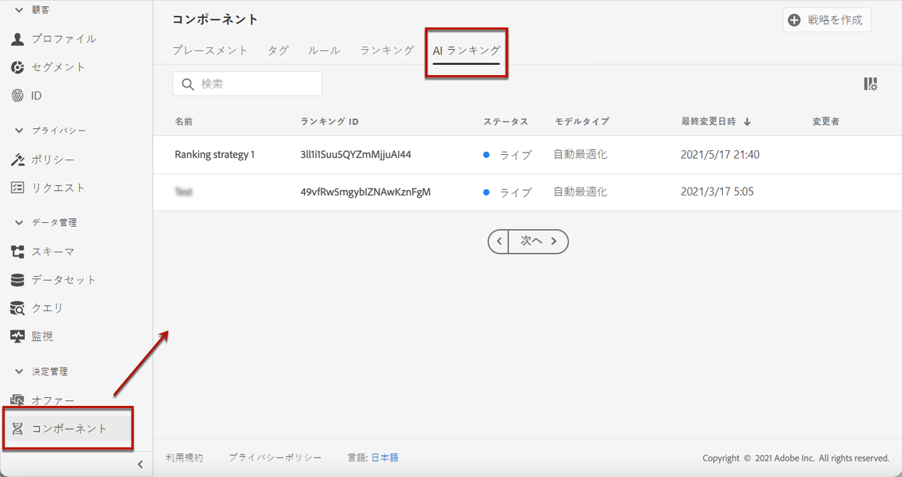

   これまでに作成したランキング戦略がすべてリストされます。

1. 「**[!UICONTROL 戦略を作成]**」ボタンをクリックします。

1. 次のフィールドに入力します。

   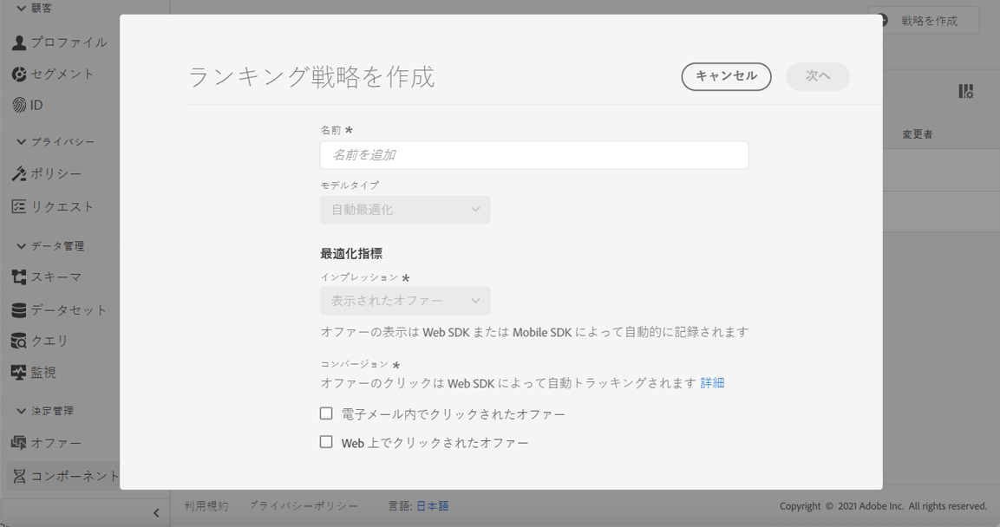

   * **[!UICONTROL 名前]**：指定する必要がある一意の名前。

   * **[!UICONTROL モデルタイプ]**：現在サポートされているモデルタイプは **[!UICONTROL 自動最適化]**&#x200B;のみです。<!--More will be supported in the future so the drop-down list will be enabled.-->

   * **[!UICONTROL 最適化指標]**：

      このオプションにより、マーケターは、表示されたオファー、電子メールでクリックされたオファー、web でクリックされたオファーに基づいて、機械学習モデルを構築およびトレーニングする方法を選択できます。

      >[!NOTE]
      >
      >必要に応じて、すべての指標タイプを選択できます。

      最適化指標には次の 2 種類があります。
      * **[!UICONTROL インプレッション]**：現在のインプレッションイベントは、表示されるすべてのオファーに対応しています。
      * **[!UICONTROL コンバージョン]**：コンバージョンイベントは、電子メールまたは web でのクリックにつながるすべてのオファーに対応します。

      選択したすべてのインプレッションイベントやコンバージョンイベントは、提供された web SDK またはモバイル SDK を使用して自動的に取得されます。 詳しくは、[Adobe Experience Platform web SDK の概要](https://experienceleague.adobe.com/docs/experience-platform/edge/home.html?lang=ja)を参照してください。

   * **[!UICONTROL データセット ID]**：コンバージョンの場合は、ドロップダウンリストからイベントを選択して収集するデータセットを指定する必要があります。そのようなデータセットを作成する方法については、[こちらの節](#create-dataset)を参照してください。 <!--This dataset needs to be associated with a schema that must have the **[!UICONTROL Proposition Interactions]** field group (previously known as mixin) associated with it.-->

   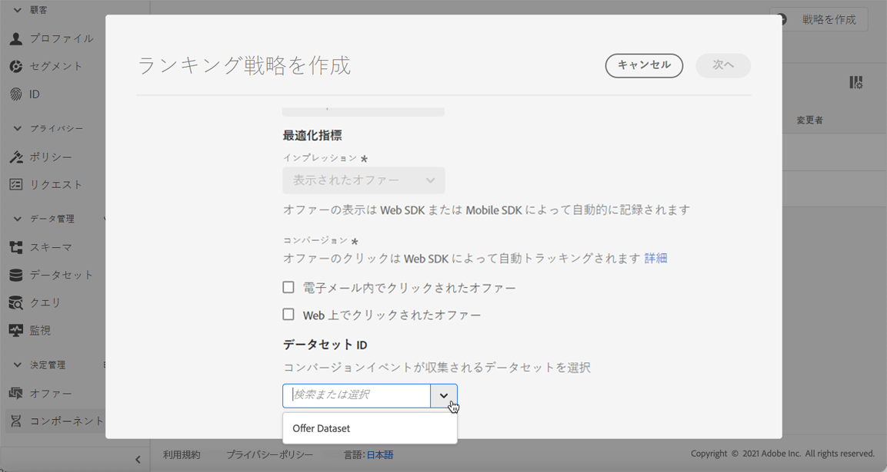

   >[!CAUTION]
   >
   >「**[!UICONTROL エクスペリエンスイベント - 提案インタラクション]**」フィールドグループ（以前の mixin）に関連付けられたスキーマから作成されたデータセットのみがドロップダウンリストに表示されます。

1. ランキング戦略を保存して有効化します。

   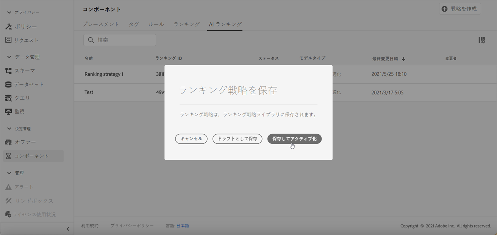

これで、プレースメントに対して適格なオファーをランク付けする決定で使用する準備が整いました。詳しくは、[この節](../offer-activities/configure-offer-selection.md#use-ranking-strategy)を参照してください。<!--TBC?-->

## イベントを収集するデータセットの作成 {#create-dataset}

コンバージョンイベントを収集するデータセットを作成する必要があります。 まず、データセットで使用するスキーマを作成します。

1. **[!UICONTROL データ管理]**&#x200B;メニューから「**[!UICONTROL スキーマ]**」を選択し、「**[!UICONTROL 参照]**」タブに移動して、「**[!UICONTROL スキーマを作成]**」をクリックします。

   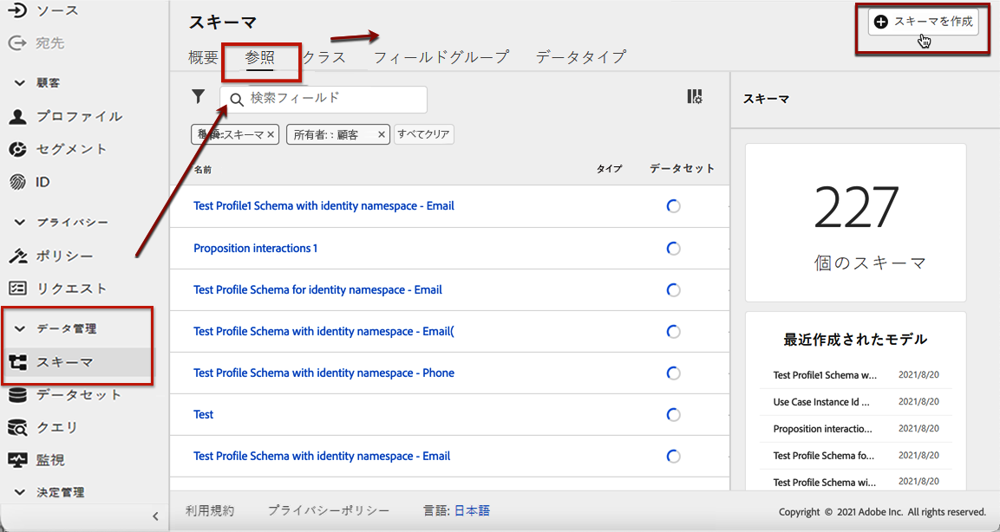

1. **[!UICONTROL XDM ExperienceEvent]** を選択します。

   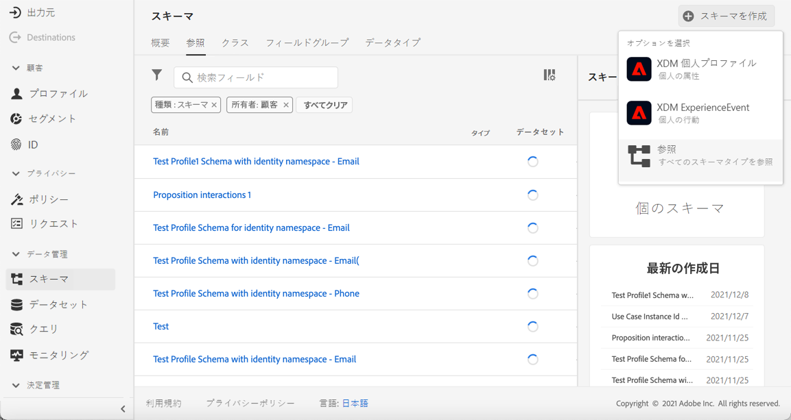

   >[!NOTE]
   >
   >    XDM スキーマとフィールドグループについて詳しくは、[XDM システムの概要ドキュメント](https://experienceleague.adobe.com/docs/experience-platform/xdm/home.html?lang=ja)を参照してください。

1. 「**[!UICONTROL 検索]**」フィールドに「提案インタラクション」と入力し、「**[!UICONTROL エクスペリエンスイベント - 提案インタラクション]**」フィールドグループを選択します。

   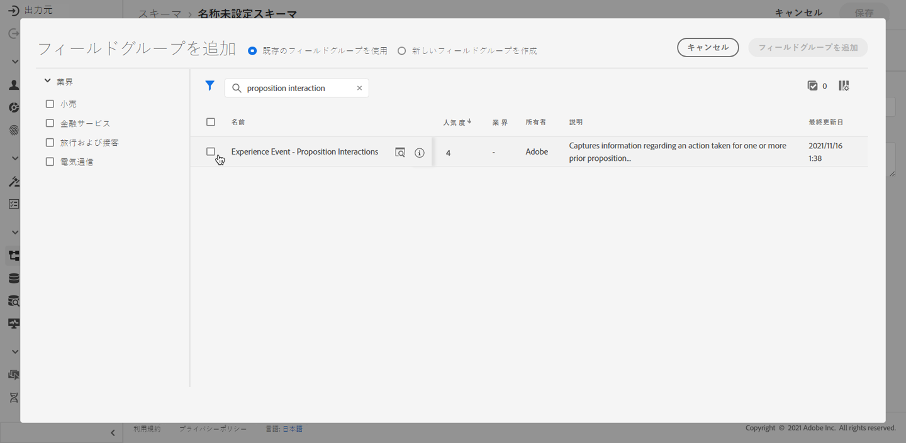

   >[!CAUTION]
   >
   >    データセットで使用されるスキーマには、「**[!UICONTROL エクスペリエンスイベント - 提案インタラクション]**」フィールドグループが関連付けられている必要があります。そうしないと、ランキング戦略で使用できなくなります。

1. 「**[!UICONTROL フィールドグループを追加]**」をクリックします。

   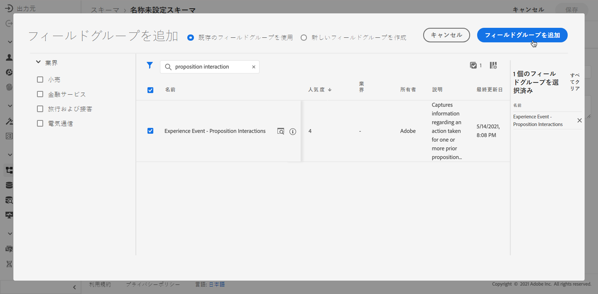

   >[!NOTE]
   >フィールドグループは、以前は mixin と呼ばれていました。

1. 名前を入力し、スキーマを保存します。<!--How do you edit the fields in this new schema? Examples?-->

>[!NOTE]
>
>    スキーマの構築に関して詳しくは、[スキーマ構成の基本](https://experienceleague.adobe.com/docs/experience-platform/xdm/schema/composition.html?lang=ja?lang=ja#understanding-schemas)で説明します。

これで、このスキーマを使用してデータセットを作成する準備が整いました。これを行うには、以下の手順に従います。

1. **[!UICONTROL データ管理]**&#x200B;メニューから「**[!UICONTROL データセット]**」を選択し、「**[!UICONTROL 参照]**」タブに移動して、「**[!UICONTROL データセットを作成]**」をクリックします。

   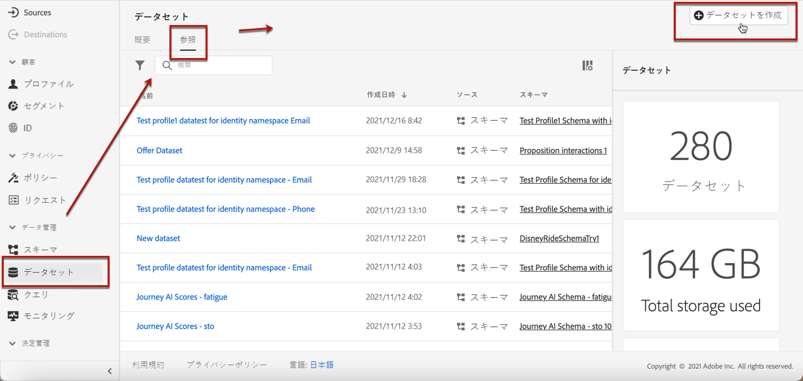

1. 「**[!UICONTROL スキーマからデータセットを作成]**」をクリックします。

   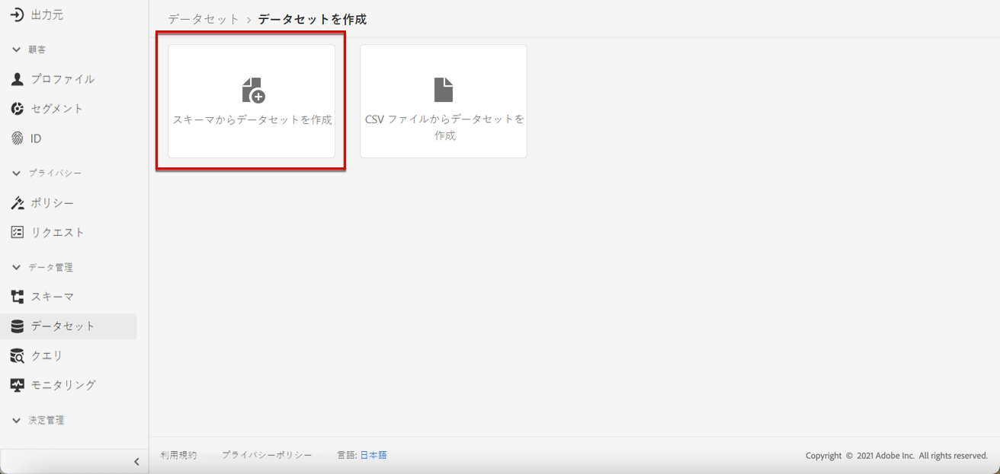

1. 作成したスキーマをリストから選択します。

   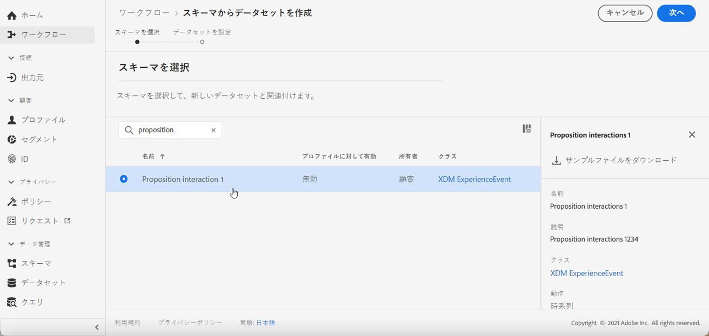

1. 「**[!UICONTROL 次へ]**」をクリックします。

1. 「**[!UICONTROL 名前]**」フィールドにデータセットの一意の名前を入力し、「**[!UICONTROL 完了]**」をクリックします。

   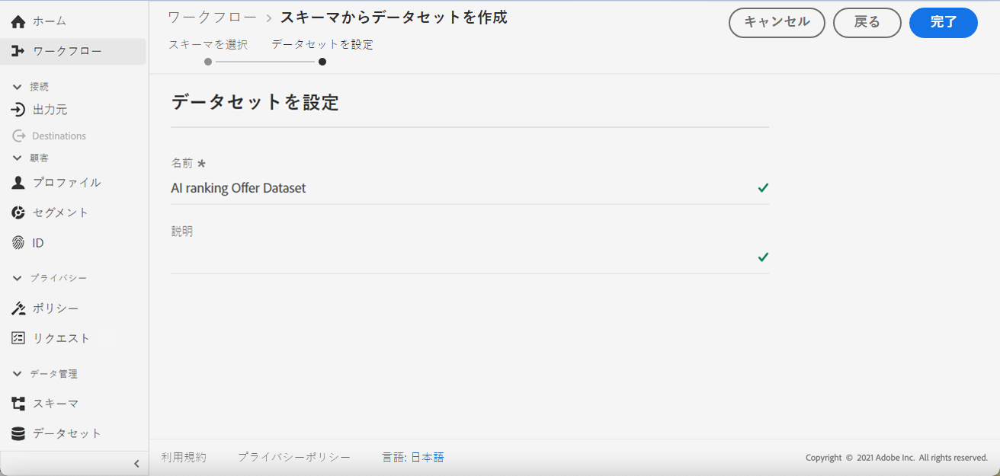

これで、[ランキング戦略](#create-ranking-strategy)を作成したときにコンバージョンイベントを収集するためのデータセットを選択できる状態になりました。

<!--## Using a ranking strategy {#using-ranking}

To use the ranking strategy you created above, follow the steps below:

Once a ranking strategy has been created, you can assign it to a placement in a decision (previously known as offer activity). For more on this, see [Configure offers selection in decisions](../offer-activities/configure-offer-selection.md).

1. Create a decision.
1. Add a placement.
1. Add a collection.
1. Choose to rank offers by AI ranking (select it from the drop-down list).
1. Click Add ranking.
1. Select the ranking strategy that you created. All the details of the ranking strategy are displayed.
1. Click Next to confirm.
1. Save your decision.

It is now ready to be used in a decision to rank eligible offers for a placement (see [Configure offers selection in decisions](../offer-activities/configure-offer-selection.md)).-->

