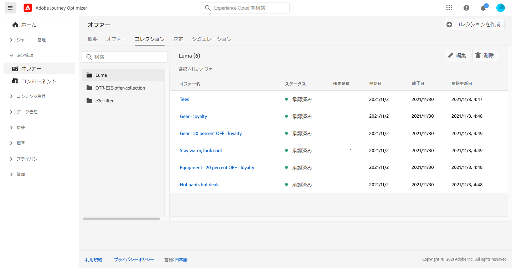
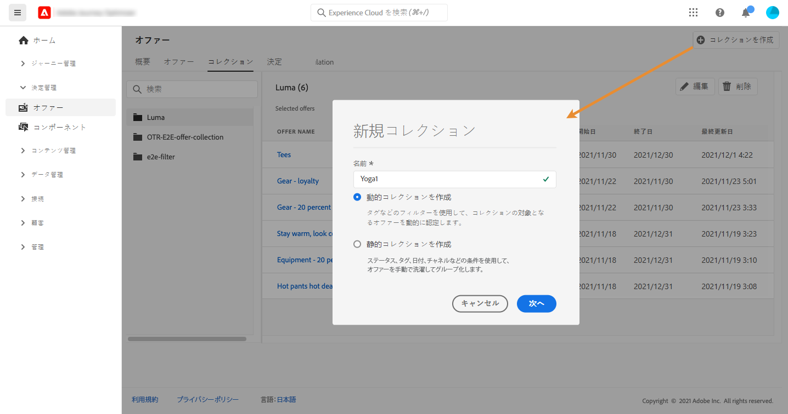
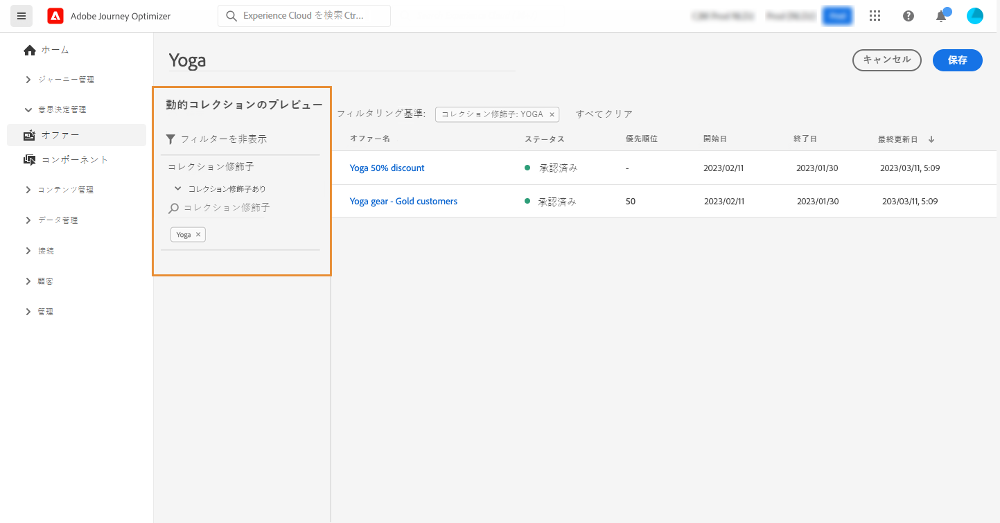
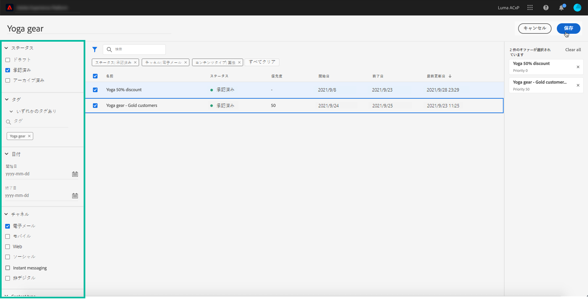
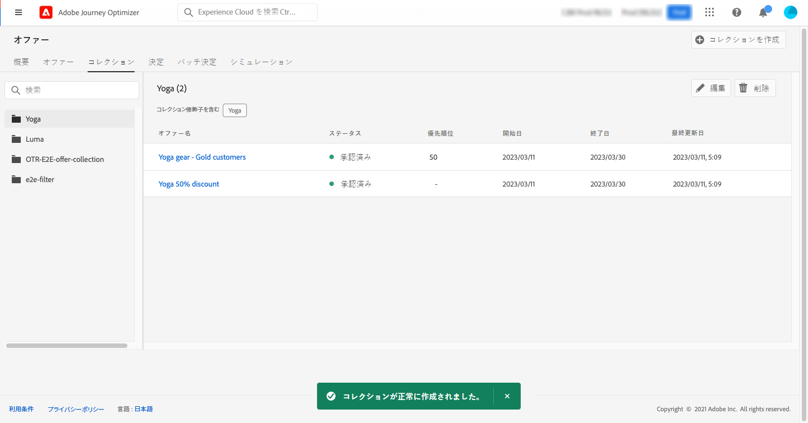

# コレクションの作成 {#create-collections}

>[!CONTEXTUALHELP]
>id="ajo_decisioning_decision_collection"
>title="オファーコレクションについて"
>abstract="オファーコレクションを使用すると、オファーを選択したカテゴリに再グループ化して整理できます。"

>[!CONTEXTUALHELP]
>id="ajo_decisioning_collection_dynamic"
>title="動的コレクション"
>abstract="コレクション修飾子を使用して、コレクションの対象となるオファーを動的に限定します。"

>[!CONTEXTUALHELP]
>id="ajo_decisioning_collection_static"
>title="静的コレクション"
>abstract="ステータス、コレクション修飾子、日付、チャネルなどの条件を使用して、オファーを手動で洗濯してグループ化します。"

>[!CONTEXTUALHELP]
>id="ajo_decisioning_collection_static_select"
>title="静的コレクションのプレビュー"
>abstract="静的コレクションは、コレクションに含める個々のオファーを手動で選択して作成されています。コレクションにオファーを手動で追加した場合にのみ、コレクションを更新できます。"

>[!CONTEXTUALHELP]
>id="ajo_decisioning_collection_dynamic_select"
>title="動的コレクションのプレビュー"
>abstract="動的コレクションは、コレクション修飾子に基づいてオファーを収集します。これらのコレクションは自動的に更新されます。例えば、「スポーツ」コレクション修飾子で新しいオファーが作成された場合、対応するコレクションに自動的に追加されます。"

コレクションを使用すると、オファーを選択したカテゴリに再グループ化して整理できます。例えば、スポーツ関連のオファーのみを含む「スポーツ」コレクションを作成できます。

➡️ [ビデオでこの機能を確認する](#video)

オファーコレクションのリストには、**[!UICONTROL オファー]**&#x200B;メニューからアクセスできます。

2 種類のコレクションを作成できます。

* **動的コレクション**&#x200B;は、コレクション修飾子（旧称「タグ」）に基づくオファーのコレクションです。これらのコレクションは自動的に更新されます。例えば、選択したコレクション修飾子で新しいオファーが作成された場合、コレクションに自動的に追加されます。

* **静的**&#x200B;コレクションは、コレクションに含める個々のオファーを手動で選択して作成したコレクションです。コレクションにオファーを手動で追加した場合にのみ、コレクションを更新できます。

コレクションを作成するには、次の手順に従います。

1. 「**[!UICONTROL コレクション]**」タブに移動し、「**[!UICONTROL コレクションを作成]**」をクリックします。

1. 作成するコレクションの名前とタイプを指定します。

   

1. 動的コレクションを作成するには、左ペインを使用してコレクションに追加するオファーのコレクション修飾子を選択し、「**[!UICONTROL 保存]**」をクリックします。選択したコレクション修飾子を持つすべてのオファーがコレクションに保存されます。

   コレクション修飾子の作成について詳しくは、[コレクション修飾子の作成](../offer-library/creating-tags.md)を参照してください。

   

1. 静的コレクションを作成するには、左側のペインを使用してオファーのリスト（ステータス、コレクション修飾子、日付、チャネル、コンテンツタイプ）をフィルターし、コレクションに追加するオファーを選択します。

   

   >[!NOTE]
   >
   >静的コレクションは自動的には更新されません。静的コレクションにオファーを追加するには、コレクションを編集し、手動で追加する必要があります。

1. カスタムデータ使用ラベルまたはコアデータ使用ラベルを静的コレクションに割り当てるには、「**[!UICONTROL アクセスを管理]**」を選択します。[オブジェクトレベルのアクセス制御（OLAC）についての詳細情報](../../administration/object-based-access.md)

   >[!NOTE]
   >
   >OLAC は、動的コレクションでは使用できません。オファーレベルで管理する必要があります。その結果、これらのオファーへのアクセス権を持たない場合、動的コレクション内にオファーが表示されない可能性があります。

1. コレクションが作成されると、リストに表示されます。選択して編集または削除できます。

   

## チュートリアルビデオ {#video}

>[!VIDEO](https://video.tv.adobe.com/v/329376?quality=12)

