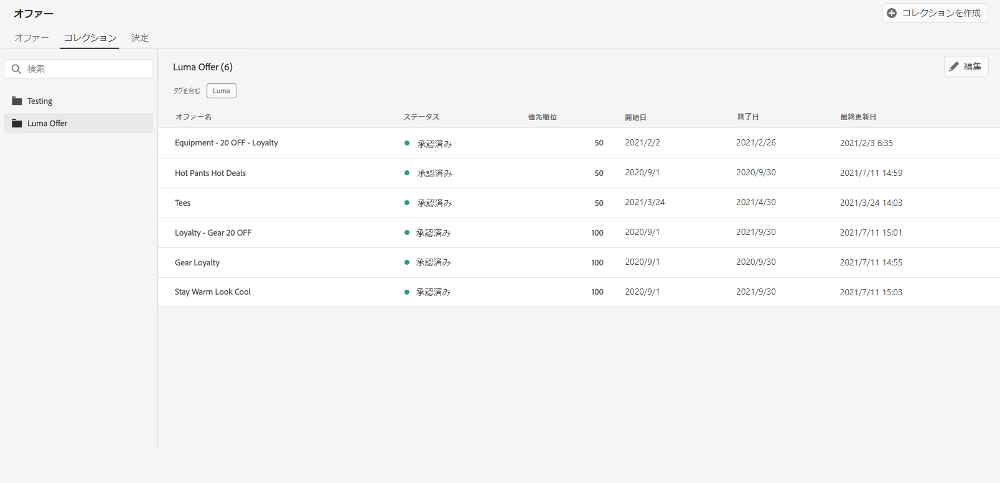
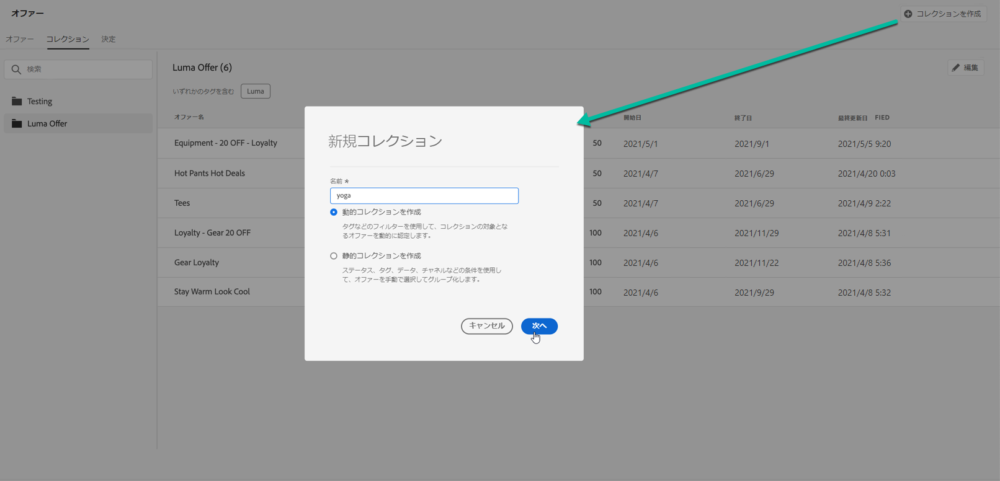
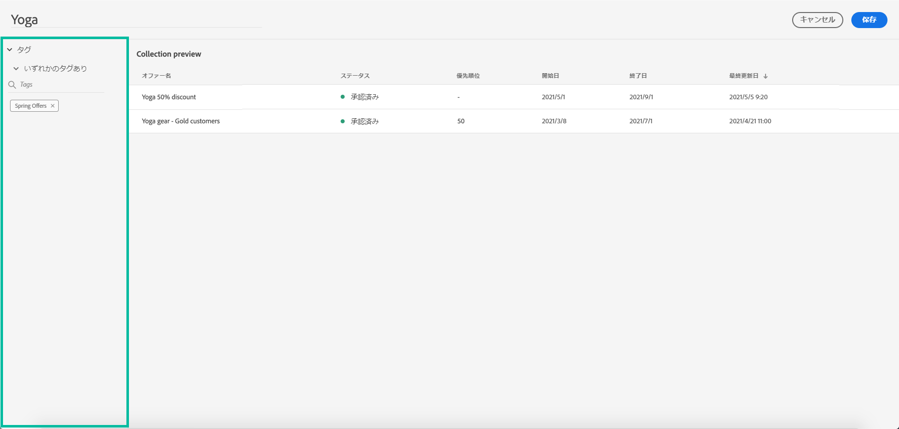
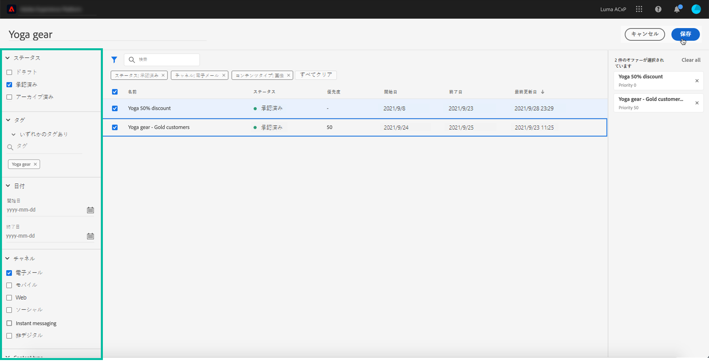
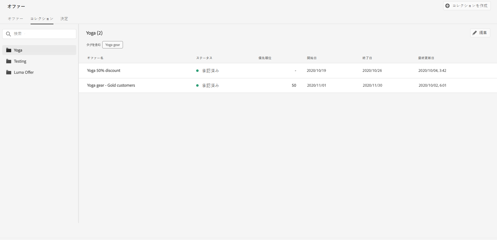

# コレクションの作成 {#creating-collections}

コレクションを使用すると、オファーを選択したカテゴリに再グループ化して整理できます。例えば、スポーツ関連のオファーのみを含む「スポーツ」コレクションを作成できます。

➡️ [この機能をビデオで確認](#video)

オファーコレクションのリストには、**[!UICONTROL オファー]**&#x200B;メニューからアクセスできます。

2 種類のコレクションを作成できます。

* **動的コレクション**&#x200B;は、タグに基づくオファーの集まりです。これらのコレクションは自動的に更新されます。例えば、選択したタグで新しいオファーが作成された場合、コレクションに自動的に追加されます。

* **静的**&#x200B;コレクションは、コレクションに含める個々のオファーを手動で選択して作成したコレクションです。コレクションにオファーを手動で追加した場合にのみ、コレクションを更新できます。

コレクションを作成するには、次の手順に従います。

1. 「**[!UICONTROL コレクション]**」タブに移動し、「**[!UICONTROL コレクションを作成]**」をクリックします。

1. 作成するコレクションの名前とタイプを指定します。

   

1. 動的コレクションを作成するには、左ペインを使用してコレクションに追加するオファーのタグを選択し、「**[!UICONTROL 保存]**」をクリックします。選択したタグを持つすべてのオファーがコレクションに保存されます。

   タグの作成について詳しくは、[タグの作成](../offer-library/creating-tags.md)を参照してください。

   

1. 静的コレクションを作成するには、左側のペインを使用してオファーのリスト（ステータス、タグ、日付、チャネル、コンテンツタイプ）をフィルターし、コレクションに追加するオファーを選択します。

   

   >[!NOTE]
   >
   >静的コレクションは自動的には更新されません。静的コレクションにオファーを追加するには、コレクションを編集し、手動で追加する必要があります。

1. コレクションが作成されると、リストに表示されます。選択して編集または削除できます。

   

## チュートリアルビデオ {#video}

>[!NOTE]
>
>このビデオは、Adobe Experience Platformで構築された Offer Decisioning アプリケーションサービスに当てはまります。ただし、Journey Optimizer のコンテキストでオファーを使用する際の一般的なガイダンスを提供しています。

>[!VIDEO](https://video.tv.adobe.com/v/329376?quality=12)
