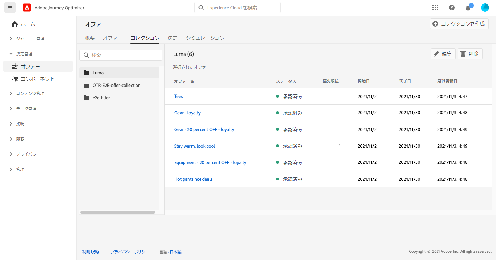
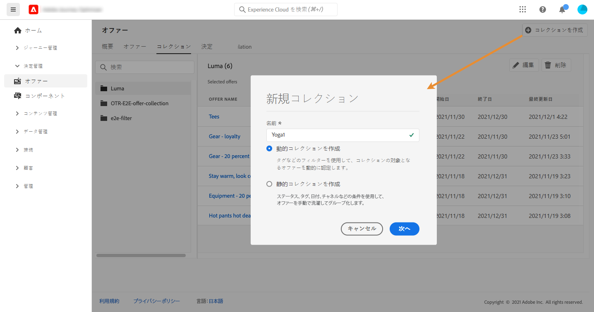
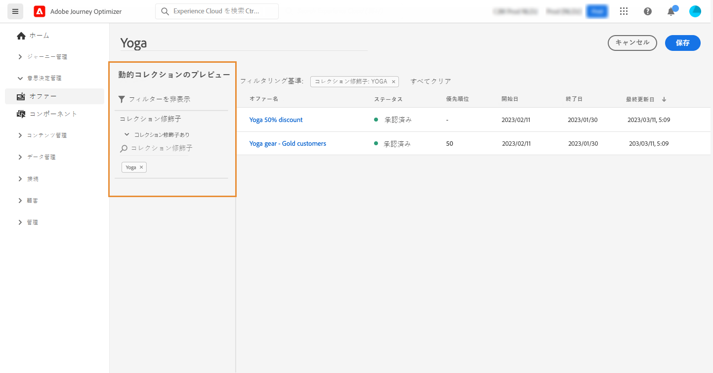
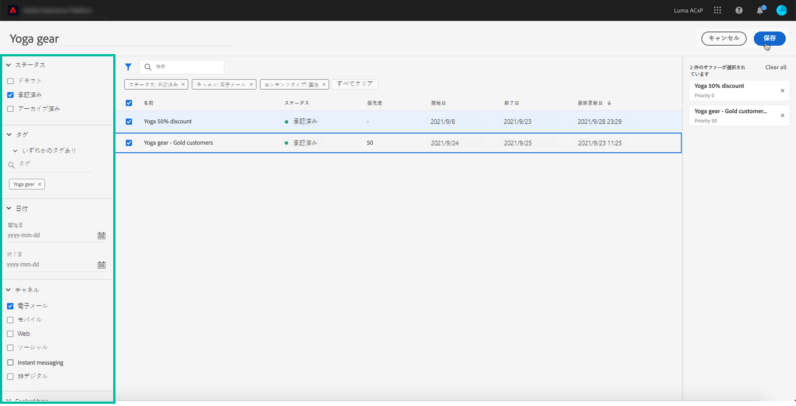
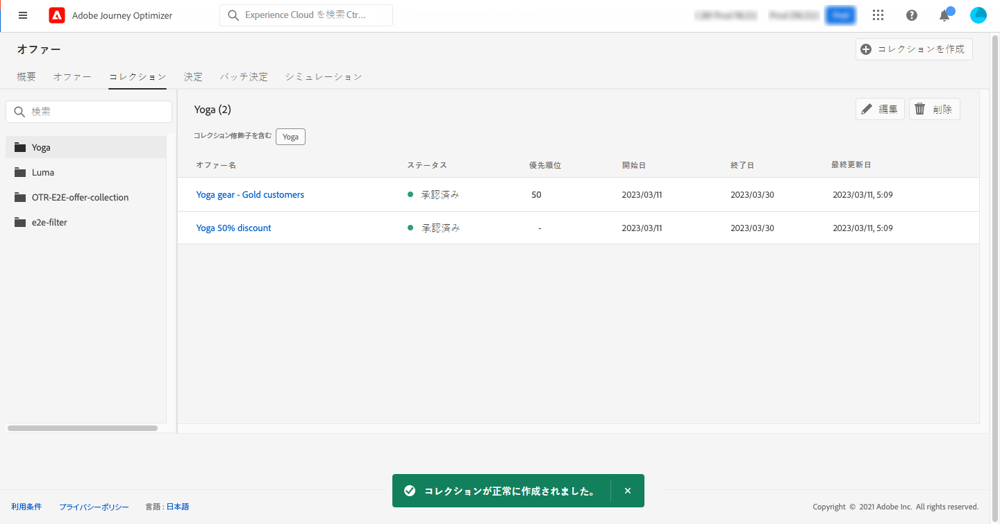

# コレクションを作成 {#create-collections}

>[!TIP]
>
>[!DNL Adobe Journey Optimizer]の新しい決定機能である決定機能が、コードベースのエクスペリエンスとメールチャネルで利用できるようになりました。 [詳細情報](../../experience-decisioning/gs-experience-decisioning.md)

>[!CONTEXTUALHELP]
>id="ajo_decisioning_decision_collection"
>title="オファーコレクションについて"
>abstract="オファーコレクションを使用すると、オファーを任意のカテゴリにグループ化して整理できます。"

>[!CONTEXTUALHELP]
>id="ajo_decisioning_collection_dynamic"
>title="動的コレクション"
>abstract="コレクション修飾子を使用して、コレクションのオファーを動的に修飾します。"

>[!CONTEXTUALHELP]
>id="ajo_decisioning_collection_static"
>title="静的コレクション"
>abstract="ステータス、コレクション修飾子、日付、チャネルなどの基準を使用して、オファーを手動で選択し、グループ化します。"

>[!CONTEXTUALHELP]
>id="ajo_decisioning_collection_static_select"
>title="静的コレクションのプレビュー"
>abstract="静的コレクションは、コレクションに含める個々のオファーを手動で選択することによって作成されます。 コレクションは、手動で追加のオファーを追加することによってのみ更新できます。"

>[!CONTEXTUALHELP]
>id="ajo_decisioning_collection_dynamic_select"
>title="動的コレクションのプレビュー"
>abstract="動的コレクションは、コレクション修飾子に基づいてオファーを収集します。 これらのコレクションは自動的に更新されます。 例えば、「sports」コレクション修飾子を使用して新しいオファーを作成すると、対応するコレクションに自動的に追加されます。"

コレクションを使用すると、オファーを任意のカテゴリにグループ化して整理できます。 例えば、スポーツ関連のオファーのみを含む「スポーツ」コレクションを作成できます。

➡️ [この機能をビデオで見つける](#video)

オファーコレクションのリストには、**[!UICONTROL オファー]** メニューからアクセスできます。

2種類のコレクションを作成できます。

* **動的コレクション**&#x200B;は、コレクション修飾子（旧称「タグ」）に基づくオファーのコレクションです。 これらのコレクションは自動的に更新されます。 例えば、選択したコレクション修飾子を使用して新しいオファーが作成された場合、そのオファーは自動的にコレクションに追加されます。

* **静的コレクション**&#x200B;は、コレクションに含める個別のオファーを手動で選択して作成されたコレクションです。 コレクションは、手動で追加のオファーを追加することによってのみ更新できます。

コレクションを作成するには、次の手順に従います。

1. 「**[!UICONTROL コレクション]**」タブに移動し、「**[!UICONTROL コレクションを作成]**」をクリックします。

1. 作成するコレクションの名前とタイプを指定します。

   

1. 動的コレクションを作成するには、左側のペインを使用して、コレクションに追加するオファーのコレクション修飾子を選択し、**[!UICONTROL 保存]**&#x200B;をクリックします。 選択したコレクション修飾子を含むすべてのオファーがコレクションに保存されます。

   コレクション修飾子の作成について詳しくは、[ コレクション修飾子の作成](../offer-library/creating-tags.md)を参照してください。

   

1. 静的コレクションを作成するには、左側のペインを使用してオファーのリスト（ステータス、コレクション修飾子、日付、チャネル、コンテンツタイプ）をフィルタリングし、コレクションに追加するオファーを選択します。

   

   >[!NOTE]
   >
   >静的コレクションは自動的には更新されません。 静的コレクションにオファーを追加するには、そのコレクションを編集し、手動で追加する必要があります。

1. カスタムまたはコアのデータ使用ラベルを静的コレクションに割り当てるには、**[!UICONTROL アクセスの管理]**&#x200B;を選択します。 [ オブジェクトレベルのアクセス制御（OLAC）について詳しく見る](../../administration/object-based-access.md)

   >[!NOTE]
   >
   >動的コレクションでは、OLACの使用は使用できません。 オファーレベルで管理する必要があります。 したがって、これらのオファーのいずれかにアクセスできない場合、動的コレクションにオファーが表示されない可能性があります。

1. コレクションを作成すると、リストに表示されます。 選択して編集または削除できます。

   

## チュートリアルビデオ {#video}

>[!VIDEO](https://video.tv.adobe.com/v/329376?quality=12)

